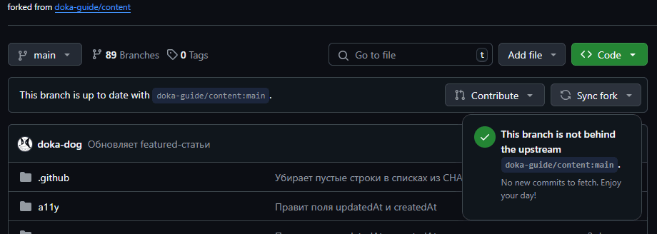

## Основные операции при работе с форком

Предположим мы создали форк для внесения изменений в исходный (upstream) репозиторий с помощью пулреквестов.

В ходе работы нам потребуется:
- проверять актуальность форк-репозитория;
- синхронизировать (обновлять) состояние форка;
- удалять устаревшие (смерженные) ветки.

## Состояние форка

Сразу после создания, форк содержит актуальное состояние исходного репозитория. Спустя некоторое время содержимое исходного репозитория может измениться. Эти изменения уже не будут видны в форке. Проще говоря, форк начинает «отставать».

Проверить актуальность форка можно на главной странице (вкладка «Code» ) форк-репозитория на GitHub. GitHub отображает состояние текущей ветки относительно исходного репозитория. В случае отставания форка, GitHub отобразит разницу, как количество коммитов добавленных в основной репозиторий:

## Синхронизация форка

Синхронизацию состояния можно выполнить несколькими способами. Расссмотрим несколько:
- через web-интерфейс GitHub;
- с помощью консольной утилиты [GitHub CLI](https://cli.github.com/);

### Синхронизация через web-интерфейс GitHub

### Синхронизация с помощью консольной утилиты GitHub CLI

После обновления состояния форка отображается как "up to date":

## Удаление ненужных веток

