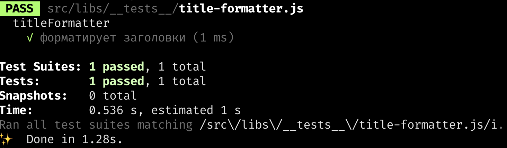

## Немного очевидностей
Пишите тесты для вашего кода. Когда вы пишите тесты, вы глубже анализируете поведение вашего приложения, а затем документируете это поведение тестом на простом и понятном вашим коллегам-разработчикам языке. Ваше приложение становится надёжным и гибким. Вы не боитесь рефакторингов. Тесты на CI позволят всей вашей команде спать спокойно. Тесты на `git pre-commit hook` не дадут запушить сломанный код в репозиторий. Зелёные галочки успокаивают.

## Как начать писать тесты?
Сначала нужно понять какие именно тесты вы хотите написать и выбрать подходящий для них фреймворк. Разобраться в тестах и фреймворках помогут эти статьи:
* [Как и зачем писать тесты](/js/tools/how-to-test-and-why/)
* [Фиктивные объекты и данные, моки, стабы](/js/tools/testing-and-fake-objects/)

Если вы не любите читать, но любите смотреть, предлагаем вам три коротких видео: [раз](https://www.loom.com/share/ed81362e0cb24a4da396419e75ceba0f), [два](https://www.loom.com/share/8a01f3821bb44ad4bea7682c99ced7a9), [три](https://www.loom.com/share/48698cd6abf947089c42b3427649a5ff). В них кратко изложено все что мы будет делать в этом рецепте.

Мы напишем несколько тестов, для разных кусочков [платформы доки](https://github.com/doka-guide/platform).
Для тестов будем использовать [Jest](https://jestjs.io/)

## Настраиваем Jest
У фреймворка *Jest* есть отличная документация, всю необходимую информацию по настройке можно [найти там](https://jestjs.io/docs/getting-started)

Чтобы правильно настроить *Jest* на платформе доки нужно научить *Jest* выполнять тесты для двух разных окружений:
* мы хотим тестировать код, который выполняется в браузере, на страничках доки
* мы хотим тестировать код, который выполняется node.js при сборке платформы доки

Jest может поддерживать различные окружения, но нам понадобится специальный [трансформер](https://jestjs.io/docs/code-transformation) `babel-jest`, который поможет удобно тестировать как нативные ES модули так и старый-добрый CommonJS.

Наш файл конфигурации будет выглядеть вот так:
```js
module.exports = {
  testEnvironment: 'jest-environment-node',
  setupFilesAfterEnv: ['<rootDir>/jest.setup.js'],
  transform: {
    '\\.[jt]sx?$': 'babel-jest',
  },
}
```

Ключик `testEnvironment` говорит, что по умолчанию мы будет тестировать код сборки.
`setupFilesAfterEnv` запустит перед тестами специальный скрипт. Не будем подробно останавливаться на том что это за скрипт, любознательные читатели всегда могут заглянуть в [исходник](https://github.com/doka-guide/platform/blob/main/jest.setup.js).

## Запускаем тесты, которых пока нет
Чтобы запустить тесты, мы создадим специальный скрипт в файле [`package.json` нашей платформы](https://github.com/doka-guide/platform/blob/09ac9232e199f802e92c52143733edfb990180ec/package.json#L33):
```json
{
  "scripts": {
    "test": "jest"
  }
}
```

В реальных приложениях конфигурация тестов [более затейливая](https://github.com/apollographql/apollo-client/blob/78f6d27d2d926c56cefd54d6f3e2371eb7e890d1/package.json#L53), вам может понадобиться несколько скриптов для запуска разных тестов. Или вам может понадобиться запускать тесты в разных конфигурациях.

## Настало время написать наш первый тест
Мы будет тестировать функция [форматирования заголовков](https://github.com/doka-guide/platform/blob/main/src/libs/title-formatter/title-formatter.js)

Код которой выглядит вот так:

```js
function titleFormatter(segments) {
  return segments.filter(Boolean).join(' — ')
}
```

Нам нужно убедиться что эта функция... форматирует заголовки :) Для этого не нужно думать, нужно писать тест.

Создадим папку `__tests__` где-нибудь поближе к файлу с функцией форматирования заголовков. И положим в эту папку наш первый тест.

```js
// src/libs/__tests__/title-formatter.js
import { titleFormatter } from '../title-formatter/title-formatter'

describe('titleFormatter', () => {
  it('форматирует заголовки', () => {
    const formattedTitle = titleFormatter(['test', 'test2'])
    expect(formattedTitle).toEqual('test — test2')
  })
})
```

Запустим наш тест
```bash
npm run test
```

Весёлые зелёные галочки сообщают, что все получилось.



Если вы хотите перезапускать тесты по мере изменения кода, используйте флаг `--watch`:
```bash
npm run test -- --watch
```

Возможно вы задаётесь вопросом: зачем писать тест для такой простой функции? Или думаете "Хм, написать семь строчек кода чтобы проверить однострочную функцию это не продуктивно". Представьте себе что кто-то решил изменить вашу функцию и добавить к ней ещё один параметр, например вот так:

```js
function titleFormatter(separator = ' — ', segments) {
  return segments.filter(Boolean).join(separator)
}
```

Тесты сразу же начнут падать. Это заставит ваших коллег проверить везде ли используется правильная сигнатура этой функции. Семь строк кода защитят вас от ошибки `Uncaught TypeError: Cannot read properties of undefined (reading 'filter')` в боевом приложении.


