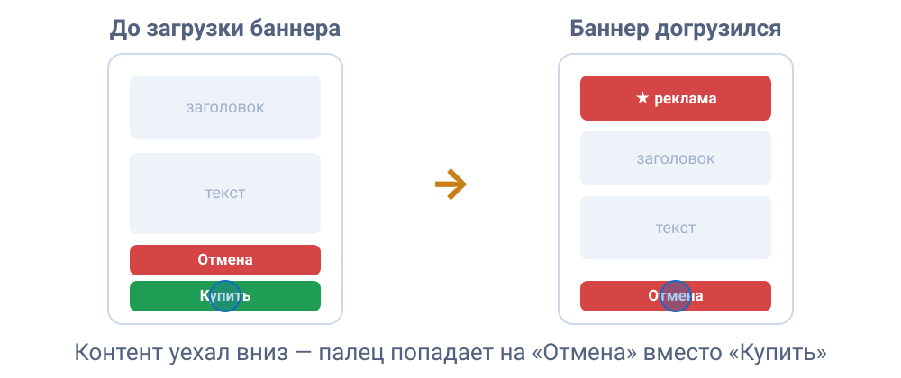

## Что такое CLS

CLS (Cumulative Layout Shift) измеряет **визуальную стабильность** страницы. Проще говоря - насколько сильно элементы страницы неожиданно перемещаются во время загрузки и после неё. Каждый раз, когда элемент, который уже отображается на странице, внезапно перемещается (не из-за вашего действия), браузер фиксирует «сдвиг макета». CLS суммирует эти сдвиги за всё время существования страницы.

Значение одного сдвига рассчитывается так: **доля затронутой области экрана × расстояние, на которое переместился контент**. Чем больше площадь и чем дальше перемещение, тем хуже. Например, знакомая ситуация: целитесь в кнопку «Купить» на сайте, в этот момент сверху догружается баннер, контент уезжает вниз, и вы случайно нажимаете «Отмена».

Запоминать формулу CLS необязательно. Достаточно понимать - чем больше площадь сдвига и расстояние, на которое сместился контент, тем сильнее ухудшается показатель.



## Из-за чего макет сдвигается

Чаще всего причиной сдвигов становятся изображения без указанных размеров. Также часто причиной становятся поздно загружаемые шрифты и динамический контент: реклама, баннеры согласия с cookies, всплывающие плашки. Cписок возможных причин:

- **Картинки и видео без размеров.** Браузер не знает, сколько места нужно зарезервировать, пока файл не загрузится. Поэтому сначала размещает остальные элементы без этого пространства, а после загрузки изображения сдвигает их;

- **Реклама, виджеты, встроенный контент как iframe** с неизвестной заранее высотой, особенно те, что подгружаются асинхронно;

- **Динамический контент**, вставленный над уже видимым: баннер согласия с обработкой cookies на сайте над текстом, догрузившийся блок рекомендаций, сообщение об ошибке в момент рендеринга;

- **Веб-шрифты.** Пока кастомный шрифт загружается, браузер может показать текст запасным системным шрифтом. Когда загружается кастомный шрифт с другими метриками (шириной символов, высотой строки и другими параметрами), браузер пересчитывает размеры текста, что может вызвать сдвиг макета (Layout Shift). Обычно это проявляется в двух сценариях: FOIT (Flash of Invisible Text) - когда текст временно скрыт до загрузки шрифта, и FOUT (Flash of Unstyled Text) - когда сначала показывается текст запасным шрифтом, а затем он заменяется на кастомный;

- **Анимации «не тех» свойств**, когда двигают `top`, `left`, `margin`, `width` вместо `transform`. Такая анимация заставляет браузер пересчитывать макет, из-за чего могут смещаться соседние элементы.

## Как улучшить CLS

Сначала убедитесь, что для изображений, видео, рекламы и других динамически появляющихся блоков заранее зарезервировано место. Затем проверьте шрифты, динамические вставки и анимации свойств, которые меняют раскладку страницы.

- **Всегда задавайте размеры изображений и видео.** Указывайте атрибуты `width` и `height` либо CSS-свойство [`aspect-ratio`](/css/aspect-ratio/). Тогда браузер заранее зарезервирует место с правильным соотношением сторон.

```html


<style>
  img {
    /* при адаптивной вёрстке размеры из атрибутов сохраняют пропорцию */
    height: auto;
    width: 100%;
  }
</style>

```

- В Next.js компонент [`<Image>`](https://nextjs.org/docs/app/getting-started/images) требует `width` и `height` либо `fill`, поэтому место под изображение резервируется до его загрузки. При статическом импорте размеры подставляются автоматически.

- Для `srcset` используйте изображения с **одинаковым соотношением сторон**. Для изображений через `` или `<picture>` задавайте `width` и `height`. В современных браузерах можно задавать размеры и для для каждого `<source>`.

- **Резервируйте место под рекламу и эмбеды (например, iframe)** заранее: задайте контейнеру `min-height` или `aspect-ratio` под самый вероятный размер. Учитывайте разные размеры на брейкпоинтах через медиазапросы;

- **Баннеры cookie-уведомлений** - частый и недооценённый источник CLS: на мобильных экранах такой баннер занимает заметную долю вьюпорта, а его текст может становится LCP-элементом. Заранее устанавливайте соединение с доменом баннера через `preconnect`/`dns-prefetch` если он внешний и резервируйте место под него так же, как под любой другой поздно подгружаемый блок;

- **Не вставляйте контент над уже видимым** без действия пользователя. Если этого избежать нельзя - размещайте её ниже текущей области просмотра или показывайте оверлеем поверх, а не сдвигая контент. Правило: **чем ближе вставка к верхней части экрана, тем сильнее сдвиг** - тот же по размеру блок, добавленный внизу видимой области, может дать меньше баллов CLS;

- Для бесконечной ленты и кнопки «Показать ещё» - подгружайте контент по нажатию на кнопку или подготавливайте новый контент за пределами экрана. Есть три рабочих паттерна. Первый из них это **менять контент внутри контейнера фиксированного размера** (карусель, ротатор - старое исчезает, новое встаёт на то же место). Далее **догружать заранее**, до того как пользователь долистает до конца блока или нажмёт на элемент (сдвиги, произошедшие в течение первых 500 мс после взаимодействия пользователя, не учитываются в CLS). И **загружать по явному действию** - кнопка «Показать ещё» вместо автоподгрузки при скролле, когда пользователь явно ожидает изменение страницы;

- **Оптимизируйте шрифты:** В `font-family` всегда указывайте системный запасной шрифт (`"Google Sans", sans-serif`, а не просто `"Google Sans"`) - иначе до загрузки шрифта текст рисуется дефолтным браузерным шрифтом с ещё большим расхождением метрик. Свойства `size-adjust`, `ascent-override`, `descent-override` и `line-gap-override` в `@font-face` позволяют подогнать запасной шрифт под кастомный, чтобы при подмене ничего не смещалось. Критичные шрифты предзагружайте через `<link rel="preload">`. Также уменьшайте размер файлов шрифтов: формат **WOFF2** (компрессия Brotli, на ~30% легче WOFF), **вариативные шрифты** вместо отдельных файлов на каждое начертание и **сабсеттинг через `unicode-range`** - браузер скачает только нужный набор символов (кириллицу отдельно от латиницы), а не полный шрифт со всеми языками;

- В Next.js [`next/font`](https://nextjs.org/docs/app/getting-started/fonts) self-хостит шрифты и подбирает метрики запасного шрифта через `size-adjust`, что помогает избежать сдвига при подмене.

```tsx
import { Geist } from "next/font/google";

const geist = Geist({ subsets: ["latin"] });

export default function RootLayout({ children }) {
  return (
    <html className={geist.className}>
      <body>{children}</body>
    </html>
  );
}
```

- **Анимируйте через [`transform`](/css/transform/)** (`translate`, `scale`, `rotate`), а не через `top`/`left`/`box-shadow` - `transform` выполняется на этапе композитинга и не вызывает перерасчёт макета соседних элементов;

- **Включите bfcache** (back/forward cache): при возврате «назад» страница восстанавливается целиком и мгновенно, без сдвигов.

<aside>

↩️ **Про bfcache стоит сказать отдельно:** он улучшает сразу LCP, FCP и CLS. Это кеш, из которого браузер мгновенно восстанавливает целую страницу при навигации «назад»/«вперёд». Такие переходы не редкость: по данным [web.dev](https://web.dev/articles/bfcache), примерно **10% навигаций на десктопе и 20% на мобильных** - это переходы «назад»/«вперёд». При восстановлении страницы из bfcache значения LCP, FCP и CLS обычно становятся близкими к нулю. Чаще всего bfcache ломают обработчики [`unload`](/js/event-unload/) (используйте `pagehide`) и заголовок `Cache-Control: no-store` (Chrome постепенно cнимает ограничения). Проверить страницу: DevTools → **Application → Back/forward cache → Test**, Chrome покажет список проблем, мешающих работе bfcache, и подскажет, какие из них можно исправить.

</aside>

<aside>

🛠 В DevTools на вкладке Performance есть дорожка **Layout Shifts**, она подсветит, какие именно элементы сдвигались и сколько баллов добавили. Очень помогает улучшить CLS.

</aside>
