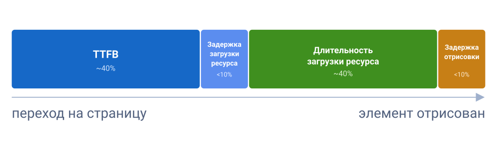

## Что такое LCP

LCP (Largest Contentful Paint) измеряет время от начала загрузки страницы до момента, когда в области просмотра (viewport) был отрисован самый большой элемент контента. Обычно это главное изображение (hero image), обложка статьи, большой текстовый блок или постер видео.

По сути, LCP отвечает на вопрос: «Когда пользователь увидел основной контент страницы?». В отличие от абстрактного понятия «страница загрузилась», LCP показывает, насколько быстро появился главный элемент страницы.

<aside>

💼 Пока главный контент не появился, пользователь не понимает, туда ли он попал и может ли взаимодействовать со страницей. Плохой LCP повышает риск раннего ухода со страницы и сокращает число людей, которые доходят до целевого действия.

</aside>

**Пример сценария:** Пользователь открывает страницу товара, но его крупное изображение появляется только через пять секунд. Не увидев основной контент, человек может решить, что страница работает слишком медленно, и вернуться к результатам поиска.

## Из чего складывается LCP

Чтобы улучшить LCP, сначала нужно понять, на каком этапе теряется время. При анализе LCP можно выделить четыре основных этапа:



1. **TTFB** (~40% времени) - время от отправки запроса до получения первого байта ответа от сервера. Пока браузер не получил первый байт ответа, он не может начать парсить HTML и находить ресурсы, необходимые для отображения LCP-элемента;

2. **Задержка загрузки ресурса** (<10%) - время между получением первого байта HTML и началом загрузки ресурса, необходимого для отображения LCP-элемента. Например, браузер может поздно обнаружить главное изображение или другой ресурс, необходимый для отображения LCP-элемента;

3. **Длительность загрузки ресурса** (~40%) - время, которое требуется для загрузки ресурса LCP-элемента. На этот этап влияют размер файла, скорость сети, формат ресурса и способ загрузки;

4. **Задержка отрисовки** (<10%) - время между моментом, когда ресурс уже доступен, и фактическим появлением элемента на экране. На этом этапе задержку чаще всего создают блокирующий CSS и JavaScript, длинные задачи (Long Tasks), ожидание загрузки шрифтов и другие операции, откладывающие отрисовку.

Если LCP-элемент не зависит от загрузки отдельного ресурса (например, это крупный текстовый блок), то этапы «задержка загрузки ресурса» и «длительность загрузки ресурса» отсутствуют. В этом случае итоговое значение LCP складывается только из TTFB и задержки отрисовки.

## Как улучшить LCP

### TTFB

Более подробно в статье о [TTFB](/tools/TTFB/). Тут кратко:

- Уберите лишние редиректы в цепочке до страницы;
- Оптимизируйте свой веб-сервер;
- Пользуйтесь CDN для статических файлов. Не забудьте настроить кеш на CDN, чтобы контент отдавался с ближайшего к пользователю узла;
- Не добавляйте уникальные query-параметры (например, аналитические метки), которые ломают кеш браузера.

### Задержка загрузки ресурса

Чтобы браузер узнал про LCP-картинку как можно раньше:

- **Держите LCP-картинку в HTML** обычным ``, не подставляйте её с помощью JavaScript и не прячьте в `data-src`. Тогда её найдёт preload-сканер ещё до выполнения скриптов;

- **Не используйте `loading="lazy"` на LCP-картинке** - ленивая загрузка откладывает именно то, что должно появиться первым;

- Поставьте **`fetchpriority="high"`** на главную картинку - браузер начнёт загружать её с более высоким приоритетом. Не назначайте высокий приоритет более чем 1–2 ресурсам, иначе теряется смысл в оптимизации;

- В Next.js укажите `priority` у LCP-картинки в компоненте [`<Image>`](https://nextjs.org/docs/app/getting-started/images): это отключит ленивую загрузку и выставит запросу высокий приоритет.

```tsx
import Image from "next/image";
import hero from "./hero.png";

<Image src={hero} alt="Обложка" priority placeholder="blur" />;
```

- Если LCP-изображение задаётся через CSS `background-image`, браузер обнаружит ее только после загрузки и разбора CSS. По возможности используйте ``, а если это невозможно - добавьте `<link rel="preload" as="image" fetchpriority="high">`;

```html
<!-- LCP-картинка: в HTML, с высоким приоритетом, без lazy -->


<!-- если картинка ссылается только из CSS - предзагрузим её -->
<link rel="preload" as="image" href="hero.avif" fetchpriority="high" />

<!-- для адаптивной предзагрузки - imagesrcset/imagesizes -->
<link
  rel="preload"
  as="image"
  imagesrcset="hero-800.avif 800w, hero-1600.avif 1600w"
  imagesizes="100vw"
  fetchpriority="high"
/>
```

- Если ресурс на другом домене - добавьте `<link rel="preconnect">` в секцию `<head>`, а еще лучше держите его на основном домене;

- **Если LCP-элемент - это простая векторная графика** (иконка, лого, иллюстрация без фотографий), вставляйте её инлайновым [`<svg>`](/html/svg/) прямо в HTML, а не через ``. Тогда браузеру не придётся делать отдельный запрос за SVG-файлом - графика приедет вместе с HTML, что уменьшит задержку до её отображения. Для фотореалистичных изображений (hero-баннер, обложка) SVG не подходит - там нужны растровые изображения (AVIF/WebP/PNG и т. д.). Перед отправкой обработайте свой SVG через [SVGO](https://svgo.dev) ([исходники на GitHub](https://github.com/svg/svgo)): он вычищает метаданные редактора, комментарии, лишние атрибуты и не влияющие на рендер данные, которые остаются после экспорта из графических редакторов. Для разовой оптимизации без установки есть веб-версия [SVGOMG](https://jakearchild.github.io/svgomg).

<aside>

⚡ `fetchpriority="high"`, один из самых простых способов улучшить LCP, который существует. По умолчанию картинки в области экрана стартуют с приоритетом Low и повышаются до High только после того, как браузер скачает и разберёт CSS и поймёт, что картинка видима. Атрибут пропускает это ожидание. На кейсе Etsy приоритет [ускорил LCP на 4%, а в лабораторных тестах на части сайтов - на 20–30%](https://addyosmani.com/blog/fetch-priority). При этом, по данным [Web Almanac 2025](https://almanac.httparchive.org/en/2025/performance), `fetchpriority="high"` используют уже 17,3% мобильных страниц - а вот обычный `<link rel="preload">` встречается всего у ~2,1% сайтов.

</aside>

### Длительность загрузки

- **Сжимайте и переводите картинки в современные форматы.** Порядок предпочтения: **AVIF** (на ~50% легче JPEG, поддержка ~95%), далее **WebP** (на 25–35% легче, поддержка ~96%), и PNG/JPEG как запасной вариант. Раздавайте через [`<picture>`](/html/picture/) с несколькими [`<source>`](/html/source/), чтобы браузер сам выбрал, что он поддерживает.

```html

<picture>
  <!-- Самый предпочтительный формат -->
  <source srcset="hero.avif" type="image/avif" />

  <!-- Если AVIF не поддерживается -->
  <source srcset="hero.webp" type="image/webp" />

  <!-- Запасной вариант -->
  
</picture>

```

- **Отдавайте адаптивные размеры** через [`srcset`/`sizes`](/html/picture/) - не грузите 4К-картинку на мобильные устройства.

```html

<picture>
  <source
    type="image/avif"
    srcset="
      hero-640.avif   640w,
      hero-1280.avif 1280w,
      hero-1920.avif 1920w
    "
    sizes="100vw"
  />

  <source
    type="image/webp"
    srcset="
      hero-640.webp   640w,
      hero-1280.webp 1280w,
      hero-1920.webp 1920w
    "
    sizes="100vw"
  />

  
</picture>

```

- Используйте **CDN** и **image CDN**, которые на лету подбирают формат и размер под устройство пользователя. Современный image CDN автоматически выбирает подходящий формат и размер изображения: смотрит на Client Hints (ширина вьюпорта, плотность пикселей), заголовок `Save-Data` и User-Agent - Chrome получит AVIF/WEBP, старый браузер PNG/JPEG, без вручную написанных `<picture>`-развилок. Экономия по весу файла может составить 40–80%;

- Настройте **долгое кеширование** (`Cache-Control` с большим `max-age`) для статических файлов - шрифтов, картинок и т. д. Не забудьте про query-параметры (например, сортируйте их и убирайте аналитические метки, не влияющие на содержимое страницы) и не отправляйте `Set-Cookie` вместе с кешируемыми ответами - большинство CDN не кеширует их вовсе;

- Уберите конкуренцию за главный поток: понизьте `fetchpriority` второстепенным ресурсам, отложите сторонние скрипты через `defer`/`async`. Работает и в обратную сторону: если на экране несколько картинок, но LCP-элементом станет только одна (например, первый слайд карусели), явно понизьте приоритет остальных через **`fetchpriority="low"`**, чтобы они не отнимали поток загрузки у главного элемента;

- **Для совсем маленьких изображений** можно вставить их как data URL прямо в HTML/CSS (`data:image/...;base64,...`) - так браузер получает картинку без отдельного сетевого запроса. Годится только для небольших иконок: base64 увеличивает вес файла примерно на треть и не кешируется отдельно от документа, поэтому для LCP-картинок это скорее исключение, чем правило.

На практике данный этап редко оказывается узким местом: у большинства сайтов основную часть LCP съедают TTFB и задержки, а не сама загрузка файла. Прежде чем оптимизировать именно длительность загрузки, проверьте по полевым данным ([Chrome UX Report (CrUX)](https://developer.chrome.com/docs/crux), `web-vitals` библиотека), действительно ли это ваше слабое место.


### Задержка отрисовки

- **Сократите блокирующий CSS**: вынесите критические стили как инлайновые, остальное грузите отложенно. Удалите неиспользуемые правила (проверьте через инструмент [Coverage](https://developer.chrome.com/docs/devtools/coverage) в DevTools). Некритичный файл можно асинхронно загрузить приёмом «`preload`, который после загрузки превращается в `stylesheet`»:

```html
<link
  rel="preload"
  href="non-critical.css"
  as="style"
  onload="this.onload=null;this.rel='stylesheet'"
/>

<!-- Запасной вариант для браузеров с отключенным JavaScript -->
<noscript><link rel="stylesheet" href="non-critical.css" /></noscript>
```

Этот приём имеет свои компромиссы (FOUC, сложнее поддерживать). Браузер cкачивает файл асинхронно, не блокируя рендер, а `onload` подключает стили, как только они готовы. [`Noscript`](/html/noscript/) - запасной вариант для отключённого JS. Такой приём позволяет загрузить некритичные стили без блокировки первоначальной отрисовки страницы.

- **Старайтесть не добавлять синхронный JavaScript в `<head>`** - переносите вниз `<body>` страницы или добавляйте [`async или defer`](/html/defer-async/) по возможности;

- **Рендерите на сервере (SSR) или используйте ([SSG](/tools/static-site-generators/))**, чтобы браузер получил LCP-контент сразу в HTML, а не строил его после выполнения JavaScript;

- Следите, чтобы тяжёлые задачи на главном потоке не блокировали отрисовку сразу после загрузки картинки (смотрите про длинные задачи в статье про [INP](/tools/INP/)).

- **Не задерживайте отображение текста веб-шрифтами.** Если LCP-элемент - это текст, используйте `font-display: swap` (или `optional`) и предзагружайте критические шрифты. Иначе браузер может отложить отображение текста до завершения загрузки шрифта.

### Углублённая оптимизация

Если у вас статический многостраничный сайт, присмотритесь к Speculation Rules API. Он позволяет заранее предзагружать или полностью пререндерить наиболее вероятную следующую страницу - например, при наведении курсора на ссылку или на основе заранее заданных правил. При переходе пользователь практически мгновенно видит готовую страницу, а значение LCP для такой навигации становится очень маленьким - сравнимым с восстановлением страницы из [bfcache](https://web.dev/articles/bfcache).

На момент написания статьи технология поддерживается только браузерами на базе Chromium (Chrome, Edge и другими) и пока недоступна в Safari и Firefox. Тем не менее за ней уже стоит следить, особенно если значительная часть вашей аудитории использует Chromium-браузеры.

```html
<script type="speculationrules">
  {
    "prerender": [
      { "where": { "href_matches": "/*" }, "eagerness": "moderate" }
    ]
  }
</script>
```
