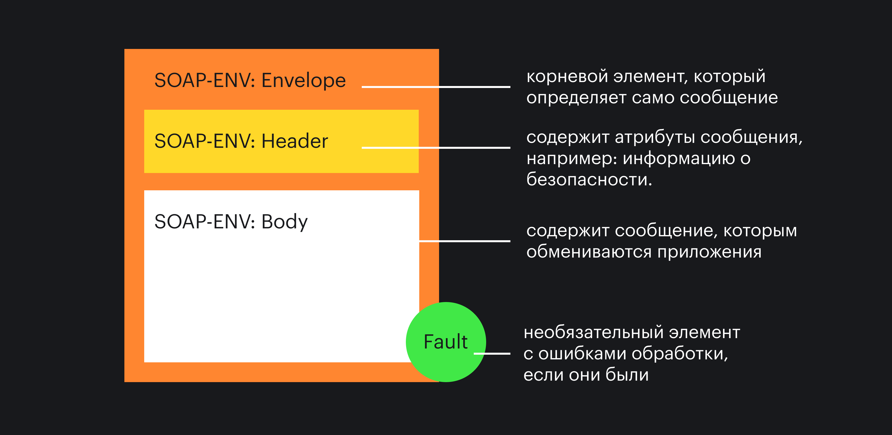

## Кратко

Разные программы могут быть написаны на разных языках.

Это очевидно, и на первый взгляд кажется, что не вызывает никаких проблем. На деле же, если программы написаны на разных языках, их может быть трудно «подружить» и сделать так, чтобы они могли друг с другом «общаться».

Именно для того, чтобы подружить разные модули, системы, языки, программы — и существуют API.

Давайте сразу рассмотрим пример: мы работаем в «Twitter» и делаем фичу для браузерного приложения на JavaScript.

Когда нам нужны какие-то данные, мы запрашиваем их у сервера. Однако сервер написан, скорее всего, не на JavaScript, а на каком-то другом языке: Python, C#, Java. Чтобы сервер понял, что мы от него хотим, нам нужно как-то объяснить наш запрос.

Именно для этого нужно API — оно позволяет разным системам общаться, понимая друг друга.

_API (Application Programming Interface)_ — это набор фич, которые одна программа представляет всем остальным. Она как бы говорит: «Смотрите, со мной можно говорить вот так и вот так, можете меня спросить о том-то через эту часть, а попросить что-то сделать — через эту».

В случае c клиент-серверным общением (см. [Как работают веб-приложения](/tools/web-app-works/)) API может выступать как набор ссылок, по которым клиент обращается на сервер:

- `POST /api/v1.0/users` — для создания пользователя;
- `GET /api/v1.0/users` — для получения списка пользователей.

О том, какие бывают виды ссылок и принципы их построения, мы поговорим чуть ниже.

API может использоваться не только для общения браузера и сервера, но и в принципе для общения разных программ друг с другом.

Представьте, что вы написали модуль `CreditCalculator`, который считает проценты по кредитам какого-нибудь банка. Чтобы воспользоваться этим модулем в других частях программы, вы экспортируете его функции наружу. Эти функции — это API этого модуля.

Или, например, вы написали плагин для [Gulp](/tools/gulp/), который минифицирует HTML-код. Если вы пользовались функциями, которые Gulp предоставляет, вы пользовались Gulp API.

Или вы пишете программку для Arduino, которая автоматически включает свет, если в комнате стало темно. Работая с Arduino SDK, вы пользуетесь их API.

## Идеальное API

В идеале всем хочется, чтобы общение между системами было бесшовным, мгновенным, понятным и поставляло все те данные и действия, которые требуются. Но на деле добиться этого бывает очень трудно.

### Бесшовность

Всегда хочется, чтобы единожды написанную функциональность можно было использовать везде. Но у каждого проекта своя специфика, из-за чего написанная функция может не подойти.

Невозможно написать «универсальный модуль», который бы подошёл к любому проекту. Но зато возможно написать модуль, который бы был достаточно абстрактным. В таком случае, чтобы добавить его в проект, нам потребуется какое-то количество дополнительного кода, но мы сможем использовать уже написанные функции.

Дизайн API, при котором такое использование доставляет меньше всего проблем — наиболее бесшовный.

### Быстродействие

Вернёмся к Twitter API. Если мы хотим создать нового пользователя, нам нужно передать на сервер данные об этом пользователе. Мы не можем сделать это с помощью JS-объекта, потому что сервер использует другой язык. Значит, нам надо «перевести» данные на какой-то промежуточный язык (чаще всего это [JSON](/tools/json/)).

Та же история с получением данных с сервера. Серверу надо получить данные из базы данных, перевести их в какой-то язык, который понятен клиенту, и отправить.

Всё это требует времени. Чем меньше времени тратится на общение и выполнение нужных действий, тем лучше спроектировано API.

### Понятность

Чем точнее названы функции, методы или ссылки в API, тем меньше заблуждений и ошибок будет возникать при работе с ним.

### Полнота

Как правило, разработчикам хочется производить как можно меньше операций, из-за чего «перевод» может оказаться неточным: в нём может не хватать данных или, наоборот, быть слишком много.

Чем грамотнее спроектировано API (а скорее даже вся программная система), тем более полным будет ответ на каждое конкретное действие.

В идеальном API все эти проблемы решены, но идеального API не существует 😃

## Какие API бывают

В этой статье мы сосредоточимся на клиент-серверной архитектуре, потому что в веб-разработке под API чаще всего имеют в виду именно запросы к серверу.

Прочитайте статью [«Как работают веб-приложения»](/tools/web-app-works/), чтобы глубже разобраться в клиент-серверной архитектуре.

### REST

_REST (Representational State Transfer)_ — стиль общения компонентов, при котором все необходимые данные указываются в параметрах запроса.

REST сейчас — один из самых распространённых стилей API в интернете.

Отличительная особенность этого стиля — это стиль построения адресов и выбор метода. Всё взаимодействие между клиентом и сервером сводится к 4 операциям (CRUD):

- созданию чего-либо, например, объекта пользователя (create, **C**);
- чтению (read, **R**);
- обновлению (update, **U**);
- удалению (delete, **D**).

Для каждой из операций есть собственный [HTTP-метод](/tools/http-protocol/):

- `POST` для создания;
- `GET` для чтения;
- `PUT`, `PATCH` для обновления;
- `DELETE` для удаления.

Разница между `PUT` и `PATCH` в том, что `PUT` обновляет объект целиком, а `PATCH` — только указанное поле.

Адрес, как правило, остаётся почти одинаковым, а детали запроса указываются в HTTP-методе и параметрах или теле запроса.

**Например**

Если бы мы писали API для интернет-магазина, то CRUD для заказа мог бы выглядеть следующим образом:

- `POST /api/orders/` — создать новый заказ. Как правило, в ответ на POST-запрос сервер возвращает ID созданной сущности, в нашем случае — ID заказа. Пусть будет 42.
- `GET /api/orders/42` — получить заказ с номером 42. В ответ мы получим JSON, XML, HTML с данными о заказе (сейчас чаще всего — JSON).
- `PUT /api/orders/42` — обновить заказ с номером 42. Вместе с запросом мы отправляем данные, которыми надо обновить этот заказ. В ответ сервер ответит или статусом 204 (всё хорошо, но контента в ответе нет), или ID обновлённой сущности.
- `DELETE /api/orders/42` — удалить заказ с номером 42. Как правило, в ответ присылается или 204, или ID удалённой сущности.

Чаще всего при работе с API веб-сервисов вам будет попадаться именно REST или что-то похожее на него.

**Плюсы:**

- самый распространённый стиль;
- использует фундаментальную технологию ([HTTP](/tools/http-protocol/)), как основу;
- достаточно легко читается.

**Минусы:**

- если спроектирован плохо, может отправлять или слишком много информации, либо слишком мало. (Но для обхода этой проблемы можно использовать backend for frontend).

### SOAP

Вообще, не очень корректно сравнивать SOAP и REST, потому что REST — это архитектурный стиль, а SOAP — формат обмена данными. Поэтому мы не будем их сравнивать, а просто расскажем, как работает SOAP.

_SOAP (Simple Object Access Protocol)_ — формат обмена данными.

Это структурированный формат обмена данными, то есть каждое сообщение следует определённой структуре. Чаще всего вместе с SOAP используется [XML](/tools/xml/) для отражения этой структуры.

Сама структура выглядит так:



- _Envelope_ — корневой элемент, который определяет само сообщение.
- _Header_ содержит атрибуты сообщения, например: информацию о безопасности.
- _Body_ содержит сообщение, которым обмениваются приложения.
- _Fault_ необязательный элемент с ошибками обработки, если они были.

Сообщение-запрос к интернет-магазину может выглядеть так:

```xml
<?xml version="1.0" encoding="utf-8"?>
<soap:Envelope
  xmlns:xsi="http://www.w3.org/2001/XMLSchema-instance"
  xmlns:xsd="http://www.w3.org/2001/XMLSchema"
  xmlns:soap="http://schemas.xmlsoap.org/soap/envelope/">
  <soap:Body>
    <getOrderDetails xmlns="https://example-store.com/orders">
      <orderID>42</orderID>
    </getOrderDetails>
  </soap:Body>
</soap:Envelope>
```

А ответ:

```xml
<?xml version="1.0" encoding="utf-8"?>
<soap:Envelope
  xmlns:xsi="http://www.w3.org/2001/XMLSchema-instance"
  xmlns:xsd="http://www.w3.org/2001/XMLSchema"
  xmlns:soap="http://schemas.xmlsoap.org/soap/envelope/">
  <soap:Body>
    <getOrderDetailsResponse xmlns="https://example-store.com/orders">
      <getOrderDetailsResult>
        <orderID>42</orderID>
        <userID>43</userID>
        <dateTime>2020-10-10T12:00:00</dateTime>
        <products>
            <productID>1</productID>
            <productID>23</productID>
            <productID>45</productID>
        </products>
      </getOrderDetailsResult>
    </getOrderDetailsResponse>
  </soap:Body>
</soap:Envelope>
```

При этом в SOAP неважно, каким методом передавать сообщения, в отличие от REST.

SOAP не очень прижился, потому что достаточно многословен и неудобен для работы на клиенте: XML проигрывает JSON, а SOAP, построенный на JSON — это довольно редкий случай.

**Плюсы:**

- не зависит от методов передачи;
- есть структура сообщения.

**Минусы**

- многословен;
- проигрывает REST в простоте.

### RPC

_RPC (Remote Procedure Call)_ — это такой стиль, при котором в сообщении запроса хранится и действие, которое надо выполнить, и данные, которые для этого действия нужны.

Так как мы больше говорим о вебе, то можно грубо сказать, что RPC — это «вызов серверной функциональности из браузера».

В вебе более часто использовались XML-RPC и [JSON-RPC](https://www.jsonrpc.org/specification). Мы будем рассматривать примеры на JSON-RPC, просто потому что JSON сейчас используется чаще, и его проще читать.

Сообщение-запрос по протоколу JSON-RPC должно иметь 3 обязательных поля:

- `method` — строка с именем вызываемого метода.
- `params` — массив данных, которые должны быть переданы методу, как параметры.
- `id` — значение любого типа, которое используется для установки соответствия между запросом и ответом.

В ответ сервер должен прислать сообщение, содержащее:

- `result` — данные, которые вернул метод. Если произошла ошибка во время выполнения метода, это свойство должно быть установлено в `null`.
- `error` — код ошибки, если произошла ошибка во время выполнения метода, иначе `null`.
- `id` — то же значение, что и в запросе, к которому относится этот ответ.

На примере всё с тем же магазином, получение заказа было бы реализовано примерно так:

Запрос:

```js
{
  // Для последней спецификации следует указывать версию:
  "jsonrpc": "2.0",

  // Далее указываем метод:
  "method": "orders.get",

  // В параметрах указываем ID заказа,
  // который нас интересует:
  "params": [42],

  // ID этого запроса.
  // Он может понадобиться,
  // когда система обрабатывает несколько запросов параллельно
  "id": 1
}
```

Успешный ответ:

```js
{
  "jsonrpc": "2.0",

  // В result данные о заказе:
  "result": {
    "orderId": 42,
    "userId": 43,
    "dateTime": "2020-10-10T12:00:00",
    "products": [
      { "productID": 1 },
      { "productID": 23 },
      { "productID": 45 }
    ]
  },
  "error": null,
  "id": 1
}
```

Ответ с ошибкой:

```json
{
  "jsonrpc": "2.0",
  "result": null,
  "error": "Order not found",
  "id": 1
}
```

**Плюсы:**

- есть структура сообщения;
- использует JSON, что делает его проще для чтения и написания;
- производителен, если нужны batch-запросы.

**Минусы:**

- слишком много логики уходит на клиент;
- HTTP-кэширование недоступно.
