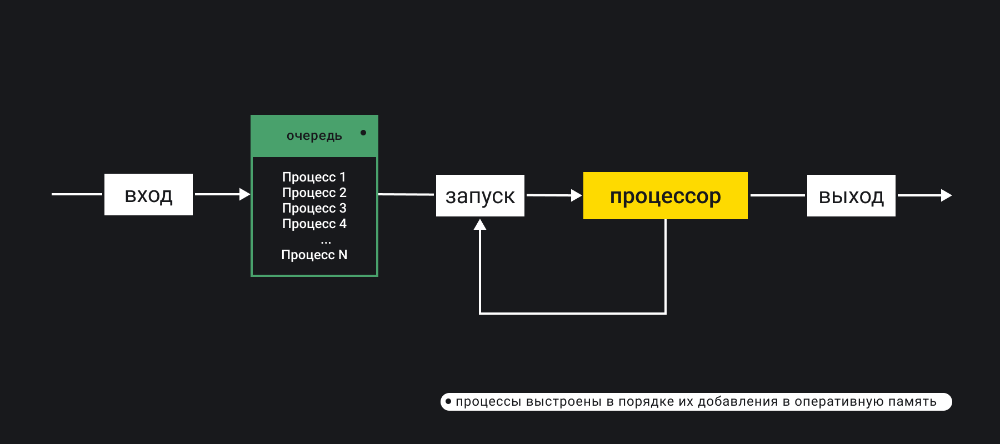
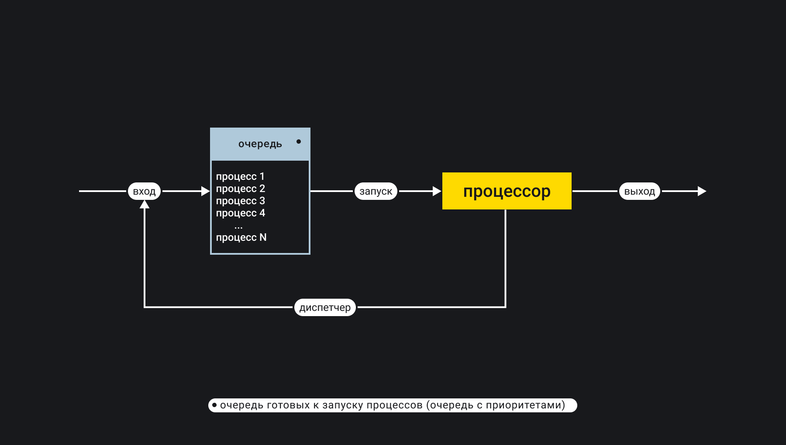
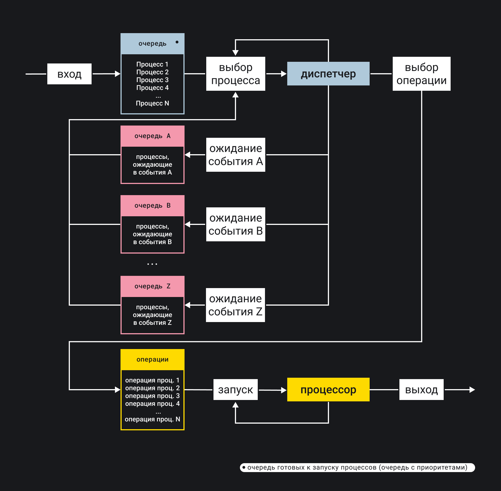
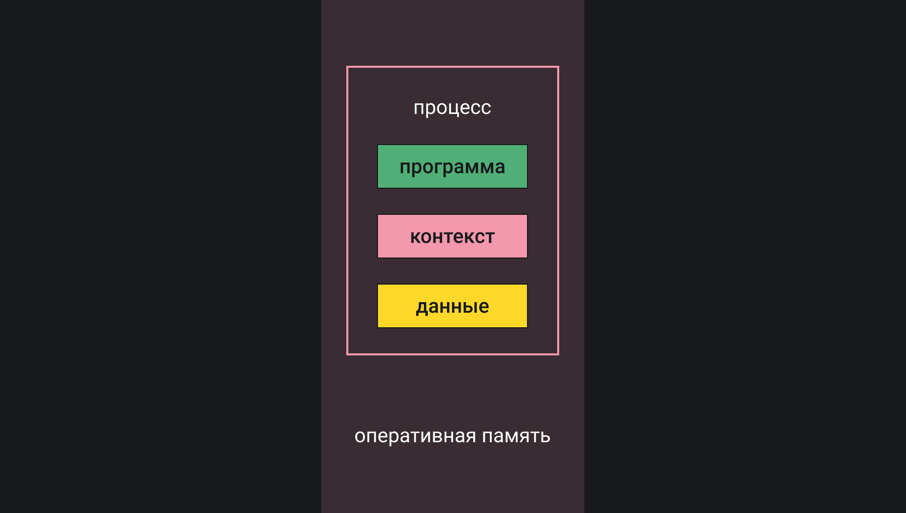
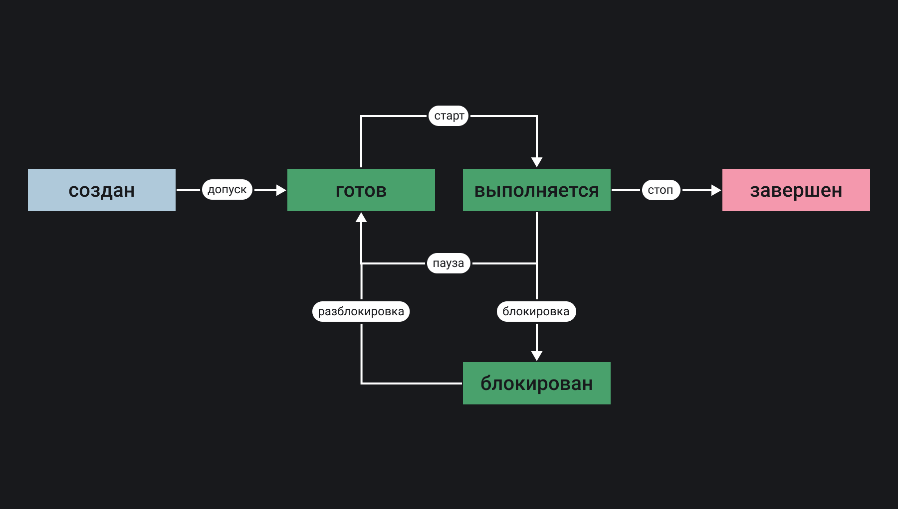
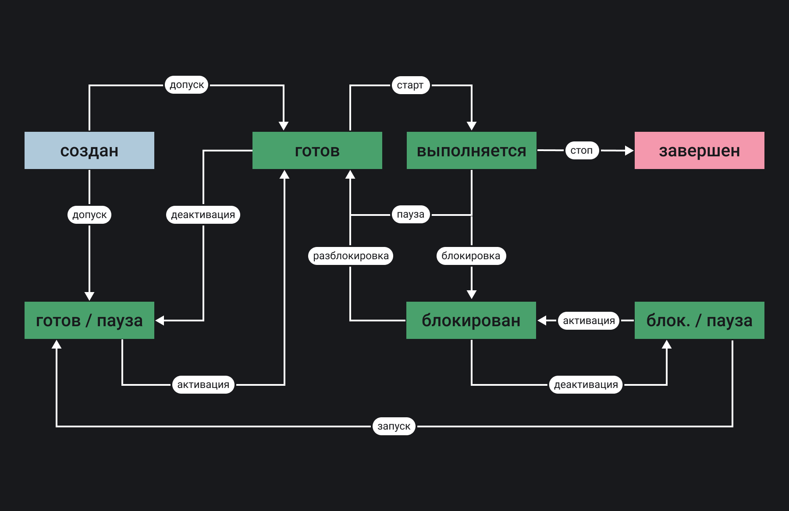

## Кратко

В современных многопоточных многопользовательских операционных системах для многопроцессорной архитектуры компьютера существуют различные механизмы для управления процессами. Под процессом чаще всего понимают отдельное работающее приложение, но бывают приложения, которые используют несколько процессов. Например, браузер Chrome под каждую вкладку создает отдельный процесс. Процесс — это абстракция операционной системы, которая позволяет выделять процессорное время и память компьютера для работы программы. Операционная система запускает процессы на короткое время поочерёдно. [Диспетчер операционной системы](https://ru.wikipedia.org/wiki/Диспетчер_операционной_системы) помещает отдельные операции из разных процессов в очередь. Когда очередь подошла, операция выполняется.

Для управления процессами операционная система использует механизм прерываний. Процессы можно останавливать или ставить на паузу, перезапускать различными способами, сообщать процессам об изменении состояния системы и прочее. Прерывания в операционных системах реализованы по-разному. В Unix-подобных системах существует несколько механизмов реализации прерываний. Один из них — управления процессами с помощью сигналов, описанный в стандарте [POSIX](https://ru.wikipedia.org/wiki/POSIX) для Unix-подобных операционных систем.

## Как понять

### Диспетчер операционной системы

Первые операционные системы были однозадачные. Разработаны они были для компьютеров с одним процессором. В каждый момент времени работать могла только одно программа. Пока она не завершится, пользователь не может запустить другую программу. Все ресурсы компьютера использовались для работы только одной программы:

Вскоре выяснилось, что такой механизм не очень работает, поскольку есть множество медленных операций по сравнению со скоростью процессора. Например, это могли быть вывод данных на печать или запрос данных от пользователя. Компьютеры были дорогие, и хотелось использовать их эффективнее.

Следующим шагом было внедрение специального диспетчера операционной системы. Главная задача диспетчера — максимально эффективно использовать процессор. На схеме показан процесс выполнения операций процессов в очереди:

Процессы разбиваются на операции. Диспетчер распределяет операции процессов в очереди в порядке приоритетов. Такая очередь называется _очередью готовых к запуску_. Приоритет служит основанием для постановки процесса в очередь. Место в очереди определяется приоритетом процесса. Например, системным процессам назначается наивысший приоритет. В некоторых операционных системам приоритетом процессов можно управлять.

После создания одной очереди, оказалось, что и это не совсем оптимальный механизм работы с несколькими процессами. Всё дело в том, что разные внешние устройства работают за разное время. Какие-то устройства работают в автоматическом режиме, какие-то в ручном (с участием пользователя). Решили, что было бы здорово сделать несколько очередей, каждая из которых обеспечивает доступ до какого-то определённого ресурса:

Например, существуют очереди для доступа к клавиатуре или принтеру, видеокарте или накопителю (HDD / SSD / Flash-drive и так далее). На рисунке разные устройства обозначены буквами (A, B и так далее).

### Процессы и ресурсы

Процесс — это совокупность программы (последовательности операций), контекста (набора значений переменных, необходимых для выполнения программы) и данных:

Программа — это совокупность операций над данными, которые осуществляет процесс. В рамках процесса нужно рассматривать программу как последовательность инструкций для процессора, которые загружены в оперативную память и находятся там в определенном диапазоне адресов. В современных операционных системах работают приложения, которые могут выполняться сразу в нескольких процессах, для каждого из которых работает своя последовательность операций — своя программа.

Контекст процесса — это текущие значения переменных и текущая операция. Контекст позволяет отложить процесс на некоторое время, а затем вернуться к нему, когда это будет возможно. Контекст был совершенно не нужен в операционных системах, когда одна программа выполнялась на одном процессоре. Но с приходом многопоточных операционных систем контекст позволил выполнять процессы по очереди, что дало иллюзию многозадачности.

Контекст процесса, например, может содержать следующие данные:

- состояние регистров процессора;
- состояние стека программы;
- состояние стека операционной системы;
- состояния зарезервированной памяти.

Данные располагаются в оперативной памяти и на внешних устройствах. Перед выполнением очередной операции программы все требуемые данные должны быть загружены в оперативную память компьютера.

Ресурсы компьютера — это то, что программа использует для работы:
- процессорное время, занятое под очередную операцию процесса;
- оперативная память, в которой хранится программа, контекст и данные;
- внешние устройства.

Важным механизмом на уровне операционной системы также является взаимодействие между процессами. Это реализуется по-разному. Чаще всего межпроцессное взаимодействие реализуется как отправка сообщений из одного процесса другому. К сообщению могут прикрепляться и данные, что сильно расширяет возможности.

У процесса также всегда есть приоритет, который позволяет помещать процесс в нужное место очереди. В первую очередь выполняются процессы, имеющие в операционной системе наивысший приоритет. Операционная система использует специальную структуру данных [_очередь с приоритетом_](https://ru.wikipedia.org/wiki/Очередь_с_приоритетом_(программирование)) в качестве абстракции для реализации механизма выполнения процессов на процессоре компьютера.

Каждому процессу соответствует набор состояний. В современных операционных системах набор состояний сводиться к следующим пяти:

Состояние «заблокирован» соответствует случаю, когда процесс, например, ожидает ответа от внешнего устройства: ввод с клавиатуры или ответ от накопителя. Количество состояний увеличивается, если в ввести возможность приостанавливать процесс в момент того, как он, например, заблокирован или готов продолжить свою работу:

### Прерывания

Для того чтобы можно было управлять процессами на уровне операционной системы, существует механизм прерываний. Когда происходит прерывание, выполнение процесса прерывается и совершается какое-то действие. Например, можно приостановить процесс или переместить из одной очереди в другую. Часть прерываний обрабатываются только операционной системой, другую часть можно слушать и реагировать на них, аналогично событиям в DOM.

#### Прерывания на уровне железа

Прерывания на уровне железа реализованы непосредственно в процессоре и используются в основном для работы с внешними устройствами. Операционная система может получить доступ к этому уровню, но управлять может только с позиции установки настроек для процессора (разрешать или запрещать определённые прерывания). Программы могут использовать прерывания на уровне железа. Программе передаётся возникновение прерывания как событие, по наступлению которого выполняется заранее заготовленный разработчиками код (обработчик прерывания).

У прерывания всегда есть источник. По типу источника прерывания делятся на:

- внешние, асинхронные, получаемые от внешних устройств: сигнал от аппаратного таймера или сетевой карты, готовность передать информацию с дискового накопителя, нажатие клавиш клавиатуры, движение мыши;
- внутренние, синхронные, возникающие в самом процессоре: переполнение стека, деление на ноль, обращение к недопустимым адресам памяти или недопустимый код операции;

Существуют ещё и программные прерывания, которые инициируются специальной инструкцией в коде программы. Программные прерывания используются для работы с внешними устройствами (например, в драйверах для операционной системы).

#### Сигналы в Unix-подобных системах

В Unix-подобных системах используется механизм сигналов, который позволяет управлять межпроцессным взаимодействием и организацией процессов в очередях. У каждого процесса в операционной системе есть набор сигналов, которые он игнорирует. Когда программа получает сигнал от операционной системы, программа прерывается, и выполняется заранее заготовленный код (обработчик сигнала).

В рамках стандарта POSIX описан [набор стандартных сигналов](https://ru.wikipedia.org/wiki/Категория:Сигналы_POSIX) операционной системы, которые можно обрабатывать в программах. Однако можно устанавливать и свои сигналы, стандарт этого не запрещает.

Вот список наиболее используемых сигналов:

1. `SIGINT` — прервать процесс (тип — управление). Сигнал сообщает процессу, что пользователь собирается остановить процесс из терминала.
1. `SIGKILL` — завершить процесс (тип — исключение). Сигнал сообщает процессу, что операционная система немедленно останавливает процесс. Этот сигнал нельзя проигнорировать или перехватить.
1. `SIGSTOP` — остановить выполнение процесса (тип — управление). Сигнал сообщает процессу, что операционная система принудительно останавливает процесс.
1. `SIGCONT` — продолжить выполнение ранее остановленного процесса (тип — управление). Сигнал сообщает процессу, что операционная система собирается продолжить выполнение процесса.
1. `SIGTRAP` — остановить выполнение процесса в брейкпоинте в программе (тип — отладка). Сигнал сообщает отладчику, что наступило интересующее событие в программе.

Сигналы можно послать работающему процессу:

— из терминала с помощью сочетания клавиш на клавиатуре;
— с помощью ядра операционной системы;
— из одного процесса другому (или самому себе).

Вот несколько наиболее распространённых сигналов, которые можно послать текущему процессу из терминала с помощью сочетаний клавиш:

— <kbd>Ctrl C</kbd> генерирует сигнал `SIGINT`;
— <kbd>Ctrl \</kbd> генерирует сигнал `SIGQUIT`;
— <kbd>Ctrl Z</kbd> генерирует сигнал `SIGTSTP`.

#### Механизм сообщений в Windows

Windows — операционная система, взаимодействие между процессами и устройствами в которой построено на системе сообщений. По сути, сообщение очень похоже на прерывание. При возникновении события (нажатие клавиши на клавиатуре или нажатие кнопки мыши или её перемещение) в процесс отправляется сообщение, которое затем обрабатывается в коде программы.
