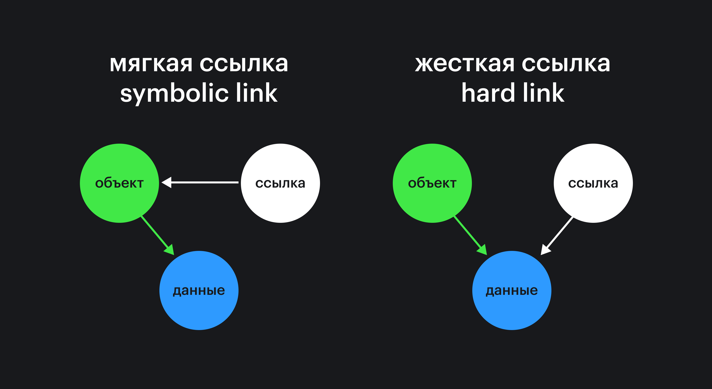
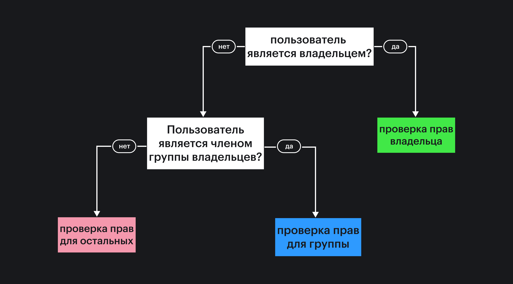

### Файловая система

Файловая система в Unix-подобных операционных системах устроена немного иначе, чем в Windows. В ней тоже есть корневая директория и дерево директорий (папок), но есть и особенности. Например, в Linux файлами считается абсолютно все. Даже директория в Linux — это файл со списком файлов, которые в ней расположены, а принтер или монитор представлены в виде файлов, в которые записываются новые символы.

Все эти файлы образуют дерево с корнем в директории `/`. Для разделения уровней дерева файлов используется символ `/`. Любое устройство, подключённое к компьютеру, файлы, диски, флэш-накопители, сетевые директории, устройства в сети, мониторы, принтеры, сканеры можно найти в дереве.

Существуют и логические диски но они не обозначаются отдельными буквами, как в Windows. Для доступа в тому или иному логическому диску (разделу) его сначала надо примонтировать, а затем использовать как обычную директорию. Монтирование — процесс помещения файловой структуры внешнего устройства в дерево директорий операционной системы. Процесс монтирования обычно автоматизирован, вам редко придётся использовать специальные команды `mount` и `umount`, чтобы примонтировать или отмонтировать какой-либо жёсткий диск, флэш-накопитель или другое устройство. Вы можете управлять местом монтирования (директорией, в которой будет доступна файловая система подключаемого устройства). По умолчанию все подключаемые устройства, как правило, располагаются в `/media/` в директории с именем устройства в системе.

Поскольку в Unix-подобных системах всё является файлами, существует довольно богатая функциональность для работы с ними в интерфейсе командной строки. Примеры работы с файлами и директориями:

- `ls` — вывод списка файлов и поддиректорий;
- `ls -l` — c указанием служебной информации;
- `ls -al` — c указанием служебной информации и показом скрытых директорий и файлов;
- `mkdir /tmp/new-dir` — создание новой директории с указанием абсолютного пути;
- `mkdir -p /tmp/new-dir/new-sub-dir` — с ключом `-p` команда создаст все несуществующие директории;
- `cd /tmp/new-dir` — переход в какую-либо директорию по абсолютному пути;
- `cd new-sub-dir` — переход в поддиректорию, если она существует;
- `cd ..` — переход на уровень вверх;
- `cd ../new-sub-dir/` — переход в какую-либо директорию по относительному пути;
- `cd -` — переход в предыдущую рабочую директорию;
- `touch /tmp/new-dir/new-sub-dir/new-file.txt` — создание нового пустого файла;
- `cat /tmp/new-dir/new-sub-dir/new-file.txt` — вывод содержимого файла на экран;
- `cp /tmp/new-dir/new-sub-dir/new-file.txt /tmp/new-dir/new-sub-dir/file-copy.txt` — копирование файла;
- `mv /tmp/new-dir/new-sub-dir/*.txt ../` — перемещение всех файлов с расширением `.txt` на уровень вверх;
- `rm /tmp/new-dir/file-copy.txt` — удаление файла;
- `rm -r /tmp/new-dir` — рекурсивное удаление содержимого директории вместе с самой текущей директорией.

Структура директорий в Unix-подобных системах часто бывает похожей. Но это не должно вводить в заблуждение, все директории равнозначны и могут использоваться произвольно. Важно, что для системных директорий по умолчанию правильно выставлены права доступа.

Чаще всего в директории `/home` хранятся домашние директории пользователей, в директории `/bin` — системные утилиты, директория `/etc` используется для служб, `/tmp` — для хранения временных файлов, `/var` — для пользовательских приложений.

В Unix-подобных системах существует понятие ссылки. Это специальный файл, и если вы обращаетесь к нему, то операционная система переадресует вас к целевому файлу или целевой директории. Эта переадресация не является переходом в другое место дерева директорий, это подмена содержимого файла или директории «на лету». Ссылки бывают символическими, или мягкими (symbolic links), и жёсткими (hard links). Символические ссылки ближе всего к ярлыкам. При удалении целевого файла ссылка остаётся. Жёсткие ссылки существуют на более глубоком уровне файловой системы, это своеобразный синоним файла (директории). Они указывают на сам файл (директорию), а не на путь, как это реализовано для символических ссылок. При перемещении целевого файла жёсткая ссылка остаётся рабочей. Разница показана на рисунке:



Чтобы управлять ссылками, воспользуйтесь командами:

- `ln /tmp symlink` — создание жёсткой ссылки;
- `ln -s /tmp symlink` — создание символической ссылки;
- `ls -l` — вывести информацию о ссылках (для символических будет указан путь).

### Доступ и пользователи

Изначально при проектировании операционной системы Unix был заложен принцип «Что не разрешено, то запрещено». Поскольку любая сущность является файлом, этот принцип означает, что по умолчанию в Unix-подобных операционных системах доступ ко всем файлам запрещён для всех пользователей, кроме суперпользователя с именем `root`. В дальнейшем с появлением пользователей в операционной системе им предоставляют права для отдельных объектов. На таком последовательном процессе построена безопасность использования. Работа от имени суперпользователя не рекомендуется. Вместо этого можно использовать специальный режим, выполняя команды от имени суперпользователя:

```bash
sudo <команда> <аргументы>
> Password:
```

Возможность работы от имени `root` доступна не всем пользователям, а только тем, которые находятся в специальном списке. Редактировать список, а также другие параметры команды `sudo` можно с помощью редактора `vi`, выполнив команду:

```bash
sudo visudo
```

В Unix-подобных операционных системах доступ к файлам основан на [ACL](https://ru.wikipedia.org/wiki/ACL). Доступ получает не сам пользователь, а процесс (приложение, служба). Например, чтобы прочитать содержимое файла, используется программа для чтения `cat`.

У каждого процесса есть идентификатор UID (User IDentifier), который указывает на пользователя, от имени которого процесс запущен. UID — это число, однозначно связанное с именем пользователя. Каждый пользователь входит в одну или несколько групп, у каждой из которых тоже есть идентификатор GID (Group IDentifier). Одному числу UID соответствует список GID.

У каждого файла есть не только идентификатор пользователя UID, который используется для указания владельца файла, но и идентификатор группы GID — для группы владельцев. Установить имя пользователя и имя группы, которые будут владельцами файла, можно с помощью команды:

```bash
chown user:group file.txt
```

При обращении процесса к файлу или директории операционная система определяет, предоставить ли к нему доступ, по следующей схеме:



Для установки прав доступа к файлу владельца, группы владельцев или любого пользователя применяется последовательность символов `-`, `r`, `w`, `x` (от слов read, write, execute) или трёх цифр от 0 до 7 (восьмеричная система счисления). Соответствие символов и цифр представлено в таблице:

| Цифра | Символ | Права              | Применение                              |
|:------|:-------|:-------------------|-----------------------------------------|
| 0     | ---    | ничего нельзя      | Доступ к файлу запрещён                 |
| 1     | --x    | запуск             | Запуск приложения / открытие директории |
| 2     | -w-    | изменение          | Можно менять содержимое                 |
| 3     | -wx    | запуск + изменение | Комбинация прав доступа                 |
| 4     | r--    | чтение             | Есть доступ на чтение                   |
| 5     | r-x    | чтение + запуск    | Комбинация прав доступа                 |
| 6     | rw-    | чтение + изменение | Комбинация прав доступа                 |
| 7     | rwx    | все можно          | Полный доступ                           |

Используется команда:

```bash
chmod 754 file.txt
```

В примере владелец имеет возможность делать с файлом все что угодно, группа владельцев — может читать файл или выполнять (такое право нужно, например, для запуска программ), для всех остальных доступна только операция чтения. Эти же права на файл можно установить и с помощью символов так:

```bash
chmod -rwxr-xr-- file.txt
```

Последовательность символов важна: `r` может стоять только на первом месте, `w` — на втором, а `x` — на третьем. Первый символ `-` в начале строки параметров `-rwxr-xr--` показывает, что перед нами файл. При вызове команды для вывода списка содержимого папки для отображения настроек доступа будет использоваться именно эта символьная запись:

```bash
ls -l
```

Если первый символ в настройках доступа `d`, то перед нами директория, если `l`, то — ссылка на другой файл или папку.

Цифры переводятся в восьмеричную систему счисления из флагов, записанных в двоичной системе. Если вы будете пользоваться цифрами, то легко запомнить, что положение букв в символьной записи и чисел двоичного кода связано. Например, выражение `rw-` является аналогом `110`, что в восьмеричной системе будет равно `6`. Вы можете посмотреть полный список в [таблице](https://ru.wikipedia.org/wiki/Chmod).

Таким образом каждому файлу ставится в соответствие владелец и группа владельцев (UID и GID), а также три числа для указания прав, которые есть у владельца (UID), группы владельцев (GID) и всех остальных пользователей. Чтобы узнать имя вашего пользователя, выполните:

```bash
whoami
```

Управлять пользователями и группами пользователей в операционных системах семейства Linux можно с помощью набора команд:

- `useradd <username>` — создание нового `<username>` пользователя;
- `cut -d: -f1 /etc/passwd` — посмотреть всех пользователей;
- `passwd` — изменение пароля пользователя;
- `usermod -a -G <usergroup> <username>` — добавление пользователя `<username>` в группу пользователей `<usergroup>`;
- `groups` — посмотреть все группы, в которых состоит пользователь.

### Продвинутый уровень использования CLI

Если что-то пошло не так (например, поехали шрифты или временно применились не те настройки), можно ещё раз инициализировать терминал без его перезагрузки:

```bash
reset
```

Выполненную ранее команду можно найти, нажав <kbd>Ctrl R</kbd> (на некоторых операционных системах <kbd>Ctrl Shift R</kbd>) и введя несколько символов. После этого наиболее подходящая команда будет показана. Если вы нажмёте <kbd>Enter</kbd>, то она выполнится, если воспользуетесь стрелками <kbd>→</kbd>, <kbd>←</kbd>, то можно будет её отредактировать. Повторное нажатие сочетания клавиш <kbd>Ctrl R</kbd> (на некоторых операционных системах <kbd>Ctrl Shift R</kbd>) продолжит поиск, и будут показаны другие варианты, подходящие под поисковый запрос. Работать с предыдущими командами можно несколькими способами. Примеры:

Выполнить предыдущую команду:

```bash
ls -al /etc
> ...

!!
> ls -al /etc
> ...
```

Использовать текст предыдущей команды:

```bash
mkdir -p ~/test/cli/last-cmd

!!/double
> mkdir -p ~/test/cli/last-cmd/double
```

Использовать при отказе в доступе:

```bash
touch ~/test/cli/example.txt

sudo chmod 700 ~/test/cli/example.txt

sudo chown root:root

rm ~/test/cli/example.txt -y
> ... Access denied

sudo !!
```

Заменить части текста в предыдущей команде:

```bash
mkdir -p ~/test/cli/change

mv ~/test/cli/chang ~/
> ...doesn't exist

^g^ge
> mv ~/test/cli/change ~/
```

Можно работать и с аргументами предыдущей команды.

Использовать значения последнего аргумента:

```bash
mkdir -p ~/test/cli/last-arg

cd !$
```

Создать директории с похожим именем:

```bash
mkdir project

mkdir !$-1

ls
> ...
```

Выполнить несколько команд подряд можно так:

```bash
cd ~/test/cli && mkdir test1 && cd test1 && touch test.txt && ls -l
```

В терминале существует два режима работы: приоритетный (по умолчанию) и фоновый. В первом терминал ожидает завершения работы очередной команды и, только после её завершения, выводит приглашение командной строки для выполнения следующей команды. Фоновый режим позволяет не дожидаться завершения работы команды. Иногда это бывает полезно, например при длительных операциях. Выполнить команду в фоновом режиме можно так:

Разархивация большого архива в приоритетном режиме:

```bash
tar xf archive.zip
```

Разархивация большого архива в фоновом режиме:

```bash
tar xf archive.zip &
> [<number>] <PID>
```

`<number>` — номер фонового процесса. Число, которое соответствует `<PID>`, можно использовать для мониторинга и управления. Пример:

- `jobs` — вывести список фоновых процессов;
- `fg` — перевести последний запущенный фоновый процесс в приоритетный режим;
- `fg <number>` — перевести фоновый процесс под номером `<number>` в приоритетный режим.
