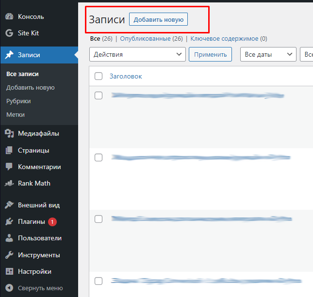
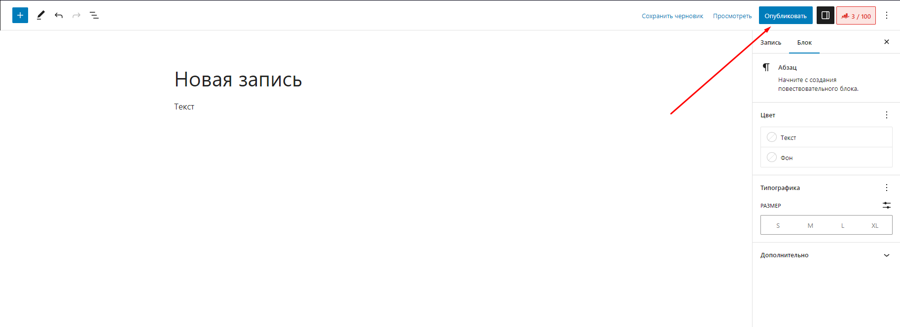
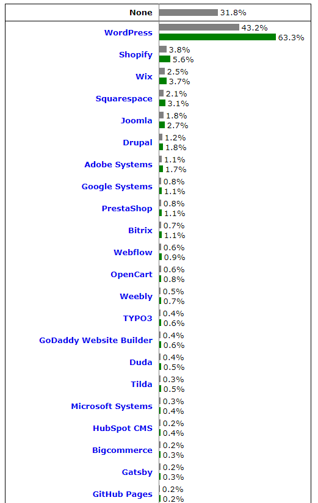

## Кратко

CMS (Content Management System) — система, которая предоставляет пользовательский интерфейс для создания и настройки сайта, а также управления контентом без навыков программирования.

## Что может CMS?

CMS делает процесс создания, редактирования и управления веб-приложением удобным и доступным. Большинство CMS могут:

- **Создавать веб-страницы**. CMS предоставляет инструменты для создания страниц без написания кода. С помощью шаблонов и визуальных редакторов можно быстро и удобно создавать новые страницы.
- **Настраивать внешний вид**. В большинстве CMS есть встроенные настройки типографики, цветовой палитры и макета сайта. С их помощью легко создавать стандартные элементы пользовательского интерфейса, например, вкладки, аккордеоны и слайдеры.
- **Расширять функционал с помощью плагинов**. Функциональность многих CMS можно расширять с помощью плагинов. При помощи плагинов можно добавлять формы обратной связи, опросы, интеграции с социальными сетями и SEO-оптимизации. Как правило плагины можно установить  через маркетплейс. Плагины могут быть как платными так и бесплатными.
- **Управлять контентом**. CMS позволяет изменять, добавлять и удалять текст, видео и изображения. Например, чтобы добавить пост в блог на WordPress, нужно нажать всего одну кнопку «Добавить запись», а чтобы опубликовать написанную статью — кнопку «Опубликовать». Удобно? Безусловно.

Страница записей в админ-панели WordPress.

Страница редактора записей в WordPress.

## Преимущества CMS

- Для использования CMS не нужны навыки программирования.
- **Скорость разработки.** CMS позволяет быстро развернуть сайт, большая часть функционала предоставляется «из коробки». Дальше можно сосредоточиться только на дизайне и контенте.
- **Расширяемость.** Большинство функциональных решений делаются всего за 2–3 клика мышкой при помощи добавления и настройки соответствующих плагинов. Во всех популярных CMS (WordPress, Joomla, OpenCart и Drupal) есть поддержка сторонних плагинов. Когда появляется новая система управления, то она просто обязана поддерживать сторонние плагины, чтобы конкурировать с другими CMS.
- **Низкие затраты.** CMS гораздо доступнее индивидуальной разработки сайта, если подразумевается разработка чего-то типового, вроде блога или визитки, а не уникального проекта. Кроме того, многие системы управления сайтом бесплатны, что также снижает затраты.
- При использовании CMS не нужно настраивать деплой и CI\CD. После установки системы пользователь получает интерфейс для создания контента, который моментально будет появляться на сайте.

## Недостатки CMS

- **Ограниченные возможности.**  Несмотря на большое количество доступных плагинов, вам может не хватить имеющихся возможностей. При помощи CMS легко создать блог, сайт-визитку, магазин, но создать уникальный проект с сложным функционалом уже вряд ли получится.
- **Зависимость от сторонних разработчиков.** Вы в любом случае зависите от создателей CMS, плагинов и тем. В них могут быть уязвимости и баги. Сторонний разработчик мог давно перестать поддерживать нужный плагин, а аналога может не быть.
- **Ограниченные возможности кастомизации.** Создание уникального дизайна через систему управления контентом тяжёлая задача, так как требует вмешательств в процесс генерации страниц выбранной админ-панели. Безусловно, есть понятие «вёрстка под CMS», но CMS всё равно ограничивает возможности создания определёнными рамками.
- **Трудности с [SEO-оптимизацией](/html/seo-for-beginners/).** Например, в Joomla и WordPress часто создаются копии страниц, что мешает продвижению в поисковых системах. Сайты на CMS грузятся долго, не используют семантическую вёрстку.
- **Ограниченный контроль над производительностью.** В некоторых случаях в CMS трудно эффективно управлять ресурсами. Это снижает производительности сайта. Пользователи систем управления контентом не могут контролировать процесс обработки запросов, что является недостатком при большом количестве посетителей. Без навыков программирования вряд ли получится устранить такие проблемы.
- **Трудности с [доступностью (a11y)](/a11y/chto-takoe-a11y/).** У многих CMS нет встроенных инструментов и плагинов, которые помогают улучшить доступность сайта.
- **Поддержка версий.** Обновления CMS важны, так как чинят баги и затыкают дыры в безопасности. При этом каждое обновление движка сайта может сломать установленные плагины и темы. Чтобы восстановить сайт, быстро откатиться не получится.

## Для каких сайтов подходят CMS?

Тип проекта влияет и на то, какую именно CMS стоит выбрать.

- **Блог.** Можно использовать WordPress, Drupal или Joomla. У них есть широкие возможности для создания и управления блогом, включая публикацию статей, управление комментариями и подписчиками.
- **Интернет-магазин.** Подойдут Magento или OpenCart. Они помогают управлять каталогом товаров, оформлением заказов и платежами прямо из коробки.
- **Корпоративный сайт.** У типичного корпоративного сайта есть несколько статичных страниц и динамический раздел с новостями. Тут опять подойдут WordPress, Drupal или Joomla. С ними можно легко создать раздел блога и нужное количество статичных страниц.

## Для каких сайтов не подойдёт CMS?

CMS очень полезны, но подходят не для всех сайтов.

- **Лендинг.** Это одна страница для рекламы продукта. Такие сайты должны быстро загружаться и обладать ярким и уникальным дизайном. На CMS это сложно сделать. Обычно на лендингах нет динамических страниц, поэтому можно смотреть в сторону конструкторов сайтов, таких как Tilda.
- **Высоконагруженные ресурсы.** Если сайт должен выдерживать большое количество пользователей и одновременных запросов к базе данных, то подумайте про индивидуальную реализацию.
- **Индивидуальные проекты.** Есть категории сайтов, которые сложно или невозможно сделать с помощью типовой CMS. Например, поисковые системы, социальные сети, форумы или CRM (системы управления взаимоотношениями с клиентами) для бизнеса.

## Дополнительные критерии выбора CMS

- **Доступность расширений.** Лучше использовать CMS с широким выбором расширений. Они понадобятся для улучшения функционала сайта.
- **Простота использования.** Стоит сразу задуматься об удобстве работы с админ-панелью сайта для лёгкой настройки и управления.
- **SEO**. Обратите внимание на наличие необходимых настроек для поисковой оптимизации. Базово это настройки [`<title>`](/html/title/), [`<meta name="description">`](/html/meta/), _robots.txt_, _sitemap.xml_ и структуры ссылок сайта.

## Немного про Headless CMS
Headless CMS — это система управления контентом, которая разделяет внешний интерфейс и управление контентом. В отличие от традиционных CMS, где контент и его представление тесно связаны, Headless CMS сосредотачивается на управлении и доставке контента через API. Такая архитектура позволяет разрабатывать более динамичные приложения, а также легко масштабировать систему.

## Популярные CMS

- **WordPress**. Самая популярная CMS на данный момент. У WordPress много плагинов и тем, его просто использовать, никакие технические навыки для этого не требуются. Его можно использовать для создания любых сайтов, но из коробки — это блог.
- **Joomla**. Популярная CMS, которая постепенно уступает позиции WordPress. Преимущества — гибкость и расширяемость, но у неё больше недостатков по сравнению с WordPress. К примеру, сложный интерфейс админ-панели и меньшее количество плагинов. Систему также можно использовать для создания любых типов сайтов.
- **OpenCart**. Более узконаправленная, чем предыдущие. В базовом функционале есть всё, чтобы построить интернет-магазин. В OpenCart много плагинов, но их недостаточно, чтобы создать магазин любой сложности. В админ-панели интуитивно понятный интерфейс, который легко освоить. Из недостатков можно выделить небольшое количество тем для оформления. Все темы делаются по одному шаблону, из-за этого легко визуально отличить OpenCart от других CMS.
- **Drupal**. Ещё одна популярная CMS. Drupal не так известен и уступает в популярности WordPress. Его сложно использовать, у него не такой большой выбор плагинов и тем. Из преимуществ – более продвинутый функционал, большая гибкость и производительность.

Ниже приведена статистика использования CMS с w3techs. Серым цветом показана общая доля на рынке, а зелёным выделена доля относительно других систем. Стоит отменить что Wix, Tilda, Gatsby и Github Pages это не совсем CMS.

