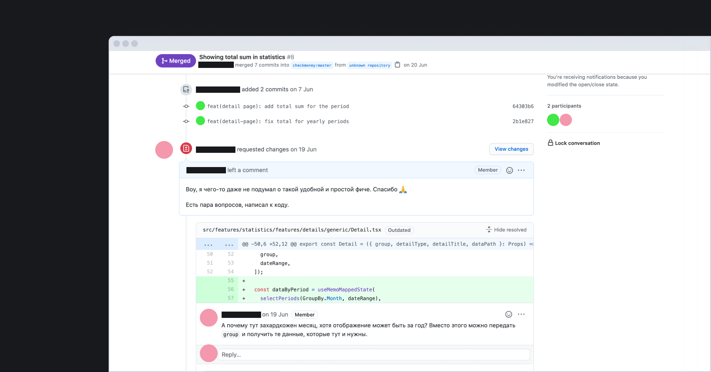

## Кратко

В индустрии разработки программ очень распространена практика **код-ревью**. Программист отправляет написанный код своим коллегам — они просматривают его и высказывают свои замечания.

Такой подход позволяет найти потенциальные проблемы, которые не заметил автор. Кроме того, такая практика распространяет знания внутри команды и помогает всем инженерам хорошо разбираться в коде.

## Как происходит

Обычно разработчик отправляет на ревью набор изменений, которые решают определённую задачу — добавляют новую функциональность или исправляют ошибку. Чаще всего, такие изменения программист [делает в своей ветке](/tools/version-control/), а перед слиянием с основной запрашивает обзор своих изменений у коллег.

Отправка изменений на код-ревью происходит через **пул-реквесты**. Для прохождения код-ревью нужно получить одобрение одного или нескольких коллег. Способ выбора коллег для проведения ревью зависит от процессов внутри компании.

Пул-реквест (PR) — это предложение слить изменения в ветке разработчика с другой веткой. Иногда их называют мёрж-реквестами (MR).

Типичный код-ревью к пул-реквесту на GitHub выглядит так:



В некоторых командах код-ревью — это опциональный процесс, автор изменений сам решает, нужен ли ему сторонний взгляд. Такой подход помогает разгрузить разработчиков, не заставляя их просматривать большое количество простых правок. С другой стороны, при таком подходе на автора ложится большая ответственность за качество написанного кода.

## [Conventional comments](https://conventionalcomments.org/)

Подобные замечания не ставят приоритет комментариям, поэтому они мало полезны:

> Это неправильно сформулировано.

Если поставить перед комментарием лэйбл, намерение станет ясным, а тон резко изменится.

> **suggestion**: Это неправильно сформулировано.

> **nitpick (non-blocking)**: Это неправильно сформулировано.

Лэйблы также побуждают ревьюера давать более _развёрнутые комментарии_, по которым можно сразу понять, что и где исправить.

> **suggestion**: Это неправильно сформулировано
> Можем ли мы изменить этот текст, чтобы он соответствовал формулировке со страницы маркетинга?

### Формат

Conventional comments предлагает формат, где сообщение описывается как:

```
<label> [decorations]: <subject>
[discussion]
```

- `label` - тип комментария;
- `subject` - основная мысль комментария;
- `decorations (опционально)` - дополнительные лэйблы для комментария. Они окружены скобками;
- `discussion (опционально)` - здесь содержатся подтверждающие заявления, контекст, рассуждения и все остальное, чтобы помочь сообщить "почему" и "последующие шаги" для разрешения замечания;

Например:

> **question (non-blocking)**: На этом этапе имеет значение, какой поток выиграл?
> Может быть, чтобы предотвратить состояние гонки, мы должны продолжать зацикливаться, пока все они не выиграют?

### Лэйблы

Настоятельно рекомендуется использовать следующие лэйблы:

| Лэйбл      | Описание                                                                                                         |
|------------|--------------------------------------------------------------------------------------------------------------|
| praise     | «Похвала» подчёркивает что-то положительное. Попробуйте оставить хотя бы один такой комментарий. Не оставляйте ложных похвал (которые на самом деле могут нанести вред).|
| nitpick    | «Придирки» - это небольшие, но необходимые изменения. Придирчивые комментарии значительно помогают направить внимание читателя на комментарии, требующие большего внимания.|
| suggestion | «Предложения» предоставляют способы по совершенствованию в определённой теме. Важно быть предельно ясным в том, что предлагается и почему именно это улучшение. Рассмотрите возможность использовать _блокирующие_ и _не блокирующие_ [декорации](#dekoracii) для последующего информирования о ваших намерениях.|
| issue      | «Проблемы» высвечивают конкретные трудности рассматриваемого вопроса. Если вы не уверены, существует проблема или нет - рассмотрите возможность оставить _question_.|
| question   | «Вопросы» допустимы, если у вас есть потенциальная проблема, но не уверены уместна она или нет. Обращение к автору с просьбой о разъяснении или расследовании может привести к быстрому урегулированию этого вопроса. |
| thought    | «Мысли» представляют собой идею, которая всплыла в процессе ревью. Эти замечания по своей природе _не блокируют_, но они чрезвычайно ценны и могут привести к более целенаправленным предложениям и возможностям наставничества.|
| chore      | «Рутинная работа» - это небольшие задачи которые необходимо выполнить до того как пулреквест (или другая форма ревью) «официально» будут приняты. Обычно в таких комментариях упоминаются какие-то общие процессы. Постарайтесь оставить ссылку в описании на процесс, чтобы автор мог понять как именно выполнять рутинную работу. |

Не стесняйтесь отклоняться от этого конкретного списка лэйблов, если это кажется уместным.

### Декорации

Декорации дают дополнительный контекст для комментария.

> **suggestion *(security)***: Я немного обеспокоен тем, что мы внедряем собственную функцию очистки DOM здесь...
> Можем ли мы вместо этого рассмотреть возможность использования фреймворка?

> **suggestion *(test, if-minor)***: Похоже, что мы пропустили какие-то тесты

Декорации могут быть индивидуальными для каждой команды. Рекомендуется установить минимальный набор декораций на ваше усмотрение.

Возможные декорации включают:

- `(non-blocking)` - комментарий с такой декорацией не должен препятствовать принятию рассматриваемого пулреквеста. Это полезно для команд, которые рассматривают блокирование комментариев по умолчанию.
- `(blocking) `- комментарий с такой декорацией должен препятствовать принятию рассматриваемого вопроса до тех пор, пока он не будет решён. Это полезно для команд, которые считают, что комментарии не блокируются по умолчанию.
- `(if-minor)` - эта декорация даёт автору некоторую свободу действий, которая заключается в том, что он может разрешить комментарий только в том случае, если изменения окажутся незначительными или тривиальными.

### Больше примеров

> `@elain-mask`
> **nitpick (non-critical)**: Некритично, но для консистентности папку с изображениями батутов назвал бы assets.

> `@vasya_pupkin`
> **praise**: Супер! Отлично поработал над этой фичей!

> `@anonymous`
> **issue(critical)**: Здесь уж слишком разбухшая логика
> **suggestion(critical)**: Сейчас не особо больно, но по-хорошему бы декомпозировать это все дело

### Итого

Преимущества и недостатки общепринятых комментариев (они же conventional comments):

**Преимущества**
- Цель и смысл наших комментариев ясна.
- Разделение между _темой_ комментария и _аргументацией_ очень чёткое и прямое.
- Автор знает, с каким приоритетом стоит расставлять замечания, потому, что комментарии хорошо размечены.

**Издержки**
- Категоризация комментариев может работать не всегда, _что-то обязательно не вместится в список_.
- Формата нужно как-то обязывать придерживаться, а это дополнительные расходы на инфраструктуру или документацию.
- Дополнительная когнитивная нагрузка при ревью.

### Полезные ссылки

- [Conventional comments](https://conventionalcomments.org/)
- [Github saved replies](https://gist.github.com/yesnoruly/ad4554360fe6c41668186e64e28c16b7)

