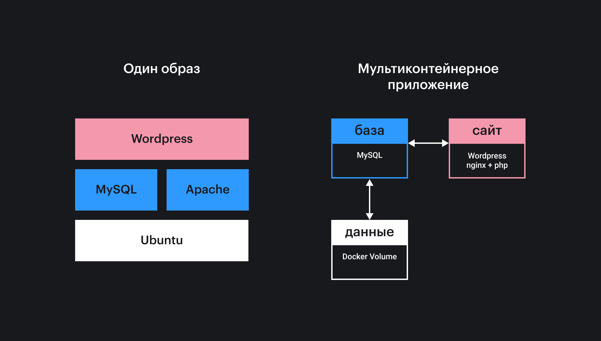
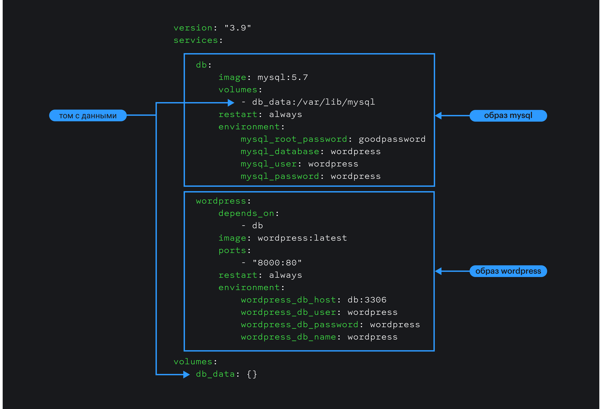

<aside>

📚 В этой статье мы говорим про инструменты Docker. Если вам не очень понятно, зачем он нужен и как работает, прочитайте статью «[Что такое Docker](/tools/docker/)».

</aside>

## Кратко

Docker Compose — это инструмент для запуска мультиконтейнерного приложения, которое не зависит от платформы и содержит все необходимые для работы технологии и библиотеки. Конфигурация такого приложения записывается в одном текстовом файле в формате YAML. Запускается приложение одной командой в терминале.

## Как начать

Если вы работаете на операционных системах Mac или Windows и установили Docker Desktop, то Docker Compose уже установлен автоматически. Если вы работаете на операционной системе семейства Linux, вам необходимо его установить, предварительно скачав последний релиз из [репозитория](https://github.com/docker/compose/releases). До установки убедитесь, что Docker Engine на Linux уже установлен и готов к работе (подробнее в статье [«Что такое Docker?»](/tools/docker/#kak-nachat)). Процесс установки описан в [официальной документации Docker](https://docs.docker.com/compose/install/).

## Как понять

Рассмотрим мультиконтейнерное приложение на примере WordPress.

Можно создать один образ с установленной базой данных, веб-сервером, интерпретатором PHP и движком WordPress на борту. А можно сделать иначе.



Веб-приложение — это, как правило, сложная система взаимодействующих частей, которые называют сервисами. Команда разработчиков Docker рекомендует подход: один сервис — один контейнер. Этот подход позволяет легче отлавливать ошибки, проще модернизировать сервисы, избегать работы над всем приложением сразу. При большой нагрузке на отдельные сервисы такой подход упрощает масштабирование с помощью перераспределения сетевых запросов (маршрутизатор можно поместить в отдельный контейнер). Реализовать мониторинг и сформировать поток ошибок также можно с помощью отдельного сервиса, запущенного в контейнере. Совокупность описанных сервисов называется мультиконтейнерным приложением.

Вернёмся к примеру. Что нужно для запуска сайта на WordPress? В самом простом случае такое веб-приложение состоит из двух сервисов:

— веб-сервер с WordPress;
— база данных.

Оба контейнера должны работать совместно. Мы можем написать [`Dockerfile`](/tools/dockerfile/) для каждого из них и настроить взаимодействие друг с другом через виртуальную сеть Docker Network. Но такой ручной подход не очень удобен. Docker Compose — это инструмент, который помогает конфигурировать запуск сразу нескольких контейнеров и указывать им, как работать совместно.

Docker Compose поддерживает файлы конфигурации в формате [YAML](https://yaml.org/). Имя файла конфигурации по умолчанию — _compose.yaml_. Для нашего примера такой файл мог бы выглядеть следующим образом (в качестве базы данных будем использовать MySQL):



<details>
  <summary>compose.yaml</summary>

  ```
  version: "3.9"

  services:
    db:
      image: mysql:5.7
      volumes:
        - db_data:/var/lib/mysql
      restart: always
      environment:
        MYSQL_ROOT_PASSWORD: goodpassword
        MYSQL_DATABASE: wordpress
        MYSQL_USER: wordpress
        MYSQL_PASSWORD: wordpress

    wordpress:
      depends_on:
        - db
      image: wordpress:latest
      ports:
        - "8000:80"
      restart: always
      environment:
        WORDPRESS_DB_HOST: db:3306
        WORDPRESS_DB_USER: wordpress
        WORDPRESS_DB_PASSWORD: wordpress
        WORDPRESS_DB_NAME: wordpress
  volumes:
    db_data: {}
  ```
</details>

В первой строчке этого файла конфигурации содержится информация о версии формата описания. С каждой новой версией функциональность Docker Compose расширяется. Если раньше этот параметр был обязательным, то сейчас его можно не указывать, если не нужно поддерживать старую версию Docker Engine, смотрите [таблицу соответствия](https://docs.docker.com/compose/compose-file/#compose-and-docker-compatibility-matrix) версий формата описания и движка Docker.

В разделе `services` содержится описание всех контейнеров, запуск которых нужно настроить. Отдельно работающие приложения или службы в терминах Docker Compose называются _сервисами_.

В подразделе `image` необходимо указать имя образа, который должен присутствовать локально на компьютере или в реестре. Можно установить и переменные окружения в подразделе `environment`, порты для подключения к сервису (например, со стороны браузера) в подразделе `ports`, пути для монтирования томов в подразделе `volumes` и прочие параметры.

В различных базах данных, не только в MySQL, как у нас, существует возможность хранить данные в отдельном файле или папке. Логично было бы положить в отдельные файлы и данные нашего сайта на WordPress. Для таких задач используются _тома_ (Docker Volumes). На самом деле — это отдельные образы дисков. Для приложения в контейнере они видны как примонтированные папки. Следовательно, когда используется том _db_data_, при остановке или перезапуске контейнера с MySQL все данные сохранятся. Ну а с контейнером с самим движком данные вообще никак не связаны.

Файл конфигурации готов, и можно «поднять» все контейнеры всего одной командой:

```bash
docker-compose up
```

Когда все образы будут загружены, тома включены, переменные окружения установлены, сайт на WordPress окажется доступным по адресу [`http://localhost:8000`](http://localhost:8000). В настройках `compose.yaml` указано, что если один из контейнеров упадёт, то Docker Compose должен перезапустить его автоматически (`restart: always`). Вы сможете начать с того же места. Появляется ещё одна возможность — можно обновить базу данных, и при следующем перезапуске запустится уже новая версия. То же самое можно делать и с веб-сервером, и движком.

Выключить оба контейнера так же просто, как и включить:

```bash
docker-compose down
```

Вы можете подробнее посмотреть все команды Docker Compose CLI в [официальной документации](https://docs.docker.com/compose/reference/overview/).

## Как пишется

Поскольку Docker Compose работает с несколькими типами объектов Docker (образами, контейнерами, томами), то логично представить их настройки в виде дерева в формате YAML, который очень часто используется в файлах конфигурации.

Если вы когда-нибудь писали на языке Python, YAML покажется вам очень понятным. Каждый новый блок отделяется отступами. Блоки могут быть вложенными, что очень удобно, и зрительно воспринимается намного легче, чем, скажем, [JSON](/tools/json/). Несомненным плюсом является популярность YAML среди специалистов по инфраструктуре.

Предпочтительное расположение файла _compose.yaml_ — корневая папка проекта, которая может содержать подпапки с сервисами мультиконтейнерного приложения. Для обеспечения обратной совместимости поддерживаются файлы с именами _docker-compose.yaml_ и _docker-compose.yml_.

В файле _compose.yaml_ могут быть следующие элементы верхнего уровня:

— [version](https://github.com/compose-spec/compose-spec/blob/master/spec.md#version-top-level-element) (скоро исключат): информация о версии формата файла конфигурации;
— [services](https://github.com/compose-spec/compose-spec/blob/master/spec.md#services-top-level-element) (обязательный): список всех контейнеров, которые нужно будет запустить;
— [networks](https://github.com/compose-spec/compose-spec/blob/master/spec.md#networks-top-level-element): список подсетей Docker Network, которые объединяют группы контейнеров в виртуальную локальную сеть (она может быть доступна из внешнего мира);
— [volumes](https://github.com/compose-spec/compose-spec/blob/master/spec.md#volumes-top-level-element): список томов, которые будут доступны контейнерам, описанным в файле конфигурации;
— [configs](https://github.com/compose-spec/compose-spec/blob/master/spec.md#configs-top-level-element): список параметров, которые позволяют запускать контейнеры в различных режимах, не собирая их заново;
— [secrets](https://github.com/compose-spec/compose-spec/blob/master/spec.md#secrets-top-level-element): список чувствительных с точки зрения безопасности параметров (то же, что и `configs`, но специального назначения).

### Services

Мультиконтейнерное приложение — система взаимодействующих сервисов. Как правило, один сервис обеспечивает какую-то одну функцию системы. Например, веб-сервер только отдаёт статический сайт (HTML, CSS и JS) браузеру, [API](/tools/api/) служит для обмена данными. Сервисы — это самостоятельные (атомарные) микроприложения или службы, работающие независимо в отдельных контейнерах.

Docker Compose — это инструмент, который не только автоматически запускает или останавливает контейнеры, но и поддерживает их жизненный цикл, обеспечивает совместное использование ресурсов.

Разрабатывая мультиконтейнерное приложение, в голове нужно держать мысль о перспективах его масштабирования и поддержки. Например, один веб-сервер со статическим сайтом может обеспечить тысячу пользователей одновременно. А что, если пользователей больше? Docker Compose в этом случае будет автоматически использовать дополнительные экземпляры сервиса, перенаправляя запросы к ним.

Например, мы запускаем два сервиса, _frontend_ и _backend_:

```yaml
services:
  frontend:
    image: awesome/webapp
    build: ./webapp
    deploy:
      mode: replicated
      replicas: 6
  backend:
    image: awesome/database
    build:
      context: backend
      dockerfile: ../backend.Dockerfile
    deploy:
    resources:
      limits:
        cpus: '0.50'
        memory: 50M
      reservations:
        cpus: '0.25'
        memory: 20M
```

Скажем, нам нужно обеспечить до шести экземпляров сервиса _frontend_, ресурсы для которого будут расходоваться, пока они будут доступны. Тогда мы указываем это явно, как сделано в примере выше, с помощью настроек `mode` и `replicas` для элемента `deploy`. Настроек для развёртывания сервиса (запуска, использования ресурсов процессора, памяти и прочее) очень много.

Сборка сервиса _frontend_ описывается отдельно от параметров развёртывания. В нашем случае она будет производиться из папки _./webapp_ с помощью файла с именем по умолчанию _Dockerfile_.

Для _backend_ — другие настройки. Нам нужно собрать образ перед тем, как мы будем использовать приложение. Настройка `context` будет содержать относительный путь к папке сервиса. Вариантов сборки образа несколько, но наш будет описываться в файле _backend.Dockerfile_. А ещё будут требования к ресурсам, которые использует приложение. Docker Compose:

- будет использовать процессор не более чем на 50% в штатном режиме, и не более 75% в пиковых нагрузках;
- сервис будет использовать не более чем 50 МБ оперативной памяти и 70 МБ в пике.

Подробнее про настройки сборки вы можете почитать в спецификации [здесь](https://github.com/compose-spec/compose-spec/blob/master/build.md), а про настройки развёртывания контейнеров [здесь](https://github.com/compose-spec/compose-spec/blob/master/deploy.md).

### Networks

Параметры, описанные в элементе `networks`, позволяют настроить виртуальную сеть Docker Network для совместной работы нескольких контейнеров. Например, можно указать две подсети, одна из которых, _back-tier_, будет обеспечивать прямую связь между _frontend_ и _backend_, в то время как другая, _front-tier_, будет связывать _frontend_ с внешним миром. В файле конфигурации это можно записать так:

```yaml
services:
  frontend:
    image: awesome/webapp

    networks:
      - front-tier
      - back-tier

  backend:
    image: awesome/database

    networks:
      - back-tier

networks:
  front-tier:
    external: true
    name: host
  back-tier:
```

### Volumes

С помощью Docker Compose вы можете использовать тома Docker Volume для хранения данных. Например, нужно обеспечить работу базы данных, расположенную в отдельной папке в томе. Проще всего это сделать следующим образом:

```yaml
services:

  backend:
    image: awesome/database

    volumes:
      - db-data:/etc/data

volumes:
  db-data:
```

Подробная спецификация элементов описана в отдельном [репозитории](https://github.com/compose-spec/compose-spec/blob/master/spec.md).
