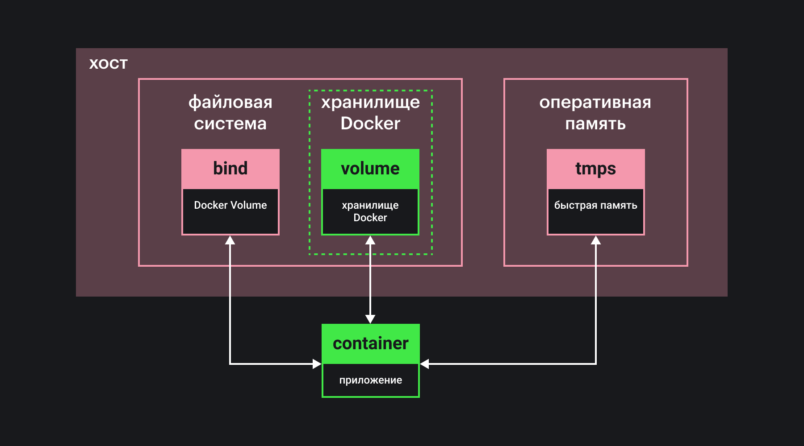

В этой статье мы поговорим про управление данными приложений в Docker. Узнать, что такое Docker, вы сможете из статьи «[Что такое Docker](/tools/docker/)». Также вы можете почитать о [мультиконтейнерных приложениях и Docker Compose](/tools/docker-compose/) и о том, [как устроен Dockerfile](/tools/dockerfile/).

Итак, по умолчанию все данные приложения хранятся в контейнере Docker и после остановки контейнера теряются. Но это не единственный способ работать с данными. Можно использовать оперативную память и файловую систему компьютера, на котором установлен Docker Engine. Существует несколько типов хранилищ данных:

- связанные папки, примонтированные к контейнеру как внешние диски (_bind mounts_);
- тома (_volumes_);
- часть оперативной памяти для работы с данными (_tmpfs mounts_ или _npipe mounts_).

Вне зависимости от того, какой тип хранилища вы выберете, данные для приложения будут храниться в заданной вами папке внутри контейнера. Технология работает бесшовно, но имеет свои накладные расходы для каждого конкретного типа.

Наглядная схема типов управления данными в Docker:



Рассмотрим каждый тип по отдельности.

## Связанные папки (bind mounts)

Связанные папки появились в Docker с самых первых релизов. Это удобный инструмент, но у него есть ограничения. Этот тип управления данными позволяет связать папку на компьютере пользователя (то есть хосте, на котором установлен Docker Engine) и папку в контейнере. Работать в контейнере и на хосте с такой папкой можно одновременно, все изменения будут отображаться и там, и там. Механизм bind mounts подразумевает, что данные могут быть изменены в любое время как из подключённого контейнера, так и непосредственно на хосте.

При создании связанной папки указывается полный путь к ней на хосте и путь внутри контейнера. Если папка не существует на хосте, Docker может создать её сам.

Связанные папки используются:

**Когда конфигурационные файлы на хосте и в контейнере одни и те же.** Именно этот тип использует сам Docker для автоматического монтирования конфигурации DNS хоста.

**Когда работаем с исходным кодом и артефактами сборок.** Можно использовать системы сборки для исходного кода внутри контейнера. Вы меняете код, [бандлер](/tools/bundlers/), который находится внутри контейнера, это видит, и код попадает в новую сборку. Другой вариант использования — работа с уже собранными бандлами, например, для тестирования или отладки приложений.

**Когда необходимо обеспечить создание одной и той же файловой структуры на различных компьютерах.** Если папки на компьютере пользователя не существует, она будет создана при сборке образа и запуске контейнера.

### Как пользоваться

Чтобы связать папку на хосте с папкой внутри контейнера, можно воспользоваться флагами `-v` или `--mount`. `$(pwd)` в командах ниже означает, что примонтируется текущая папка на хосте.

Пример с флагом `-v`:

```bash
docker run -d \
  -it \
  --name devtest \
  -v "$(pwd)"/target:/app \
  node:lts
```

Можно задать следующие опции: `rprivate`, `private`, `rshared`, `shared`, `rslave`, `slave`, `ro`, `z` и `Z`.

Первые шесть параметров позволяют управлять тем, как будут влиять изменения в одной точке монтирования тома на другие точки монтирования. По умолчанию используется `rprivate`, что означает — никак.

Последние три параметра могут быть указаны только для флага `-v`. Значение `ro` определяет режим только для чтения. Папка на хосте не может быть изменена внутри контейнера. Значение `z` обозначает, что папка на хосте может быть использована несколькими контейнерами. Значение `Z` обозначает, что папка используется только одним контейнером. Не указывайте значение `Z` для системных папок, например, _/usr_ или _/home_. Это приведёт к тому, что работа операционной системы на хосте будет парализована. Будьте аккуратны!

Пример с флагом `--mount`:

```bash
docker run -d \
  -it \
  --name devtest \
  --mount type=bind,source="$(pwd)"/target,target=/app \
  node:lts
```

<details>
  <summary>Ключ <code>bind-propagation</code></summary>

  Для флага `--mount` есть ключ `bind-propagation`, который работает только на Linux (операционные системы контейнера и хоста должны поддерживать этот режим работы).

  Представьте, есть две точки монтирования `/mnt1` и `/mnt2`, к которым привязана одна и та же папка на хосте. Значения ключа `bind-propagation` определяют, что произойдёт, если в связанной папке появятся подпапки. Что произойдёт с `/mnt2/sub` при монтировании `/mnt1/sub`? Возможны следующие варианты:

  — `shared` указывает на то, что изменения для точки монтирования `/mnt1/sub` будут в точности отражаться в `/mnt2/sub` и наоборот;
  — `slave` указывает на то же, что `shared`, но только в одном направлении (изменения в первой точке монтирования будут распространяться на вторую, но не наоборот);
  — `private` указывает, что изменения в первой точке монтирования не будут отображаться во второй, и наоборот;
  — `rshared` — то же, что `shared`, распространяет подобное поведение на все реплики точек монтирования;
  — `rslave` — то же, что `slave`, распространяет подобное поведение на все реплики точек монтирования;
  — `rprivate` (значение по умолчанию) — то же, что `private`, распространяет подобное поведение на все реплики точек монтирования.

  Пример:

  ```bash
  docker run -d \
    -it \
    --name devtest \
    --mount type=bind,source="$(pwd)"/app/src,target=/app \
    --mount type=bind,source="$(pwd)"/app/src,target=/app2,readonly,bind-propagation=rslave \
    node:lts
  ```

  Папка _/app/src_ на хосте дважды монтируется к разным папкам в контейнере. Вторая точка монтирования имеет дополнительные настройки:

  — приложение _app2_ может только читать данные из папки на хосте;
  — изменения в первой точке монтирования сразу происходят и во второй, но не наоборот.

  Ключ `bind-propagation` служит для управления хранилищами на продвинутом уровне и, как правило, нужен в специальных задачах. Об этом механизме вы можете почитать подробнее в [официальной документации Linux](https://www.kernel.org/doc/Documentation/filesystems/sharedsubtree.txt).

</details>

Флаг `--mount` не поддерживает опции для управления метками [selinux](https://ru.wikipedia.org/wiki/SELinux) (`z` и `Z`).

Проверьте корректность работы хранилища с помощью команды:

```bash
docker inspect devtest
```

В соответствующей секции _Mounts_ вы сможете найти исчерпывающую информацию. Например, если вы находились в папке _/tmp/source/target_ при запуске контейнера, то в этой секции будет указана примерно следующая информация:

```js
"Mounts": [
    {
        "Type": "bind",
        "Source": "/tmp/source/target",
        "Destination": "/app",
        "Mode": "",
        "RW": true,
        "Propagation": "rprivate"
    }
],
```

Для разрыва связи между папками на хосте и в контейнере выполните команды остановки и удаления контейнера:

```bash
docker container stop devtest
docker container rm devtest
```

<aside>

☝️ Помните:

1. Связанными папками нельзя управлять из Docker CLI.
2. Абсолютные пути на разных компьютерах могут быть разными.
3. Если в контейнере в примонтированной папке есть содержимое, то оно «перекроет» содержимое связанной папки на все время работы контейнера.
4. Использовать связанные папки для работы с конфигурационными файлами небезопасно.
5. Файловая система и структура папок могут сильно отличаться на разных компьютерах.
6. Правила описания путей к файлам могут отличаться при переходе от одной платформы к другой.
7. Вы можете столкнуться с ситуацией, когда приложение в контейнере получит доступ к системным папкам или удалит критически важные файлы.

</aside>

## Тома (volumes)

Тома — это лучший тип управления данных в Docker. Только объекты или службы Docker должны иметь права на изменение данных, расположенных в томах. На хосте данные хранятся в специальных папках, но без доступа администратора к ним не подобраться. В идеологии Docker тома — что-то вроде образа флэш-накопителя или CD/DVD.

Тома можно размещать не только на хосте. Можно, например, пользоваться облачными платформами для совместной работы с данными или для тестирования приложений. А ещё тома будут работать как с Linux-контейнерами, так и с Windows-контейнерами, поскольку файловая система томов одна и та же.

Когда том примонтирован к контейнеру, операционная система хоста не имеет к нему доступа. Docker управляет томами отдельно, позволяя подключаться одному или нескольким контейнерам одновременно. Плюсом является и то, что том существует самостоятельно и не зависит от жизненного цикла контейнеров.

Тома могут быть созданы при сборке контейнера (с помощью [Dockerfile](/tools/docker/) или [Docker Compose](/tools/docker-compose/)) или вручную с помощью Docker Engine. Тома могут иметь имя, назначенное пользователем (именованные тома, named volumes), а могут быть анонимными с именем, которое Docker устанавливает автоматически (анонимные тома, anonymous volumes).

Концепция драйвера позволяет преобразовывать данные в томах или влиять на потоки данных между томами и контейнерами. Например, это можно использовать для шифрования. Но чаще с помощью драйверов к контейнеру подключают тома, которые расположены не локально на хосте, а в облаке или на сервере. Это позволяет, не меняя логику работы приложения внутри контейнера, обрабатывать данные, которых на хосте нет.

Итак, возможности томов:

— миграция данных и создание резервных копий;
— управление с помощью Docker CLI или Docker API;
— тома работают и с Linux-, и с Windows-контейнерами;
— данные легко и безопасно можно использовать в нескольких контейнерах;
— существует механизм драйверов, который позволяет хранить данные не только на хосте, но и на сервере или в облаке, шифровать данные в томе или добавлять дополнительную функциональность;
— новые тома могут создаваться с уже загруженными с помощью контейнера данными;
— если на хосте установлены Mac или Windows, тома будут быстрее работать с Docker Desktop, чем связанные папки;
— тома не увеличивают размер контейнера;
— тома находятся вне жизненного цикла контейнера.

Тома используются:

**Когда нам нужно получить доступ к данным из разных контейнеров.** Том создаётся в первый раз либо вручную, либо при сборке контейнера. Уничтожается том всегда только с помощью Docker вручную. После остановки контейнера том будет продолжать работать, пока не будет удалён пользователем.

**Когда вы не уверены, что путь до папки будет одним и тем же на разных компьютерах.** Тома позволяют повысить уровень абстракции.

**Когда вы хотите хранить данные не только у себя на локальном компьютере, но и на сервере или в облаке.**

**Когда нужно создать резервную копию или перенести тома с одного компьютера на другой.** Тома хранятся в определённой папке на компьютере. Вы можете просто скопировать её, заархивировать и перенести на другой хост. Примерно так же создаётся и резервная копия.

**Если ваше приложение требует высокой скорости обмена данными на Mac и Windows.** Тома сохраняются на виртуальной машине Linux VM, на которой работают и контейнеры, поэтому скорость чтения и записи высокая. Нет лишних накладных расходов на доступ к файловой системе хоста.

**Когда важно, чтобы файловая система имела нативное поведение.** Например, база данных должна контролировать кэширование на диске для гарантии выполнения транзакций. Файловые системы на Mac и Windows работают не так, как на Linux. Это может привести к ошибкам работы некоторых приложений.

### Как пользоваться

Создать том можно с помощью флагов `-v` или `--mount` при запуске контейнера. Для флага `-v` можно указать параметр `ro`, который будет означать использование режима только для чтения. Для флага `--mount` есть ключ `volume-opt`, который устанавливает набор опций, разделённых запятыми. Не забывайте, что значения для этого ключа должны быть экранированы кавычками. Работа с томами такова, что изменения в одной точке монтирования в контейнере не будут отображаться в другой точке монтирования (параметр `bind-propagation` всегда выставлен в значение `rprivate`).

Подключить том с именем `my-vol` можно следующим образом.

С флагом `--mount`:

```bash
docker run -d \
  --name devtest \
  --mount source=my-vol,target=/app \
  node:lts
```

С флагом `-v`:

```bash
docker run -d \
  --name devtest \
  -v my-vol:/app \
  node:lts
```

Проверьте корректность результата выполнения команды:

```bash
docker inspect devtest
```

Чтобы удалить том, необходимо отключить связанный с ним контейнер и удалить сам контейнер:

```bash
docker container stop devtest
docker container rm devtest
docker volume rm my-vol
```

Управлять томами можно через Docker API с помощью Docker CLI и Docker Compose.

Чтобы создать новый том **с помощью Docker CLI**, используйте команду:

```bash
docker volume create my-vol
```

Получите список томов на хосте:

```bash
docker volume ls
```

Посмотрите информацию о томе:

```bash
docker volume inspect my-vol
```

Удалите том командой:

```bash
docker volume rm my-vol
```

Если том был анонимным, то можно удалить его сразу после завершения работы контейнера. Для этого при запуске контейнера вы можете прописать флаг `--rm`. Вместе с удалением контейнера в этом случае удалится и том:

```bash
docker run --rm -v /foo -v awesome:/bar container app
```

После завершения работы и последующего удаления контейнера анонимный том удалится, а именованный `awesome` продолжит работать.

Чтобы удалить все неиспользуемые тома, используйте команду:

```bash
docker volume prune
```

Для того, чтобы подключить том **с помощью Dockerfile**, необходимо использовать инструкцию `VOLUME`:

```dockerfile
FROM node:lts
RUN useradd user
RUN mkdir /data && touch /data/x
RUN chown -R user:user /data
VOLUME /data
```

Интересно, что вы не сможете внести какие-либо изменения в данные на этапе сборки образа. Следующий _Dockerfile_ правильно работать не будет:

```dockerfile
FROM node:lts
RUN useradd user
VOLUME /data
RUN touch /data/x
RUN chown -R user:user /data
```

Том будет подключён только после создания образа на этапе запуска контейнера. Возможно, придётся использовать инструкции `CMD` или `ENTRYPOINT`. Подробнее описано в статье «[Как устроен Dockerfile](/tools/dockerfile/)».

Запустить том для отдельного контейнера **с Docker Compose** можно с помощью следующей конфигурации:

```yaml
services:
  frontend:
    image: node:lts
    volumes:
      - myapp:/home/node/app
volumes:
  myapp:
```

Команда `docker-compose up` поднимет не только сам контейнер `frontend`, но и создаст том `myapp`. Если он уже был создан, Docker Compose подключит его к контейнеру, но надо указать это явно с помощью элемента `external` так:

```yaml
services:
  frontend:
    image: node:lts
    volumes:
      - myapp:/home/node/app
volumes:
  myapp:
    external: true
```

Подробнее о формате конфигурации Docker Compose можно прочитать [в статье о Docker Compose](/tools/docker-compose/).

### Использование драйверов

Когда приходит время масштабировать приложение, несколько сервисов должны работать с одним хранилищем данных. Для этого существует масса решений, и у Docker есть своё — драйверы для томов. Это лишь один пример использования драйверов. Можно организовать, например, пересылку данных между контейнерами с поддержкой шифрования или автоматическое шифрование и дешифровку всех данных в томе. Можно реализовать любой механизм обработки данных. Драйверы повышают уровень абстракции, позволяя отделить логику работы приложения от системы хранения данных.

Например, есть два компьютера — хост, на котором установлен Docker и запускаются контейнеры, и файловый сервер, который поставляет данные для них. Контейнеры ничего не знают про эту архитектуру: все запускалось изначально на локальном хосте. Драйвер `vieux/sshfs` позволяет использовать SSH-соединение для связи с файловым сервером, при этом данные будут представлены в виде тома Docker.

Для начала необходимо установить соответствующий плагин для Docker Engine:

```bash
docker plugin install --grant-all-permissions vieux/sshfs
```

Затем нужно создать том и прописать учётные данные:

```bash
docker volume create --driver vieux/sshfs \
  -o sshcmd=test@node2:/home/test \
  -o password=testpassword \
  sshvolume
```

Если для связи по SSH между клиентом и сервером уже работают ключи доступа, то пароль можно опустить. Флаг `-o` указывает на опции, которые могут быть переданы драйверу. Набор доступных опций у каждого драйвера свой.

Можно создать том и другим способом, при запуске контейнера:

```bash
docker run -d \
  --name sshfs-container \
  --volume-driver vieux/sshfs \
  --mount src=sshvolume,target=/app,volume-opt=sshcmd=test@node2:/home/test,volume-opt=password=testpassword \
  nginx:latest
```

Если драйвер требует передачи опций, приходится использовать флаг `--mount`.

### Резервные копии

Для того чтобы создать резервную копию тома, можно использовать механизм контейнеров Docker. Например, вы уже создали контейнер с именем `dbstore` на базе операционной системы Ubuntu и работаете с данными в томе `dbdata`. Для этого вы уже выполнили команду и получили доступ к терминалу контейнера:

```bash
docker run -v /dbdata --name dbstore node:lts /bin/bash
```

Как создать резервную копию данных в томе? Нужно:

— запустить новый контейнер и примонтировать том, который используется в контейнере `dbstore`;
— примонтировать папку на хосте, чтобы потом в неё положить резервную копию;
— зайти внутри контейнера в том, заархивировать данные и положить их в связанную папку.

Выполните команду:

```bash
docker run --rm --volumes-from dbstore -v $(pwd):/backup ubuntu tar cvf /backup/backup.tar /dbdata
```

После завершения архивации контейнер выключится и удалится, а резервная копия останется у вас в папке, из которой вы запускали команду.

Допустим, у вас возникла необходимость развернуть данные из сохранённой резервной копии внутри контейнера `dbstore2`. Нужно запустить его:

```bash
docker run -v /dbdata --name dbstore2 node:lts /bin/bash
```

Затем разархивировать данные в том:

```bash
docker run --rm --volumes-from dbstore2 -v $(pwd):/backup ubuntu bash -c "cd /dbdata && tar xvf /backup/backup.tar --strip 1"
```

## Хранение в оперативной памяти

Хранение в оперативной памяти бывает двух типов:  _tmpfs mounts_ и _npipe mounts_.

Механизм _tmpfs mount_ в операционной системе Linux позволяет выделить часть оперативной памяти хоста для хранения данных. Данные не сохраняются в файловой системе, и получается быстрое хранилище. Примонтированная папка _tmpfs_ работает, пока запущен контейнер, поэтому не стоит использовать этот способ для хранения настроек и результатов работы приложения.

Для пользователей операционной системы Windows существует ещё один тип управления данными — _npipe mount_. Этот тип позволяет получить доступ к хосту Docker из контейнера и в основном используется для управления данными с Docker Engine API.

Используем оперативную память:

**Если вы не хотите оставлять данные после завершения работы приложения.**

### Как пользоваться

Этот раздел посвящён использованию только на Linux.

С помощью томов и связанных папок вы можете делиться файлами между хостом и контейнером. После остановки контейнера данные сохраняются. Но если на хосте используется операционная система Linux, то существует и третий тип работы с данными — _tmpfs_. Это временное файловое хранилище, которое располагается в оперативной памяти, присутствует во многих Unix-подобных системах. Когда вы создаёте контейнер, Docker может создать отдельный слой в оперативной памяти снаружи контейнера для хранения и обработки данных.

При использовании этого типа работы с данными в Docker есть два ограничения:

— операционной системой хоста может быть только Linux;
— данные в _tmpfs_ доступны лишь из одного контейнера.

_tmpfs_ хорошо работает в случае хранения чувствительной информации: ключей шифрования, паролей, сертификатов доступа и тому подобного.

Чтобы запустить контейнер с _tmpfs_, используют команду:

```bash
docker run -d \
  -it \
  --name tmptest \
  --mount type=tmpfs,destination=/app \
  node:lts
```

С помощью ключа `tmpfs-size` можно определить максимальный размер хранилища в байтах. По умолчанию он не ограничен. Ключ `tmpfs-mode` служит для определения уровня доступа в восьмеричном формате. Например, значение по умолчанию `1777` обозначает, что любой пользователь или программа в контейнере имеют неограниченный доступ к данным, которые будут доступны и вне контейнера. Этот параметр работает также, как и для [_tmpfs_ в Unix-подобных операционных системах](https://man.archlinux.org/man/tmpfs).

Также есть альтернативная более короткая команда для управления _tmpfs mounts_:

```bash
docker run -d \
  -it \
  --name tmptest \
  --tmpfs /app \
  node:lts
```

Проверьте состояние контейнера, чтобы убедиться, что файловое хранилище создано корректно:

```bash
docker container inspect tmptest
```

В соответствующей секции будет доступна информация о примонтированной папке:

```js
"Tmpfs": {
    "/app": ""
},
```

Для удаления слоя с данными выполните команды остановки и удаления контейнера:

```bash
docker container stop tmptest
docker container rm tmptest
```
