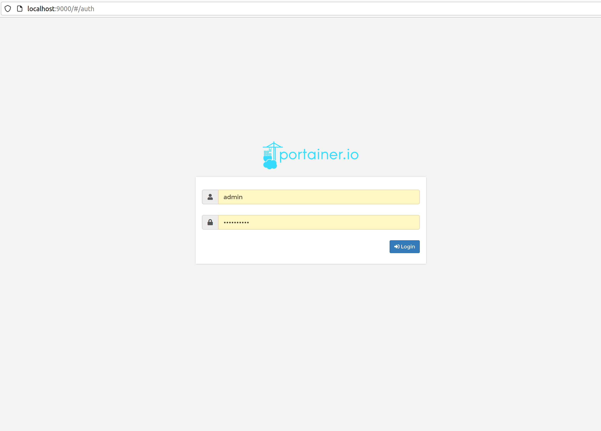
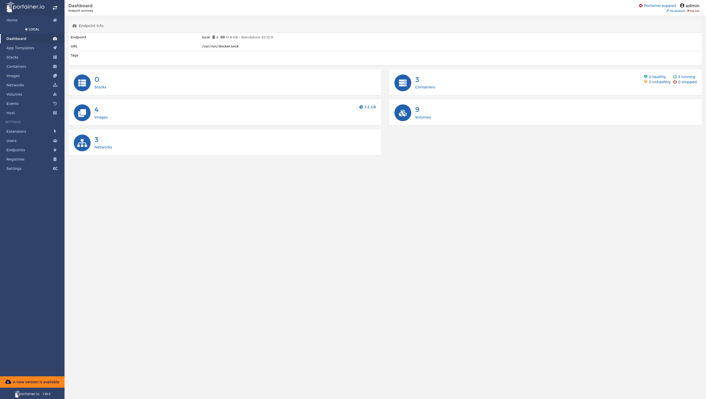
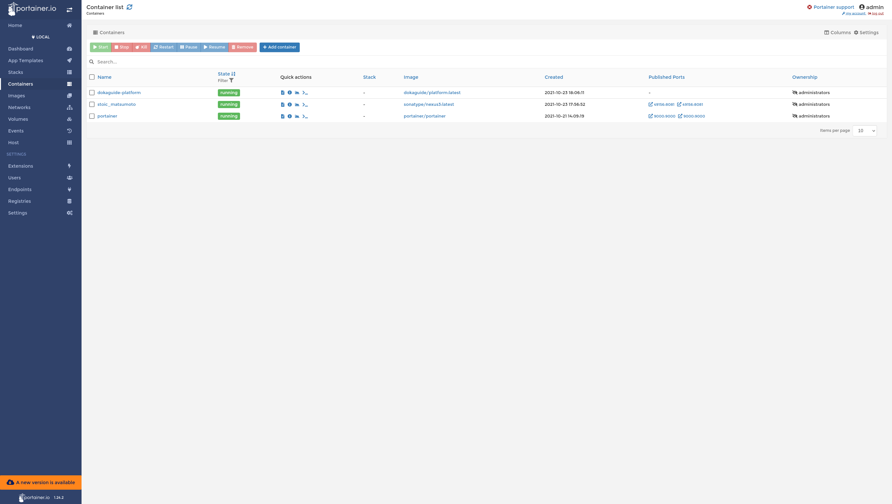
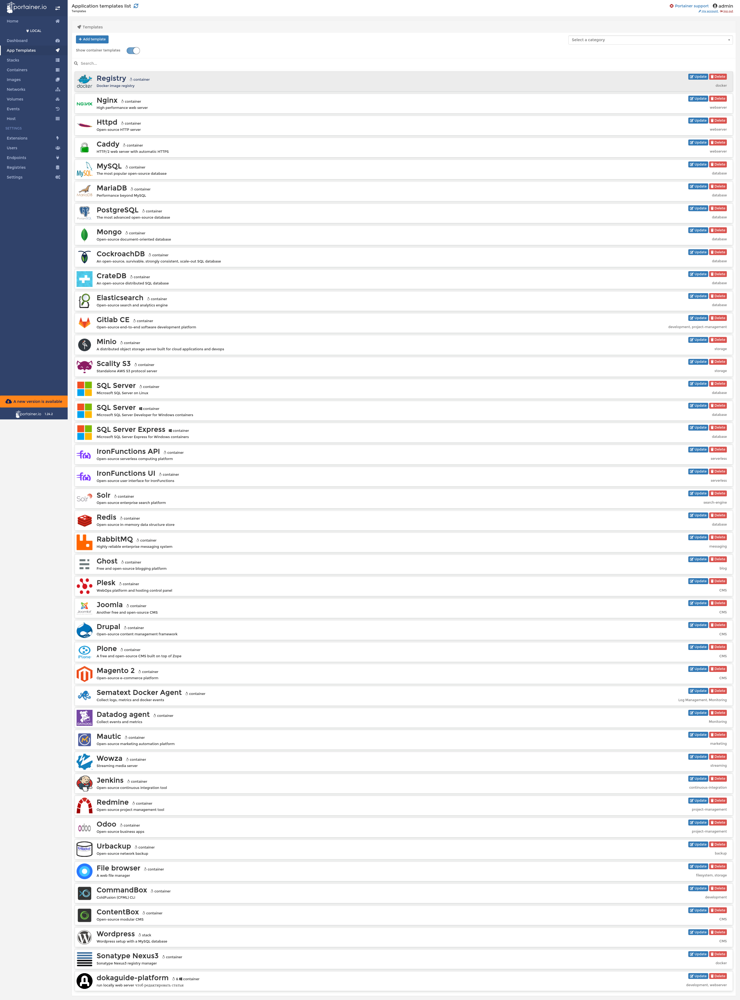
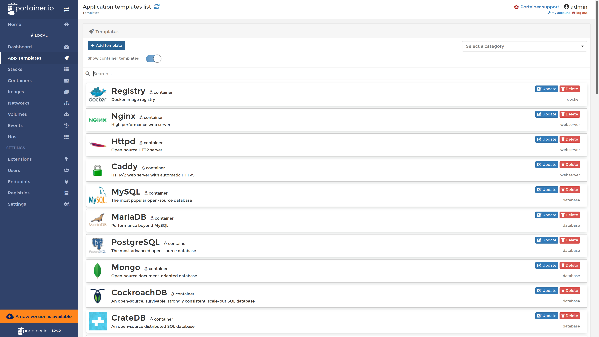
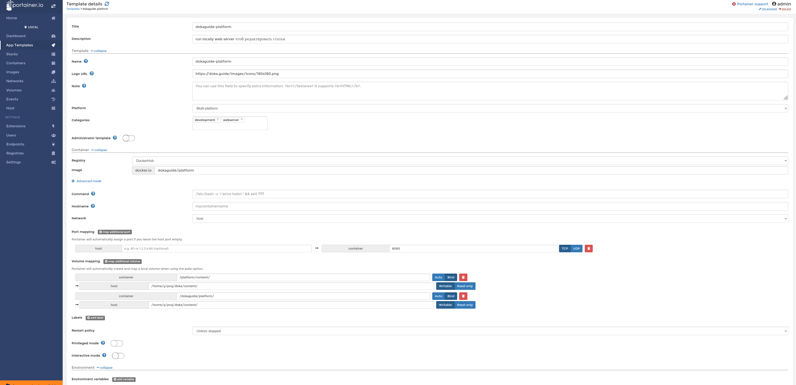
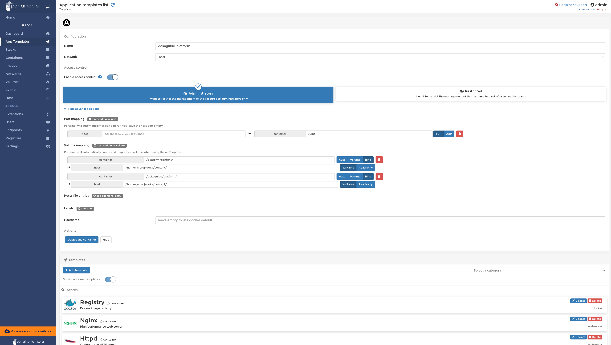

Portainer :1st_place_medal: — это удобный инструмент для управления Docker из браузера по популярности он опережает сходные с ним rancher и lazy-docker. Portainer включает все возможности Docker Desktop (на операционных системах macOS и Windows),  и обладаёт рядом дополнительных  функций. Portainer не зависит от операционной системы, на которой запускается, и позволяет работать как с локально установленным докером, так и с удалёнными серверами. Позволяет управлять:

- Шаблонами приложений - этот аспект использования (use case) мы рассмотрим дальше подробнее.
- Самими контейнерами.
- Образами контейнеров.
- Виртуальными сетями на хосте.
- Томами.

Разработка Веба это работа в браузере и вкладка c [Portainer](http://localhost:9000) по адресу http://localhost:9000 поможет быстрее выполнить рутинные операции, которые в консоли bash занимают место и время, с Portainer можно не углубляться в детали cli-инструментов, хотя с ними конечно надо быть знакомым - посмотрите материалы Доки про docker статья «[Что такое Docker](/tools/docker/)» и docker-compose в статье «[Мультиконтейнерное приложение и Docker Compose](tools/docker-compose/)» они работают под "капотом" Portainer.

Ещё нужно обозначить, что везде по тексту Portainer/Portainer == это Portainer Community Edition, он доступен бесплатно в отличие от Portainer Buisness. И ещё, мы поговорим только о части возможностей Portainer (Community Edition) наиболее востребованных с точки зрения веб-разработчика использующего и настраивающего индивидуальную среду разработки самостоятельно.

 [сайт Portainer.io](https://portainer.io)

## Как установить Portainer

Официальный сайт Portainer.io представляет информацию о том как установить stand-alone server, а в индивидуальной среды разработки удобнее установить portainer как образ докера, чтобы не тратить ресурсы на отдельный сервер не менять системные настройки - таким образом мы используем преимущества Docker!

### установка Portainer в Линуксе (ubuntu, debian) как сервиса с помощью докер-контейнера

<details>
<summary>Вот эту часть можно пропустить, если вы уже знакомы с Docker и docker-compose и эти инструменты установлены у вас. Иначе раскрывайте спойлер.</summary>

след.шаги повторяют как установить docker и docker-compose, если их у вас Ещё нет. также для работы portainera нужно, чтобы пользователь был в группе docker

в современных дистрибутивах Ubuntu, Debian этот шаг не нужен, но пригодится если ubuntu версии bionic

```bash
    sudo apt-get install apt-transport-https ca-certificates software-properties-common curl gnupg lsb-release
```

```bash
    curl -fsSL https://download.docker.com/linux/ubuntu/gpg | sudo gpg --dearmor -o /usr/share/keyrings/docker-archive-keyring.gpg
```

```bash
    sudo echo "deb [arch=$(dpkg --print-architecture) signed-by=/usr/share/keyrings/docker-archive-keyring.gpg] https://download.docker.com/linux/ubuntu \
$(lsb_release -cs) stable" | sudo tee /etc/apt/sources.list.d/docker.list > /dev/null
```

```bash
    sudo apt update && apt-get install docker-ce docker-ce-cli containerd.io
```

```bash
    sudo usermod -aG docker $(whoami)
```

    В этот каталог в домашней папки

```bash
    mkdir -p $HOME/.docker/cli-plugins/
```

скачиваем [docker-compose](https://github.com/docker/compose/releases) и делаем его исполняемым

```bash
    sudo chmod +x ~/.docker/cli-plugins/docker-compose
```
после всего перегрузим компьютер, чтобы стартовали сервисы

</details>

Убедимся, что у нас работает docker-compose

```bash
    docker-compose --version
```

и что в результатах команды `groups` есть группа docker

создадим для Portainer постоянный том фиксированного размера на котором будут сохраняться данные Portainer Community Edition

```bash
    docker volume create -d local --name portainer_data \
    --opt device="/mnt/device_guid/portainer_volume" \
    --opt type="none" \
    --opt o="bind" \
    --opt o=size=10000m,gid=1000 \
```
Укажем докеру скачать образ portainer/portainer одной из предыдущих версий (1.24.2) из общедоступного registry, не интерактивно запустим Portainer с опцией постоянного рестарта и подключением созданного portainer_data тома:

```bash
    docker run -d -p 9000:9000 --name=portainer --restart=always -v /var/run/docker.sock:/var/run/docker.sock -v portainer_data:/data portainer/portainer:1.24.2
```

:1.24.2 можно не добавлять, тогда полученная версия будет latest.

После запуска Portainer'a открываем в браузере http://localhost:9000 (не https!)

если понадобится остановить/запустить Portainer выполняем соответственно `docker stop portainer` или `docker start portainer`

## Как выглядит Portainer

Ниже несколько скриншотов, для самых основных моментов работы с Portainer. При первом запуске предложено создать пользователя admin'a, назначить ему пароль, так чтобы каждая веб-сессия была авторизована.



Дашборд -  даёт обзорную информацию обо всех контейнерах, скаченных образах (images), состоянии томов (volumes) и работающих процессах в докере кликнув, например, на CONTAINERS мы "провалимся" в уровень ниже и увидим какие контейнеры у нас работают и сможем управлять их состоянием с помощью кнопок kill, restart, stop, remove и добавить новые с помощью ADD+



Управлять можно как отдельным контейнером, так и группами через "выбрать галочками", подобный же интерфейс в разделах дашборда VOLUMES, IMAGES, NETWORKS



Самый интересный раздел App Templates - он предоставляет готовые шаблоны для развёртывания - container deployment. Пара десятков шаблонов на скриншоте  идут "из коробки" и распространяются вместе с Portainer. Как использовать? Просто выбираете шаблон, входите в него, нажимаете deploy container и получаете запущенное на компьютере приложение. Portainer даёт возможность создать шаблон приложения самостоятельно. Ваши шаблоны появятся в списке вместе с другими. Давайте сделаем это.



## Пример использования

### Создадим шаблон приложения dokaguide-platform

На сайте Доки есть инструкция о том как развернуть локальную среду разработки для редактирования материалов Доки. В инструкции предлагается выполнить bash script, который скачает и запустит образ dokaguide/platform в несколько нажатий кнопок. Давайте создадим шаблон приложения для быстрого запуска приложения dokaguide-platform, чтобы Portainer заботился от том, чтобы у нас работал локальный сайт Доки! 

 разберёмся, как устроен этот шаблон.

Предположим, что папка нашего проекта находится по пути /home/user/projects/doka (туда был склонирован форк Доки) открываем http://localhost:9000 и выбираем в меню APP Templates Add Template



Создаём шаблон как на скриншоте, и нажимаем кнопку Create Template обратите внимание что выбрана опция networks - host, а для двух точек монтирования (тип BIND ) контейнера на локальную файловую систему выбраны значения соответственно:

```
    1. host: "/home/user/projects/doka/content" "Container": "/dokaguide/platform"
    2. host: "/home/user/projects/doka/content" "Container": "/platform/content"
```
На вашем компьютере host путь будет другим, в зависимости от того какую папку своего компьютера вы хотите открыть на запись/чтение для приложения в докере.



Для шаблона можно указать логотип, я использовал 

Осталось теперь выбрать в меню список всех шаблонов app templates и найти на последнем месте созданный шаблон, выбираем его, открываем и нажимаем кнопку deploy :tada:



Контейнер запускается, первый запуск связан с этапом скачивания образа из общедоступного registry, последующие запуски будут быстрыми. открываем домашнюю страницу Доки локально http://localhost:8080

Если контейнер запущен, проброшен порт 8080, и сделана привязка (bind) к локальной файловой системе, мы увидим

