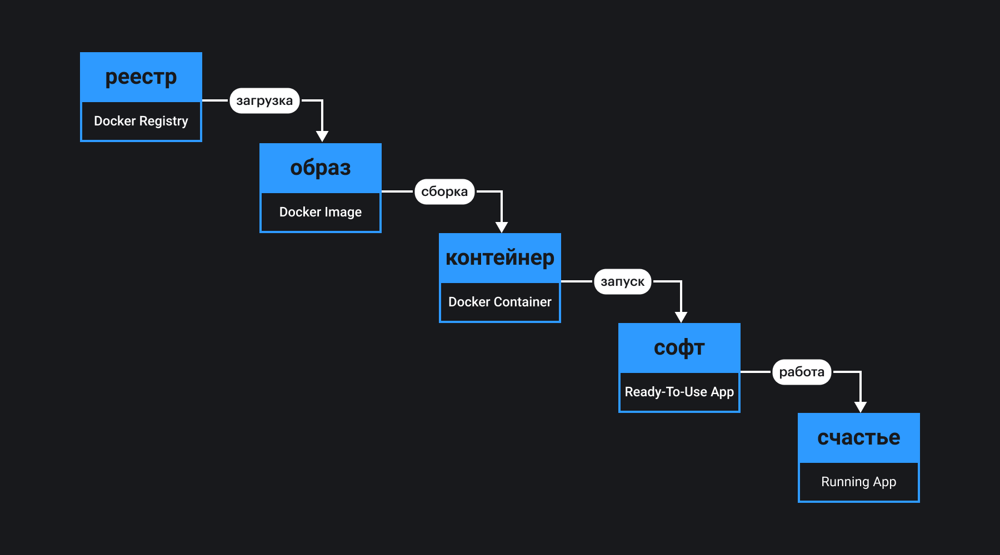

## Кратко

Docker — это технология, которая позволяет создавать и использовать приложения в «родном» окружении. В основе Docker лежит идея: если приложение работает у вас, то оно должно работать где угодно. Способ этого добиться очень простой — нужно упаковать настройки окружения вместе с приложением.

Docker чаще всего применяется для развёртывания серверных приложений, но может использоваться и в мире фронтенда для:

- сборки [бандлов](/tools/bundlers/);
- [статического анализа кода](/tools/static-analysis/);
- [тестирования приложений](/tools/how-to-test-and-why/);
- подготовки ресурсов (картинок, шрифтов, иконок и пр.);
- воспроизводимых экспериментов с новыми технологиями и демок;
- настройки инфраструктуры разработчика (редактора кода, [платформы](/tools/nodejs/), [пакетных менеджеров](/tools/package-managers/), [линтеров](/tools/static-analysis/) и прочего).

## Как начать

Установите Docker:

- Windows — [Docker Desktop for Windows](https://hub.docker.com/editions/community/docker-ce-desktop-windows/)
- macOS — [Docker Desktop for Mac](https://hub.docker.com/editions/community/docker-ce-desktop-mac/)
- Linux — в зависимости от версии: [CentOS](https://docs.docker.com/engine/install/centos/), [Debian](https://docs.docker.com/engine/install/debian/), [Fedora](https://docs.docker.com/engine/install/fedora/), [Raspbian](https://docs.docker.com/engine/install/debian/), [Ubuntu](https://docs.docker.com/engine/install/ubuntu/).

Запустите Docker и проверьте его работоспособность с помощью графического интерфейса [Dashboard](https://docs.docker.com/desktop/dashboard/) (для Mac или Windows) или команды в терминале (для всех операционных систем):

```bash
docker --version
```

У создателей Docker есть готовая демка, которую можно запустить командой:

```bash
docker run -d -p 80:80 docker/getting-started
```

Теперь можно открыть в браузере документацию Docker по адресу [http://localhost](http://localhost).

## Как понять

Запуск готового веб-приложения — наиболее популярный сценарий использования. Демка Docker — самое простое, что можно сделать «из коробки». Вам не пришлось устанавливать и запускать веб-сервер, не пришлось разбираться с какими-либо настройками, вы не трудились устанавливать у себя [Node.js](/tools/nodejs-tooling/) и не столкнулись ни с какими сложностями. Представьте, что вы передали проект другому разработчику, и вам не приходится возиться с тем, чтобы проект запускался, не приходится говорить: «А у меня все работало 😞»

Без Docker вы, скорее всего, действовали бы так:

1. Узнали операционную систему на компьютере разработчика.
2. Сформировали сценарий или инструкцию настройки окружения.
3. Протестировали, как развёртывается ваше приложение.
4. Передали приложение разработчику, и ждали результаты.

Ситуация будет ещё сложнее, если вы и другой разработчик используете разные операционные системы. С Docker все намного проще! Вы создаёте конфигурацию, и если она работает у вас, то заработает у всех.

Docker упаковывает приложение так, что будет счастлив любой, кто его получит 😇

Давайте разберёмся, как это происходит. Что должен делать Docker с вашим приложением, какое окружение он должен подготовить?

Рассмотрим пример с демкой от создателей Docker. Когда вы выполнили команду `docker run`, произошло следующее:

1. Docker нашёл и загрузил приложение с именем `docker/getting-started` из реестра приложений Docker Hub. Приложение уже было заботливо упаковано со всеми необходимыми ему утилитами и программами. Такая упаковка называется _образ_ (Docker Image). Образ обычно содержит в себе операционную систему на базе Linux, стартовую конфигурацию для установки служб, утилит, приложений, зависимостей проекта — все это называется окружением приложения.
1. Docker создал _контейнер_ (Docker Container) на основе образа. Контейнер — это конкретный экземпляр образа на вашем компьютере. Отношение «образ — контейнер» примерно такое же, как у пары «класс — объект класса» в [ООП](/tools/oop/).
1. Docker запустил контейнер с веб-сервером Nginx внутри, и веб-приложение «Справка по Docker» заработало. Для вашей операционной системы запустить контейнер — это все равно что запустить любое приложение или сервис.

Вы просто начали использовать веб-приложение, никаких сложностей.



Перед тем, как мы научимся готовить образ сами, необходимо разобраться с терминами. Лучше сделать это на берегу 😎

### Важные службы

**Движок Docker Engine** — приложение для управления объектами Docker. Оно включает в себя три компонента:

1. сервер (Docker Daemon);
1. интерфейс (Docker API);
1. консольный клиент (Docker CLI).

Ваш компьютер называется _Docker Host_. Все операции, которые мы выполняем в интерфейсе или через [консоль](https://docs.docker.com/engine/reference/commandline/cli/), выполняются сервером через [API движка](https://docs.docker.com/engine/api/).

**Docker Desktop** — пакет приложений с графическим интерфейсом, включающий специальную виртуальную машину для работы с движком, визуальный интерфейс (Dashboard), консольный клиент, инструменты для работы с реестром Docker Hub и пр.

Для платформы Mac и Windows невозможно использовать Docker Engine напрямую, необходимо запустить виртуальную машину. Docker Desktop содержит такую виртуальную машину. Все процессы в ней оптимизированы, контейнеры работают быстрее, но определённые [ограничения](https://docs.docker.com/desktop/faqs/) все равно присутствуют.

### Объекты Docker

**Образ (Docker Image)** — прототип будущего контейнера, содержащий операционную систему, приложение или проект для сборки приложения. Образы состоят из слоёв. Каждый новый слой — это надстройка над предыдущим. Слои должны надстраиваться поверх базового образа, формируя новый. Например, базовым образом может быть образ операционной системы.

Слои образа описываются в специальных файлах конфигурации. Как правило, для этого используется Dockerfile. Конфигурационный файл всегда начинается с указания базового образа, имя которого прописывается после директивы `FROM`. Дальше могут идти разные надстройки (новые слои) образа. Вы можете задать рабочую папку проекта с помощью директивы `WORKDIR`, скопировать файлы в эту рабочую папку директивой `COPY`, запустить выполнение команды или нескольких команд в терминале директивой `RUN`. Пример конфигурации:

```dockerfile
FROM ubuntu:18.04
WORKDIR /app
COPY . .
RUN apt-get update && apt-get upgrade
```

**Контейнер (Docker Container)** — уже собранное и запущенное приложение в изолированном окружении, которое формируется послойно, в соответствии с образом. Каждый новый слой расширяет функциональность предыдущего, формируя стек используемых инструментов, платформ и настроек системных служб. Файловая система контейнера тоже стековая ([Union File Systems](https://www.terriblecode.com/blog/how-docker-images-work-union-file-systems-for-dummies/)). Каталоги и файлы отдельного слоя образа накладываются друг на друга, образуя единое целое.

**Том (Docker Volume)** — папка, которую можно подключить (говорят _«примонтировать»_) к контейнерам. Папка может быть связана с конкретной папкой на вашем компьютере, а может быть как бы сетевой для контейнеров на вашем компьютере. Тома необходимы для хранения файлов конфигурации, критических с точки зрения безопасности, файлов баз данных, файлов, которые нельзя удалять после окончания работы приложения.

**Сеть (Docker Network)** — виртуальная локальная сеть, которая позволяет совместно использовать несколько запущенных контейнеров и соединять запущенный контейнер с вашим компьютером. В основном вы будете использовать три режима работы сетевой инфраструктуры Docker:

1. `bridge` — когда контейнеры могут взаимодействовать между собой как веб-сервер и база данных.
1. `host` — для доступа к локальному сетевому окружению на вашем компьютере.
1. `none` — сеть для контейнеров полностью отключена.

### Инструменты

**Docker Hub (реестр)** — официальный реестр образов.

Опубликованные образы хранятся в [Docker Hub](https://hub.docker.com/). Существуют и другие публичные реестры образов:

- [Google Cloud Container Registry](https://cloud.google.com/container-registry);
- [Azure Container Registry](https://azure.microsoft.com/services/container-registry);
- [IBM Cloud Container Registry](https://www.ibm.com/cloud/container-registry);
- [Oracle Cloud Infrastructure Container Registry](https://www.oracle.com/cloud-native/container-registry/);
- [Yandex Container Registry](https://cloud.yandex.com/services/container-registry).

Предпочитайте официальные образы Docker, которые обновляются самой компанией. Они относительно безопасны. Для фронтенд-разработчика могут быть интересны:

- [Node](https://hub.docker.com/_/node);
- [Express with compatible of MongoDB](https://hub.docker.com/_/mongo-express);
- [Drupal](https://hub.docker.com/_/drupal);
- [Python](https://hub.docker.com/_/python);
- [PHP](https://hub.docker.com/_/php);
- [Ruby](https://hub.docker.com/_/ruby).

**Docker CLI** — консольный клиент, позволяющий управлять Docker через интерфейс командной строки.

Консольный клиент содержит команды для управления объектами Docker. Список основных команд:

- [`docker ps`](https://docs.docker.com/engine/reference/commandline/ps/);
- [`docker run`](https://docs.docker.com/engine/reference/commandline/run/);
- [`docker image`](https://docs.docker.com/engine/reference/commandline/image/);
- [`docker container`](https://docs.docker.com/engine/reference/commandline/container/);
- [`docker volume`](https://docs.docker.com/storage/volumes/).

## Как пользоваться

Ключи командного интерфейса Docker CLI хорошо проработаны и похожи на консольные команды в bash. Например, дополнительный ключ `prune` позволяет удалять неиспользуемые объекты. Ключ `rm` служит для удаления, а ключ `ls` для просмотра объектов. Объекты Docker в обязательном порядке имеют уникальное имя. Если вы не именуете объект специально, то имя объекта формируется с помощью хэш-функции. Если вы попытаетесь создать объект одного и того же типа с уже использованным именем, в этом вам будет отказано. Как же пользоваться консольным клиентом?

### Мониторинг запущенных контейнеров

- `docker ps` — просмотр запущенных контейнеров.
- `docker ps -a` — ключ `-a` выводит и запущенные, и остановленные контейнеры.
- `docker ps -s` — ключ `-s` выводит дисковое пространство, используемое каждым запущенным контейнером.
- `docker ps -f name=hello` — ключ `-f` фильтрует список контейнеров по имени, например, `hello`.

Полный список ключей для команды `docker ps` доступен [в документации](https://docs.docker.com/engine/reference/commandline/ps/).

### Запуск контейнеров

Для запуска контейнера, который доступен локально или на Docker Hub, выполните команду:

```bash
docker run --name test -i -t hello
```

Ключ `--name` используется для установки имени запущенного контейнера. Ключи `-i` и `-t` указывают, что для запуска контейнера будет использоваться [стандартный поток ввода](https://ru.wikipedia.org/wiki/Стандартные_потоки) и [терминал TTY](https://ru.wikipedia.org/wiki/TTY-абстракция) соответственно. Для того чтобы при запуске контейнера примонтировать том, который будет связан с папкой на вашем компьютере, а потом получить доступ к контейнеру через терминал, выполните команду:

```bash
docker run -t -i --mount type=bind,src=/data,dst=/data hello bash
```

Полный список ключей для команды `docker run` доступен [в документации](https://docs.docker.com/engine/reference/commandline/run/).

### Управление образами

Вы можете получить список всех доступных локально образов с помощью команды:

```bash
docker image ls
```

Ключи `prune`, `rm` действуют обычным способом, позволяя удалить неиспользуемые или конкретные образы соответственно. Для работы с реестром необходимо использовать следующие команды:

- `docker image pull hello` — загрузка образа с именем hello из реестра;
- `docker image push hello` — отправка образа с именем hello в реестр;
- `docker image inspect hello` — полная информация о контейнере `hello`;
- `docker image build` — собрать контейнер из текущей папки с учётом Dockerfile.

Полный список ключей для команды `docker image` доступен [в документации](https://docs.docker.com/engine/reference/commandline/image/).

### Управление контейнерами

Наиболее используемыми командами будут команды запуска и остановки контейнеров.

Команда для запуска контейнера:

```bash
docker container start
```

Команда для перезапуска контейнера:

```bash
docker container restart
```

Команда для остановки контейнера:

```bash
docker container stop
```

Команда для постановки контейнера на паузу:

```bash
docker container pause
```

Полный список ключей для команды `docker container` доступен [в документации](https://docs.docker.com/engine/reference/commandline/container/).

### Управление томами

- `docker volume ls` — вывод всех томов.
- `docker volume ls -f name=hello` — вывод всех томов с фильтрацией по имени, например, `hello`.
- `docker volume create hello` — создание нового тома, например, `hello`.
- `docker volume inspect hello` — исчерпывающая информация о томе.

Полный список ключей для команды `docker volume` доступен [в документации](https://docs.docker.com/engine/reference/commandline/volume/).
