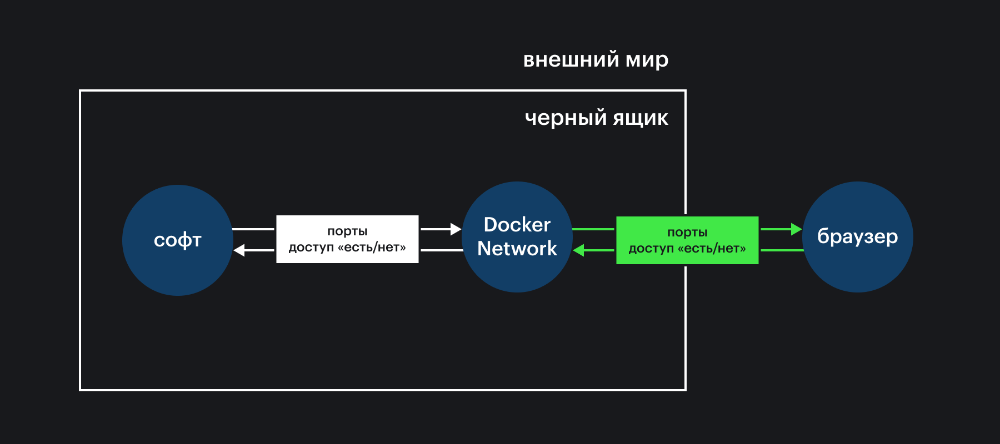

## Кратко

`Dockerfile` — это текстовый файл, в котором описан рецепт создания образа Docker. Рецепт состоит из инструкций, которые выполняются последовательно. Они содержат информацию об операционной системе, выбранной платформе, фреймворках, библиотеках, инструментах, которые нужно установить.

Dockerfile позволяет создавать одинаковое окружение для работы программы, независимо от машины, которая собирает образ. Прочитайте [обзорную статью о Docker](/tools/docker/), чтобы лучше разобраться, зачем это нужно.

## Как понять

Современные веб-приложения работают очень просто только для пользователя, который может смотреть видео, читать тексты, слушать музыку или заказывать еду «в один клик». Под капотом — это сложный набор приложений, взаимодействующих между собой. Если одно из приложений в цепочке сломается, клиент не сможет решить свою задачу. Важная задача веб-разработчика — сделать приложение максимально живучим в самых разных условиях. Решение задачи заключается в том, чтобы воспроизвести одинаковое, «правильное» поведение веб-приложения.

Docker умеет создать идентичные условия работы приложения, независимо от операционных систем и установленных служб на компьютере разработчика и на сервере. Для этого используется концепция контейнера. Прототипом контейнера является образ, в `Dockerfile` описывают процесс его создания в виде набора инструкций.

Инструкции записываются построчно. На первом месте указывается команда для Docker, которую нужно выполнить, а затем — список аргументов этой команды:

```dockerfile
# Comment
INSTRUCTION arguments
```

Образ Docker легче всего представить в виде слоёного пирога или бургера: новый слой — новая инструкция. Образы для типичного веб-приложения могут быть собраны примерно так:


Каждая новая инструкция — новый слой. В качестве инструкции можно выполнить команду в терминале, скопировать файлы внутрь образа или настроить связь с внешним миром с помощью сетевого окружения и томов. Docker объединяет файловые системы отдельных слоёв в одну во время сборки, используя механизм [Union File Systems](https://www.terriblecode.com/blog/how-docker-images-work-union-file-systems-for-dummies/).

Концепция слоёв позволяет Docker оптимальным образом хранить данные на жёстком диске. Docker загружает только те слои, которых не было на компьютере прежде. При этом слой из одного образа может подойти и к другому.

После того как слои образа описаны в файле конфигурации, необходимо произвести сборку образа с помощью команды:

```bash
docker build
```

## Как пишется

Работу с `Dockerfile` можно разбить на два этапа: описание инструкций и сборка образа. Набор инструкций — последовательность действий, чтобы собрать образ.

### Описание инструкций `Dockerfile`

#### `FROM`. Установка базового образа

Dockerfile обычно начинается с инструкции `FROM`. Эта инструкция задаёт базовый образ.

В качестве базового образа может быть использован образ с чистой операционной системой, образ с уже установленной и настроенной платформой или вообще любой другой образ. Вот так можно установить Ubuntu 18.04 как базовый образ:

```dockerfile
FROM ubuntu:18.04
```

Для веб-приложения на [Node.js](/tools/nodejs/) обычно используют [официальный образ от команды Docker](https://hub.docker.com/_/node):

```dockerfile
FROM node
```

#### `RUN`. Запуск команд терминала

Инструкция `RUN` позволяет запускать команды терминала при сборке. Это самая используемая инструкция, ей можно создать папку, установить недостающие пакеты или запустить shell скрипт.

Например, установим платформу Node.js поверх образа с чистой Ubuntu:

```dockerfile
FROM ubuntu:18.04
RUN sudo apt update && sudo apt install nodejs && sudo apt install npm
```

При сборке образа теперь будет произведена установка последней версии Node.js.

#### `COPY` и `ADD`. Копирование файлов проекта

Инструкции `COPY` и `ADD` позволяют перенести файлы с компьютера, который запускает сборку, внутрь образа.

Например, перенесём все содержимое папки, где лежит `Dockerfile` в папку `/app` внутри образа:

```dockerfile
FROM ubuntu:18.04
RUN sudo apt update && sudo apt install nodejs && sudo apt install npm
COPY . /app
```

<aside>

☝️ Используйте `COPY`, она только копирует указанную папку во внутреннюю папку образа. Инструкция `ADD` слишком всемогущая и можно случайно использовать её неверно. Например, она может скачать файл из Интернета перед копированием или разархивировать архив.

</aside>

#### `ENTRYPOINT` и `CMD`. Запуск приложения

После того как образ готов, необходимо запустить приложение, которое в нем содержится. Образы Docker задумывались как упаковка для приложения, поэтому нет ничего удивительного в существовании механизма запуска приложения при старте контейнера на основе собранного образа. Для этого используют одну из двух инструкций: `ENTRYPOINT` и `CMD`.

Инструкция `ENTRYPOINT` используется для запуска приложения при старте контейнера:

```dockerfile
FROM ubuntu:18.04
RUN sudo apt update && sudo apt install nodejs && sudo apt install npm
COPY . /app
ENTRYPOINT ["node", "/app/app.js"]
```

В отличие от инструкции `RUN` эта инструкция получает полный доступ к инфраструктуре терминала на компьютере пользователя. Вместе с командой запуска контейнера вы можете передавать параметры команде, которая прописана после `ENTRYPOINT` или пользоваться системой [сигналов Linux](https://ru.wikipedia.org/wiki/Сигнал_(Unix)). Внутрь образа можно положить программу и запускать её внутри контейнера, передавая через параметры текстовые файлы со своего компьютера. Например, можно упаковать в контейнер утилиту для проверки орфографии [yaspeller](https://github.com/hcodes/yaspeller/blob/master/README.ru.md). В примере ниже она используется для проверки орфографии слов на русском и английском языках в файлах с расширением `*.md` и `*.txt`:

```dockerfile
FROM node
RUN npm install yaspeller -g
ENTRYPOINT ["yaspeller"]
```

Затем необходимо собрать образ, указав явно имя образа для удобства:

```bash
docker build -t yaspeller .
```

Запускать проверку орфографии в любой папке для файлов с расширением `*.md` и `*.txt` можно теперь простой командой:

```bash
docker run --rm yaspeller .
```

Вместо `.` можно писать название файла или папки. Ключ `--rm` означает, что после завершения работы контейнер удалится из списка использованных Docker. Это важно, поскольку, пока контейнер хранится в этом списке, нельзя запустить контейнер с таким же именем, несмотря на то, что контейнер уже отработал и не используется.

Инструкция `CMD` делает практически то же самое. Обычно это также команда запуска приложения:

```dockerfile
FROM ubuntu:18.04
RUN sudo apt update && sudo apt install nodejs && sudo apt install npm
COPY . /app
CMD ["node", "/app/app.js"]
```

`CMD` — инструкция запуска по умолчанию, она игнорируется в том случае, если пользователь вашего образа прописывает в явном виде, что и как запускать после запуска контейнера на основе образа. Обычно `CMD` вообще используется для передачи параметров по умолчанию вашему приложению, которые пользователь может переопределить.

В чем же разница между `ENTRYPOINT` и `CMD`? В ваших намерениях.

<aside>

☝️ Используйте `ENTRYPOINT`, если вы не хотите, чтобы пользователь вашего образа переопределял поведение приложения в контейнере. Используйте `CMD`, если записываете команду по умолчанию, которую пользователь с лёгкостью может переопределить на этапе запуска контейнера.

</aside>

Есть две формы записи аргументов `ENTRYPOINT` и `CMD`: в виде строки и в виде массива строк. Первый вариант (так называемый __shell__ режим) используется редко, поскольку не позволяет гибко настраивать работу образа. Обычно используется второй вариант (так называемый  __exec__ режим) — массив строк, который может состоять из команды и её параметров. Среди аргументов инструкции `CMD` строка с командой может и отсутствовать, если эта инструкция идёт после инструкции `ENTRYPOINT`. В этом случае строки массива рассматриваются как аргументы по умолчанию для команды, обозначенной в `ENTRYPOINT`.

#### `ENV`. Переменные окружения

Переменные окружения задаются инструкцией `ENV`.

Через переменные окружения передают ключи и пароли к сервисам, режим работы, другие секретные и не очень значения. Например, запуск приложения Node.js для конечного пользователя обозначается дополнительной инструкцией:

```dockerfile
FROM ubuntu:18.04
RUN sudo apt update && sudo apt install nodejs && sudo apt install npm
COPY . /app
ENV NODE_ENV=production
CMD ["node", "/app/app.js"]
```

#### `WORKDIR`. Рабочая папка проекта

Инструкция `WORKDIR` задаёт рабочую папку приложения. Все инструкции в `Dockerfile` будут выполняться относительно неё.

Устанавливать рабочую папку — хороший тон. Она позволяет явно указать место, где будет происходить вся работа. Добавим её в нашу конфигурацию:

```dockerfile
FROM ubuntu:18.04
RUN sudo apt update && sudo apt install nodejs && sudo apt install npm
WORKDIR /app
COPY . .
ENV NODE_ENV=production
CMD ["node", "app.js"]
```

#### `USER`. Запуск от имени пользователя

Если приложение нужно запускать от имени пользователя системы, то используйте инструкцию `USER` с именем пользователя. Например, если вы хотите запускать приложение от имени пользователя `node_user`, то конфигурационный файл будет выглядеть так:

```dockerfile
FROM ubuntu:18.04
RUN sudo apt update && sudo apt install nodejs && sudo apt install npm
WORKDIR /app
COPY . .
ENV NODE_ENV=production
USER node_user
CMD ["node", "app.js"]
```

#### `EXPOSE`. Проброска порта вовне

Для запуска веб-приложения на компьютере вы используете веб-сервер, запущенный локально. Обычно веб-приложение становится доступным по адресу `http://localhost:8080`. Цифры в конце означают порт, открытый для запросов со стороны браузера или других приложений. Чтобы открыть в браузере веб-приложение, запущенное внутри контейнера, нужно «пробросить» запросы от браузера внутрь контейнера, а ответ от веб-приложения из контейнера наружу. Для этого используется перенаправление пакетов в виртуальном сетевом окружении (Docker Network):



`EXPOSE` незаменим, когда в образе находится база данных и нам нужен доступ к ней вне контейнера. Для этого используется инструкция `EXPOSE`:

```dockerfile
FROM ubuntu:18.04
RUN sudo apt update && sudo apt install nodejs && sudo apt install npm
WORKDIR /app
COPY . .
ENV NODE_ENV=production
USER node_user
EXPOSE 8080
CMD ["node", "app.js"]
```

Запись `EXPOSE 8080` означает, что на компьютере, на котором запущен Docker, веб-приложение будет доступно по адресу `http://localhost:8080`.

#### `ARG`. Аргументы командной строки

Во время сборки образа не всегда удобно, а иногда даже опасно, описывать все параметры внутри `Dockerfile`, поскольку этот файл обычно доступен в репозитории большинству разработчиков. В случае публичного репозитория это недопустимо вовсе. В этом случае следует пользоваться переменными, значения которых задаются на этапе сборки образа.

Передавать данные можно с помощью аргументов команды `docker build` на этапе сборки образа. Во время сборки эти аргументы можно использовать как переменные, достаточно их определить инструкцией `ARG`. Можно задать и значения по умолчанию на тот случай, если пользователь не укажет нужные аргументы. Например, передать имя пользователя внутрь контейнера можно следующим образом:

```bash
docker build --build-arg user=node_user .
```

В `Dockerfile` надо будет добавить соответствующие инструкции:

```dockerfile
FROM ubuntu:18.04
RUN sudo apt update && sudo apt install nodejs && sudo apt install npm
WORKDIR /app
COPY . .
ENV NODE_ENV=production
# Значение по умолчанию 'deploy' (можно не указывать)
ARG user=deploy
USER $user
EXPOSE 8080
CMD ["node", "app.js"]
```

Важно, что так не следует передавать секретные данные, поскольку их можно будет увидеть в истории Docker:

```bash
docker history
```

Для безопасной передачи секретных данных лучше использовать тома Docker.

#### Многоступенчатая сборка образа

С точки зрения оптимизации сборки, уменьшения размера образа и ускорения приложения, образ можно собирать в несколько этапов. Например, с помощью платформы Node.js произвести сборку веб-приложения на первом этапе, а на втором — запустить готовый бандл с помощью веб-сервера. Операция копирования из первого промежуточного образа во второй целевой пройдёт совершенно незаметно. После сборки образ будет занимать мало дискового пространства, в нем будет все самое необходимое для работы веб-приложения:

```dockerfile
# Сборка проекта на платформе Node.js
FROM node:lts-alpine as build-stage
WORKDIR /app
COPY package*.json ./
RUN npm install
COPY . .
RUN npm run build

# Запуск приложения на сервере
FROM nginx:stable-alpine as production-stage
COPY --from=build-stage /app/dist /usr/share/nginx/html
EXPOSE 80
CMD ["nginx", "-g", "daemon off;"]
```

Имя промежуточного образа `build-stage` служит для передачи результата работы первой стадии сборки.

### Рекомендации

Для того чтобы использовать образы эффективнее, необходимо следовать рекомендациям от команды Docker:

1. Нужно создавать образы так, чтобы жизненным циклом контейнера можно было удобно управлять. Образ не должен хранить внутреннее состояние. Данные внутрь образа можно передать на этапе сборки с помощью аргументов командной строки, а на этапе работы контейнера можно пользоваться томами Docker.
2. Необходимо понимать контекст запуска веб-приложения: папка проекта, удалённый ресурс (remote source) или репозиторий.
3. Надо понимать, что `Dockerfile` может запускаться вне контекста через стандартный поток ввода.
4. Используйте файл `.dockerignore` для того, чтобы в образ попадали только нужные файлы и папки. От всего лишнего лучше избавиться на этапе сборки.
5. Используйте сборку приложения в несколько стадий. Это позволит существенно уменьшить размер образа.
6. Не устанавливайте то, что не будете использовать в образе.
7. Необходимо разделять приложения на обособленные части, которые способны выполняться независимо. Этот процесс носит название декаплинга (Decoupling).
8. Минимизируйте количество слоёв в образе. Это повышает производительность образа как при сборке, так и при работе контейнера.
9. Если параметры инструкции записываются в несколько строк (с помощью символа переноса строки `\`) необходимо выстраивать аргументы в алфавитном порядке. Это повышает читаемость файла и упрощает отладку.
10. Используйте кэш Docker только для тех слоёв, которые будут нужны для сборки других образов. Для этого достаточно добавить параметр `--no-cache=true` в команду сборки `docker build`.

### Сборка образа

Образ Docker можно собрать тремя способами:

– указав путь к папке `PATH`;
– указав путь к репозиторию `URL`;
– используя стандартный поток ввода `–`.

Чаще всего используется первый способ с указанием пути. Самая простая команда для сборки образа:

```bash
docker build .
```

С помощью этой команды собираться образ будет из текущей папки (`.` в конце), в которой должен быть `Dockerfile`.

#### Использование нескольких `Dockerfile`

Иногда возникает необходимость использования нескольких вариантов сборок в одном проекте. В этом случае не обойтись без нескольких файлов с инструкциями. При сборке можно указать другое имя для файла конфигурации или относительный путь внутри `PATH`, нужно использовать флаг `-f`:

```bash
docker build -f containers/dockerfile-mode-1 .
```

Точно так же можно указать относительный путь для проекта или репозитория по некоторому `URL`. Например, Docker может скачать не только репозиторий GitHub, но и произвольный архив с проектом, распаковать его и собрать образ:

```bash
docker build -f ctx/Dockerfile http://server/ctx.tar.gz
```

Поддерживаются архивы форматов bzip2, gzip, xz.

Файлы и папки проекта, исполняемый файл приложения, архив или репозиторий [Git](/tools/version-control/) составляют `контекст` образа. Но Docker позволяет собирать образы без `контекста` из стандартного потока ввода. Собрать такой образ можно командой:

```bash
docker build - < Dockerfile
```

#### Исключение файлов из сборки `.dockerignore`

Если вам не нужно включать в образ какие-то папки или файлы из `контекста`, добавьте в папку файл исключений `.dockerignore`. В этом файле перечисляются в отдельных строках все пути или маски путей, которые не должны быть помещены в образ. Пример файла:

```bash
# Комментарий
*/temp*
*/*/temp*
temp?
```

– `*/temp` позволяет не включать в образ файлы или папки, имена которых начинаются на `temp`, и которые находятся в любой папке первого уровня (например, `/somedir/temporary.txt` или `/somedir/temp`);
– `*/*/temp*` — делает то же, но для папок второго уровня;
– `temp?` — позволяет не включать в образ файлы и папки из корневой папки образа, имена которых начинаются на `temp` и состоят из пяти символов, последний из которых может быть любым.
