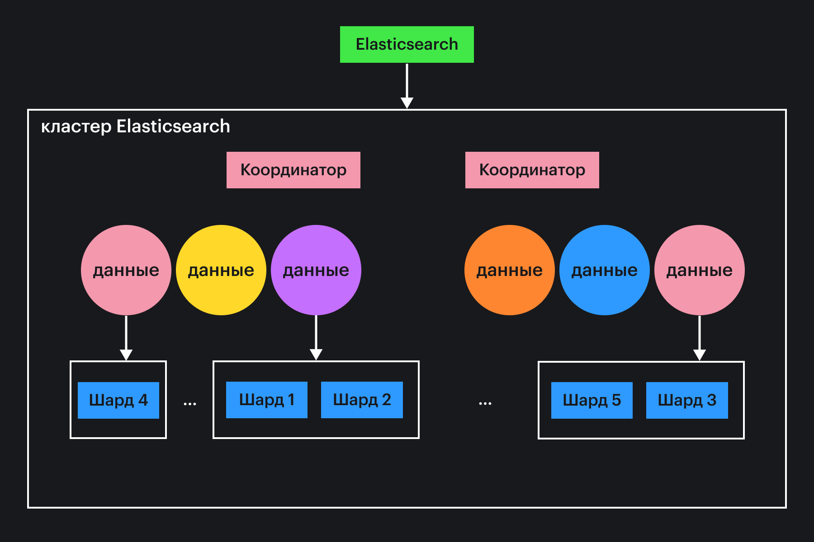

## Кратко

[Elasticsearch](https://www.elastic.co/elasticsearch/) (далее _ES_) — масштабируемая поисковая система, которую также можно отнести к нереляционным (noSQL) базам данных. В основном используется для полнотекстового поиска с фильтрами и анализаторами.

ES написан на Java, использует JSON REST API для работы с данными и [Lucene](https://lucene.apache.org/) для полнотекстового поиска. Подобные движки используются для сложного поиска по документам (релевантность, морфология, даты, диапазоны и т.д.). Документ в данном случае — это просто набор полей, с которым мы будем работать.

## Как понять

ES позволяет производить поиск по документам в режиме реального времени, он горизонтально масштабируется и поддерживает многопоточность. У других noSQL-систем выигрывает качеством и скоростью обработки текста и гибким полнотекстовым поиском по всей базе документов.

В основе работы с текстом лежит анализатор, который представляет собой цепочку обработчиков. Сначала отданный в ES текст проходит **символьные фильтры**, которые обрабатывают отдельные символы. Например, можно привести текст к нижнему регистру или удалить HTML-теги.

Далее текст обрабатывается токенизатором, который очищает текст от специальных символов, знаков препинания и разбивает по указанным правилам на отдельные слова-токены.

После токенизатора текст передаётся в один или несколько **фильтров токенов**, которые могут изменять слова в наборе. Например, можно добавить фильтр стоп-токенов, который будет удалять так называемые стоп-слова. На выходе из анализатора получается набор токенов, который добавляется в поисковый индекс.

Если говорить коротко про архитектуру ES, то она такая: есть поисковые индексы, их можно делить на части — шарды. На каждом запущенном процессе (узле) ES может быть несколько шардов. Каждый узел делегирует операции нужному шарду, перебалансировка выполняется автоматически. Отказоустойчивость достигается тем, что индекс автоматически распределяется по узлам кластера. Кластеры продолжают работать, даже если возникают аппаратные ошибки.



На схеме: данные через координаторы поступают в кластер, далее распределяются по узлам в поисковые индексы и шарды.

## Как начать

Для использования ES нужно установить [Java 8+ версии](https://www.java.com/ru/download/manual.jsp). Инструкция установки самого ES
[есть на сайте разработчика](https://www.elastic.co/downloads/elasticsearch).

После установки можно проверить, что ES работает:

```bash
curl -X GET localhost:9200
```

В результате увидим подобный ответ:

```json
{
  "name" : "YOUR_PC_NAME",
  "cluster_name" : "elasticsearch",
  "cluster_uuid" : "lzEwg8XDSUqDm15eIej4Zg",
  "version" : {
    "number" : "8.1.1",
    "build_flavor" : "default",
    "build_type" : "tar",
    "build_hash" : "unknown",
    "build_date" : "2022-04-07T18:55:12.682985671Z",
    "build_snapshot" : false,
    "lucene_version" : "9.0.0",
    "minimum_wire_compatibility_version" : "7.17.0",
    "minimum_index_compatibility_version" : "7.0.0"
  },
  "tagline" : "You Know, for Search"
}
```

Альтернативный способ — запустить ES в докер-контейнере. Узнать больше про Docker можно в [статье «Docker»](/tools/docker/). Официальный образ можно найти на [Docker Hub](https://hub.docker.com/_/elasticsearch), а инструкция по запуску и настройке контейнера есть в [документации по ES](https://www.elastic.co/guide/en/elasticsearch/reference/current/docker.html). Скачали контейнер, настроили по инструкции и двигаемся дальше.

## Как использовать

Рассмотрим на практике создание индекса, его настройку, индексацию и поиск записей. Будем использовать Node.js.

Для работы нам нужно инициализировать проект и поставить библиотеку для работы с ES. С помощью команды создадим новый проект _elastic-js_ в текущей директории, а затем установим клиент ES:

```bash
mkdir elastic-js && cd elastic-js

npm init -y && npm install @elastic/elasticsearch --save
```

Нам понадобятся 2 файла: _functions.js_ и _index.js_. В первом мы опишем функции для работы с ES, а во втором будем их вызывать. Выполнять код будем максимально просто:

```bash
node index.js
```

### Подключение к ES

Для начала нам нужно подключиться к нашему ES. В файле _functions.js_ напишем следующий код:

```javascript
import * as ElasticSearch from '@elastic/elasticsearch'

const client = new ElasticSearch.Client({
  node: 'https://localhost:9200',
  auth: {
    username: 'elastic',
    password: 'changeme'
  }
})
```

Здесь `node` — хост для подключения к ES, а `auth` — логин и пароль, увидеть их вы можете после запуска ES в логах. Вместо логина и пароля можно использовать ApiKey, для этого изучите [описание этого метода подключения в документации](https://www.elastic.co/guide/en/elasticsearch/client/javascript-api/current/client-connecting.html).

### Создание и настройка индекса

Далее нам нужно создать поисковый индекс — в нем будут храниться наши документы. Напишем для этого функцию:

```javascript
export async function createIndex() {
  return await client.indices.create({
    index: 'search_index'
  })
}
```

Заодно напишем функцию для удаления индекса:

```javascript
export async function deleteIndex() {
  return await client.indices.delete({
    index: 'search_index'
  })
}
```

Здесь `'search_index'` — название нашего индекса, не более того.

Теперь давайте добавим в наш индекс _mapping_ — список полей документа. Но для начала немного теории. Маппинг позволяет указать поля и их типы внутри поискового индекса. Это нужно для того, чтобы можно было эффективно работать с разными типами данных и ES понимал какие данные как индексировать. Подробное описание типов данных можно найти в [документации](https://www.elastic.co/guide/en/elasticsearch/reference/current/mapping-types.html). А мы же перейдём к практике. Не будем усложнять и возьмём простой пример и будем хранить товары: `id` и `title` и `description`.

```javascript
export async function createIndex() {
  return await client.indices.create({
    index: 'search_index',
    body: {
      mappings: {
        properties: {
          id: {type: 'keyword'},
          name: {type: 'text'},
          description: {type: 'text'}
        }
      }
    }
  })
}
```

Это самый простой пример маппинга — название и типы полей. Но давайте добавим анализатор и фильтр, чтобы нормализация текста была лучше. Это нужно для того, чтобы сделать наш поиск точнее, ES предлагает нам огромные возможности для работы с разными данными, не только с текстом. Чем тщательнее мы анализируем наши документы, тем качественнее можем сделать их поиск. Для этого нужно добавить в наш индекс новые настройки:

```javascript
export async function createIndex() {
  return await client.indices.create({
    index: 'search_index',
    body: {
      mappings: {
        properties: {
          id: {type: 'keyword'},
          name: {
            type: 'text',
            analyzer: 'search_analyzer'
          },
          description: {
            type: 'text',
            analyzer: 'search_analyzer'
          }
        }
      },
      settings: {
        index: {
          analysis: {
            char_filter: {
              text_char_filter: {
                type: 'mapping',
                mappings: [
                  'Ё => ё',
                  'ё => е',
                  ', => .'
                ]
              }
            },
            analyzer: {
              search_analyzer: {
                type: 'custom',
                tokenizer: 'standard',
                filter: [
                  'lowercase',
                  'shingle',
                  'russian_stop',
                  'russian_stemmer'
                ],
                char_filter: 'text_char_filter'
              }
            },
            filter: {
              shingle: {
                type: 'shingle',
                min_shingle_size: 2,
                max_shingle_size: 4,
              },
              russian_stop: {
                type: 'stop'
              },
              russian_stemmer: {
                type: 'stemmer',
                language: 'russian'
              }
            }
          }
        }
      }
    }
  })
}
```

Давайте разберём. В блоке `analysis` мы описываем настройки анализатора. `char_filter` — символьный фильтр, его задача заменить указанные символы. `analyzer` — анализатор текста, который использует фильтры из блока `filter`. Фильтр `"shingle"` отвечает за расстояние между двумя словами для поиска искомой фразы, в нашем случае от 2 до 4. Дальше описываем фильтр для стоп-слов и стемминга. Стемминг — удаление окончаний и суффиксов из слова, получение основы. Прописываем имя анализатора в текстовые поля `name` и `description`, чтобы он заработал.

Теперь при добавлении документов в ES текстовые данные будут обработаны нашим анализатором. Давайте создадим поисковый индекс и добавим в него настройки с маппингом. Содержимое файла `index.js`:

```javascript
import { createIndex } from './functions.js'

const run = async () => {
  const result = await createIndex()
  console.log(result)
}

run()
```

Выполняем код через терминал `node index.js` и видим успешный ответ от ES:

```bash
{
  acknowledged: true,
  shards_acknowledged: true,
  index: 'search_index'
}
```

### Индексация записей

Индексация документов — это сохранение наших документов в базу данных, чтобы мы могли иметь к ним доступ. В случае с ES перед сохранением данные прогоняются через анализатор и только затем сохраняются.

Значительная часть работы уже сделана — мы описали наш поисковый индекс и можем с ним работать. Давайте добавим парочку товаров в индекс. Для этого создадим функцию в _functions.js_:

```javascript
export async function indexElement(data) {
  return await client.index({
    index: 'search_index',
    body: data
  })
}
```

Обновим файл _index.js_ и запустим следующий код:

```javascript
import { indexElement } from './functions.js'

const run = async () => {
  let result = await indexElement({
    id: 1,
    name: 'Apple iPhone 12 256GB (PRODUCT)RED',
    description: 'iPhone 12. Во-первых, это быстро. iPhone 12 поражает возможностями.'
  })
  console.log(result)

  result = await indexElement({
    id: 2,
    name: 'Lenovo Legion 5',
    description: 'Мощный игровой ноутбук'
  })
  console.log(result)
}

run()
```

Запустим через `node index.js`. В результате увидим подобный ответ от ES (ответ вашего ES может немного отличаться):

```bash
{
  _index: 'search_index',
  _id: 'ZWgomoEBOs_ZEts5qraF',
  _version: 1,
  result: 'created',
  _shards: { total: 2, successful: 1, failed: 0 },
  _seq_no: 0,
  _primary_term: 1
}
{
  _index: 'search_index',
  _id: 'ZmgomoEBOs_ZEts5qrbI',
  _version: 1,
  result: 'created',
  _shards: { total: 2, successful: 1, failed: 0 },
  _seq_no: 1,
  _primary_term: 1
}
```

Множественная вставка записей поддерживается при помощи [bulk](https://www.elastic.co/guide/en/elasticsearch/reference/current/docs-bulk.html), но его мы пропустим.

### Поиск записей

Теперь давайте попробуем найти наши документы. Добавим в _functions.js_:

```javascript
export async function search(query) {
  return await client.search({
    index: 'search_index',
    query: query
  })
}
```

Код файла _index.js_:

```javascript
import { search } from './functions.js'

const run = async () => {
  const query = {
    match: {
      name: 'Iphone'
    }
  }

  const result = await search(query)
  console.log(result)

  const products = result.hits.hits
  console.log(products)
}

run()
```

После запуска получим ответ от ES:

```bash
{
  took: 4,
  timed_out: false,
  _shards: { total: 1, successful: 1, skipped: 0, failed: 0 },
  hits: {
    total: { value: 1, relation: 'eq' },
    max_score: 0.8713851,
    hits: [ [Object] ]
  }
}
[
  {
    _index: 'search_index',
    _id: 'ZWgomoEBOs_ZEts5qraF',
    _score: 0.8713851,
    _source: {
      id: 1,
      name: 'Apple iPhone 12 256GB (PRODUCT)RED',
      description: 'iPhone 12. Во-первых, это быстро. iPhone 12 поражает возможностями.'
    }
  }
]
```

Это самый простой пример поиска — мы ищем товары, у которых в названии будет слово «Iphone». Сами элементы находятся в поле `result.hits.hits` — такая уж структура ответа в ES.

Теперь рассмотрим запрос посложнее:

```javascript
const query = {
  function_score: {
    query: {
      bool: {
        should: [
          {
            match_phrase: {
              name: {
                query: 'Iphone Pro',
                slop: 3,
                boost: 1000
              }
            }
          },
          {
            match_phrase: {
              name: {
                description: 'Iphone Pro',
                slop: 3,
                boost: 10
              }
            }
          }
        ]
      }
    }
  }
}
```

Результат:

```bash
{
  took: 31,
  timed_out: false,
  _shards: { total: 1, successful: 1, skipped: 0, failed: 0 },
  hits: {
    total: { value: 1, relation: 'eq' },
    max_score: 882.4754,
    hits: [ [Object] ]
  }
}
[
  {
    _index: 'search_index',
    _id: 'ZWgomoEBOs_ZEts5qraF',
    _score: 882.4754,
    _source: {
      id: 1,
      name: 'Apple iPhone 12 256GB (PRODUCT)RED',
      description: 'iPhone 12. Во-первых, это быстро. iPhone 12 поражает возможностями.'
    }
  }
]
```

В ES можно описывать функции для расчёта релевантности документов — за это отвечает `function_score`. В данном запросе нас устроит первое условие ИЛИ второе условие — логическая функция `bool` с `should`. Конструкция `match_phrase` позволяет искать соответствие по поисковой фразе, `slop` отвечает за то, сколько слов может быть между нашей поисковой фразой, а `boost`, как можно догадаться, отвечает за веса полей.

Вложенность и структура запроса в ES могут быть любыми — фантазия вам в помощь. Язык запросов для ElasticSearch непростой, вам точно понадобится [описание возможных запросов](https://www.elastic.co/guide/en/elasticsearch/reference/current/query-dsl.html).
