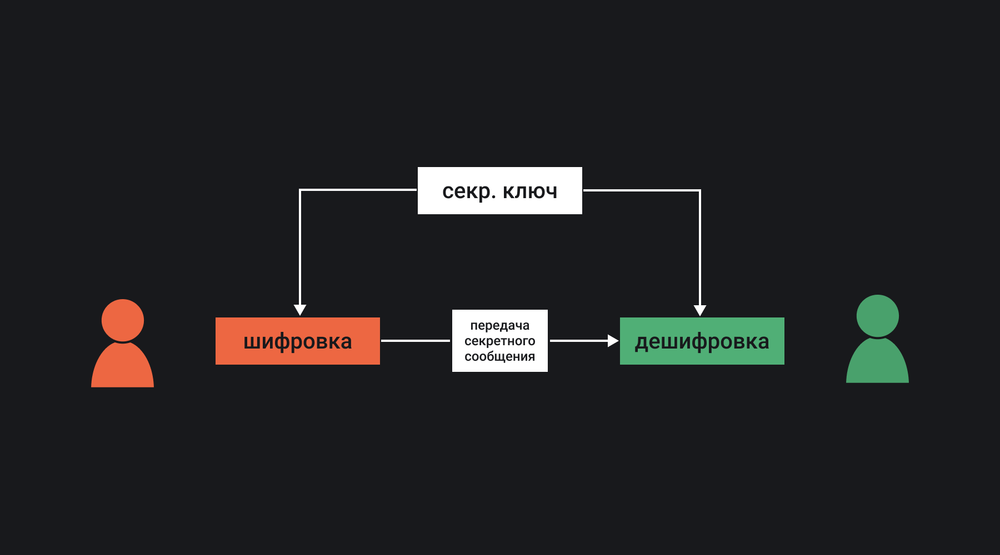
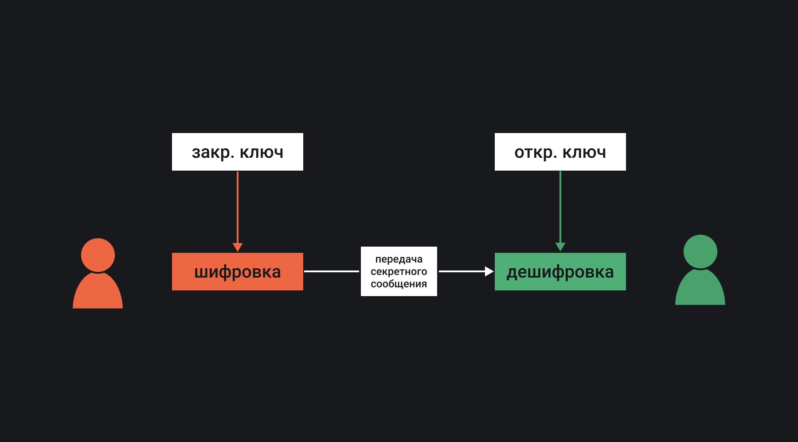

## Кратко

Шифрование — это способ защитить данные от постороннего взгляда (несанкционированного доступа) с помощью шифра. Шифр — системы действий или операций над данными, которые позволяют скрыть исходные данные от злоумышленника. Шифрование можно сравнить с хранением секретных документов в сундуке под замком, и только обладатель ключа имеет доступ к этим документам. Сундук (контейнер), ключ и способ их хранения — это _шифр_, система сущностей и действий, которая позволяет скрыть информацию, хотя и довольно примитивная в этом примере.

Существует специальная наука [криптография](https://ru.wikipedia.org/wiki/Криптография), в рамках которой исследуются существующие шифры и разрабатываются новые. Классификация шифров, исследование параметров шифров и криптосистем в целом (систем хранения и/или передачи данных с шифрованием) — сферы интересов этой науки.

## Шифрование в вебе

Интернет (ARPANET) был создан как компьютерная сеть передачи данных военного назначения. Удивительно, но интернет сам по себе не содержит никаких специальных возможностей для шифрования данных. Вся ответственность и нагрузка по передаче конфиденциальных данных лежит на плечах пользователей сети. Так, письма, веб-страницы, данные пользователей, документы на протяжении большого времени передавались в открытом виде, чем активно пользовались злоумышленники. Только в последние годы ситуация начала меняться.

Браузеры требуют от сайтов использовать сертификаты безопасности, почтовые серверы используют защищённые протоколы для пересылки писем, программы используют защищённые [API](/tools/api/), некоторые операции с данными пользователей возможны только при наличии ключей доступа (токенов или электронной подписи).

Шифрование в вебе, за исключением отдельных специальных случаев, можно свести к нескольким вариантам:

- Защищённые протоколы передачи данных.
- Сертификаты безопасности.
- [Электронная цифровая подпись](https://ru.wikipedia.org/wiki/Электронная_подпись).
- [Хэш-функции](https://ru.wikipedia.org/wiki/Хеш-функция).

<aside>

📚 Подробнее о сертификатах безопасности можно прочитать в статье [«SSL-сертификаты»](/tools/ssl-certificates/). Протоколы TLS, HTTP, HTTPS описаны в статьях [«Протокол HTTP»](/tools/http-protocol/) и [«Работа с сетью»](/tools/network/).

</aside>

Для того чтобы разобраться с шифрованием в интернете, необходимо рассмотреть, какие криптосистемы бывают и какие шифры используются в них. При рассмотрении алгоритмов, обращают внимание на его основные характеристики:

1. [Криптографическую стойкость](https://ru.wikipedia.org/wiki/Криптографическая_стойкость) — способность криптографического алгоритма противостоять взлому и криптоанализу.
2. Скорость работы алгоритма шифрования, которая является критически важной при выборе железа и в зависимости от контекста может определяться:
  - [Вычислительной сложностью](https://ru.wikipedia.org/wiki/Вычислительная_сложность) — функциональной зависимостью объёма работы алгоритма от размера входных данных).
  - Количеством арифметических операций определённого типа, требуемых на выполнение необходимых действий.
  - Другими специфическими характеристиками шифра.

## Симметричное шифрование

Идея симметричного шифрования — использование одного и того же ключа для шифрования и дешифровки. Такое шифрование широко применялось в древних и средневековых государствах ([Атбаш](https://ru.wikipedia.org/wiki/Атбаш), [шифр Цезаря](https://ru.wikipedia.org/wiki/Шифр_Цезаря), [омофоническая замена](https://ru.wikipedia.org/wiki/Омофоническая_замена) и прочие) и применяется до сих пор (например, [блочные шифры](https://ru.wikipedia.org/wiki/Блочный_шифр) или [поточные шифры](https://ru.wikipedia.org/wiki/Поточный_шифр)).

Например, шифр Цезаря заключается в следующем:

1. Шифрование: символы исходного сообщения преобразуются с помощью смещения на определённое количество по алфавиту.
2. Расшифровка: символы смещаются на то же количество, но в обратную сторону.

Например, если зашифровать сообщение «Привет» со смещением на три символа, получится сообщение «<!-- yaspeller ignore:start -->Тулезх<!-- yaspeller ignore:end -->». С разными шифрами можно поиграть на сайте «Каталог онлайн калькуляторов» в разделе «[Криптография](https://planetcalc.ru/search/?section=813)».

Достоинства симметричного шифрования по сравнению с асимметричным:

- Скорость работы алгоритма.
- Простота программной реализации.
- Меньшая требуемая длина ключа для сопоставимой стойкости.

Недостатки симметричного шифрования по сравнению с асимметричным:

- Управление большим количеством ключей в реальных системах.
- Сложность реализации процедуры обмена ключами.

## Асимметричное шифрование

Асимметричное шифрование — это использование разных ключей для шифрования и дешифровки. Представьте такой замок, закрыть который можно одним ключом, а открыть — другим. Разновидностью асимметричного шифрования является шифрование с открытым ключом, использование которого очень распространено в интернете. Открытый ключ — это ключ, который распространяется свободно. С помощью открытого ключа данные шифруются. А вот расшифровать данные можно только с помощью закрытого ключа, то есть ключа, который должен хранится только у адресата.

Например, если вам необходимо переслать сообщение, вы просите адресата переслать вам открытый ключ. После шифрования, вы отправляете сообщение адресату, и только он сможет расшифровать сообщение, поскольку только он обладает закрытым ключом. По интернету передаётся открытый ключ, обладание которым не даёт злоумышленнику никакого преимущества. Даже если злоумышленник перехватит зашифрованный пакет, он не сможет расшифровать запись без закрытого ключа.

Достоинства асимметричного шифрования по сравнению с симметричным:

- Нет необходимости предварительно передавать секретный ключ.
- Только одной стороне известен ключ для дешифровки сообщения.
- В реальных системах число ключей в асимметричной криптосистеме существенно меньше.

Недостатки асимметричного шифрования по сравнению с симметричным:

- Сложность модификации алгоритма.
- Ключи большей длинны.
- Медленнее совокупность операций шифрования и дешифровки.
- Нужно больше вычислительных ресурсов.

В современном вебе используются схема передачи зашифрованных данных, в которой асимметричное шифрование используется только для того, чтобы создать ключ симметричного шифрования:

1. Устанавливается соединение между клиентом и сервером (двумя клиентами).
2. Стороны обмениваются открытыми ключами в рамках системы с асимметричным шифрованием.
3. По зашифрованному каналу передаётся токен (ключ для симметричного шифрования).
4. С помощью токена происходит обмен данными. Токен работает только в течение сеанса связи или пока одна из сторон не отзовёт его.

Разновидностью асимметричного шифрования является электронная цифровая подпись, которая используется для подтверждения авторства электронного документа или цифрового ресурса. Система подписи работает наоборот относительно той схемы, которая используется для асимметричного шифрования. Закрытый ключ используется для подписи документа, то есть для шифрования. Открытый ключ используется для дешифровки, поскольку каждый должен иметь возможность прочитать документ. Справедливости ради нужно сказать, что симметричные электронные цифровые подписи тоже существуют, но используются значительно реже.

## Необратимое шифрование

Представьте, что вам нужно использовать пароли для аутентификации пользователей. Если хранить их как есть в открытом виде (в виде символов, которые вводит пользователь при заполнении поля пароля) в базе данных или в файлах на сервере, то это будет небезопасно. Злоумышленник, которому удастся получить доступ к базе данных или файлам, получит пароли всех пользователей. В этом случае на помощь приходит необратимое шифрование.

Необратимое шифрование — это такой способ шифрования, расшифровка при котором вообще невозможна или занимает очень большое время. Пароли пользователей можно хранить в зашифрованном виде. Чтобы проверить введённый пользователем пароль, нужно просто зашифровать его ещё раз и сравнить результат.

Для необратимого шифрования используются так называемые *хэш-функции*. Хэш-функция — специальный алгоритм, который позволяет генерировать хэш для шифруемых данных (в нашем случае паролей). Хэш или хэш-сумма — это просто последовательность символов.

Последовательность сгенерированных символов должна:

1. Существенно отличаться для близких по значению данных (для паролей, которые отличаются, например, на один символ).
2. Генерировать строку-результат одной и той же длины для разных входных данных (разные пароли по количеству и составу символов).
3. Не повторяться для разных данных (только один пароль может аутентифицировать одного и того же пользователя).
4. Быть максимально быстрой, насколько это возможно.

Другим вариантом применения хэш-функций является подсчёт хэш-сумм для файлов. Поскольку хэш-функция выдаёт существенно отличающуюся хэш-сумму для данных, которые отличаются незначительно, её можно использовать для регистрации изменений в файлах. Изменение даже одного символа можно будет обнаружить. Например, такой подход используется в системе контроля версий git.

Можно упомянуть об ассоциативных массивах, которые позволяют хранить данные в формате "ключ — значение". Для ключа формируется хэш-сумма, которая представляет собой порядковый номер элемента массива. То есть можно сопоставить ключу в виде текста элемент массива.

## Применение шифрования

Чтобы выбрать тот или иной алгоритм шифрования для решения практической задачи защиты данных необходимо держать в голове несколько вещей:

1. Необходимая криптографическая стойкость.
2. Критически важные особенности железа.
3. Путь распространения информации.
4. Информацию о пользователях будущей системы.

Все эти особенности будут влиять на выбор алгоритма. Типизация алгоритмов позволяет ориентироваться во всём многообразии. Ниже приведена упрощённая схема основных типов шифров:

### Без ключа

Необратимое шифрование: git, целостность данных, отслеживание транзакций, криптовалюты, шифрование паролей.

- Хэш-функции, известные алгоритмы: MD4/5, SHA-1/2/3.
- Блокчейн, известные алгоритмы: ECDSA.

На сегодняшний день не каждый алгоритм обладает достаточной криптостойкостью. Например, MD5 нельзя использовать для шифрования паролей. Подробнее об этом можно прочитать, например, в [статье на Википедии](https://ru.wikipedia.org/wiki/MD5#%D0%9A%D1%80%D0%B8%D0%BF%D1%82%D0%BE%D0%B0%D0%BD%D0%B0%D0%BB%D0%B8%D0%B7).

### Один ключ

Симметричное шифрование данных с наибольшей скоростью:

- Подстановочные шифры, известные алгоритмы: Атбаш, шифр Цезаря, шифр Виженера.
- Блочные шифры, известные алгоритмы: Blowfish, Twofish, RC2/5/6, DES, AES, FROG, ГОСТ 28147-89.
- Поточные шифры, известные алгоритмы: RC4, SEAL, A5, Mosquito.

### Два ключа

Шифрование данных с наибольшим удобством для большого количества пользователей:

- Асимметричное шифрование, известные алгоритмы: RSA, Elgamal, ECC.
- Электронная цифровая подпись, известные алгоритмы: схема Диффи-Хелмана, ГОСТ Р 34.10-2012, ECDSA, ГОСТ Р 34.10-94, DSA.
