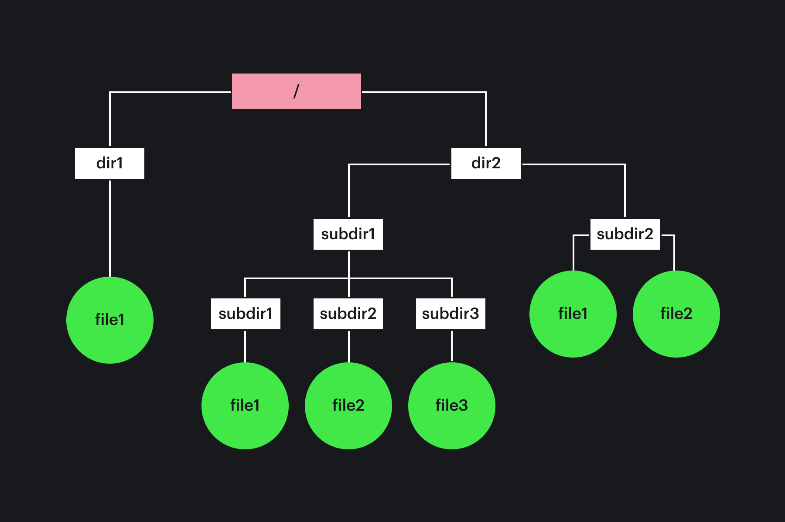

## Кратко

Файл — это набор сгруппированных данных, которому дали имя и записали на физическом носителе. У файлов есть атрибуты, которые говорят операционной системе, как с ними работать. Для организации сохранённых файлов используются абстрактные модели. Наибольшее распространение получили иерархические модели — деревья директорий (папок) и файлов.

## Как понять

### Файлы

Файл — это абстракция, которая пришла из физического мира. До появления компьютеров файлом называли коробку, папку, шнур, пружину и что-то подобное, с помощью которых можно было собрать, упорядочить и хранить несколько листов бумаги вместе.

Файл — это набор данных, сохранённых на носителе информации. В процессе работы программы данные помещаются в оперативную память компьютера и обрабатываются. Все данные в компьютере представляются в виде последовательности машинных слов (байтов). Раньше машинные слова в оперативную память компьютера вводили вручную с помощью специального устройства — телетайпа. Вся последовательность машинных слов находилась в распечатанном или письменном виде на листах бумаги, которые скреплялись с помощью _файла_. Так и прижилось это понятие.

С появлением магнитных лент для хранения данных стали использовать другую модель — последовательность записей переменной длины. Считать с магнитной ленты данные или записать их на неё можно только последовательно (последовательный доступ). _Файлом_ стали называть часть магнитной ленты с записанными на неё данными. Программисты должны были знать, с какого и по какое место на ленте записаны их данные.

Когда появились перфокарты, данные стали разделять на записи постоянной длины, поскольку на одной перфокарте умещалось [определённое количество](https://ru.wikipedia.org/wiki/Перфокарта) машинных слов. _Файлом_ стали называть набор перфокарт с нужными данными. Доступ оставался последовательным, но загрузить можно было произвольный файл, отдав компьютеру нужную стопку перфокарт.

Чуть позже были разработаны модели иерархической организации данных в файлах с помощью специальной структуры данных — дерева поиска. Это позволило очень быстро производить поиск по файлу. Такая модель применяется и сейчас, в специализированных системах хранения. Применение иерархической модели стало возможно, благодаря появлению носителей информации с произвольным доступом.

Жёсткие и гибкие диски, flash и SSD накопители реализуют произвольный доступ к данным, что позволяет читать файлы в произвольном порядке. Поэтому разработчики операционных систем снова вернулись к самой первой абстракции — представлению файла в виде последовательности байтов. Однако в этот раз ей назначили имя — имя файла.

Чтобы можно было отделить один файл от другого, в файл записываются атрибуты наряду с данными. Имя файла иногда выносится в отдельную сущность, но чаще записано в атрибутах. Список атрибутов зависит от конкретной операционной системы и файловой системы, которая используется в ней. Вот список наиболее распространённых атрибутов файла:

- имя;
- права доступа (определяются согласно правилам операционной системы);
- персонификация (создатель и владелец);
- тип файла;
- размер файла;
- время создания файла;
- время последней модификации;
- время последнего обращения;
- указатель чтения / записи (часто называют курсором или указателем);
- и др.

Практически в любой операционной системе работа с файлами осуществляется по похожему сценарию:

1. Открытие файла (начало сессии);
2. Работа с содержимым файла и его атрибутами;
3. Закрытие файла (окончание сессии).

Большинство операционных систем применяют буферизацию, чтобы не заставлять пользователя ждать окончания записи. Она происходит в фоне. При записи новых данных в файл или изменении существующих, операционная система сначала помещает данные в буфер. Если данных много, то они переносятся из буфера в файл постепенно, как во время работы с ним, так и после закрытия файла. В этом случае в интерфейсе пользователя сохранение изменений в файле происходит очень быстро, а для операционной системы существует некоторая инерция. При работе с большими файлами можно заметить как после сохранения и выхода из программы файл ещё некоторое время растёт в размере.

Для работы с файлами в операционной системе предусмотрены специализированные программные интерфейсы. Именно с помощью них программы получают доступ к файлам. Среди интерфейсов можно выделить типовые:

- `open` — открытие сессии работы с файлом / создание нового файла;
- `close` — закрытие сессии работы с файлом;
- `read` / `write` — читать / писать в файл относительно положения указателя чтения / записи;
- `delete` — удалить файл;
- `seek` — позиционирование указателя чтения / записи;
- `rename` — переименование файла;
- `read_attributes` / `write_attributes` — чтение / модификация атрибутов файла.

В Unix-подобных системах представление внешних устройств сводится к абстракции файла. Работа с устройством происходит через интерфейсы работы с файлами. Это позволяет унифицировать работу программ, облегчает многие задачи для пользователя по обслуживанию приложений и настройке операционной системы.

### Файловые системы

Файловая система — абстракция, которая позволяет работать с данными на различных внешних накопителях так, чтобы для программ в операционной системе не видна была разница в аппаратной реализации. Файловая система позволяет на физическом устройстве выделять и освобождать постоянную память, заполнять её данными в асинхронном режиме, используя абстракцию файла. Кроме того, файловая система разрешает конфликты (говорят, _коллизии_) с именами файлов.

Один из методов решения коллизий — запретить создавать файлы с одинаковыми именами.

Первой моделью организации файлов была одноуровневая (или плоская) файловая система. Использовать такую файловую систему неудобно, если в операционной системе работает несколько пользователей и используется большое количество файлов. Однако одноуровневые файловые системы до сих пор применяются для определённых устройств. Например, в стиральных машинах или в микроволновых печах.

Продолжением одноуровневых файловых систем являются системы с фиксированным количеством уровней. Такие файловые системы используются на маршрутизаторах и телевизорах.

Самой успешной моделью файловой системы является иерархическая модель. Она произвела настоящую революцию в хранении данных. Иерархическая система подразумевает существование дерева данных с узлами трёх типов:

- корневая директория (каталог, папка) — специальный узел дерева;
- обычная директория (каталог, папка) — обычные узлы дерева;
- файлы — листья дерева.

Такая структура позволяет хранить файлы в разных директориях. Полное имя файла состоит из пути до файла в дереве директорий и имени файла. Таким способом обеспечивается уникальность имён. Файлы с одинаковыми именами не создают коллизии, если хранятся в разных директориях.

Один уровень иерархии от другого отделяется особым символом (например, `/` для Unix-подобных систем и `\` для операционных систем на базе Windows). Поддерживаются и относительные имена файлов, из которых можно сформировать полное имя путём конкатенации (сложения строк) имени директории и относительного имени.

В Unix-подобных системах поддерживаются специальные директории: домашняя директория пользователя и текущая директория. Часть операционных систем вслед за Unix использует эти абстракции. Модель файловой системы Unix считается одной из наиболее удачных и безопасных, поскольку:

- используется очень простая, но достаточно безопасная система прав доступа;
- поддерживаются [символические ссылки](/tools/cli/#faylovaya-sistema);
- директории являются специальными файлами;
- внешние устройства являются специальными файлами;
- подключение внешних дисков или любых других внешних устройств обеспечивается подключением их к общей файловой системе.
