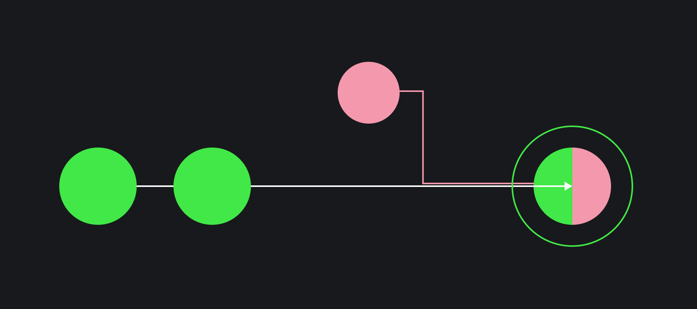

## Кратко

Git CLI — это консольный интерфейс для Git, который выполняется в терминале. На своих компьютерах разработчики часто используют графические интерфейсы, чтобы работать с репозиторием более комфортно. Но уметь пользоваться Git CLI все равно важно. Например, на серверах зачастую нет графического интерфейса, и пользователи вынуждены использовать консольные приложения. Git CLI — это общий для всех разработчиков инструмент, он есть почти для каждой операционной системы компьютера.

При работе над проектом разработчики обычно следуют примерно одному и тому же сценарию — скачивают себе удалённый репозиторий, создают отдельную ветку для своих правок, изменяют код или пишут новый, добавляют изменённые файлы к списку отслеживаемых изменений, создают коммит и отправляют всю ветку обратно, чтобы другие программисты могли провести [код-ревью](/tools/code-review/). После успешного код-ревью ветка разработчика сливается с основной веткой. На этом разработку по конкретной задаче можно считать законченной, а ветку разработчика можно удалить.


## Как пользоваться

### Скачивание удалённого репозитория

Удалённый репозиторий — не самый удачный перевод на русский английского `remote repository`. Он значит, что репозиторий находится на удалении от вас — не на вашем компьютере, а не то, что ваш код уничтожен.

Обычно, при разработке программы есть сервер, где хранится оригинал исходного кода. Все разработчики копируют этот репозиторий на свой локальный компьютер. После разработки какой-то функциональности изменения отправляются обратно — из локального репозитория разработчика в удалённый.

В первый раз, чтобы скачать весь удалённый репозиторий на свой компьютер, его нужно __клонировать__. Команда `git clone` создаст полную копию локально, в которую можно будет вносить изменения.

```bash
git clone git@remote_repo_address
```

Со временем, в удалённом репозитории могут появляться новые изменения, которые необходимо подтягивать в локальный репозиторий. Получить все изменения из удалённого репозитория можно командой:

```bash
git pull --all
```

### Создание ветки

При работе в команде, разработчики делают задачи параллельно. Чтобы в будущем возникло минимальное число конфликтов в исходном коде, используют ветки.

Конфликт — это ситуация, когда один и тот же код изменили два разных разработчика. В такой ситуации нельзя автоматически решить, чьи правки важнее, и приходится разбирать каждый случай вручную.

Новую ветку можно создать от текущей через Git CLI:

```bash
git branch new-user-profile
```

Обычно после создания ветки, её сразу делают активной, для этого используется команда:

```bash
git switch new-user-profile
```

Для удобства можно использовать параметр, с которым команда сразу создаст новую ветку и сделает её активной: `git switch -c new-user-profile`

Новая ветка будет включать историю той ветки, от которой она отведена. При этом коммиты в родительской ветке, созданные после отведения дочерней, уже не попадут в историю дочерней. Точно так же и коммиты из дочерней ветки не попадут ни в какую другую, пока разработчик явным образом их туда не поместит.

Можно произвольно переключаться между ветками с помощью команды `git switch`.

```bash
git switch main
git switch new-user-profile
```

<aside>

❗️ До версии Git 2.23 вместо `switch` использовалась `checkout`, но она предназначена и для многих других операций, потому разработчики выделили это действие в отдельную команду.

</aside>

Использование `checkout` похоже на `switch`.

Для создания и переключения на ветку:
```bash
git branch new-user-profile
git checkout new-user-profile
```

Или сразу создать новую ветку и сделать её активной
```bash
git checkout -b new-user-profile
```

Переключение между ветками происходит аналогично:
```bash
git checkout main
git checkout new-user-profile
```

### Проверка текущего статуса репозитория

Чтобы посмотреть, какие файлы были изменены, созданы или удалены, нужно проверить статус репозитория:

```bash
git status
```

Эта команда помогает понять, что произошло в репозитории со времени последнего коммита, какие файлы отслеживаются, и решить, что делать дальше.

### Отслеживание изменений

По умолчанию изменения в новых файлах не отслеживаются. Чтобы Git начал это делать, нужно добавить их к списку отслеживания. Для этого в Git CLI используется команда `git add`:

```bash
git add filename.js
```

Использовать команду можно не только для отдельного файла, но и для целой директории с файлами. Например, чтобы добавить все файлы в текущей директории, можно сделать так:

```bash
git add .
```

Если вы уверены, что хотите добавить все новые и изменившиеся файлы, то воспользуйтесь параметром `--all` для команды `git add --all`.

### Коммит

Коммит — это фиксация того состояния вашего кода, которое вы хотите оставить в истории вашего проекта.

Всегда создавайте коммит после внесения изменений в код проекта и давайте ему осмысленный комментарий. В Git CLI для этого используется команда:

```bash
git commit
```

Она создаст коммит, в который войдут все изменения, добавленные к отслеживанию. После вызова откроется текстовый редактор, куда следует ввести комментарий к коммиту.

Если комментарий к коммиту короткий, то его можно передавать через аргумент: `git commit -m "Rename getUser function"`

### Отправка в удалённый репозиторий

Чтобы отправить свои изменения в удалённый репозиторий, нужно сделать коммит в конкретной ветке и выполнить команду:

```bash
git push
```

Если такой ветки ещё не существует в удалённом репозитории, Git CLI посоветует создать её и подскажет команду.

### Слияние изменений

Часто случается так, что за время разработки какой-то функциональности в дочерней ветке, в родительскую ветку добавляется много новых коммитов, и хочется добавить их и в дочернюю ветку. Для этого нужно провести слияние родительской ветки в дочернюю.

С другой стороны, после окончания разработки функциональности в дочерней ветке, нужно отправить изменения в родительскую. Для этого тоже нужно провести слияния, но уже в обратную сторону — из дочерней ветки в родительскую.



Чтобы слить любую ветку в текущую активную ветку, нужно выполнить следующую команду:

```bash
git merge branch_name
```

### Удаление ветки

После того как изменения из ветки разработчика попали в основную ветку (`master` или `main`), ветку разработчика нужно удалить. Это можно сделать консольной командой:

```bash
git branch -d branch_name
```
