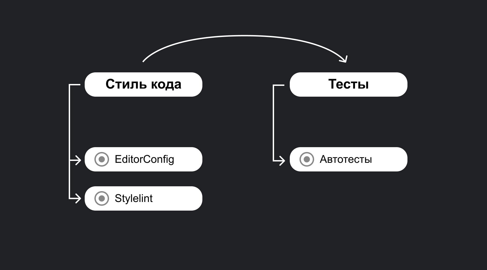

<aside>

📚 В этой статье мы говорим про инструменты CI/CD (Continuous Integration и Continuous Delivery). Под этими терминами понимается итерационный процесс сопровождения кода: тестирование и отладка кода, автоматизация рутинных действий, сборка приложений, размещение приложений в магазинах приложений и так далее. Подробно об этом говорится в статье «[Что такое CI/CD](/tools/ci-cd/)».

</aside>

## О GitLab

[GitLab](https://gitlab.com) — популярный веб-сервис для совместной разработки и поддержки программного обеспечения. Вы можете работать с [Git-репозиториями](/tools/version-control/), управлять задачами, обсуждать правки с вашей командой, писать wiki-документацию, оценивать качество, выпускать релизы и даже мониторить работающие программы — и всё это в одном месте.

## Кратко

GitLab CI — инструмент, встроенный в GitLab для автоматизации рутинных задач, возникающих в процессе разработки программного обеспечения. Спектр таких задач огромен и отличается от проекта к проекту, но основные — это [тестирование](/tools/how-to-test-and-why/), [статический анализ](/tools/static-analysis/), [проверка стиля написания кода](/tools/code-style/) и деплой (выпуск) приложения. GitLab CI — конкурент другого популярного инструмента, [GitHub Actions](/tools/github-actions/). Эти два сервиса во многом похожи, но есть некоторые отличия.

## Пример

Допустим, мы договорились в команде об особых правилах оформления кода при помощи [EditorConfig](https://editorconfig.org/), установили его как дев-зависимость и сделали его доступным с помощью команды `npm run editorconfig`. Можно запускать проверку каждый раз перед коммитом, но всегда будут ситуации, когда это забудут сделать, и код, оформленный неправильно, попадёт в репозиторий. Здесь приходит на помощь GitLab CI/CD — достаточно создать в корне проекта файл _.gitlab-ci.yml_ со следующим содержанием:

```yaml
EditorConfig:
  image: node:lts
  script:
    - npm ci
    - npm run editorconfig
```

И теперь каждый раз, когда в репозиторий попадает новый код, он будет проверяться на соответствие правилам, а ошибки будут видны в интерфейсе GitLab.

## Как пользоваться

### Основные понятия

Основной сущностью в GitLab CI/CD является **пайплайн** (pipeline) — конвейер, который может состоять из:

- **джобов** (jobs), описывающих _что_ нужно выполнить;
- **этапов** (stages), указывающих _когда или в какой последовательности_ нужно выполнить джобы.

Джобы в одном этапе обычно выполняются параллельно. Если все джобы завершились успешно, выполнение переходит к следующему этапу и так далее. Если любой из джобов завершился ошибкой, то выполнение останавливается, и весь пайплайн (обычно) считается проваленным.

### Создаём `.gitlab-ci.yml`

GitLab CI полностью конфигурируется с помощью одного файла в формате [YAML](/tools/yaml/), который нужно создать в корне проекта — _.gitlab-ci.yml_.

Джобы часто могут иметь одинаковые свойства, например, образ среды, в которой выполняются действия, предварительные команды и т. д. Чтобы не повторять их каждый раз, нужно объявить их в секции `default`. Если какому-то джобу нужны другие параметры, можно указать их внутри этого джоба, и они перезапишут глобальные параметры.

В первую очередь нужно указать Docker-образ (подробнее в статье «[Что такое Docker](/tools/docker/)»), в котором будут выполняться джобы. В большинстве случаев нам подойдёт официальный образ [Node.js](/tools/nodejs/) `node:lts` — это означает, что наши команды будут выполняться внутри операционной системы Linux с установленными Node.js, npm и даже Yarn. Про буквы _lts_ можно почитать в разделе про [версионирование Node.js](/tools/nodejs/#osobennosti-versionirovaniya).

```yaml
default:
  image: node:lts
```

### Задаём подготовительные команды

При работе с CI/CD во фронтенд-проектах чаще всего перед выполнением основного действия необходимо установить зависимости. Для этого мы можем указать их в секции `before_script` — эти команды будут выполняться в каждом джобе перед основным действием.

```yaml
default:
  image: node:lts
  before_script:
    - npm -v
    - npm install
```

### Указываем этапы

Предположим, что мы хотим запускать сначала проверку кодовой базы с помощью EditorConfig и [Stylelint](/tools/static-analysis/#linter-dlya-css), а потом, если они обе завершатся успешно, запустить тесты. В этом примере можно выделить два этапа: стиль кода и тесты. Определить этапы можно при помощи ключевого слова `stages`:

```yaml
stages:
  - Стиль кода
  - Тесты
```

### Описываем джобы и задаём команду

Теперь укажем все три джоба. Для этого мы вначале указываем название джоба, указываем его этап при помощи ключевого слова `stage` и передаём список команд в `script`. В нашем примере каждый джоб будет запускать по одному npm-скрипту.

```yaml
default:
  image: node:lts
  before_script:
    - npm -v
    - npm ci

stages:
  - Стиль кода
  - Тесты

EditorConfig:
  stage: Стиль кода
  script:
    - npm run editorconfig

Stylelint:
  stage: Стиль кода
  script:
    - npm run stylelint

Автотесты:
  stage: Тесты
  script:
    - npm run test
```

А вот схематичное представление конфигурации выше:


Конфигурация сначала проверяет стиль кода и, если он верный, запускает тесты.

<aside>

ℹ️ Джобы должны иметь уникальные имена — если указать два джоба с одинаковым именем, то из них выполнится только последний — он перезапишет все предыдущие джобы с таким именем!

</aside>

## Продвинутое использование

### Запуск вручную

Если мы хотим запускать определённый джоб вручную, то нужно добавить `when: manual`:

```yaml
job:
  script: npm run deploy
  when: manual
```

### Продолжение при провале

По умолчанию при провале любого джоба весь пайплайн отмечается как проваленный, и оставшиеся джобы не выполнятся. Однако бывают ситуации, когда этого поведения хочется избежать. Например, мы добавили джоб с тестами в только что появившейся версии Node.js и просто хотим видеть проблемы, которые потенциально нужно исправить в будущем. Здесь придёт на помощь `allow_failure: true`:

```yaml
job:
  image: node:latest
  script: npm run test
  allow_failure: true
```

### Выполнение джобов по условию

GitLab даёт доступ к большому количеству переменных окружения с полезной информацией. Например, `$CI_COMMIT_BRANCH` содержит текущую ветку, `$CI_COMMIT_SHORT_SHA` — короткий хеш коммита, `$CI_PIPELINE_SOURCE` — источник вызова текущего пайплайна и так далее. С их помощью мы можем запускать определённые джобы при соблюдении заданных условий. Для этого нужно объявить одну или несколько секций `rules`.

Вот такой джоб будет выполняться только для коммитов в ветку `main`:

```yaml
job:
  script: npm run deploy-to-production
  rules:
    - if: '$CI_COMMIT_BRANCH == "main"'
```

### Запуск по расписанию

В отличие от GitHub Actions, в GitLab CI/CD запуск пайплайнов по расписанию настраивается только в веб-интерфейсе. Для этого нужно открыть страницу репозитория и выбрать _CI/CD → Schedules_. Перед нами откроется список уже существующих правил и кнопка добавления нового. В форме добавления можно указать название правила, выбрать интервал из списка или указать свой в синтаксисе [Cron](https://ru.wikipedia.org/wiki/Cron). Последним важным полем является ветка — при срабатывании правила пайплайн запустится, как будто был запушен код в этой ветке. Отличие в том, что переменная `$CI_PIPELINE_SOURCE` будет содержать значение _schedule_.

### Серия джобов

Ещё одна типичная задача — прогнать тесты в разных версиях Node.js. Можно для каждой версии создать вручную джоб, а можно указать список переменных:

```yaml
Unit Tests:
  script: node -v
  image: ${NODE_VERSION}
  parallel:
    matrix:
      - NODE_VERSION: ["node:14", "node:16", "node:17"]
```

В примере выше мы объявили список `NODE_VERSION` из трёх элементов. GitLab создаст три джоба с именами: «Unit Tests [node:14]», «Unit Tests [node:16]» и «Unit Tests [node:17]», а потом в каждом джобе заменит все места использования переменной `NODE_VERSION`. Поэтому `image` в каждом джобе будет разный.
