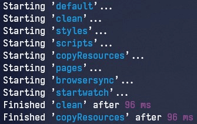
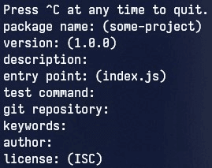

## Кратко

[Gulp](https://gulpjs.com/) (англ. «глоток» [/gʌlp/, /галп/]) — менеджер для организации и выполнения задач при разработке приложений с использованием платформы [Node.js](/tools/nodejs/).

Gulp может выполнять разные задачи: формировать файлы стилей, объединять и минифицировать файлы, оптимизировать изображения, транспилировать код и т. д. При выполнении этих задач происходит взаимодействие с рабочим окружением: обратиться к файловой системе, создать или сохранить итоговый файл, запустить процесс локального web-сервера, показать результат в браузере.

## Как понять

Gulp —  это менеджер задач. Он выполняет объявленные инструкции в указанной последовательности. Gulp не предоставляет разработчику готовые механизмы для сборки проекта, но позволяет настроить такую сборку с помощью необходимых модулей.

Webpack — это сборщик модулей для приложений, написанных на JavaScript. Он «из коробки» предлагает решения для сборки проектов с использованием уже подготовленных механизмов и настроек.

## Модули и задачи

При работе с web-проектом разработчику необходимо выполнять ряд повторяющихся операций:

- проверять HTML-разметку и CSS-правила;
- преобразовывать синтаксис CSS-препроцессоров в «чистый» CSS;
- проверять JS-код на соответствие требуемым стандартам;
- при необходимости объединять несколько файлов (CSS или JS) в один;
- минифицировать большие файлы;
- проверять в браузере результат, желательно по принципу «live-reload» («живая перезагрузка»);
- формировать итоговую сборку проекта.

С использованием Gulp, выполнение всех этих задач можно организовать с применением специальных модулей, которые распространяются средствами [пакетных менеджеров](/tools/package-managers/).

Все инструкции по организации работы проекта указываются в файле _gulpfile.js_. Сначала объявляются основные свойства, которые Gulp использует при выполнении задач:

```javascript
const { src, dest, parallel, series, watch } = require('gulp')
```

- `src()` выполняет чтение исходных файлов;
- `dest()` выполняет запись итоговых файлов;
- `parallel()` объединяет задачи для выполнения в параллельном режиме;
- `series()` объединяет задачи для выполнения в последовательном режиме;
- `watch()` запускает необходимые задачи при изменениях в файлах.

Потом таким же способом подключаются необходимые npm-модули, например:

```javascript
const sass = require('gulp-sass')(require('sass'))
const browserSync = require('browser-sync').create()
const autoprefixer = require('gulp-autoprefixer')
```

Затем создаются рабочие задачи со следующей структурой:

- указывается расположение исходных файлов;
- с использованием оператора `pipe()` выстраивается последовательность выполнения операций;
- определяется место, куда будут сохраняться итоговые файлы.

Чтобы к такой задаче можно было обратиться в любом месте _gulpfile.js_, ей обязательно присваивается своё название.

### Задача — task

До третьей версии Gulp задачи создавались встроенной функцией `gulp.task()`:

```javascript
gulp.task('styles', function() {
  return src('./src/styles/style.scss')
  .pipe(sass().on('error', sass.logError))
  .pipe(dest('./public/styles/style.css'))
  .pipe(browserSync.stream())
})
```

Эта функция регистрирует объявленную инструкцию в качестве общедоступного таска, который может взаимодействовать с рабочим окружением. Такой таск можно запускать на выполнение как отдельно — командой `gulp styles`, так и в составе сводного таска (`watch`, `default` и т. п.).

### Задача — function

Начиная с четвёртой версии Gulp, для создания задач рекомендуется использовать обычные функции:

```javascript
function styles() {
  return src('./src/styles/style.scss')
  .pipe(sass().on('error', sass.logError))
  .pipe(dest('./public/styles/style.css'))
  .pipe(browserSync.stream())
}
```

Формирование задачи с использованием такой функции создаёт инструкцию, которая доступна только для _внутреннего использования_. Чтобы объявленная функция могла взаимодействовать с рабочим окружением и выполняться командой `gulp`, её необходимо экспортировать в общедоступный таск:

```javascript
exports.styles = styles
```

Только после этого задача станет доступной для запуска и выполнения как отдельной командой `gulp styles`, так и в составе сводного таска.

### Отслеживание изменений в проекте

При работе над проектом разработчику необходимо видеть результат изменений, которые он вносит в файлы. Для этой цели в Gulp предусмотрен метод `watch()`, который проверяет файлы при их сохранении и запускает соответствующие задачи.

Каждый вызов метода `watch()` состоит из двух частей:

- указывается расположение файлов, которые должны отслеживаться;
- вызывается определённая ранее задача для обработки этих файлов.

Так, например, будет выглядеть задача отслеживания изменений в файлах стилей и страниц:

```javascript
function watch_dev() {
  watch('./src/styles/style.css', styles).on(
    'change',
    browserSync.reload
  )
  watch('./src/*.html', pages).on(
    'change',
    browserSync.reload
  )
}
```

### Работа с проектом и его сборка

Запуск проекта в режиме разработки осуществляется сводной задачей `default`, название которой **зарезервировано** в Gulp. В примере ниже она будет выполнять и отслеживать в параллельном режиме таски, ранее экспортированные из функций:

```javascript
exports.default = parallel(
  styles,
  scripts,
  pages,
  watch_dev
);
```

Поскольку название `default` для Gulp является служебным, запуск этого таска в терминале можно выполнить командой `gulp`.



Для сборки проекта обычно создаётся отдельный таск с произвольным названием, который будет последовательно выполнять необходимые таски:

```javascript
exports.build = series(
  styles,
  scripts,
  pages
);
```

Запуск такого таска осуществляется вводом в терминале команды `gulp build`.

## Использование

Рассмотрим вариант проекта по разработке сайта.

Структура проекта будет организована с использованием компонентного подхода: для каждого блока страницы выделяется отдельная папка. В папке компонента будут располагаться его файлы стилей, разметки и скриптов. В отдельных папках будут храниться изображения и файлы шрифтов.

Все исходные файлы размещаются в папке _src_, результат будет сохраняться в папку _public_:

```
.
├─ /public
│   ├─ /css
│   ├─ /images
│   ├─ /js
│   ├─ index.html
│   └─ order.html
├─ /src
│   ├─ /components
│   │   ├─ /header
│   │   │   ├─ header.html
│   │   │   └─ header.scss
│   │   ├─ /offer
│   │   │   ├─ offer.html
│   │   │   ├─ offer.js
│   │   │   └─ offer.scss
│   │   ├─ /order
│   │   │   ├─ order.html
│   │   │   ├─ order.js
│   │   │   ├─ order.scss
│   │   └─ /footer
│   │       ├─ footer.html
│   │       ├─ footer.js
│   │       └─ footer.scss
│   ├─ /fonts
│   ├─ /images
│   ├─ /js
│   │   └─ script.js
│   ├─ /pages
│   │   ├─ index.html
│   │   └─ order.html
│   └─ /styles
│       └─ style.scss
├─ gulpfile.js
└─ package.json
```

Сначала в рабочей папке командой `npm init` необходимо выполнить инициализацию проекта, в процессе которой будет предложено указать его данные:



После этого в папке будет создан файл манифеста проекта _package.json_, в котором также будет сохраняться информация об используемых модулях. Модули устанавливаются стандартной командой `npm install`.

Нам понадобятся следующие npm-модули:

- `del` для очистки папки `public`;
- `sass` и `gulp-sass` для использования препроцессора SASS;
- `gulp-autoprefixer` добавляет необходимые [вендорные префиксы CSS](/css/vendor-prefixes/);
- `gulp-group-css-media-queries` группирует все media-запросы CSS в одном месте итогового файла стилей;
- `gulp-include` подключает отдельные файлы компонентов в итоговые файлы HTML и JS;
- `browser-sync` создаёт и запускает локальный веб-сервер.

В _gulpfile.js_ сначала объявим все необходимые свойства и модули:

```javascript
const { src, dest, parallel, series, watch } = require('gulp')
const del = require('del')
const sass = require('gulp-sass')(require('sass'))
const autoprefixer = require('gulp-autoprefixer')
const gcssmq = require('gulp-group-css-media-queries')
const includeFiles = require('gulp-include')
const browserSync = require('browser-sync').create()
```

Затем создадим задачи для запуска веб-сервера, обработки файлов стилей, скриптов и страниц:

```javascript
function browsersync() {
  browserSync.init({
    server: {
      baseDir: './public/',
      serveStaticOptions: {
        extensions: ['html'],
      },
    },
    port: 8080,
    ui: { port: 8081 },
    open: false,
  })
}

function styles() {
  return src('./src/styles/style.scss')
  .pipe(sass().on('error', sass.logError))
  .pipe(autoprefixer({ grid: true }))
  .pipe(gcssmq())
  .pipe(dest('./public/css/'))
  .pipe(browserSync.stream())
}

function scripts() {
  return src('./src/js/script.js')
  .pipe(
    includeFiles({
      includePaths: './src/components/**/',
    })
  )
  .pipe(dest('./public/js/'))
  .pipe(browserSync.stream())
}

function pages() {
  return src('./src/pages/*.html')
  .pipe(
    includeFiles({
      includePaths: './src/components/**/',
    })
  )
  .pipe(dest('./public/'))
  .pipe(browserSync.reload({ stream: true, }))
}
```

В задачах `scripts()` и `pages()` для модуля `gulp-include` указывается параметр `includePaths`, который определяет местоположение файлов компонентов. Это позволит подключать части HTML-разметки в файле _index.html_ без указания полного пути к ним:

```html
<!--=include header.html -->
<!--=include offer.html -->
<!--=include order.html -->
<!--=include footer.html -->
```

По такому же принципу в файле _script.js_ подключается и JS-код компонентов:

```javascript
//=include offer.js
//=include order.js
```

Для использования шрифтов и картинок создадим задачи, которые в асинхронном режиме будут копировать файлы из папки `src` в папку `public`:

```javascript
function copyFonts() {
  return src('./src/fonts/**/*')
  .pipe(dest('./public/fonts/'))
}

function copyImages() {
  return src('./src/images/**/*')
  .pipe(dest('./public/images/'))
}

async function copyResources() {
  copyFonts()
  copyImages()
}
```

Перед запуском проекта в режиме разработки, а также перед его сборкой, желательно удалить папку `public` c предыдущими версиями файлов, поэтому добавим задачу очистки:

```javascript
async function clean() {
  return del.sync('./public/', { force: true })
}
```

Осталось создать задачу, которая будет отслеживать изменения в файлах после их сохранения. Поскольку структура проекта организована с использованием компонентов, необходимо также указать их расположение — `/src/components/`:

```javascript
function watch_dev() {
  watch(['./src/components/script.js', './src/js/**/*'], scripts)
  watch(['./src/styles/style.scss', './src/components/**/*.scss'], styles).on(
    'change',
    browserSync.reload
  )
  watch(['./src/pages/*.html', './src/components/**/*.html'], pages).on(
    'change',
    browserSync.reload
  )
}
```

После этого создадим отдельные таски для запуска проекта в режиме разработки и сборки его итоговой версии:

```javascript
exports.browsersync = browsersync
exports.clean = clean
exports.scripts = scripts
exports.styles = styles
exports.pages = pages
exports.copyResources = copyResources

exports.default = parallel(
  clean,
  styles,
  scripts,
  copyResources,
  pages,
  browsersync,
  watch_dev
)

exports.build = series(
  clean,
  styles,
  scripts,
  copyResources,
  pages
)
```

## Заключение

Если вы работаете над web-проектом, который:

- не основан на современных [JS-фреймворках](/js/react-and-alternatives/);
- не является [SPA](/js/web-app-types/#single-page-applications-spa/) или [PWA](/js/web-app-types/#progressive-web-applications-pwa/);

то Gulp — ваш бро, не сомневайтесь.
