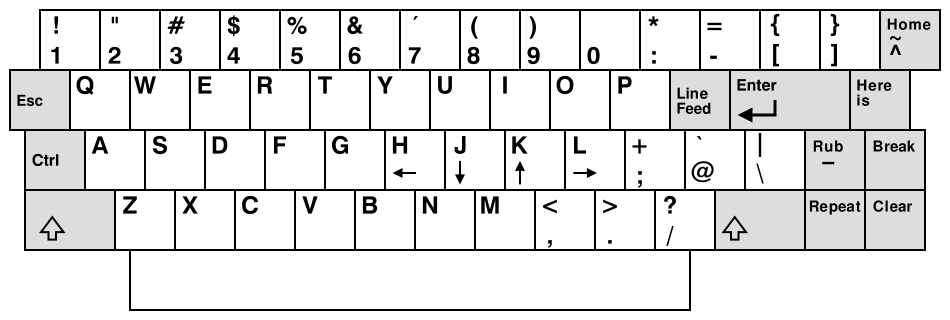

## Кратко

[Vim](https://www.vim.org/) — сложный, но очень интересный инструмент. Он позволяет сильно ускорить вашу работу с текстом. В этой статье познакомимся с общими принципами работы в Vim, изучим режимы работы, посмотрим на некоторые команды и их поведение.

Горячие клавиши есть в любом IDE, но Vim можно использовать в любом редакторе, что снимает с вас необходимость изучения шорткатов.

## Как войти

Все мы с вами сталкиваемся с Vim: при создании коммита или при работе на удалённом сервере. Однако, мало кто задумывался почему этот инструмент настолько популярен. Его поклонники до сих пор существуют и продвигают Vim в массы.

## Общая концепция

Основная идея Vim заключается в том, что редактирование текста (в нашем случае кода) более сложная задача чем его создание. С нуля писать просто — сосредоточился и тыкаешь правильные кнопочки в правильной последовательности. А для редактирования нужно понять, куда вносить правки, навести мышь на эту часть кода, начать удалять буквы удерживая Backspace, и только после этого можно будет вводить другой код. Повторить до успешного результата.

Однако перемещение и редактирование может происходить гораздо быстрее в случае, если не придётся трогать мышь или тачпад. Подумал и бац, уже редактируешь код в правильном месте. Магия вне Хогвартса — не иначе.

## Принцип команд

Большинство команд при работе в Vim это обычные глаголы и существительные в английском языке.

- Удалить слово: delete word — <kbd>dw</kbd>.
- Заменить два слова: change 2 word — <kbd>c2w</kbd>.
- Ввести текст: insert — <kbd>i</kbd>.
- Удалить всё в скобках: delete inside ( — <kbd>di(</kbd>.

Иногда важно расположение курсора для той или иной команды. Например, если курсор находится в середине слова, то <kbd>dw</kbd> отработает не совсем ожидаемо: удалится часть слова после курсора _включая букву под курсором_. Чтобы достичь желаемого поведения, достаточно вспомнить, что мы находимся в середине слова и поэтому нам понадобиться команда <kbd>diw</kbd>.

<video controls width="700">
  <source src="video/diw-di.mp4" type="video/mp4">
  <source src="video/diw-di_safari.mp4" type="video/mp4">
</video>

## Клавиши hjkl

Клавиши <kbd>h</kbd><kbd>j</kbd><kbd>k</kbd><kbd>l</kbd> — это основные команды для движения по открытому файлу в визуальном режиме (подробнее о режимах Vim поговорим ниже). Использование именно этих клавиш это историческая особенность. Когда <!-- yaspeller ignore:start -->[Билл Джой](https://ru.wikipedia.org/wiki/Джой,_Билл)<!-- yaspeller ignore:end --> создавал редактор vi, стрелочки на его машине [ADM-3](https://ru.wikipedia.org/wiki/ADM-3) были именно на этих кнопках.

- h — ←
- j — ↓
- k — ↑
- l — →

## Режимы

Существует 5 основных режимов для работы в Vim. Большая часть из них создана для редактирования текста тем или иным способом.

1. Режим _normal_ — позволяет перемещаться по файлу используя кнопки, которые мы изучили ранее.
1. <kbd>i</kbd> — _insert_, режим ввода текста.
1. <kbd>v</kbd> — _visual_, режим выделения текста.
1. <kbd>:</kbd> — _command_, режим ввода команд bash.
1. <kbd>R</kbd> — _replace_, режим замены текста **перед** курсором.

<kbd>Esc</kbd> — выйти из любого режима и вернуться в нормальный режим.

<video controls width="700">
  <source src="video/rewrite.mp4" type="video/mp4">
  <source src="video/rewrite_safari.mp4" type="video/mp4">
</video>

## Undo-Redo

Все мы совершаем ошибки и хотим их изменить. В Vim это возможно одним движением.

Для отмены последнего редактирования используется кнопка <kbd>u</kbd> (undo). Для отмены отмены редактирования <kbd>Ctrl r</kbd> (redo).

## Как же выйти из Vim?

Как было сказано ранее, все в Vim это глаголы и существительные английского языка. Сохранение и выход не исключение. Эти операции совершаются в режиме команд. Войти в этот режим можно через кнопку <kbd>:</kbd>.

- <kbd>w</kbd> — write, сохранить;
- <kbd>q</kbd> — quit, выйти;
- <kbd>q!</kbd> — выйти без сохранения изменений;
- <kbd>wq</kbd> — выйти и сохранить.

## Навигация по тексту

Передвигаться по тексту в Vim можно очень быстро. За пару комбинаций можно перепрыгнуть на место в коде о котором вы подумали и тут же начать его редактировать. Все комбинации работают в режимах _normal_ и _visual_.

### Прыгаем по словам

Если слово **не** содержит пунктуационный знак в конце:

- переместить курсор _вперёд_ на начало следующего слова — <kbd>w</kbd>;
- переместить курсор _вперёд_ на конец слова — <kbd>e</kbd>;
- переместить курсор _назад_ на начало слова — <kbd>b</kbd>.

Если слово содержит пунктуационный знак в конце:

- курсор _вперёд_ на начало следующего слова — <kbd>W</kbd>;
- курсор _вперёд_ на конец слова — <kbd>E</kbd>;
- курсор _назад_ на начало слова — <kbd>B</kbd>.

### Начало и конец строки

- в _начало_ строки — <kbd>0</kbd>;
- в _начало_ строки на первый **не** пробельный символ — <kbd>^</kbd>;
- в _конец_ строки — <kbd>$</kbd>.

### Начало и конец файла

- в самое начало файла — <kbd>gg</kbd>;
- в конец файла — <kbd>G</kbd>.

### Перейти на конкретную строку

- перейти на строку 32 — <kbd>:32</kbd>.

### Поиск по слову

- найти слово param — <kbd>/param</kbd>.

Если совпадений несколько, то переход к следующему совпадению — <kbd>n</kbd> (next), к предыдущему — <kbd>N</kbd>.

### Перемещение по файлу

- _вверх_ на половину экрана — <kbd>Ctrl u</kbd>;
- _вверх_ на _весь_ экран — <kbd>Ctrl b</kbd>;
- _вниз_ на половину экрана — <kbd>Ctrl d</kbd>;
- _вниз_ на _весь_ экран — <kbd>Ctrl f</kbd>.

По моему мнению использование этих клавиш для быстрого перемещения по странице не очень удобно — становится сложно следить за текстом из-за скорости. Vim слишком быстрый и мозг не успевает отследить столь быстрое перемещение. Есть вариант лучше:

- _вверх_ к следующей пустой строке — <kbd>{</kbd>;
- _вниз_ к следующей пустой строке — <kbd>}</kbd>;
- вернутся к прошлому месту курсора — <kbd>Ctrl o</kbd>;
- обратное команде выше, к прошлому месту курсора — <kbd>Ctrl i</kbd>.

## Заключение

Vim не устарел, инструмент по-прежнему остаётся очень мощным. Дело не только в быстром редактировании или моментальном передвижении по файлу, но и в том, что Vim довольно просто превратить из редактора в полноценную IDE, заточенную конкретно под ваши нужды.
