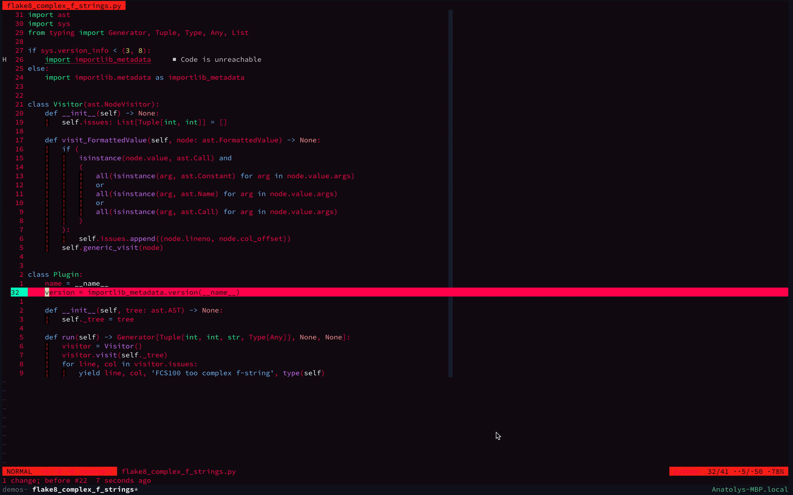

# Кратко
VIM - сложный, но очень интересный инструмент. Он позволяет сильно ускорить вашу работу с текстом. В этой статье познакомимся с общими принципами работы в VIM, изучим режимы работы, посмотрим на некоторые команды и их поведение.

Горячие клавиши есть в любом IDE, но VIM можно использовать в любом редакторе, что снимает с вас необходимость изучения шорткатов.

# Как выйти из VIM

Все мы с вами сталкиваемся с vim: при создании коммита или при работе на удалённом сервере. Однако, мало кто задумывался почему этот инструмент настолько популярен. Его поклонники до сих пор существуют и продвигают vim в массы. Я являюсь одним их этих поклонников.

## Общая концепция vim

Основная идея vim заключается в том, что редактирование текста(в нашем случае кода) более сложная задача чем его создание. С нуля писать просто - сосредоточился и тыкаешь правильные кнопочки в правильной последовательности. А для редактирования приходится отследить где вносить правки, навести мышь на эту часть кода, начать удалять буквы удерживая Backspace, и только тогда уже можно будет вводить другой код. Повторить до успешного результата.

Однако перемещение и редактирование может происходить гораздо быстрее в случае, если не придётся трогать мышь или trackpad. Подумал и бац, уже редактируешь код в правильном месте. Магия вне Хогвартса - не иначе.

### Принцип команд в vim

Большинство команд при работе в vim это обычные глаголы и существительные в английском языке.

- удалить слово - delete word - <kbd>dw</kbd>
- заменить 2 слова - change 2 word - <kbd>c2w</kbd>
- ввести текст - insert - <kbd>i</kbd>
- удалить все в скобках - delete inside ( - <kbd>di(</kbd>

Иногда важно расположение курсора для той или иной команды. Например, если курсор находится в середине слова, то <kbd>dw</kbd> отработает не совсем ожидаемо: удалится часть слова после курсора **включая букву под курсором**. Чтобы достичь желаемого поведения, достаточно вспомнить, что мы находимся в середине слова и поэтому нам понадобиться команда <kbd>diw</kbd>.

## hjkl

Этот заголовок вызывает вопросы, однако это основные команды для движения по открытому файлу в визуальном режиме(_более подробно про режимах vim смотри [тут](##режимы-vim)_). Использование именно этих клавиш это историческая особенность. Когда [Bill Joy](https://ru.wikipedia.org/wiki/Джой,_Билл) создавал редактор vi на его машине [ADM-3](https://ru.wikipedia.org/wiki/ADM-3) стрелочки были именно на этих кнопках.

- h - ←
- j - ↓
- k - ↑
- l - →

## Режимы vim

Существует 5 основных режимов для работы в vim. Большая часть из них создана для редактирования текста тем или иным способом.

- normal - обычный режим. Позволяет перемещаться по файлу используя кнопки, которые мы изучили ранее
- <kbd>i</kbd> - insert - режим ввода текста
- <kbd>v</kbd> - visual - режим выделения текста
- <kbd>:</kbd> - command - режим ввода команд bash
- <kbd>R</kbd> - replace - режим замены текста **перед** курсором

<kbd>Esc</kbd> - выйти из любого режима и вернуться в normal режим.

## Undo-Redo

Все мы совершаем ошибки и хотим их изменить. В vim это возможно одним движением.

Для отмены последнего редактирования используется кнопка <kbd>u</kbd> (undo). Для отмены отмены редактирования <kbd>Ctrl r</kbd> (redo).

## Как все же выйти из vim?

Как и было сказано ранее все в vim это глаголы и существительные английского языка. Сохранение и выход не исключение.
Эти операции совершаются в режиме команд. Войти в этот режим можно через кнопку <kbd>:</kbd>.

- сохранить - write - <kbd>w</kbd>
- выйти - quit - <kbd>q</kbd>
- выйти без сохранения изменений - <kbd>q!</kbd>
- выйти и сохранить - <kbd>wq</kbd>

## Передвижение в vim

Передвигаться в vim можно очень быстро. За пару комбинаций можно перепрыгнуть на место в коде о котором вы подумали и тут же начать его редактировать. Все комбинации работают в режимах normal и visual.

### Прыгаем по словам

- если слово **не** содержит пунктуационный знак в конце:
  - переместить курсор _вперёд_ на начало следующего слова - <kbd>w</kbd>
  - переместить курсор _вперёд_ на конец слова - <kbd>e</kbd>
  - переместить курсор _назад_ на начало слова - <kbd>b</kbd>

- если слово содержит пунктуационный знак в конце:
  - курсор _вперёд_ на начало следующего слова - <kbd>W</kbd>
  - курсор _вперёд_ на конец слова - <kbd>E</kbd>
  - курсор _назад_ на начало слова - <kbd>B</kbd>

### Начало и конец строки

- в _начало_ строки - <kbd>0</kbd>
- в _начало_ строка на первый **не** пробельный символ - <kbd>^</kbd>
- в _конец_ строки - <kbd>$</kbd>

### Начало и конец файла

- в самое начало файла - <kbd>gg</kbd>
- в конец файла - <kbd>G</kbd>

## Заключение

Это был краткий экскурс в VIM. На текущий момент этот инструмент остаётся по прежнему очень мощным. Дело не только в быстром редактировании или моментальному передвижении по файлу, но и то что, VIM - довольно просто превратить из редактора в полноценную IDE, заточенную конкретно под ваши нужды.

С примером конфигурации вы можете ознакомиться в моем [.dotfiles](https://github.com/anatoly-kor/dotfiles).

