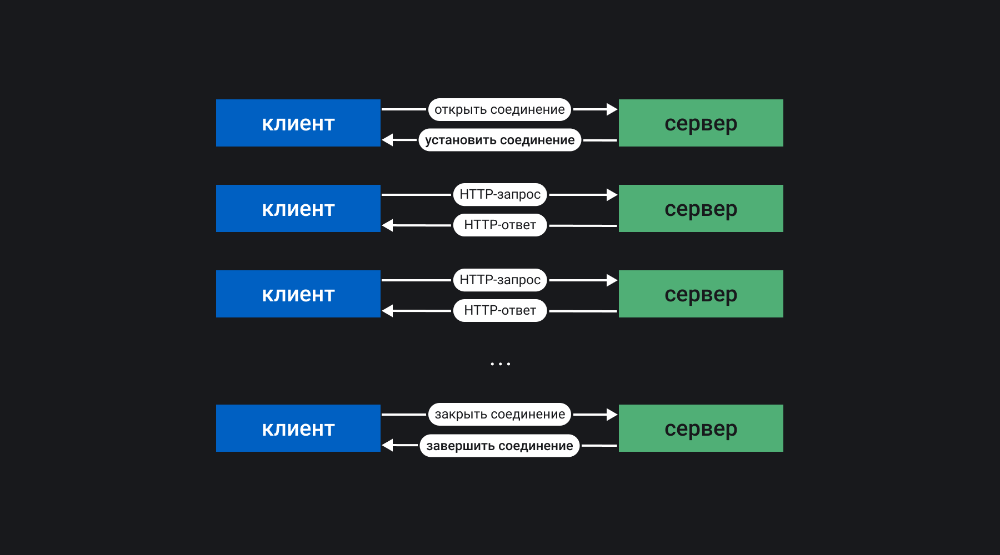

## Кратко

HTTP был разработан как протокол обмена данными между веб-сервером и веб-браузером. Это протокол прикладного уровня [модели OSI](/tools/network-models/), который используется для передачи между клиентом и сервером файлов HTML, CSS, JS, API, картинок, аудио, видео, введённых пользователем данных и прочего. Клиент (веб-браузер) отправляет серверу (веб-серверу) запросы и получает от него ответы. Сервер в рамках протокола HTTP практически всегда занимает пассивную позицию.

## Как понять

Есть три главных объекта, которые обмениваются сообщениями:

1. Клиент (user agent) — программа, которая отправляет запросы, получает и обрабатывает ответы от имени пользователя на устройстве пользователя, например, браузер.
2. Сервер (веб-сервер) — программа, которая работает на сервере, принимает и обрабатывает запросы от клиента, а затем отправляет ответы клиенту. Этой программой является веб-сервер.
3. Прокси (прокси-сервер) — программа, которая работает на сервере, пропускает через себя запросы и ответы и выступает в роли посредника между клиентом и сервером.

<aside>

📚 Подробнее о веб-серверах читайте в статье «[Веб-сервер](/tools/web-server/)».

</aside>

На первом этапе клиент устанавливает соединение с сервером с помощью протокола транспортного уровня TCP. Клиент может переиспользовать одно и то же соединение для работы с сервером или создавать его каждый раз. Это зависит от задачи, конфигурации сети и конкретных настроек оборудования. После установки соединения клиент посылает HTTP-сообщение с телом и параметрами запроса. Сервер принимает это сообщение и на основании логики работы бэкенда формирует и отправляет HTTP-сообщение ответа.



Протокол HTTP не хранит состояние, поэтому количество соединений не приводит к существенному усложнению взаимодействия между объектами системы. Однако существует понятие _сессии_, с помощью которой можно передавать и хранить необходимые данные, относящиеся к конкретному сеансу связи. Данные сессии сохраняются на клиенте и на сервере. Например, доступен идентификатор сессии, который позволяет не проводить авторизацию клиента при каждом обращении к серверу.

<aside>

🍪 Часто для хранения данных о сессии используются [Cookie](/js/cookie/).

</aside>

Прокси-серверы осуществляют сервисные функции:

- Кэшировать данные запроса или ответа для улучшения производительности и снижения сетевого трафика.
- Фильтровать данные. Например, можно сканировать данные антивирусом или использовать родительский контроль.
- Осуществлять балансировку нагрузки, распределяя запросы между разными серверами.
- Проводить аутентификацию клиентов для управления доступом к ресурсам.
- Хранить информацию о запросах клиентов и ответах сервера, реализуя таким образом логирование.
- Обнаруживать некоторые типы атак на сетевой узел (например, определение подозрительного трафика или DDoS-атаки).

<aside>

🍪 Подробнее о разных атаках можно прочитать в статье «[Безопасность веб-приложений](/tools/web-security/)».

</aside>


## Формат сообщения

HTTP-сообщение представляет собой обычный текст. Структура сообщения строго определена:

1. Стартовая строка;
2. Заголовки, передают сервисную информацию;
3. Тело сообщения, представляет данные в текстовом виде.

Тело сообщения — это опциональная часть сообщения, которая может отсутствовать. Например, для некоторых GET-запросов (то есть запросов со стороны клиента, в качестве метода получения данных для которого выбран метод `GET`) или для всех HEAD-запросов. Если тело сообщения присутствует, то это обозначается заголовками `Content-Length` или `Transfer-Encoding`.

### Стартовая строка

Стартовая строка запроса содержит информацию о методе запроса, относительном адресе и версии протокола в формате `Метод URI HTTP/Версия`. Стартовая строка ответа содержит версию протокола, код и статус ответа сервера в формате `HTTP/Версия Код Статус`.

Когда браузер посылает запрос на открытие главной страницы сайта, стартовая строка запроса будет такой:

```bash
GET / HTTP/1.1
```

Если страница существует и к ней есть доступ, то стартовая строка ответа будет такой:

```bash
HTTP/1.1 200 OK
```

Методы запроса описывают тип обработки данных, который клиент хочет осуществить. Доступны следующие методы:

- `OPTIONS` — используется для определения возможностей сервера по преобразованию данных.
- `GET` — используется для получения данных от сервера.
- `HEAD` — то же, что и `GET`, но не содержит тело в сообщении ответа.
- `POST` — используется для отправки данных на сервер.
- `PUT` — используется для добавления новых или изменения существующих данных на сервере.
- `PATCH` — то же, что и `PUT`, но используется для обновления части данных.
- `DELETE` — используется для удаления данных на сервере.
- `TRACE` — возвращает запрос от клиента таким образом, что в ответе содержится информация о преобразованиях запроса на промежуточных серверах.
- `CONNECT` — переводит текущее соединение в TCP/IP-туннель. Обычно этот метод используется для установления защищённого SSL-соединения.

Код состояния в ответе сервера содержит информацию о результате обработки данных. Существует пять классов кодов состояний:

- `1xx` — обработка данных на сервере продолжается;
- `2xx` — успешная обработка данных;
- `3xx` — перенаправление запросов;
- `4xx` — ошибка по вине клиента;
- `5xx` — ошибка по вине сервера.

Самые популярные ответы сервера (коды состояния и статусы):

- `200 OK` в случае успешной обработки запроса.
- `301 Moved Permanently` если редирект используется на постоянной основе.
- `307 Temporary Redirect` если редирект используется временно.
- `400 Bad Request` если в запросе есть синтаксическая ошибка.
- `403 Forbidden` если запрос успешный, но сервер его не может выполнить, поскольку пользователь не имеет достаточных прав.
- `404 Not Found` если запрошенного ресурса не существует.
- `500 Internal Server Error` если работа программы на сервере выдала ошибку.

Все возможные статусы описаны [в реестре кодов](https://www.iana.org/assignments/http-status-codes/http-status-codes.xhtml), а так же на [справочных ресурсах](https://httpstatuses.com).

### Использование заголовков

Заголовки делятся на четыре группы:

1. Основные заголовки, которые могут включаться в любые сообщения клиента и сервера.
2. Заголовки запроса, которые используются только в сообщениях клиента.
3. Заголовки ответа, которые используются только в сообщениях сервера.
4. Заголовки сущности, которые описывают данные в сообщении.

Заголовки принято группировать в соответствии со списком выше и посылать их в соответствующем списку порядке. В стандартах для каждой версии HTTP описано довольно много заголовков, но можно использовать и свои.

В заголовках указывается разная необходимая для работы веб-сервера или клиента информация. Например, есть адрес домена, к которому обращается клиент или информация об авторизации пользователя. Также заголовки могут содержать информацию о настройках кэширования на клиенте и сервере, формате передаваемых данных, языке, последних дате и времени модификации данных и так далее.

Приведём пример. Для экономии трафика часто используют сжатие данных: архивация данных перед пересылкой и разархивация после пересылки. Для этого применяют несколько алгоритмов сжатия. Например, часто применяется gzip, но наиболее интересным и современным является brotli.

Для того чтобы пользоваться сжатием, необходимо дать понять клиенту и серверу, что это вообще возможно и какой алгоритм сжатия применять. Выбор конкретного алгоритма обусловлен несколькими специфическими причинами. Например, программная поддержка на клиенте (чаще всего клиентом является браузер), реализация сжатия на сервере, особенности пересылаемых данных. В любом случае клиент должен сообщить серверу, что сжатие поддерживается, сервер должен сообщить клиенту, что данные сжаты и их необходимо распаковать перед использованием.

Например, для того чтобы сообщить серверу о поддержке сжатия в форматах gzip, br или deflate, нужно использовать заголовок:

```bash
Accept-Encoding: gzip, br, deflate
```

Сервер для передачи данных в сжатом формате gzip должен послать заголовок:

```bash
Content-Encoding: gzip
```

### Тело сообщения

Формат данных тела сообщения может быть нескольких типов, которые закреплены в спецификациях HTTP-протокола различных версий ([HTTP/1.0 (стандарт RFC 1945)](https://tools.ietf.org/html/rfc1945), [HTTP/1.1 (стандарт RFC 2616)](https://tools.ietf.org/html/rfc2616), [HTTP/2 (черновик стандарта)](https://tools.ietf.org/html/draft-ietf-httpbis-http2-17), [HTTP/3 (черновик стандарта)](https://quicwg.org/base-drafts/draft-ietf-quic-http.html)). Чаще всего встречаются типы:

- text/html.
- application/json.
- multipart/form-data.
