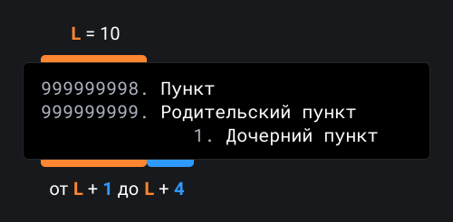

## Кратко

Markdown — удобочитаемый язык разметки, который прозрачно конвертируется в HTML. Его можно открывать и изменять в любом редакторе текста. Широко используется для написания документаций и README-файлов.

<aside>

📚 Все статьи Доки написаны на Markdown. [Разметку](https://github.com/doka-guide/content/blob/main/tools/markdown/index.md) этой страницы можно найти в [репозитории контента Доки](https://github.com/doka-guide/content).

</aside>

## Пример

Вы можете встретить Markdown в _.md_ или _.markdown_ файлах. Давайте посмотрим на пример одного из таких:

```md
# Дока

Дока — это **добрая** энциклопедия для веб-разработчиков.
Вы можете [открыть её](https://doka.guide) в своём браузере.

## Преимущества

- Понятный материал;
- Нескучные объяснения;
- Удобный поиск.
```

Он содержит базовые элементы, которые можно найти почти в любом `README.md`:

- заголовок первого уровня для названия;
- выделение жирным шрифтом важных частей в описании;
- ссылка с понятным текстом;
- заголовок второго уровня для подпунктов;
- маркированный список для перечисления преимуществ.

Несмотря на то, что Markdown достаточно удобно читать в исходном виде, его часто переводят в HTML. Результат конвертации находится ниже.

<iframe title="Пример README.md" src="demos/example/" height="330"></iframe>

## Синтаксис

### Параграф

Параграф — это одна или несколько подряд идущих строчек текста, отделённых одной или несколькими пустыми строчками. Если строка содержит только пробелы или табы, то она всё равно считается пустой.

Подряд идущие строчки будут склеены в одну, если не добавить жёсткий перенос. Существует несколько способов, как это можно сделать:

- добавить два (или больше) пробелов в конце строки `<пробел><пробел>`;
- добавить обратную косую черту в конце строки `\`;
- добавить HTML-тег переноса строки `<br>`.

```md
Привет,
мир!

Привет,<пробел><пробел>
пробел!

Привет,\
косая черта!

Привет,<br>
тег бр-р-р!
```

<iframe title="Перенос строк" src="demos/line-break/" height="280"></iframe>

### Заголовки

Markdown предлагает два стиля написания заголовков: **через решётки** (`#`) и **через подчёркивания** (`====`). Можно использовать до шести уровней заголовков, но подчёркивания позволяют создавать только первые два (`<h1>` и `<h2>`).

<aside>

🤓 В англоязычных источниках для обозначения стилей написания заголовков используются термины Atx-style (для решёток) и [Setext](https://en.wikipedia.org/wiki/Setext)-style (для подчёркиваний).

</aside>

#### Решётки (Atx-style)

Для того чтобы выделить заголовок, необходимо поставить от 1 до 6 решёток (`#`) и пробел в самом начале строки. Уровень заголовка зависит только от количества решёток.

```md
# Заголовок 1 уровня
## Заголовок 2 уровня
### Заголовок 3 уровня
#### Заголовок 4 уровня
##### Заголовок 5 уровня
###### Заголовок 6 уровня
```

<iframe title="Заголовки через решётки" src="demos/atx-style/" height="330"></iframe>

#### Подчёркивания (Setext-style)

«Подчёркивание» параграфа знаками равно (`=`) или дефисами (`-`) делает его заголовком первого или второго уровня соответственно. Уровень заголовка зависит только от типа «чёрточек», их количество значения не имеет.

Между текстом и «подчёркиванием» не должно быть пустых строк.

```text
Заголовок 1 уровня
==================

Заголовок 2 уровня
------------------

Заголовок, который подчеркнули одним символом
-

Заголовок второго
уровня из нескольких
строчек текста
------------------
```

<iframe title="Заголовки через подчёркивания" src="demos/setext-style/" height="270"></iframe>

### Списки

#### Маркированные

Для создания маркированных (ненумерованных) списков перед каждым пунктом нужно поставить минус (`-`), плюс (`+`) или звёздочку (`*`). Маркер и текст пункта необходимо разделять пробелом.

```md
- Помидор
- Огурец

+ Бублик
+ Ватрушка

* Молоко
* Кефир
```

<iframe title="Маркированный список" src="demos/marked-list/" height="270"></iframe>

Если перед подряд идущими пунктами будут стоять разные маркеры, то после конвертации мы получим разные списки.

```md
- Помидор
+ Бублик
* Молоко
```

<iframe title="Разные маркеры" src="demos/different-markers/" height="200"></iframe>

#### Упорядоченные

Если в качестве маркеров использовать цифры c точкой на конце (`1.`, `2.` и т. д.), то мы получим упорядоченный (нумерованный) список.

```md
1. Хлеб
2. Молоко
3. Помидоры
```

<iframe title="Упорядоченный список" src="demos/ordered-list/" height="175"></iframe>

Номера пунктов в итоговой разметке будут идти по порядку (1, 2, 3), даже если в Markdown будут стоять `1.`, `4.`, `9.`. Такая особенность позволяет нам использовать «ленивую нумерацию», когда перед каждым пунктом ставится одно и то же число.

```md
1. Хлеб
1. Молоко
1. Помидоры
```

<iframe title="«Ленивая нумерация»" src="demos/ordered-list/" height="175"></iframe>

Число перед первым пунктом показывает с чего нужно начинать нумеровать элементы списка, поэтому если в Markdown поставить `99.`, `1.`, `2.`, то в итоговой разметки пункты будут стоять под номерами 99, 100, 101.

```md
99. Хлеб
1. Молоко
2. Помидоры
```

<iframe title="Упорядоченный список с 99" src="demos/ordered-list-starts-with/" height="175"></iframe>

#### Вложенность

Любые списки можно вкладывать друг в друга, для этого перед маркером нужно поставить таб или несколько пробелов.

```md
+ Хлеб
+ Молочные продукты
  1. Кефир
  2. Ряженка

1. Молоко
2. Хлебобулочные изделия
    + Бублик
    + Ватрушка
```

<iframe title="Вложенные списки" src="demos/list-nesting/" height="300"></iframe>

Количество пробелов, которое нужно использовать, чтобы вложить один список в другой, может варьироваться. Оно зависит от количества символов в родительском маркере (`L`):
- `+` — 1 символ (`L = 1`)
- `1.` — 2 символа (`L = 2`)
- `99.` — 3 символа (`L = 3`)

Перед вложенным списком нужно поставить от `L + 1` до `L + 4` пробелов.



<iframe title="Отступ вложенных списков" src="demos/list-nesting-intend/" height="305"></iframe>

### Цитаты

Если в начале строки поставить треугольную скобку (`>`), то Markdown превратит текст после неё в цитату. Внутри могут быть любые блоки: параграфы, заголовки или даже другие цитаты.

```md
> Одна треугольная скобка
превращает в цитату несколько строк,
идущих друг за другом.
```

<iframe title="Многострочная цитата" src="demos/quote1/" height="150"></iframe>

```md
> # Цитаты великих людей
> Ваша работа заполнит большую часть жизни и единственный способ быть
> полностью довольным — делать то, что по-вашему является великим делом.
> И единственный способ делать великие дела — любить то, что вы делаете.
>
> *— Стив Джобс, Речь в Стенфорде*
```

<iframe title="Многострочная цитата" src="demos/quote2/" height="230"></iframe>

```md
> Первая, родительская цитата
> > А это уже вторая,\
> > дочерняя цитата
```

<iframe title="Вложенная цитата" src="demos/quote-nesting/" height="220"></iframe>

### Исходный код

Markdown позволяет специальным образом размечать исходный код, все символы внутри будут автоматически экранированы. Есть 3 способа, как это можно сделать:

- Обернуть код одной-двумя парами бэктиков (``` `код` ```)
- Обернуть код тремя и более парами бэктиков (` ```код``` `)
- Поставить таб или 4 пробела перед каждой строчкой кода

#### Одна-две пары бэктиков

Этот способ позволяет вставлять исходный код как строчный элемент. Даже если фактически у нас будет несколько строчек кода, обёрнутых бэктиками, мы всё равно получим одну строку после конвертации в HTML.

```text
Функция `alert()`
вызывает диалоговое окно.

Сумму двух переменных
можно вывести так:
``const a = 1
const b = 2
alert(a + b)``
```

<iframe title="Однострочный код" src="demos/code-inline/" height="155"></iframe>

#### Три и более пары бэктиков

Если обернуть одну строчку кода тремя или более парами бэктиков, то мы получим строчный элемент, а если несколько строчек, то — блочный. Второй вариант позволяет указывать язык программирования, который мы используем, для этого нужно написать его сразу после открывающих бэктиков.

После обозначения языка программирования визуально ничего не изменится, но это даст возможность дополнительным плагинам и скриптам подсветить код внутри блока.

````text
Функция ```console.log()```
выводит текст в консоль.

Сумму двух переменных
можно вывести так:
```javascript
const a = 1
const b = 2

console.log(a + b)
```
````

<iframe title="Многострочный код" src="demos/code-block/" height="275"></iframe>

#### Отступ

Другой способ выделить код — поставить перед ним таб или 4 пробела. Исходный код необходимо отделять пустой строкой от предыдущего блока.

```text
Метод ```.toString()```
превращает числа в строку.

Его можно использовать так:

    const a = 1
    const b = 2

    (a + b).toString()
```

<iframe title="Многострочный код" src="demos/code-intend/" height="275"></iframe>

### Выделение текста

Если обернуть текст звёздочками (`*`) или нижними подчёркиваниями (`_`), то он станет жирным или курсивным. Оба символа работают одинаково, стиль выделения зависит только от их количества:

- одна пара `*` или `_` сделает текст _\*курсивным\*_;
- две пары `*` или `_` сделают текст **\*\*жирным\*\***;
- три пары `*` или `_` применят ***\*\*\*оба стиля\*\*\****.

```md
Обычный текст

*Курсивный текст*<br>
_Другой курсивный текст_

**Жирный текст**<br>
__Другой жирный текст__

***Оба стиля***<br>
___Оба стиля___<br>
```

<iframe title="Выделение текста" src="demos/emphasis/" height="285"></iframe>

Для экранирования служебных символов Markdown нужно поставить обратную косую черту перед каждым из них (`\*`, `\_`, `\*\*`).

```md
**_Оба стиля из \* и \__**<br>
__*Оба стиля из \* и \_*__

\*\*Экранирование звёзд\*\*<br>
\_\_\_Экранирование подчёркиваний\_\_\_
```

<iframe title="Экранирование выделения" src="demos/emphasis-escape/" height="200"></iframe>

### Ссылки

Markdown предлагает 3 стиля разметки ссылок: **строчный**, **справочный** и **автоматический**.

#### Строчные

Для вставки ссылки в строчном стиле необходимо воспользоваться следующей конструкцией: `[Текст ссылки]​(URL)`. Есть возможность добавить [подсказку](/html/global-attrs/#title), для этого нужно после URL дописать текст в кавычках: `[Текст ссылки]​(URL "Подсказка")`.

```md
Привет, [Дока](https://doka.guide "Энциклопедия про web-dev")!
```

<iframe title="Ссылка" src="demos/link-inline/" height="125"></iframe>

#### Справочные

Для вставки ссылки в справочном стиле нужно написать `[Текст ссылки]​[Ключ]` в том месте, где вы хотите её поместить, а где-нибудь выше или ниже добавить сноску `[Ключ]: URL "Подсказка"`.

```md
У [Доки][1] есть свой [репозиторий][repo].


[1]: https://doka.guide "Энциклопедия про web-dev"
[repo]: https://github.com/doka-guide "Репозиторий Доки"
```

<iframe title="Ссылка" src="demos/link-ref/" height="125"></iframe>

#### Автоматические

Markdown позволяет использовать упрощённый вариант для вставки ссылок, для этого нужно просто обернуть URI треугольными скобками (`<URI>`).

Можно вставлять адреса электронной почты (`<hi@doka.guide>`), тогда мы автоматически получим ссылку типа `mailto:`.

```md
Заходите на <https://doka.guide>
или присылайте нам письма на <hi@doka.guide>
```

<iframe title="Автоматические ссылки" src="demos/link-auto/" height="125"></iframe>

### Изображения

Конструкции для вставки изображений очень похожи на те, что используются для ссылок. Предлагается 2 стиля разметки: **строчный** и **справочный**.

#### Строчные

Для вставки изображения в строчном стиле необходимо воспользоваться конструкцией `!⁠[Alt текст]​(URL картинки)`. При желании можно добавить [подсказку](/html/global-attrs/#title): `!⁠[Alt текст]​(URL картинки "Подсказка")`.

```md

```

<iframe title="Изображение" src="demos/img/" height="250"></iframe>

#### Справочные

Для вставки изображения в справочном стиле нужно написать `!⁠[Alt текст]​[Ключ]` в том месте, где вы хотите его поместить, а где-нибудь выше или ниже описать картинку по ключу `[Ключ]: URL картинки "Подсказка"`.

```md
![Одна собака][1]

[1]: dog.png "Собака смотрит влево"
```

<iframe title="Изображение" src="demos/img/" height="250"></iframe>

### Горизонтальный разделитель

Для разделения смысловых блоков можно использовать [горизонтальную черту](/html/hr/) (`<hr>`). Чтобы это сделать, необходимо поставить на одной строке три (или более) дефиса (`-`), подчёркивания (`_`) или звёздочки (`*`). Они не обязательно должны идти друг за другом, между ними могут быть табы или пробелы.

```md
---

***

_	_	_

*  * *  *

------------
```

<iframe title="Горизонтальные разделители" src="demos/hr/" height="200"></iframe>

## Стандартизация

У Markdown есть [оригинальная спецификация](https://daringfireball.net/projects/markdown/basics) от одного из создателей языка — Джона Грубера. К сожалению, она не всегда однозначно описывает синтаксис, из-за чего многие конвертеры Markdown работают по-разному. Чтобы исправить эту ситуацию, группа ~~разработчиков~~ «поклонников Markdown» создала [CommonMark](https://commonmark.org/) — [спецификацию](https://spec.commonmark.org/), которая описывает многие частные случаи, и [эталонную реализацию](http://try.commonmark.org/) парсера Markdown на JS.

## Диалекты

Простой Markdown не всегда подходит для тех или иных проектов, поэтому существуют спецификации, которые расширяют или сужают его.

### GitHub Flavored Markdown

[GFM](https://github.github.com/gfm) — один из диалектов Markdown, который, как можно догадаться из названия, используется на GitHub. Он основан на спецификации CommonMark и расширяет её дополнительными элементами: таблицами, списками задач и зачёркиваниями.

#### Таблицы

Колонки таблицы размечаются с помощью вертикальных черт (`|`), а заголовок отделяется дефисами (`-`).

```md
| Место | Участник | Рейтинг |
|-------|----------|---------|
| 1     | Саша     | 118     |
| 2     | Юля      | 92      |
| 3     | Даниил   | 36      |
```

<iframe title="Таблица" src="demos/table/" height="305"></iframe>

Можно поставить двоеточие (`:`) рядом с дефисами для выравнивания текста:

- по левой стороне (`|:----|`)
- по центру (`|:----:|`)
- по правой стороне (`|----:|`)

```md
| Место | Участник | Рейтинг |
|------:|:--------:|:--------|
| 1     | Саша     | 118     |
| 2     | Юля      | 92      |
| 3     | Даниил   | 36      |
```

<iframe title="Таблица с выравниванием" src="demos/aligned-table/" height="305"></iframe>

Ячейки таблицы могут не соответствовать друг другу по размеру.

```md
|Место|Участник|Рейтинг|
|-:|:-:|:-|
|1|Саша|118|
|2|Юля|92|
|3|Даниил|36|
```

<iframe title="Таблица с выравниванием" src="demos/aligned-table/" height="305"></iframe>

#### Список задач

Для создания списка задач используется синтаксис [маркированного списка](/tools/markdown/#markirovannye), но с добавлением чекбоксов (`[ ]` или `[x]`) после маркеров.

```md
- [x] Выйти на улицу
- [x] Зайти в магазин
- [ ] Купить продукты
  - [x] Молоко
  - [x] Хлеб
  - [ ] Помидоры
- [ ] Вернуться домой
```

<iframe title="Список задач" src="demos/tasks-list/" height="330"></iframe>

#### Зачёркивание

Если необходимо зачеркнуть текст, то можно поставить по две тильды (`~~`) в начале и в конце фрагмента.

```md
~~Привет, Вова!~~\
Здравствуйте, Владимир!
```
<iframe title="Зачёркивание" src="demos/strikethrough/" height="150"></iframe>

### Stack Exchange Additions

Популярный среди разработчиков сайт [Stack Overflow](https://stackoverflow.com) и все остальные сайты, входящие в группу Stack Exchange, используют в редакторе вопросов Markdown, основанный на спецификации CommonMark. Он расширен [следующим образом](https://stackoverflow.com/editing-help):

#### Теги

Ссылка на вопросы по определённому тегу пишется просто в квадратных скобках с префиксом `tag`:

```md
Все вопросы по тегу [tag:javascript] на нашем сайте.
```

#### Спойлер

Если после символа цитирования поставить восклицательный знак (`>!`), то цитата выведется свёрнутой, и развернуть её пользователь сможет, кликнув по ней.

```md
В конце пятого эпизода выясняется, что
>! он его отец.
```

#### Другие отличия

Stack Exchange использует тот же синтаксис для создания таблиц, что и **GitHub Flavored Markdown**, а также некоторые HTML-теги из числа безопасных.

В комментариях к вопросам поддерживается только минимальный набор правил разметки: жирный шрифт, курсив, строчный код в бэктиках и ссылки строчного формата.

### Мессенджеры

Многие мессенджеры, например Telegram или Discord, используют упрощённую версию Markdown. Там отсутствует разметка заголовков, списков и цитат, но поддерживается расширенный синтаксис выделения текста: жирный шрифт, курсив, зачёркивания, ссылки, разметка исходного кода.
