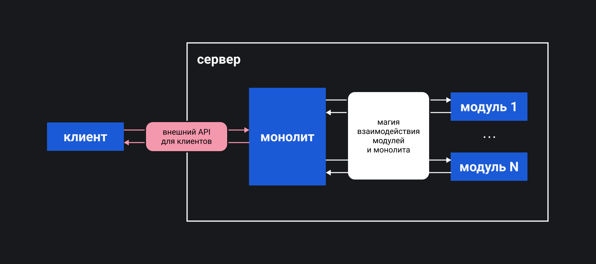

## Кратко

Микросервис — это отдельное приложение, как правило, очень небольшое, которое поддерживает ограниченную функциональность. С помощью программного интерфейса ([API](/tools/api/)) такое приложение встраивается практически в любой продукт и может работать в составе разных продуктов одновременно. Микросервисы часто противопоставляют монолитам, крупным приложениям, которые полностью реализуют большой набор функций. Особенностью монолитов является глубокое зацепление разных частей приложения и, как следствие, худшие характеристики масштабируемости в сравнении с микросервисами.

Например, приложение, которое рассылает письма по списку адресов электронной почты, или приложение, которое проводит аутентификацию пользователей, или приложение, которое отслеживает активность пользователей в сервисе, — отличные кандидаты, чтобы стать микросервисами. Можно повторять разработку похожего набора функций для нового продукта, а можно реализовать и отладить микросервис или несколько микросервисов, которые будут работать корректно для любого приложения.

## Как понять

Традиционно существовала концепция приложения, которое полностью решает все задачи программного продукта — монолит. В эпоху быстрого развития рынка IT стало важным уменьшить показатель time-to-market — время доведения до потребителя новой функциональности или продукта. Схематично работу монолита можно изобразить так:



Практика разбиения программ на модули, которые можно переиспользовать в других программах, оказалась успешной. Сначала на стороне сервера (бэкенд), потом и на стороне клиента (фронтенд), части приложения стали выносить не только в отдельные модули, но и в отдельные самостоятельные программы. Это позволило переиспользовать прошедшую проверку временем функциональность в новых продуктах. Так и пришли к новому понятию — микросервис. А так работает веб-приложение, построенное на микросервисах:


<aside>

📚 Критерий минимальной функциональности микросервиса прост — логика работы микросервиса должна уместиться в голове одного человека.

</aside>

Плюсы микросервисов:

- Можно использовать тот стек технологий, который больше всего подходит для решения поставленной задачи.
- Проще и дешевле разрабатывать набор микросервисов, в сравнении с разработкой большого приложения.
- Поддерживать микросервисы намного проще и дешевле, чем поддерживать большое приложение.
- Не приходится каждый раз отлаживать работу для новых продуктов.
- Легко масштабировать приложение, построенное как совокупность микросервисов.
- Есть возможность использовать разные подходы к тестированию и доработки каждого микросервиса.

Минусы микросервисов:

- Нужно поддерживать контракт — формализацию возможностей и условий взаимодействия с микросервисом.
- Должна быть достаточно высокой квалификация разработчиков и инженеров по инфраструктуре.
- Микросервис должен минимально зависеть от контекста использования, не всегда это возможно.
- Могут возникать коллизии при обращении к одним и тем же сервисам: к базе данных, к оперативной памяти, к диску, к процессору и прочим ресурсам.
- Сложно поддерживать и тестировать большое количество микросервисов.
- Разрабатывать большое количество микросервисов иногда дороже разработки монолита.

Чтобы посмотреть на минусы через призму оптимизма, прочитайте истории от гигантов рынка — все они используют микросервисы: «[Adopting Microservices at Netflix: Lessons for Architectural Design](https://www.nginx.com/blog/microservices-at-netflix-architectural-best-practices/)», «[Amazon Architecture](http://highscalability.com/amazon-architecture)», «[Service-Oriented Architecture: Scaling the Uber Engineering Codebase As We Grow](https://eng.uber.com/service-oriented-architecture/)», [«Building Products at SoundCloud—Part II: Breaking the Monolith](https://developers.soundcloud.com/blog/building-products-at-soundcloud-part-2-breaking-the-monolith)».

Чтобы автоматизировать часть задач и избежать проблем, связанных с недостатками использования микросервисов, используют современные инструменты CI/CD. Наиболее популярные решения:

- Для разработки: [GitLab CI](https://docs.gitlab.com/ee/ci/), [TeamCity](https://www.jetbrains.com/teamcity/), [Jenkins](https://www.jenkins.io), [Github Actions](https://github.com/features/actions), [Circle CI](https://circleci.com/), [Docker](https://www.docker.com).
- Для оркестрации: [Nomad](https://www.hashicorp.com/products/nomad), [Apache Mesos](https://mesos.apache.org), [Kubernetes](https://kubernetes.io), [Docker Swarm](https://docs.docker.com/engine/swarm/).
- Для обнаружения активных сервисов: [Consul](https://www.consul.io), [Eureka](https://cloud.spring.io/spring-cloud-netflix/reference/html/), [Apache Zookeeper](https://zookeeper.apache.org).
- Для мониторинга: [Zabbix](https://www.zabbix.com), [ELK](https://www.elastic.co/what-is/elk-stack), [TICK](https://www.tickspot.com), [Prometheus](https://prometheus.io), [Grafana](https://grafana.com), [Graphite](https://graphiteapp.org).
- Для организации очередей: [RabbitMQ](https://www.rabbitmq.com), [Apache Kafka](https://kafka.apache.org), [ActiveMQ](https://activemq.apache.org).

<aside>

📚 В этой статье мы касаемся темы CI/CD. Если вам не очень понятно, зачем это нужно, прочитайте статью «[Что такое CI/CD](/tools/ci-cd/)».

</aside>

## Когда применять

**Нужно держать высокую нагрузку**. Проблемы пикового трафика легко решаются с помощью микросервисов, существуют готовые решения и облачные сервисы, которые обеспечивают автомасштабирование приложения. Сервисы добавляют ресурсы нагруженным микросервисам или создают копии.

**Выросла команда разработки**. Команда уже больше 10-15 человек и постоянно растёт, новичков становится сложнее погружать во все тонкости разработки. Микросервисы могут упростить командную работу и привести к единому набору стандартов разработки.

**В приложении появилось много модулей**. Модулей уже несколько десятков, они достаточно автономны, перевод их в микросервисы позволит легче масштабировать приложение в будущем или переиспользовать при разработке новых продуктов.

**Стало очень много кода**. Если приложение становится очень большим, то разбиение на микросервисы упростит его поддержку и развитие.

**Нужно загружать приложение быстрее**. Если приложение запускается несколько минут, микросервисы позволят оптимизировать загрузку и применить масштабирование для непроизводительных или высоконагруженных частей программы. Кроме этого, разработчики тоже не будут ждать длительной сборки приложения и его загрузки на этапе отладки.

**Нужно использовать ресурсы компьютера оптимально**. Модули могут обращаться к сети, к памяти или к процессору неравномерно. Применение микросервисов позволит оптимизировать этот компонент в работе приложения.

**Нужно быстро выводить новые продукты на рынок**. Нужно обеспечить минимальное время выхода на рынок новых продуктов и новых функций для уже существующих, микросервисы обеспечат максимальную скорость развёртывания.

## Как начать

Написать свой микросервис не сложно. Общение микросервиса с внешним миром часто реализуется через протокол HTTP или RPC. Работа любого микросервиса сосредоточена вокруг одной доменной области. Например, нужно авторизовать пользователя или обработать оплату заказа в интернет-магазине.

Напишем свой микросервис по оптимизации степени сжатия, формата и размера картинок. Пользователь будет закачивать картинку, микросервис будет обрабатывать её с помощью библиотеки, которая работает под капотом известного сервиса [Squoosh](https://squoosh.app/), и встраивать обработанную картинку на сайт.

Создадим проект, установим необходимые библиотеки [libSquoosh](https://github.com/GoogleChromeLabs/squoosh/tree/dev/libsquoosh) и [busboy](https://github.com/mscdex/busboy) и создадим два файла _image.js_ и _micro.js_:

```bash
npm init -y
npm install @squoosh/lib busboy
touch image.js
touch micro.js
```

Код в примере использует ES-модули, поэтому не забудьте добавить в _package.json_ строку `"type": "module"`, чтобы проект запустился.

Файл _image.js_ — простейшая программа, которая берёт на локальном диске файл с картинкой, обрабатывает её с заданными параметрами и сохраняет на диск:

```javascript
import { ImagePool } from '@squoosh/lib'
import fs from 'fs/promises'
import { cpus } from 'os'

async function openImage(path, pool) {
  const file = await fs.readFile(path)
  return pool.ingestImage(file)
}

async function processImage(image, preOpt, encOpt) {
  await image.decoded
  await image.preprocess(preOpt)
  await image.encode(encOpt)
  return image
}

async function saveIntoJpeg(image, path) {
  const rawEncodedImage = (await image.encodedWith.mozjpeg).binary
  return fs.writeFile(path, rawEncodedImage)
}

export async function saveImage(unprocessedImagePath, processedImagePath, preOpt, encOpt) {
  const imagePool = new ImagePool(cpus().length)
  const image = await openImage(unprocessedImagePath, imagePool)
  const processedImage = await processImage(image, preOpt, encOpt)
  await saveIntoJpeg(processedImage, processedImagePath)
  await imagePool.close()
}
```

Файл _micro.js_ — микросервис, программа, которая получает файл картинки, обрабатывает его и отдаёт для скачивания уже преобразованную картинку через запрос:

```javascript
import http from 'http'
import path from 'path'
import fs from 'fs'
import Busboy from 'busboy'

import { saveImage } from './image.js'

const preprocessOptions = {
  resize: {
    enabled: true,
    width: 100
  },
}

const encodeOptions = {
  mozjpeg: {}
}

http.createServer(function(req, res) {
  if (req.method === 'POST') {
    const busboy = new Busboy({ headers: req.headers })

    busboy.on('file', async function(fieldName, file, fileName) {
      console.log(`Для загрузки файла ${fileName} используется поле ${fieldName}`)
      const fName = fileName.split('.')[0]
      const saveTempTo = path.join(process.cwd(), path.basename(fileName))
      const saveResultTo = path.join(process.cwd(), path.basename(`${fName}.jpg`))
      await new Promise((resolve, reject) => {
        const stream = file.pipe(fs.createWriteStream(saveTempTo))
        stream.on('finish', resolve)
        stream.on('error', reject)
      })
      await saveImage(saveTempTo, saveResultTo, preprocessOptions, encodeOptions)
    })

    busboy.on('finish', function() {
      res.end('Картинка обработана!')
    })

    return req.pipe(busboy)
  } else if (req.method === 'GET') {
    const imageFileName = req.url.replace(/^\//, '')
    const data = fs.readFileSync(imageFileName)
    res.writeHead(200, {'Content-Type': 'text/html'})
    res.write('<html><body></body></html>')
    return
  }
  res.writeHead(404)
  res.end()
}).listen(8000, function() {
  console.log('Слушаю запросы...')
})
```

Настройки для преобразования картинок находятся в объектах `preprocessOptions` (для предварительной обработки) и `encodeOptions` (для сжатия). Вы можете использовать другие параметры для преобразования картинок, которые описаны в официальной документации библиотеки.

Теперь нужно запустить микросервис командой:

```bash
node micro.js
```

Вы можете переслать любую картинку, предварительно подготовив форму для отправки файлов или напрямую, запросом из терминала. Например, для картинки, которая лежит на вашем компьютере по адресу _path/to/image.png_:

```bash
curl -v -F upload=@path/to/image.png http://localhost:8000/
```

Результат можно посмотреть в браузере, введя адрес _http://localhost:8000/image.jpg_, поскольку картинка сохраняется в ту же директорию, где находится микросервис. Имя файла картинки сохраняется, меняется только расширение на _.jpg_.

Применение набора подобных микросервисов может положительно сказаться на масштабируемости всего приложения или сервиса. Поддерживать и развивать микросервисы проще, можно применять разные архитектурные решения и наиболее подходящий стек технологий, для оптимального решения.
