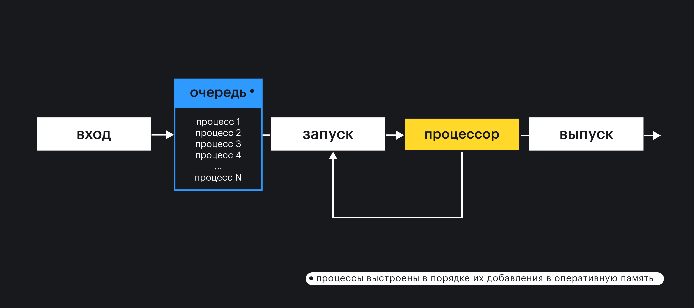
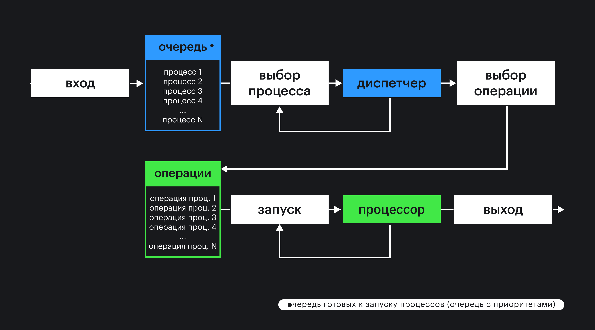
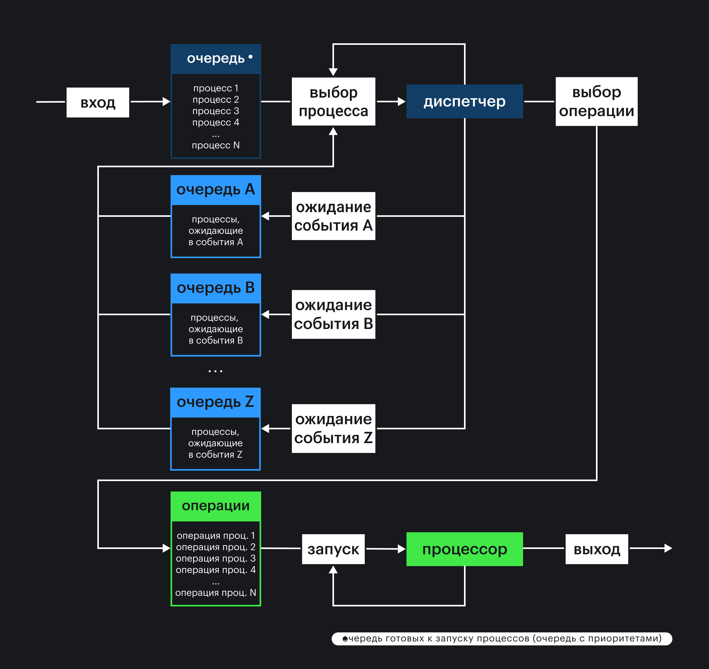

## Кратко

Современные операционные системы позволяют нескольким пользователям одновременно работать на одном компьютере. При этом ресурсы компьютера должны правильно распределяться между приложениями, которые запускают пользователи. Для этого в операционной системе используется специальная абстракция — «процесс».

Под процессом чаще всего понимают отдельное работающее приложение, но бывают приложения, которые используют несколько процессов. Например, браузер Chrome под каждую вкладку создаёт отдельный процесс. Процесс — это абстракция операционной системы, которая позволяет выделять процессорное время и память компьютера для работы программы. Операционная система запускает процессы на короткое время поочерёдно. [Диспетчер операционной системы](https://ru.wikipedia.org/wiki/Диспетчер_операционной_системы) помещает отдельные операции из разных процессов в очередь. Когда очередь подошла, операция выполняется.

Для управления процессами операционная система использует механизм прерываний. Процессы можно останавливать или ставить на паузу, перезапускать различными способами, сообщать процессам об изменении состояния системы и прочее. Прерывания в операционных системах реализованы по-разному. В Unix-подобных системах существует несколько механизмов реализации прерываний. Один из них — управления процессами с помощью сигналов, описанный в стандарте [POSIX](https://ru.wikipedia.org/wiki/POSIX) для Unix-подобных операционных систем.

## Как понять

Первые операционные системы были однозадачные. Разработаны они были для компьютеров с одним процессором. В каждый момент времени работать могла только одна программа. Пока она не завершится, нельзя запустить другую программу. Все ресурсы компьютера используются для работы только одной программы:

Вскоре выяснилось, что такой механизм не очень хорошо работает. Программы могут запрашивать данные у внешних устройств или ждать ввода данных от пользователя, и процессор все это время простаивает. Хочется использовать процессор эффективнее, загружая выполнением других программ. Для этого операционная система стала разбивать программы на блоки. Каждый блок выбирался так, чтобы процессор не простаивал.

Например, можно было сделать так:

- выполняется блок программы до тех пор, пока не запросит данные у пользователя;
- далее выполняется блок другой программы, пока данные не будут получены;
- после этого выполняется блок первой программы, пока программа не отправит данные на печать;
- пока печатаются данные, выполняется блок второй программы.

Следующим шагом было внедрение специального диспетчера операционной системы. Главная задача диспетчера — максимально эффективно использовать процессор. Для этого все программы бились уже не на блоки, а на отдельные операции (команды для процессора). Процессор заблокирован, пока команда не выполнится полностью. На схеме показано, как диспетчер использует очередь готовых к запуску программ (процессов в терминах операционной системы):

Диспетчер операционной системы распределяет процессы в очереди в порядке приоритета. Такая очередь называется _очередью готовых к запуску_. Например, системным процессам назначается наивысший приоритет. Приоритет означает количество процессорного времени, которое будет отдано процессу. В некоторых операционных системах приоритетом процессов можно управлять. Linux одна из таких операционных систем. Все процессы в Linux имеют свой приоритет, который задаётся числом от -20 (наивысший приоритет) до 19 (наименьший приоритет). Любой пользователь может понижать приоритет процесса, но только суперпользователь может его увеличивать. Управление приоритетом возможно как на этапе запуска, так и на этапе работы процесса.

После создания одной очереди, оказалось, что и это не совсем оптимальный механизм работы с несколькими процессами. Всё дело в том, что разные внешние устройства работают за разное время. Какие-то устройства работают в автоматическом режиме, какие-то в ручном (с участием пользователя). Решили, что было бы здорово сделать несколько очередей, каждая из которых обеспечивает доступ до какого-то определённого ресурса:

Например, существуют очереди для доступа к клавиатуре или принтеру, видеокарте или накопителю (HDD, SSD, Flash-drive и так далее). На рисунке разные устройства обозначены буквами (A, B и так далее).

Процесс для операционной системы — это не просто совокупность операций или код программы. Для того чтобы процессор мог возвращаться к выполнению программы, в операционной системе должны хранится промежуточные результаты выполнения программы, состояние процессора на момент перехода к другому процессу (контекст) и значения переменных (данные программы):

Для операционной системы процесс состоит из трёх частей: программы, контекста и данных. Программа — это последовательность операций над данными, записанная в оперативной памяти. Данные программ располагаются в оперативной памяти и на внешних устройствах. Перед выполнением очередной операции программы все требуемые данные должны быть загружены в оперативную память компьютера.

Контекст позволяет операционной системе отложить процесс на некоторое время, а затем вернуться к нему, когда это будет возможно. Контекст процесса, например, может содержать следующие данные:

- состояние регистров процессора;
- состояние стека программы;
- состояние стека операционной системы;
- состояния зарезервированной памяти.

Контекст необходим для того, чтобы можно было реализовать работу диспетчера операционной системы, обеспечить межпроцессное взаимодействие и обмен информацией между процессами и операционной системой.

У процесса всегда есть приоритет, который позволяет помещать процесс в нужное место очереди. В первую очередь выполняются процессы, имеющие в операционной системе наивысший приоритет. Операционная система использует специальную структуру данных [_очередь с приоритетом_](https://ru.wikipedia.org/wiki/Очередь_с_приоритетом_(программирование)) в качестве абстракции для реализации механизма выполнения процессов на процессоре компьютера.

Каждому процессу соответствует набор состояний. В современных операционных системах набор состояний сводится к следующим пяти:

Состояние «блокирован» соответствует случаю, когда процесс, например, ожидает ответа от внешнего устройства: ввод с клавиатуры или ответ от накопителя. Количество состояний увеличивается, если ввести возможность приостанавливать процесс в момент того, когда он, например, заблокирован или готов продолжить свою работу:

### Прерывания

Чтобы можно было управлять процессами на уровне операционной системы, существует механизм прерываний. Когда происходит прерывание, выполнение процесса прерывается и совершается какое-то действие. Например, можно приостановить процесс или переместить из одной очереди в другую. Часть прерываний обрабатываются только операционной системой, другую часть можно слушать и реагировать на них, аналогично событиям в DOM. Прерывания делятся на две группы: прерывания на уровне железа, и программные прерывания.

Механизм прерываний из первой группы реализован на уровне процессора и используется в основном для работы с внешними устройствами. Операционная система может получить доступ к прерываниям, но управлять может только с позиции установки настроек для процессора (разрешать или запрещать определённые прерывания). Программы могут использовать прерывания для взаимодействия с другими программами и для взаимодействия с внешними устройствами на уровне железа. Программе прерывание передаётся как событие, по наступлению которого выполняется заранее заготовленный разработчиками код (обработчик прерывания).

По типу источника «железные» прерывания делятся на:

- внешние, асинхронные, получаемые от внешних устройств: сигнал от аппаратного таймера или сетевой карты, готовность передать информацию с дискового накопителя, нажатие клавиш клавиатуры, движение мыши;
- внутренние, синхронные, возникающие в самом процессоре: переполнение стека, деление на ноль, обращение к недопустимым адресам памяти или недопустимый код операции.

Вторая группа прерываний (программные прерывания) реализуются на уровне операционной системы. Программные прерывания инициируются специальной инструкцией в коде программы. Программные прерывания, например, используются для пересылки данных между процессами или работы драйверами внешних устройств.

Реализация программных прерываний зависит от операционной системы. Например, в Windows в основном используется модель событий. Когда событие наступает программе посылается специальное сообщение. Это может быть использовано для реализации взаимодействия пользователя с интерфейсом окна или для обмена данными между программами. Однако модель сообщений очень ограничена в функциональности. Например, остановить или перезапустить программу с помощью сообщений не получится.

В Unix-подобных операционных системах используется модель сигналов, которые могут посылаться программам как со стороны пользователя, так и со стороны операционной системы. Когда программа получает сигнал, выполнение программы прерывается, и исполняется заранее заготовленный код (обработчик сигнала).

В рамках стандарта POSIX описан [набор стандартных сигналов](https://ru.wikipedia.org/wiki/Категория:Сигналы_POSIX) операционной системы, которые можно обрабатывать в программах. Однако можно устанавливать и свои сигналы, стандарт этого не запрещает.

Вот список наиболее используемых сигналов:

1. `SIGINT` — прервать процесс (тип — управление). Сигнал сообщает процессу, что пользователь собирается остановить процесс из терминала.
1. `SIGKILL` — завершить процесс (тип — исключение). Сигнал сообщает процессу, что операционная система немедленно останавливает процесс. Этот сигнал нельзя проигнорировать или перехватить.
1. `SIGSTOP` — остановить выполнение процесса (тип — управление). Сигнал сообщает процессу, что операционная система принудительно останавливает процесс.
1. `SIGCONT` — продолжить выполнение ранее остановленного процесса (тип — управление). Сигнал сообщает процессу, что операционная система собирается продолжить выполнение процесса.
1. `SIGTRAP` — остановить выполнение процесса в брейкпоинте в программе (тип — отладка). Сигнал сообщает отладчику, что наступило интересующее его событие в программе.

Сигналы можно послать работающему процессу:

— из терминала с помощью сочетания клавиш на клавиатуре;
— с помощью ядра операционной системы;
— из одного процесса другому (или самому себе).

Вот несколько наиболее распространённых сигналов, которые можно послать текущему процессу из терминала:

— `SIGINT`, нажав на клавиатуре <kbd>Ctrl C</kbd>;
— `SIGQUIT`, нажав на клавиатуре <kbd>Ctrl \\</kbd>;
— `SIGTSTP`, нажав на клавиатуре <kbd>Ctrl Z</kbd>.
