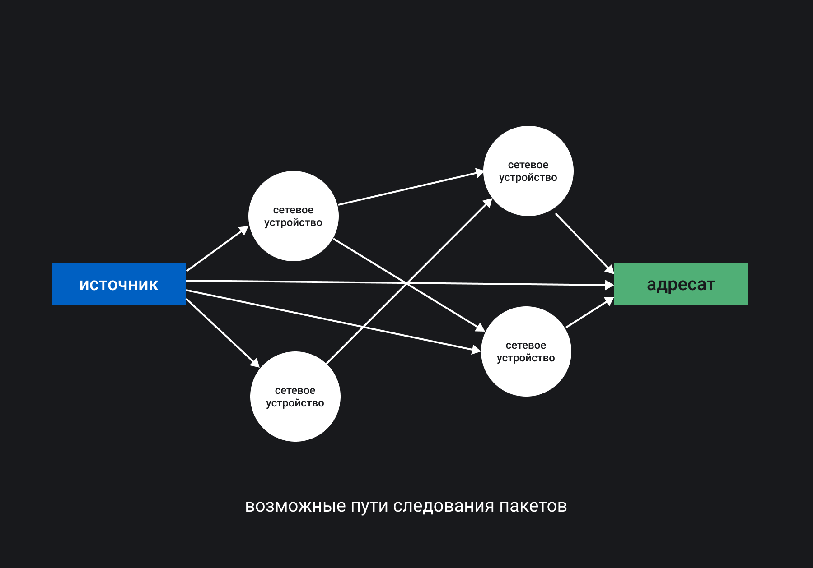

## Кратко

Передача данных в компьютерных сетях происходит благодаря протоколам. Протокол — это набор правил, по которым работают все сетевые устройства. Сетевыми устройствами могут быть компьютеры, маршрутизаторы, концентраторы, сетевые шлюзы, файерволы, точки доступа и прочие. Данные от одного сетевого устройства к другому передаются пакетами, размер и состав которых определяется конкретным протоколом.

У сетевого устройства обязательно есть адрес. Сеть устроена так, что пакеты постоянно пытаются найти сетевое устройство с целевым адресом. На сетевом устройстве можно прописать правила о том, что нужно делать c пакетами, как их обрабатывать или куда отправлять дальше по сети. Эти правила определяются настройками сетевой службы. Сетевая служба — это специальное приложение, иногда включённое в состав операционной системы, которое позволяет другим приложениям пользоваться [сетевыми сервисами](https://ru.wikipedia.org/wiki/Сетевые_сервисы). Сетевые сервисы — это набор функций устройств, которыми можно воспользоваться через сеть. Например, сервис печати или сервис обмена файлов с файловым хранилищем.

Допустим, нам нужно передать файл по сети. На источнике файл разбивается на пакеты. Пакеты отправляются через сетевое соединение. Каждый пакет ищет целевое сетевое устройство самостоятельно. Когда пакеты попали на него, они собираются в файл.

## Как понять

Чтобы работать с сетью, необходимо представлять себе, как работает сетевой протокол. Например, чтобы отобразить страницу в браузере, нужно задействовать протокол [HTTP](https://developer.mozilla.org/ru/docs/Web/HTTP). Это протокол прикладного уровня (согласно модели [OSI](https://ru.wikipedia.org/wiki/Сетевая_модель_OSI)), который позволяет передавать данные между клиентом и сервером, как показано на рисунке:

<aside>

📚 Протокол HTTP и модель OSI подробно описаны в статьях:

1. «[Протокол HTTP](/tools/http-protocol/)».
1. «[Модель OSI](/tools/network-models/)».

</aside>

Разберём примерный сценарий работы протокола HTTP:

1. Пользователь набирает адрес страницы (имя домена и внутренний путь на сайте) в адресной строке браузера и запускает загрузку страницы.
1. Браузер обращается к сетевой службе на компьютере и формирует сетевой запрос. Запрос состоит из текстовой информации о целевой странице.
1. Запрос разбивается на пакеты и отправляется путешествовать по сети Интернет. Адресом целевого сетевого устройства будет ближайший [DNS-сервер](https://ru.wikipedia.org/wiki/DNS) (DNS — Domain Name System). DNS-сервер — это специальный сервер, который знает, на каких сетевых адресах расположен сайт.
1. DNS-сервер меняет адрес целевого сетевого устройства на адрес сервера, на котором расположен запрашиваемый пользователем сайт, и отправляет пакеты дальше по сети.
1. Запрос в виде пакетов доходит до сетевой службы сервера, собирается из пакетов и обращается к веб-серверу.
1. Веб-сервер по запросу от пользователя формирует ответ — запрашиваемую HTML-страницу.
1. HTML-страница и информация об адресе компьютера пользователя отдаются сетевой службе, которая разбивает всё на пакеты и отправляет в сеть.
1. Сетевая служба пользователя принимает набор пакетов с HTML-страницей, объединяет их в один файл и отдаёт браузеру.
1. Браузер отображает HTML-страницу. Ресурсы этой страницы (шрифты, картинки, видео, стили, JavaScript) догружаются по похожей схеме.

### Работа сетевых устройств

У каждого сетевого устройства есть собственный сетевой адрес. В Интернете это [IP-адрес](https://ru.wikipedia.org/wiki/IP-адрес) (Internet Protocol — межсетевой протокол). Благодаря этому протоколу пакеты, которые отправляются по сети, находят наиболее короткий путь от источника к адресату.

Кроме IP-адреса используются ещё и [порты](https://ru.wikipedia.org/wiki/Порт_(компьютерные_сети)). Порт — это число, которое обозначает номер соединения. Порт необходим для того, чтобы определить программу или драйвер устройства в сети, которые будут обрабатывать пришедший пакет или отсылать исходящий. Количество портов ограничено и находится в диапазоне от 1 до 65 535.

Для передачи пакетов от одного сетевого устройства к другому в Интернете используются протоколы транспортного уровня, которые делятся на две группы: с проверкой целостности данных и без неё.

Протоколы с проверкой целостности данных используются для передачи веб-страниц или файлов. Они проверяют целостность данных, запрашивают утерянные пакеты или пакеты, в которых была найдена ошибка. Самые распространённые — [TCP](https://ru.wikipedia.org/wiki/Transmission_Control_Protocol) (Transmission Control Protocol — протокол управления передачей) и [TLS](https://ru.wikipedia.org/wiki/TLS) (Transport Layer Security — протокол защиты транспортного уровня).

Протоколы без проверки целостности используются для передачи видео или аудио, потому что они позволяют передавать больше данных, но с потерями. Пример такого протокола — это [UDP](https://ru.wikipedia.org/wiki/UDP) (User Datagram Protocol — протокол пользовательских датаграмм), который не обращает внимания на утерянные пакеты или пакеты с ошибками.

Пары TCP/IP, TLS/IP или UDP/IP обеспечивают передачу пакетов между сетевыми устройствами и обычно называются стеками протоколов передачи данных. В современных операционных системах служба для работы с пакетами, адресами и портами часто реализуется на уровне ядра. Правила же обработки пакетов можно настраивать.

### Работа с данными на уровне приложений

В адресной строке браузера вы наверняка видели буквы _http_ или _https_. Это протоколы прикладного уровня, которые описывают уже не пакеты и адреса сетевых устройств, а правила формирования набора данных для передачи того или иного формата. Часто _http_ ассоциируется с небезопасным сайтом, многие браузеры сообщают нам об этом.

Применение HTTPS внесло ряд новых правил обработки данных, которые отныне не должны передаваться в открытом виде, а должны шифроваться. В протоколе HTTP используется TCP в качестве транспортного протокола, который совсем никак не защищает данные. Если подключиться к одному из сетевых устройств, через которое проходят пакеты, то можно прочитать их содержимое. Протокол HTTPS использует другой протокол транспортного уровня — TLS, который подразумевает шифрование пакетов. Данные пользователя передаются в зашифрованном виде.

<aside>

📚 Подробнее о том, как защитить пользователей веб-приложений, читайте в статье [«Безопасность веб-приложений и распространённые атаки»](/tools/web-security/).

</aside>

Браузер — это одно из приложений на компьютере. Он использует один или несколько сетевых портов для отправки данных на сервер и их получения через протоколы HTTP/HTTPS, UDP и другие. Так же работает и почтовый клиент, только по другим протоколам — IMAP, POP3, SMTP. Мессенджеры тоже используют определённые протоколы для обмена сообщениями, и эти протоколы активно развиваются. Некогда популярные протоколы ICQ и IRQ сменились мессенджерами на основе протокола XMPP (прежнее название Jabber). Протоколы прикладного уровня лишь определяют формат передаваемых данных.

### Сетевая служба и сетевые сервисы

Сетевая служба организует передачу данных на уровне операционной системы. Она обеспечивает создание соединения (сокета) для сетевого сервиса и привязку его к определённому порту. После того как такое соединение создано, сетевая служба посылает все пакеты от сервиса или к сервису через указанный порт. Сетевые сервисы — это конкретные приложения, службы, демоны, которые работают в качестве поставщика данных: веб-серверы, серверы для обмена электронной почтой, серверы сообщений для мессенджеров, FTP-серверы, VPN-серверы, серверы для IP-телефонии и прочее.

Например, в браузере для передачи веб-страниц через протокол HTTPS по умолчанию используется порт 443, то есть _https://example.com_ и _https://example.com:443_ эквивалентны. Поэтому браузер подставляет _:443_, даже не отображая это в интерфейсе. Порт даёт понять сетевой службе на сервере, какой сервис будет использоваться для обработки данных, которые приходят в виде пакетов.

[Существуют стандарты](https://www.iana.org/assignments/service-names-port-numbers/service-names-port-numbers.xhtml) от [IANA](https://ru.wikipedia.org/wiki/IANA) (Internet Assigned Numbers Authority — «Администрация адресного пространства Интернет»), в которых описаны номера портов и соответствующие им сетевые сервисы. В стандартах также описаны диапазоны адресов, которые можно использовать для любых задач. Например, локальные веб-серверы запускают на порте 8080 или 8000.

В большинстве операционных систем в терминале работает команда [`netstat -an`](https://ru.wikipedia.org/wiki/Netstat), с помощью которой можно узнать информацию о текущем состоянии сетевой службы. В выводе этой команды будет отображена таблица со всеми открытыми на данный момент соединениями с указанием протокола передачи данных, состояния этого соединения, IP-адресов и портов источника и адресата.

Пару IP-адресов источника и адресата с указанием соответствующих сетевому сервису портов называют маршрутом. Статические маршруты обычно прописаны в настройках сетевой службы, а динамические формируются с помощью специальных протоколов маршрутизации. На основе маршрутов, сформированных на сетевых устройствах, пакеты и находят адресата, IP-адрес целевого сервера, компьютера пользователя, любого устройства в Интернете.

<aside>

📚 В этой статье рассматриваются не все инструменты для работы с сетевым окружением. Существуют утилиты для анализа трафика, мониторинга состояния сетевых интерфейсов. Для быстродействия веб-приложения важен детальный анализ не только структуры сети, но и пакетов, которые передаются по сети. Инструменты для проведения такого анализа рассмотрены в статье [«Протоколы TCP/UDP»](/tools/tcp-udp-protocols/).

</aside>
