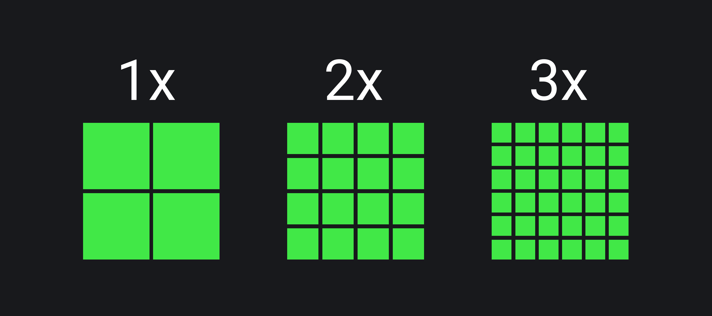
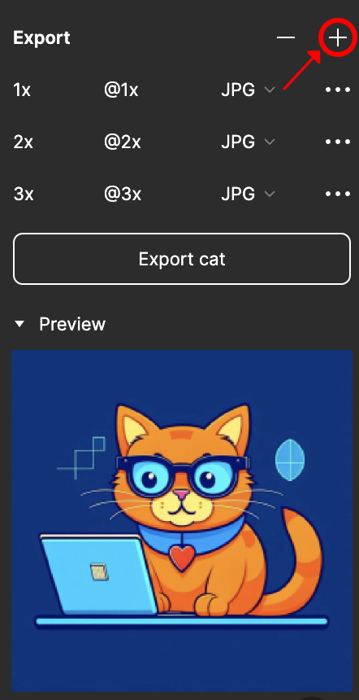
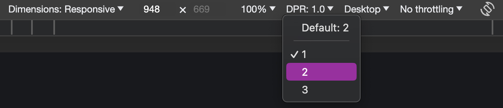

## Кратко

Чёткость изображений на экранах устройств зависит от такого параметра, как плотность пикселей. Каждый пиксель на экране может изменять цвет и/или прозрачность. В совокупности это создаёт полноценное изображение, которое видит пользователь. Количество пикселей на квадратный дюйм матрицы называется **плотностью экрана** — PPI (pixels per inch, пиксели на дюйм).

Чем выше значение PPI, тем более чёткое изображение увидит пользователь. При низкой плотности пикселей можно заметить зернистость на изображении, а при высокой — рассмотреть больше деталей.

Значение PPI отличается для различных видов устройств. Высокая плотность пикселей критически важна для одних, другие могут обходиться меньшей плотностью. Это зависит от расстояния между глазами пользователя и устройством. Устройства, находящиеся ближе к пользователю, должны иметь более высокую плотность пикселей, чтобы изображение было максимально чётким. Из-за этого у смартфонов самая высокая плотность пикселей, а у телевизоров — меньшая.

<iframe title="Пример двух изображений с разной плотностью пикселей" src="demos/different-images/" height="540"></iframe>

## Что такое Retina-дисплей

**Retina-дисплей** — это термин, который придумала компания Apple для описания экранов с высоким расширением, которые обеспечивают высокую плотность пикселей. Такие дисплеи используют в разных устройствах Apple — iPhone, iPad и MacBook. Впервые Retina-дисплей был представлен в 2011 году Стивом Джобсом. По его словам такой экран обеспечивает плотность пикселей, при которой человеческий глаз перестаёт замечать, что изображение состоит из отдельных точек. Благодаря этому у Retina-дисплеев чёткое и реалистичное изображение, а ещё высокие качество графики и читаемость текста.

Retina — маркетинговое название. Такие экраны использует только в устройствах Apple. Сейчас другие компании также производят экраны с высокой плотностью пикселей. Обычно их называют **экранами с увеличенной плотностью пикселей**. Далее, говоря о Retina-дисплеях, будем подразумевать и экраны с увеличенной плотностью пикселей.

## Какие бывают пиксели?

Чтобы понять, как экраны с увеличенной плотностью пикселей влияют на вёрстку страниц, разберёмся с понятием пикселя и его видами.

**Пиксель** — это минимальный неделимый элемент из которого состоит изображение на экране монитора.

Вместе пиксели образуют изображение, которое видят пользователи. Чем больше пикселей на единицу площади, тем качественнее изображение. Параметр PPI зависит от разрешения экрана монитора и его матрицы. По этой причине пиксель — относительная единица измерения. Обычно такие пиксели называют _физическими_.

**Плотность пикселей** — это количество физических пикселей на экране устройства. Например, когда говорим, что ширина экрана 1000px, подразумеваем, что по всей ширине находится 1 000 неделимых ячеек.

В CSS, наоборот, пиксели являются [абсолютной величиной](/css/numeric-types#absolyutnye-velichiny) и не всегда равны физическому пикселю. **CSS-пиксели** — абстрактная величина, которую браузеры использут для точного отображения содержимого на страницах, вне зависимости от экрана.

В современной разработке в основном используют три категории плотности:

1. Нормальная плотность пикселей (обозначается как 1x) — соответствует типичным экранам, где один CSS-пиксель равен одному физическому пикселю на дюйм. Например, у большинства настольных мониторов и ноутбуков плотность пикселей равна примерно 96 PPI или [1/96 дюйма](/css/numeric-types#absolyutnye-velichiny).
1. Высокая плотность пикселей (2x) — используется для экранов с повышенной плотностью пикселей, таких как Retina-дисплеи. В этом случае один CSS-пиксель равен четырём физическим пикселям (два по горизонтали и два по вертикали) на дюйм. Плотность пикселей составляет около 192 PPI.
1. Очень высокая плотность пикселей (3x) — используется для некоторых мобильных устройств с экранами с высоким разрешением. Здесь один CSS-пиксель равен девяти физическим (три по горизонтали и три по вертикали) на дюйм. Плотность пикселей равна примерно 288 PPI.

Плотность пикселей может быть и выше, но человеческий глаз уже не может это различить.


Разница в количестве пикселей при различной плотности.

На предыдущем изображении заметите, что, при одинаковом размере изображений, в первом случае у нас меньшее количество пикселей. Из-за этого такие изображения менее детализированные.

Стоит упомянуть ещё о **растровых пикселях**. Это самые маленькие части, составляющие растровое изображение. Например, форматы PNG, BMP или GIF. Каждый пиксель содержит информацию о цвете и о расположении в системе координат изображения. В некоторых форматах пиксель может содержать дополнительную информацию, например, прозрачность. Когда готовите изображения для экранов с высокой плотностью пикселей, это важно учитывать.

## Подготовка и оптимизация изображений

Вся растровая графика состоит из пикселей. Их количество определяется при создании изображения и после не изменяется. Так что, при увеличении такой картинки, её качество ухудшается: она становится «зернистой».

Рассмотрим пример:

```html

```

На обычных экранах такое изображение займёт область 128×128 физических пикселей, а на Retina-дисплеях — 256×256. Если изображение подготовлено с расширением 128×128 пикселей, то для Retina-дисплеев оно будет увеличено и станет зернистым. Из-за этой особенности при оптимизации вёрстки под Retina-дисплеи основной упор делается именно на подготовку и добавление растровой графики.

Графику рекомендуют готовить как минимум для двух типов экранов. Одна для обычных дисплеев, вторая для дисплеев с увеличенной плотностью пикселей. Например, можете экспортировать графику с коэффициентом увеличения плотности пикселей в Figma. Для этого перейдите в меню экспорта изображений, нажмите на кнопку с крестиком «Добавить» и в выпавшем списке выберите нужный коэффициент. Пример того, как это сделать, на скриншоте ниже. В Figma можете не только выбрать коэффициент плотности, но и добавить к картинкам разные суффиксы и выгрузить их в разных форматах.


Экспорт изображений в Figma.

Есть несколько способов оптимизации изображений для экранов с высокой плотностью пикселей. У них есть сильные и слабые стороны, а выбор подходящего зависит от требований проекта, доступных ресурсов и ограничений. Рассмотрим каждый из этих способов подробнее и перечислим достоинства и недостатки.

### Изменение размеров элемента

В этом случае изображение сразу подготавливается в увеличенном формате с большим количеством растровых пикселей и затем уменьшается до нужной величины с помощью атрибутов `width` и `height` у тега [``](/html/img/).

```html

```

Можете также использовать CSS-свойства `width` и `height`:

```css
img {
  width: 128px;
  height: 128px;
}
```

Преимущества:

- чёткое и детализированное изображение на любых устройствах;
- быстрая и лёгкая реализация.

Недостаток — больший вес изображения из-за большой плотности пикселей. В этом случае пользователи с не Retina-дисплеями при загрузке изображений будут скачивать лишние байты или килобайты.

### Медиавыражения

С помощью CSS можно вставлять фоновые изображения. Для этого используют свойства группы [`background`](/css/background/) — [`background-image`](/css/background-image/) и [`background-size`](/css/background-size/). На фон можно вставить только одно изображение.

Медиавыражение [`min-resolution` и `max-resolution`](https://drafts.csswg.org/mediaqueries/#resolution) помогает рассказать браузеру, какое фоновое изображение использовать для экранов с нормальной плотностью пикселей, а какое — на экранах с увеличенной плотностью.

<aside>

👵 Раньше использовали медиавыражение с префиксом `-webkit-min-device-pixel-ratio`. Сейчас это делать избыточно. Подробнее на [MDN](https://developer.mozilla.org/en-US/docs/Web/CSS/@media/-webkit-device-pixel-ratio).

</aside>

```css
.block {
  background-image: url("/images/cat.jpg");
}

@media (min-resolution: 2dppx) {
  .block {
    background-image: url("/images/cat@2x.jpg");
  }
}
```

<iframe title="Вывод фонового изображения при помощи медиавыражений" src="demos/media-query/" height="620"></iframe>

Используйте инструменты разработчика в браузерах, чтобы убедиться, что разные изображения подгружаются для экранов с разной плотностью пикселей. Подробнее об этом чуть позже.

Ещё один способ отображения рахных фоновых картинок — CSS-функция [`image-set`](/css/image-set/). Она позволяет указать несколько вариантов изображения и даёт браузеру возможность самостоятельно выбирать, какое из них показать. Пример того, как с помощью данной функции добавлять изображения с различной плотностью пикселей, найдёте в [статье про `image-set`](/css/image-set/).

Преимущества:

- оптимизация загрузки страницы: используется только одна версия изображения в зависимости от плотности пикселей устройства;
- гибкость при выборе версий изображений для типов экранов экранов.

Недостатки:

- нужно создавать и хранить две или больше версии изображения с разными разрешениями;
- дополнительный CSS-код для управления версиями изображений;
- возможное замедление работы страницы при большом количестве медиавыражений.

### HTML

HTML также влияет на то, какое изображение показывать пользователю. В случае CSS акцент делается на фоновых изображениях, а в HTML — на встроенных в содержимое страницы.

Чтобы загрузить разные картинки для различных устройств прямо в HTML, используйте атрибут [`srcset`](/html/img#srcset) у [``](/html/img/). Просто укажите в атрибуте желаемую плотность, например, 1x/2x/3x, после пути к файлу.

```html

```

Когда загружаете изображения не только с различной плотностью, но и в разных форматах, используйте тег [`<picture>`](/html/picture/). Синтаксис похож на тот, что используют для тега [``](/html/img/).

```html
<picture>
  <source srcset="tiny-cat@1x.jpg 1x, tiny-cat@2x.jpg 2x" media="(max-width: 800px)">
  <source srcset="cat@2x.jpg 2x">
  
</picture>
```

Преимущество — больший контроль за тем, когда и какое изображение загружаете.

Недостаток — больший объём HTML-кода и долгая подготовка изображений.

### Автоматизация процесса

Каждый из описанных выше способов требует большого количества времени на подготовку изображений перед их размещением на сайте:

- подготовить изображения для различных экранов (1х, 2х, 3х);
- перевести их в современные форматы (webp и avif);
- сжать каждое изображение для экономии трафика.

Данные процессы можно оптимизировать с помощью программ или консольных утилит. Одной из наиболее популярных утилит для работы с изображениями является [imagemagick](https://imagemagick.org/index.php). С её помощью возможно выполнить все описанные выше пункты — изменить размеры, формат и качество изображения.

Также можно совмещать несколько различных утилит для автоматизации различных этапов оптимизации, например:

- [jpegoptim](https://github.com/tjko/jpegoptim) для сжатия изображений в формате jpeg;
- [cwebp](https://developers.google.com/speed/webp/docs/cwebp) для конвертации изображений из формата jpeg в webp, а также сжатия изображений;
- [oxipng](https://github.com/shssoichiro/oxipng) для сжатия изображений в формате png.

При работе с такими утилитами часто пишется один общий скрипт, который повторяет операции по оптимизации над большим количеством изображений. Это сокращает количество времени на оптимизацию изображений, но, при этом, даёт усреднённые результаты, особенно при операциях сжатия. Какие-то изображения могут оказаться менее качественными, чем другие. Поэтому результат работы утилит стоит проверять. Если нужен более качественный результат, придётся изменять настройки утилит под конкретные изображения.

Использование консольных утилит можно встроить в процессы сборки вашего приложения перед публикацией на сервер.

Помимо консольных утилит можно встретить инструменты, в которых используется искусственный интеллект. Например, можно воспользоваться следующими для подготовки изображений с различной плотностью пикселей:

- [upscale](https://www.upscale.media/) — есть несколько попыток в день для оптимизации в бесплатной версии;
- [hitpaw](https://www.hitpaw.com/) — приложения для macOS и Windows, есть пробный период;
- [gigapixel](https://www.topazlabs.com/gigapixel-ai) — приложения для macOS и Windows, также есть пробный период.

## Как проверить

Чтобы проверить, какое изображение загружается при различной плотности экрана, используйте инструменты разработчика. Например, в Chrome DevTools в верхней панели можно изменить плотность экрана, 1.0, 2.0 или 3.0, в выпадающем меню DPR. Во вкладке «Сеть» (network) можно посмотреть, какие изображения при этом загружаются. Важно помнить, что после изменении плотности экрана в инструментах разработчика надо перезагрузить страницу.


Инструмент разработчика Chrome.

## Итоги

В современной вёрстке важно учитывать устройства и их плотность пикселей, поэтому стоит тщательнее готовить изображения. Хорошо иметь графику как минимум для двух типов экранов — с нормальной и повышенной плотностью пикселей, а ещё тестировать вашу вёрстку.

И последнее — не забывайте оптимизировать изображения перед тем, как добавить их на сайт. Есть много инструментов сжатия, к примеру, онлайн-сервис [squoosh](https://squoosh.app/).
