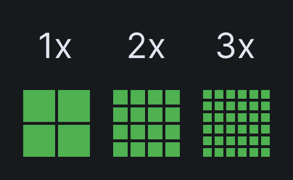

## Кратко

Чёткость изображения экрана любого устройства зависит от такого параметра, как плотность пикселей. Каждый пиксель на экране может изменять свой цвет, и/или прозрачность, что в совокупности создаёт полноценное изображение, которое видит пользователь. Количество пикселей на квадратный дюйм матрицы называется плотностью экрана — PPI (pixels per inch — пиксели на дюйм).

Чем выше значение PPI, тем более чёткое изображение увидит пользователь. При низкой плотности пикселей можно заметить зернистость на изображении, а при высокой, можно рассмотреть больше деталей.

Значение PPI для различных видом устройств будут отличаться. Для одних устройств высокая плотность пикселей критически важна, другие же могут обходиться меньшей плотностью. Во многом это зависит от расстояния между глазами пользователя и устройством. Устройства, находящиеся ближе к пользователю, должны иметь более высокую плотность пикселей, чтобы обеспечить наиболее чёткое изображение. Поэтому смартфоны имеют самую высокую плотность пикселей, в то время как ТВ обычно имеют меньшую.

<iframe title="Пример - два изображения с разной плотностью пикселей при одинаковой ширине и высоте " src="demos/different-images/" height=540></iframe>

## Что такое Retina-экраны

Retina-дисплей - это термин, придуманный компанией Apple для описания экранов с высоким расширением, которые обеспечивают очень высокую плотность пикселей. Они используются в различных устройствах Apple, таких как iPhone, iPad и MacBook. Впервые Retina-дисплей был представлен в 2011 году Стивом Джобсом. По его словам Retina-дисплей обеспечивает такую плотностью пикселей, при которой человеческий глаз перестаёт замечать, что изображение состоит из отдельных точек. Благодаря этому, Retina-дисплеи обеспечивают очень чёткое изображение, высокое качество графики и текста. Они делают изображения более реалистичными, текст более читаемым и интерфейс более качественным.

Retina - это маркетинговое название, используемое только для устройств компании Apple. Но в сейчас, многие крупные бренды также производят экраны с высокой плотность пикселей. Такие экраны обычно называют экранами с увеличенной плотностью пикселей. Далее, говоря о Retina экранах, будем также подразумевать и экраны с увеличенной плотностью пикселей.

## Какие бывают пиксели?

Чтобы понять как экраны с увеличенной плотностью пикселей влияют на разработки HTML страниц, нужно разобраться с понятие пикселя и его видами.

**Пиксель** - это минимальный неделимый элемент, из которого состоит изображение на экране монитора.

Все пиксели вместе образуют видимое пользователем изображение. Чем больше пикселей находится на единицу площади, тем более качественным будет изображение. Параметр PPI, зависит от разрешения экрана монитора и матрицы экрана. По этой причине, пиксель относится к относительным единицам измерения. Такие пиксели обычно называют *физическими*.

**Плотность пикселей** - это количество физических пикселей на экране устройства.

Например, когда мы говорим, что ширина экрана устройства 1000px, то подразумеваем, что по всей ширине находится 1000 неделимых ячеек.

Но в CSS, как известно, пиксели являются [абсолютной величиной](/css/numeric-types#absolyutnye-velichiny) и они не всегда равны физическому пикселю.

**CSS-пиксели** — абстрактная величина, используемая браузерами для точного отображения контента на страницах, вне зависимости от экрана. Они используются для контроля плотности пикселей на разных экранах и устройствах.

В современной разработке в основном используются три категории плотности пикселей:
1. Нормальная плотность пикселей (обозначается как 1x) - соответствует типичным экранам, где один CSS-пиксель равен одному физическому пикселю на дюйм. Например, на большинстве настольных мониторов и ноутбуков плотность пикселей составляет около 96 PPI, или [1/96 дюйма](/css/numeric-types#absolyutnye-velichiny).

2. Высокая плотность пикселей (2x) - используется для экранов с повышенной плотностью пикселей, таких как Retina-дисплеи. В этом случае, один CSS-пиксель будет эквивалентен четырём физическим пикселям (2 по горизонтали и 2 по вертикали) на дюйм. Плотность пикселей составляет около 192 PPI.

3. Очень высокая плотность пикселей (3x) - используется на некоторых современных мобильных устройствах с экранами высокого разрешения. Здесь один CSS-пиксель будет эквивалентен девяти физическим пикселям (3 по горизонтали и 3 по вертикали) на дюйм. Плотность пикселей составляет около 288 PPI.


Разница в количестве пикселей при различной плотности

Посмотрев на изображение выше, можно заметить что при одинаковом размере изображения, в первом случаем мы имеем меньшее количество пикселей. Тем самым такие изображения получаются менее детализированными.

Стоит отметить что плотность пикселей экрана может быть и выше, но человеческий глаз уже будет не в состояние заметить такие тонкости.

Также стоит упомянуть о **растровых пикселях**. Это самые маленькие части, составляющие растровое изображение (PNG, JPF, GIF и т.д.) Каждый пиксель содержит информацию, о цвете и расположении в системе координат изображения. В некоторых форматах пиксель может содержать дополнительную информацию, например, прозрачность. Понимание растровых пикселей будет важно при подготовке изображений для отображения на экранах с высокой плотностью пикселей.


## Подготовка и оптимизация изображений

Вся растровая графика состоит из пикселей, количество которых определяется при создании изображения остаётся неизменным. Поэтому при увеличении такой картинки её качество ухудшается: она становится «зернистой».

Рассмотрим пример:

```html
  
```

Такое изображение на обычных экранах будет занимать область 128x128 физических пикселей, а на Retina-экранах тот же блок получит 256x256 физических пикселей. Если изображение подготовлено с расширение 128x128 пикселей, то для Retina-дисплеев оно будет увеличено, и мы заметим зернистость.

Из-за таких особенностей основной упор при оптимизации вёрстки под Retina-дисплеи делается именно на подготовку и добавление растровой графики.

Графика должна быть подготовлена как минимум для двух вариантов экранов. Один для обычных дисплеев, второй, для дисплеев с увеличенной плотностью пикселей. Такие изображения могут подготовить дизайнеры, предоставим все необходимые изображения. Либо их можно подготовить самостоятельно. Например в Figma можно экспортировать графику с коэффициентом увеличения плотности пикселей. Для этого необходимо перейти в меню экспорта изображений, в правом боковом меню. Затем нажать на иконку добавить, и в появившемся выпадающем меню выбрать соответствующий коэффициент. Пример того, как это сделать показан на рисунке ниже. Вы можете выбрать с каким коэффициентом плотности пикселей скачать изображение, добавить к нему необходимый суффикс, а также выбрать нужный формат изображения.


Экспорт изображений с различной плотностью пикселей

Теперь, зная как подготовить изображения, перейдём к тому как их добавить в код.

Существует несколько способов оптимизации изображений для отображения на экранах с высокой плотностью пикселей. Рассмотрим каждый из них подробнее и выделим его достоинства и недостатки.

### С помощью изменения размеров элемента

В этом случае изображение сразу подготавливается в увеличенном формате (с большим количеством растровых пикселей) и затем с помощью атрибутов `width` и `height` тега [``](/html/img/), данное изображение уменьшается до необходимого.

```html
  ...
  
  ...
```

Либо, можно воспользоваться CSS свойствами `width` и `height`:

```css
  .img {
    ...
    width: 128px;
    height: 128px;
    ...
  }
```

Преимущества:
- чёткое и детализированное изображение, практически на любых устройствах;
- быстрая и лёгкая реализация.

Недостатки:
- больший вес изображения - так как изображение имеет большую плотность пикселей, то и его размер будет больше. В этом случае пользователи с не Retina-дисплеями будут скачивать лишние байты (или килобайты) при загрузке изображений.

### С помощью CSS и медиа выражений

С помощью CSS можно вставлять на сайт фоновые изображения. Для этого используется свойства группы [`background`](/css/background/), такие как [`background-image`](/css/background-image/) и [`background-size`](/css/background-size/).

Но такая вставка позволяет использовать только одно изображение в качестве фона. Для того чтобы сказать браузеру что для экранов с нормальной плотностью пикселей необходимо использовать одно изображение, а для экранов с увеличенной плотностью другое, используется медиа выражение [`min-resolution`/`max-resolution`](https://drafts.csswg.org/mediaqueries/#resolution).

_В старом коде можно встретить использование Webkit медиа выражения `-webkit-min-device-pixel-ratio`, но сейчас его использование выглядит избыточным, более подробную информацию можно узнать на [MDN](https://developer.mozilla.org/en-US/docs/Web/CSS/@media/-webkit-device-pixel-ratio)_.

```css
  .block {
    background-image: url("/images/cat.jpg");
  }

  @media (min-resolution: 2dppx) {
    .block {
      background-image: url("/images/cat@2x.jpg");
    }
  }
```

<iframe title="Пример - вывод фонового изображения при помощи медиа выражений" src="demos/media-query/" height=620></iframe>

Для того чтобы убедиться что для экранов с разной плотностью пикселей подгружаются различные изображения, необходимо воспользоваться инструментами разработчика Chrome. Более подробно от этом будет рассказано [далее](/tools/pixel-density#kak-proverit).

Ещё один способ отображение различных фоновых изображений — использовать CSS-функцию [`image-set`](/css/image-set/). Эта функция позволяет указать несколько вариантов изображения и предоставляет браузеру возможность самостоятельно выбирать, какое из них показать пользователю. Демонстрацию того как с помощью данной функции грузить изображения с различной плотностью пикселей можно найти внутри [статьи](/css/image-set/).

Преимущества:
- оптимизация загрузки страницы: используется только одна версия изображения в зависимости от плотности пикселей устройства;
- гибкость в выборе различных версий изображений для разных экранов.

Недостатки:
- необходимость создания и хранения двух или более версий изображений с разным разрешением;
- дополнительный код CSS для управления различными версиями изображений;
- потенциальное замедление работы страницы при большом количестве медиа-запросов.

### С помощью HTML

Используя современные возможно HTML также можно влиять на то, какое изображение будет показано пользователю. Если в случае с CSS акцент делался на фоновые изображение, то в случае HTML акцент сдвигается на контентные изображения.

Для того чтобы загрузить для различных устройств, различные изображения, можно воспользоваться атрибутом [`srcset`](/html/img#srcset) тега [``](/html/img/). Для этого внутри данного атрибута после указания пути к файлу необходимо указать желаемую плотность, например, 1x/2x/3x и т.д.

```html
  
```

Также в случае если необходимо загрузить изображения не только с различной плотность, но и в различных форматах, можно воспользоваться тегом [`<picture>`](/html/picture/). Синтаксис будет аналогичен тому что использовался и для тега [``](/html/img/).

```html
  <picture>
    <source srcset="tiny-cat@1x.jpg 1x, tiny-cat@2x.jpg 2x" media="(max-width: 800px)">
    <source srcset="cat@2x.jpg 2x">
    
  </picture>
```

Преимущества:
- больший контроль за тем, когда и какое изображение необходимо загружать;

Недостатки:
- больший объем HTML кода, и предварительной работы по подготовке изображений.

Все эти подходы имеют свои сильные и слабые места, и выбор наиболее подходящего зависит от конкретных требований проекта, доступных ресурсов и ограничений.

## Как проверить

Для того чтобы проверить какое изображение загружается при различной плотности экрана, можно воспользоваться инструментами разработчика в браузере. Например, в Chrome DevTools на верхней панели можно изменить плотность экрана, воспользовавшись выпадающим меню DPR: 1.0, 2.0 или 3.0. А во вкладке «Сеть» или Network можно посмотреть, какие изображения при этом загружаются. Важно помнить, что после изменении плотности экрана в инструментах разработчика необходимо перезагрузить страницу.


Изменение плотности экрана в инструментах разработчика Google Chrome

## Итоги
В современной вёрстке необходимо учитывать, то что пользователи используют устройства с различной плотностью пикселей, поэтому важно тщательно подходить к вопросу подготовки и отображения визуального контента, а именно изображений.
Необходимо готовить изображения как минимум для двух типов экранов - с нормальной и повышенной плотностью пикселей. А также не забывать о тестировании полученной вёрстки.

## Подсказки
💡 Не забывайте оптимизировать изображение перед тем как добавлять их на сайт. Для этого можно воспользоваться различными инструментами сжатия, например онлайн-сервисом [squoosh](https://squoosh.app/).
