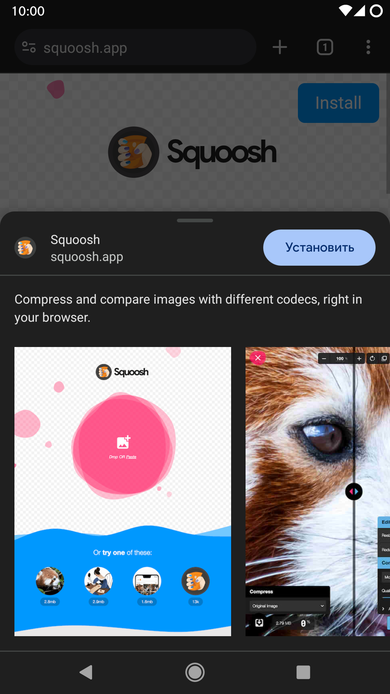
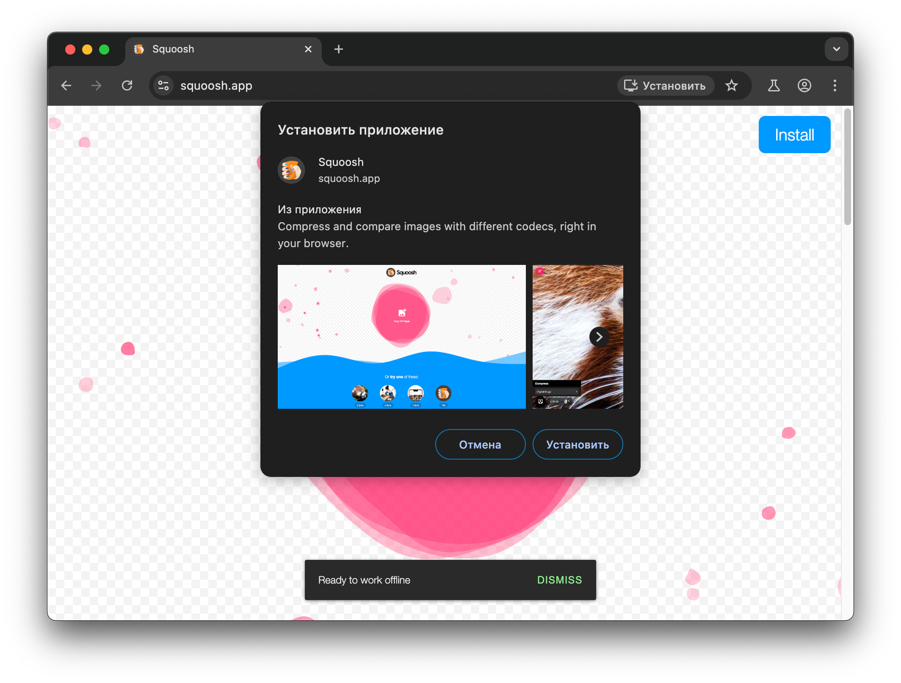

## Определение

PWA — это аббревиатура, образованная от словосочетания на английском языке Progressive Web Applications, которая переводится на русский язык как "прогрессивные веб-приложения".

Есть 3 подхода к определению прогрессивных веб-приложений.

### Обывательское

Это определение можно использовать, когда нужно объяснить, что такое прогрессивные веб-приложения, человеку, который не является веб-разработчиком.

PWA — это такие сайты, которые можно добавить в виде иконки на главный экран или рабочий стол, и при запуске их с этой иконки они будут выглядеть и работать неотличимо от нативных приложений, то есть запускаться в специальном, так называемом автономном режиме (англ. standalone mode), в котором нет адресной строки и других элементов интерфейса браузера, работать без доступа к интернету, получать push-уведомления и т.д.

### Официальное (каноническое)

Это определение является официальным.

PWA — это веб-приложения, которые применяют стратегию прогрессивного улучшения (англ. progressive enhancement), то есть проверяют, поддерживает ли браузер те или иные Web API, и если да, то могут их использовать, чтобы обеспечить пользовательский опыт наравне с нативными приложениями. Отсюда и название — *прогрессивные* веб-приложения.

  
🤓 Комментарий автора

  Как видно, в этом определении ничего не говорится о конкретном перечне свойств (необходимых требований) и признаков (достаточных требований) к веб-приложениям, например, требовании обязательно предоставлять пользователям возможность добавлять иконку на главный экран или рабочий стол, способности обязательно работать без доступа к интернету и т.д.

  Действительно, если прогрессивное веб-приложение не устанавливать, а просто использовать во вкладке браузера, оно не перестанет быть прогрессивным. Пользователь продолжит получать другие преимущества, которые предоставляют PWA, например, получать push-уведомления, получать доступ к аппаратным сенсорам устройства (камере, микрофону, Bluetooth, USB, NFC, GPU и др.) и т.д. Одно из преимуществ PWA как раз и заключается в том, что они не требуют установки.

  Если же прогрессивное веб-приложение не способно работать без доступа к интернету, но при этом в других аспектах обеспечивает пользовательский опыт наравне с нативными приложениями, оно не перестаёт быть прогрессивным. Во-первых, далеко не каждое нативное приложение способно корректно работать без доступа к интернету. А во-вторых, далеко не каждому приложению это нужно. Например, приложение для видеозвонков, запущенное без доступа к интернету, в целом бесполезно.

  То есть каждый критерий не является обязательным.

  Таким образом почти любое веб-приложение можно формально считать PWA.

  PWA — это просто удобный маркетинговый зонтичный термин, чтобы одним коротким словосочетанием описать подход к созданию веб-приложений, набор лучших практик и технических требований к веб-приложениям, и веб-разработчики могли понимать, о чём идёт речь.

### Техническое

PWA — это сайты, формально удовлетворяющие определённым техническим критериям.

Критерии у каждого браузера на каждой платформе могут быть различны и меняться со временем.

У браузеров на основе Chromium это:

* Использование защищённого соединения HTTPS.
* Наличие [манифеста веб-приложения](https://web.dev/learn/pwa/web-app-manifest) ([специального файла](https://web.dev/articles/add-manifest) в формате JSON, в котором указаны название приложения, описание приложения, ссылка на как минимум одну растровую иконку с разрешением не ниже 512x512px или векторную иконку в формате SVG).

Ранее браузеры на основе Chromium требовали также наличия service worker (специального файла JavaScript, который работает в фоновом режиме независимо от веб-страницы, даже если вкладка или браузер закрыты). Он позволяет выполнять такие задачи, как получение push-уведомлений, фоновая синхронизация, перехват и обработка сетевых запросов, что как раз и позволяет реализовать кеширование и работу без доступа к интернету.

Если сайт удовлетворяет этим критериям, то при открытии такого сайта в браузерах на основе Chromium браузер предложит установить этот сайт как приложение.

Другие браузеры, например, Safari и Firefox, самостоятельно не предлагают пользователю установить PWA.

<!-- TODO: загрузить изображение -->

### История появления

Термин был придуман в 2015 году инженером Google [Алексом Расселом](https://twitter.com/slightlylate) и его супругой [Фрэнсис Берримэн](https://twitter.com/phae) и впервые публично упомянут в статье [Progressive Web Apps: Escaping Tabs Without Losing Our Soul](https://infrequently.org/2015/06/progressive-apps-escaping-tabs-without-losing-our-soul/).

Идея PWA не нова — главные концепции были заложены и реализованы еще в Palm webOS, Firefox OS и ChromeOS, где все приложения по сути являются веб-приложениями.

Еще в 2007, за 18 дней до выхода первого iPhone, Стив Джобс [сформулировал](https://youtu.be/ZlE7dzoD6GA) идею приложений, которые создаются с использованием веб-технологий и доставляются через сеть. App Store изначально не планировался, а в течение первого года существования устройства не был доступен SDK для создания нативных приложений.

Apple принципиально не использует термин Progressive Web Apps, а использует свой собственный термин Home Screen Web Apps.

У PWA есть одобренный сообществом [логотип](https://github.com/webmaxru/progressive-web-apps-logo).

Впервые на то, что у технологии нет своего логотипа в мае 2017 года обратил внимание [Максим Сальников](https://twitter.com/webmaxru) и через Twitter [организовал](https://twitter.com/webmaxru/status/867369157565853696) на GitHub [конкурс на лучшее лого](https://github.com/webmaxru/progressive-web-apps-logo/issues/3). Народным голосованием победил логотип от [Диего Гонзалеза](https://twitter.com/diekus). В то время он был DevRel'ом команды Samsung Internet — одного из самых популярных браузеров для мобильных устройств в Азии, сейчас Диего — DevRel команды браузера Microsoft Edge.

А ещё Диего — [автор](https://lists.w3.org/Archives/Public/public-immersive-web-wg/2019Jul/0002.html) логотипа WebXR API, который неразрывно связан с PWA.

## Преимущества PWA

### Настоящая кроссплатформенность

PWA работают на устройствах любого форм-фактора, на любой архитектуре и ОС, где есть браузер и доступ в интернет. Они запускаются на любых устройствах от носимой электроники до телевизоров, от VR/AR-очков до самых немыслимых устройств вроде умных зеркал.

А единая кодовая база снижает стоимость разработки и поддержки.

### Нативное поведение

PWA выглядят и работают как нативные приложения:
* запускаются через иконку на главном экране,
* глубоко интегрируются в операционную систему (могут запускаться при старте ОС, могут быть зарегистрированы как обработчики определённых URI, расширений файлов и MIME-типов),
* могут получать push-уведомления,
* могут работать без доступа к интернету,
* могут получать доступ к аппаратным сенсорам устройства, таким как камера, микрофон, Bluetooth, USB, NFC, GPU и др.

### Не требуют установки и обновлений

Чтобы воспользоваться PWA, достаточно посетить сайт. Необходимый для работы код при первом запуске помещается в кэш, который автоматически обновляется в фоновом режиме.
### Меньший размер

PWA сами не реализовывают API — они лишь вызывают API, уже реализованные в браузере. При запуске они загружают необходимый минимум, а всё остальное подгружают по мере необходимости.

### Децентрализованность, открытость и независимость

Веб — самая крупная платформа, больше, чем все остальные платформы вместе взятые, так как на них есть браузеры. Чтобы распространять PWA не нужны магазины приложений, которые навязывают свои правила. Но при желании PWA можно упаковать в легковесную нативную оболочку и опубликовать в Google Play, App Store и других магазинах.

### Все преимущества веб-платформы "из коробки"

PWA — это сайт, а значит весь контент индексируется поисковиками.

У каждой страницы есть URL, который можно скопировать и поделиться. Причём можно поделиться ссылкой на конкретный абзац и даже на конкретный фрагмент текста на странице. Вот такой вот deep linking "из коробки".

Также пользователь может:
* выделять и копировать любой текст на экране,
* переводить текст на другой язык,
* изменять масштаб страницы,
* открывать одно и то же веб-приложение в нескольких вкладках или окнах,
* распечатывать страницу,
* изменять внешний вид и поведение страниц с помощью расширений браузера, например вырезать рекламу и много чего еще.

### Безопасность

Код PWA выполняется в песочнице браузера, а для его загрузки и передачи данных используется безопасное соединение HTTPS.

Также веб-приложения используют более защищенную модель разрешений. Например, в отличие от нативных Windows- и Android-приложений, PWA запрашивают у пользователя разрешение на получение push-уведомлений, доступ к NFC и так далее.

### Низкий порог входа

Для написания PWA не нужно изучать проприетарные SDK, достаточно знать HTML, JS, CSS. Для разработки, например, в отличие от разработки для iOS, не требуется определённое оборудование. Можно даже обойтись без IDE и компилятора. Код HTML, JS, CSS интерпретируется и может быть отлажен прямо в браузере.

Если у вас уже есть веб-приложение или сайт, можно постепенно внедрять различные Web API.

### Обратная совместимость

Самый первый в мире сайт до сих пор открывается и работает. А все новые Web API разрабатываются с учётом обратной совместимости.

## Недостатки PWA

Некоторые преимущества также могут являться и недостатками.

### Децентрализованность

Прогрессивные веб-приложения используют децентрализованную модель распространения. На данный момент нет какого-либо достаточно крупного известного каталога/магазина прогрессивных веб-приложений, где пользователи могли бы ознакомиться с описанием, скриншотами, оценками и отзывами других пользователей до запуска PWA.

### Неодинаковая поддержка на различных платформах

Например, в iOS все браузеры (Chrome, Firefox и др.) вынуждены вместо своего собственного движка (Blink, Gecko и др.) использовать движок WebKit, используемый браузером Safari, который либо не поддерживает некоторые Web API, либо поддерживает их частично.
