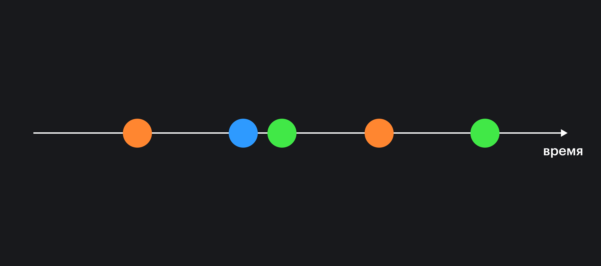

## Кратко

Реактивность – это способ автоматически обновлять систему в зависимости от изменения [потока данных](/tools/architecture-data-flow/).

Поток данных – любая последовательность событий из любого источника, упорядоченная во времени. Например, в кейлогере — приложении, которое записывает нажатие клавиш на клавиатуре, потоком данных будут сигналы нажатия клавиш.

Реактивное программирование – парадигма в программировании, в которой программа больше сосредоточена на управлении потоками данных, таким образом описывая взаимосвязи между ними.

## Что такое реактивность?

Давайте вспомним, как пользователь представляет себе работу с интерфейсом. Мы ожидаем, что интерфейс будет мгновенно *реагировать* на наши действия. Начали вводить текст, он сразу же появляется в поле. Нажали на кнопку, форма тут же изменилась, появились лоадеры, а затем выпрыгнуло радостное сообщение об успехе. С точки зрения пользователя реактивность – это мгновенная реакция на его действия.

Для разработчика этот термин имеет немного другое значение. Когда речь заходит о реактивности, фокус смещается на данные. Для примера напишем код, чтобы сложить два числа:

```js
let a = 3
let b = 4

const sum = a + b

console.log(sum)
// 7
```

В переменной `sum` теперь хранится сумма чисел, и мы знаем, что она никогда не изменится. Если изменить значения переменных `a` и `b` после сложения, это уже не повлияет на результат:

```js
// ...продолжение предыдущего примера

// Меняем значения слагаемых
a = 10
b = 8

console.log(sum)
// Все еще 7
```

Чтобы получить новую сумму, нужно заново сложить эти числа. Кажется, что все логично, но что, если эти числа вводит пользователь, и они могут меняться? В таком случае было бы удобнее, если бы программа могла самостоятельно обновлять значение.

```js
// ☝️ это псевдокод, настоящий код так не работает!
let $a = 3
let $b = 4

const $sum = a + b
console.log($sum)
// 7

$a = 2
$b = 9
console.log($sum)
// 11

$a = -4
console.log($sum)
// 5
```

Пример выше ненастоящий, он не будет работать таким образом, но он даёт возможность понять, какую проблему может решать реактивность.

Во фронтенде мы можем связать любое изменение в интерфейсе с изменениями данных внутри программы. Реактивность с точки зрения фреймворков – это обновление интерфейса на основе изменений состояния.

В реактивности данные часто представляются в виде потока – последовательности событий, упорядоченной по времени.



Поток данных можно начать обрабатывать в любой момент времени, и все новые события могут быть обработаны. Таким образом, реактивность – это удобный способ синхронизировать данные, например, с интерфейсом, который видит пользователь. Реактивность помогает сосредоточиться на данных, как они связаны между собой, что гораздо ближе к бизнес-логике.

## Типы реактивности

Основная идея реактивности строится на [паттерне «Наблюдатель» (Observer)](/tools/architecture-and-design-patterns/). Это [поведенческий паттерн проектирования](/tools/design-patterns-behaviorial/), который создаёт механизм подписки, позволяющий другим следить и реагировать на события, происходящие в источнике. А вот в какой момент подписчики узнают об обновлениях, зависит от типа реактивности. Она бывает двух типов: *push* и *pull*.

### Push-реактивность

Когда в реактивной системе по методу *push* происходит изменение, она самостоятельно проталкивает (от англ. *push* – «толкать») это изменение всем подписчикам. При таком типе реактивности все подписчики будут получать актуальные изменения сразу, как только они произошли.

Если мы подписываемся на событие (например, [клик](/js/element-click/)), то браузер сразу же уведомит всех подписчиков, когда оно случится.

```js
document.addEventListener('click', () => {
  console.log('Я среагировал на клик!')
})
```

<aside>

🦄 В реальном мире можно подписаться на уведомления в приложении. Когда случится обновление, мы получим на телефон push-уведомление.

</aside>

В экосистеме JavaScript самый популярный способ использовать push-реактивность — это использовать библиотеку [RxJs](https://rxjs.dev/).

```js
// создаем источник
const $clicks = Rx.Observable.fromEvent(document, 'click')

$clicks.subscribe(event => {
  console.log('Я среагировал на клик реактивно!')
})
```

Недостатком push-реактивности могут быть повторяющиеся вычисления, так как при изменении данных все подписчики могут заново проделывать свою работу с этими данными. Это может быть проблемой при частых обновлениях, когда система может быть просто завалена большим потоком данных, а все подписчики без конца делают вычисления.

Предположим, что есть приложение-дашборд, на котором выводится актуальная информация с графиками и изменениями. Страница может состоять из множества различных блоков, и каждому нужна информация. Когда данные приходят непрерывно, вся страница будет постоянно обновляться в разных местах. Одни вычисления могут быть сложнее и дольше других, из-за чего в очереди будут скапливаться новые данные, которые нужно посчитать.

<aside>

🥸 В JavaScript-коде, в котором используются библиотеки для реактивности, часто можно встретить обозначения переменных через знак доллара $, как в примере выше. Таким образом переменной дают специальный префикс, показывая, что в ней находится поток (stream) и на него можно подписаться. Вторым вариантом может быть добавление в конце буквы S: `clicksS = Rx.Observable.fromEvent(...)`.

</aside>

### Pull реактивность

Реактивность по методу *pull* работает противоположно *push*-реактивности. Вычисления, вызванные изменением данных в источнике, здесь откладываются до тех пор, пока не будут нужны. При таком типе реактивности подписчики вытянут (от англ. «pull» – тянуть) новые данные, только когда обновится вся система.

Примером из реальной жизни может быть паттерн pull-to-refresh из мобильных приложений. Например, в Twitter пользователь может потянуть контент с верхнего края немного вниз, а затем отпустить. Такое действие заставит ленту твитов обновиться, и пользователь сможет увидеть актуальные данные. При *push*-подходе лента обновлялась бы каждый раз самостоятельно, как только появляется новый твит.

Pull-механику редко можно встретить в библиотеках, потому часто она лишь частично присутствует в некоторых местах, например в [MobX](https://mobx.js.org/).

Недостатком pull-подхода являются проблемы с производительностью — каждый раз обновлять всю систему, чтобы уведомить подписчиков о новых данных, может быть затратным.

## Реактивное программирование

Идеи реактивности в итоге привели к появлению новой парадигмы, которая базируется на [асинхронном](/js/async-in-js/) управлении потоками данных. Хотя ранее уже было сказано, что подписки на события в браузере тоже являются реактивной моделью, реактивное программирование возводит эти идеи в абсолют. Это значит, что потоки данных можно создавать из чего угодно и как угодно ими управлять: скрещивать, трансформировать, фильтровать и так далее. Например, в приложении, написанном с использованием подхода [MVC](/tools/architecture-mvc/), с помощью реактивного программирования можно создать автоматическое отражение изменений из Model во View, и наоборот, из View в Model.

Реактивное программирование помогает абстрагироваться от описания действий в коде напрямую и сосредоточиться на взаимосвязи данных. Оно создано, чтобы упростить создание программ с большим количеством связей.

В современном фронтенде можно встретить сложные клиентские приложения, где изменение значений в полях ведёт к целому ряду обновлений интерфейса. Реактивное программирование может облегчить создание таких систем. Существует даже целый [манифест Реактивных Систем](https://www.reactivemanifesto.org/ru), описывающий, как должна себя вести реактивная система.

Само по себе реактивное программирование редко встречается в чистом виде. Часто оно объединено с другими парадигмами. Так появились такие смешения, как императивное реактивное программирование, объектно-ориентированное реактивное программирование и функциональное реактивное программирование. Последнее наиболее популярно, а язык [Elm](https://elm-lang.org/) считается одним из главных его представителей.
