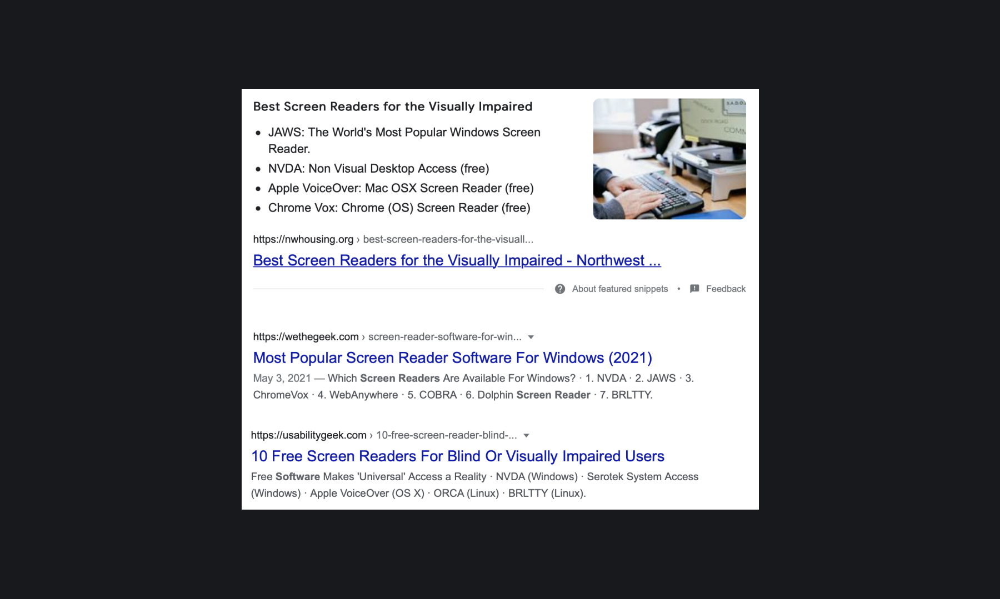

## Кратко

Современный сайт — это не только интерфейс пользователя. Чтобы сайт «взлетел» нужно многое добавить после реализации макета в вёрстке. Наряду с быстродействием, оптимизацией загрузки контента и кода, важно уделить внимание настройке сайта под поисковые системы и социальные сети, отработать вариант использования сайта с помощью скринридеров и другое.

Для этого необходимо разобраться с тем, как различные сервисы, службы, приложения «читают» сайт, как подготовить его для них и как сделать это правильно.

## Поисковые системы

Наверняка вы слышали про SEO — поисковую оптимизацию (Search Engine Optimization), суть которой заключается в том, чтобы вы сначала появились в поисковом индексе Yandex, Google, Bing и прочих поисковых системах, а потом стали приближаться к первой странице выдачи по определённым поисковым запросам пользователей. Процесс такой оптимизации состоит из двух больших этапов:

1. Настройка сайта, которая нужна, чтобы сайт стал доступен в индексе.
1. Оптимизация контента сайта и добавление ссылок на него со сторонних ресурсов.

Разберём особенности первого этапа и рассмотрим, что нужно, чтобы сайт был максимально удобным для чтения поисковой системой.

### Чтение сайта

Поисковики регулярно индексируют сайты. Как правило, индексация проходит в несколько этапов:

1. Обнаружение новых ссылок.
1. Индексация страниц.
1. Определение поведения пользователя на странице.
1. Постоянное обновление индекса страницы.

На первом этапе работает специальная программа, которая вносит в базу данных поисковика новые и проверяет старые ссылки. Если программа обнаруживает новую ссылку, то она выполняет несколько действий: проверяет её на спам, на обнаружение вредоносных программ, нормализует, проверяет на дубликаты и так далее. Если ссылка прошла все проверки, то она будет добавлена в базу данных поисковой системы.

По адресам страниц из базы данных регулярно заходит поисковый робот (веб-паук, веб-краулер), основной функцией которого является составить [поисковый индекс](https://ru.wikipedia.org/wiki/Поисковый_индекс).

**Индексация** — это составление статистического отчёта о содержимом страницы по определённым правилам. На основе этого отчёта и ряда других факторов определяется положение страницы в рейтинге релевантности по тому или иному поисковому запросу пользователя. Современные поисковые системы содержат тысячи критериев для определения этого положения относительно других страниц. Важно подготовить каждую страницу для встречи с поисковым ботом, результаты этой встречи сильно повлияют на популярность вашего сайта.

Попасть в индекс — это только первый шаг. Рейтинг страницы в интернете всё время меняется. На положение страницы в рейтинге оказывают влияние не только количество страниц, которые ссылаются на вашу страницу, но и контент. Большое значение имеет и поведение пользователя на странице. Чем больше пользователь взаимодействует со страницей, тем лучше. Поэтому важно уделять внимание содержимому, дизайну и пользовательскому опыту.

Веб-краулер регулярно проходит по существующим адресам в базе и проверяет наличие страницы или ответ сервера при запросе страницы. Если статус страницы корректен, но содержимое изменилось, то бот производит индексацию и заново обновляет информацию о странице в базе данных. Период проверок меняется, как правило, в зависимости от популярности страницы.

### Как начать

Для того, чтобы поисковая система смогла правильно проиндексировать страницу, существует несколько способов  подсказать поисковой системе, какая информация содержится на странице. Есть ряд общепризнанных способов и ряд способов, специфичных для конкретных поисковых систем. Мы разберём первую группу, поскольку она является универсальной.

<aside>

⚠️ Необходимо помнить, что все наши подсказки являются лишь инструментами для поисковой системы, которые дают возможность анализировать контент сайта и красиво представлять его в поисковой выдаче. Конечное решение, создавать красивую карточку выдачи или нет, повышать или понижать сайт в рейтинге или нет, поисковая система принимает на основании своего алгоритма.

</aside>

#### Семантика

При формировании веса слов в индексе страницы поисковый робот опирается не только на частоту их употребления, но и на теги, внутри которых эти слова употреблены. Заголовкам, как правило, отдаётся наибольший вес (для поисковиков имеет значения заголовки первых трёх уровней). Затем идут ссылки (анализируется текст внутри [`<a></a>`](/html/a/) и атрибут `title`), описания картинок (атрибут `alt` в теге [``](/html/img/)), выделенный текст (парные теги [`<strong>`](/html/strong/), [`<b>`](/html/b/), [`<em>`](/html/em/), [`<i>`](/html/i/), [`<mark>`](/html/mark/), [`<u>`](/html/u/) и прочие). Алгоритм определения весов у каждого поисковика свой, но выделенный текст анализируется особым образом.

Имеет значение структура тегов. Например, будет иметь значение, каким образом расставлены секции ([`<section>`](/html/section/)) внутри текста статьи (например, [`<article>`](/html/article/)), для формирования структурированного текста. Весовые коэффициенты имеют огромное значение в ранжировании, они влияют на положение страницы в поисковой выдаче.

#### Мета-описание

Мета-описание — это информация, которая не отображается браузером, но помогает поисковым системам понять общую тематику страницы и правильно отобразить сайт (сформировать сниппет) в результатах выдачи. Мета-описание страницы указывается в специальных тегах в шапке страницы внутри секции [`<head>`](/html/head/). Наиболее важными для поискового робота являются два тега: тег заголовка страницы [`<title>`](/html/title/) и
мета-тег описания страницы `<meta name="description" content="...">`. В атрибуте `content` содержится краткое описание страницы.

Особым классом мета-тегов являются теги, которые позволяют красиво отобразить ссылку на вашу страницу в социальных сетях и мессенджерах. Необходимости в таких тегах нет. Любой современный мессенджер или социальная сеть сформирует минимальный сниппет на основе заголовка страницы и краткого описания. Но специальные теги позволяют настроить отображение намного тоньше.

Для пользователей очень важно как выглядит ссылка. Количество переходов на ваш сайт из социальных сетей учитывается поисковыми системами через подключение специальных скриптов, например, [Google Analytics](https://analytics.google.com/) или [Яндекс Метрика](https://metrika.yandex.ru/). Эти переходы используется поисковой системой для определения рейтинга сайта в поисковой выдаче.

Признанным стандартом являются теги схемы [Open Graph](https://ruogp.me). Они хорошо описаны в документации от [Facebook](https://developers.facebook.com/docs/sharing/opengraph) и [Google](https://developers.google.com/web/fundamentals/discovery/social-discovery#use_open_graph_protocol_ogp_to_provide_rich_snippets_on_facebook).

Формат мета-тегов выглядит так:

```html
<meta property="og:title" content="Заголовок">
<meta property="og:type" content="website">
<meta property="og:url" content="https://www.example.com/">
```

Первый тег отвечает за заголовок карточки, в виде которой отображается ссылка, второй — задаёт тип карточки, третий — определяет абсолютную ссылку. Доступны и другие возможности. Можно установить описание с помощью `og:description`, задать ссылку на картинку с помощью `og:image`, определить ссылку на соответствующее странице видео и прочие. Во время разработки можно использовать валидаторы, наиболее известные из которых:

- [Facebook Object Debugger](https://developers.facebook.com/tools/debug/) (отладчик от Facebook, компании, которая была одним из инициаторов использования данного типа мета-тегов.
- [Google Rich Snippets Testing Tool](https://search.google.com/structured-data/testing-tool/u/0/) (отладчик от Google, который обеспечивает валидацию совместимых с поисковыми системами мета-теги).
- [LinkedIn Post Inspector](https://www.linkedin.com/post-inspector/inspect/) (отладчик представления ссылок в этой социальной сети).
- [Card validator](https://cards-dev.twitter.com/validator) (отладчик представления постов в Twitter).
- [Meta Tags](https://metatags.io) (агрегатор, который позволяет увидеть, как будет выглядеть карточка ссылки сразу в нескольких социальных сетях).

Существуют и другие схемы мета-тегов для дополнительного описания страниц сайта, например, от компании [Twitter](https://developer.twitter.com/en/docs/twitter-for-websites/cards/guides/getting-started) (существует официальный [валидатор](https://cards-dev.twitter.com/validator)).

Например, если мы захотим поделиться одной из статей с сайта smashingmagazine.com «[Search Engine Optimization Checklist (PDF)](https://www.smashingmagazine.com/search-engine-optimization-checklist/)», мы получим вот такие карточки и сниппет:


#### Микроразметка

Существует альтернативный способ разметить элементы страницы так, чтобы поисковая система понимала их назначение, — это микроразметка. Это даёт возможность поисковой системе разбираться в контенте точнее, правильно расставляя акценты и тонко настраивая сниппет показа страницы в поисковой выдаче (если поисковая система решит, что это необходимо).

Если набрать в поисковой строке Google фразу «best screen reading software», то результаты поискового запроса могут выглядеть примерно так:



Микроразметка реализуется на основе словарей. Словарь — это набор атрибутов для данных определённого типа. Существует несколько словарей микроразметки, наиболее важным из которых является [Schema.org](https://schema.org).

Например, в комментариях или в отзыве о товаре можно указать, какое поле отвечает за рейтинг. И поисковая система при выводе страницы с комментарием или товаром выведет рейтинг сразу в карточки поисковой выдачи.

В словаре Schema.org существуют три важных атрибута, которые нужно использовать при описании элемента страницы:
- `itemscope` — определяет контекст, то есть раздел словаря. Например, можно указать, что страница — это пост в блоге или страница новости на новостном портале.
- `itemtype` — определяет тип объекта. Например, `Product` (Продукт) используется для товаров.
- `itemprop` — определяет свойства выбранного объекта (цена, описание, рейтинг, опции, спецификации и прочие).

Рассмотрим пример с информацией об авторе какой-то статьи. Выберем контекст _[Person](https://schema.org/Person)_. Для него доступны, например, такие объекты, как имя, фамилия (_[givenName](https://schema.org/givenName)_, _[familyName](https://schema.org/familyName)_) и занимаемая должность (_[jobTitle](https://schema.org/jobTitle)_).

Для того, чтобы применить тот или иной словарь необходимо использовать один из доступных синтаксисов:

- Microdata - данные размечаются в HTML-коде.
- RDFa - данные размечаются в HTML-коде (сейчас почти не используется, и мы его затрагивать не будем).
- JSON-LD - самый актуальный на сегодняшний день формат.

В рамках синтаксиса Microdata код страницы в части реализации микроразметки будет выглядеть так:

```html
<article itemscope itemtype="http://schema.org/Article">
  <section itemscope itemtype="http://schema.org/Person" itemprop="author">
    <p>
      Автор статьи:
      <span itemprop="givenName">Василий</span>
      <span itemprop="familyName">Иванов</span>
      (<span itemprop="jobTitle">Штатный корреспондент</span>)
    </p>
  </section>
</article>
```

В рамках синтаксиса JSON-LD в тег `<head>` страницы нужно встроить отдельную секцию [`<script>`](/html/script/) следующим образом:

```html
<head>
  <script type="application/ld+json">
    {
      "@context": "http://schema.org",
      "@type": "Article",
      "author": {
        "@type": "Person",
        "givenName": "Василий",
        "familyName": "Иванов",
        "jobTitle": "Штатный корреспондент"
      }
    }
  </script>
</head>
```

С 2014 года для микроразметки предпочтительнее использовать синтаксис JSON-LD. Больше примеров доступно на сайте с примерами «[Steal Our JSON-LD](https://jsonld.com)». Полную спецификацию можно посмотреть на [сайте с документацией](https://w3c.github.io/json-ld-syntax/).

## Скринридеры

Для людей с нарушениями зрения внешний вид вашего сайта может не иметь никакого значения. Незрячие люди вообще его не увидят, дальтонизм может помешать увидеть какие-то элементы или блоки, которые не обладают достаточной контрастностью, корректным с точки зрения другого цветового восприятия цветом и оттенком. Есть люди, которые не могут использовать мышь или любой другой способ указатель (перо, стилус или даже свой палец).

Очень важно не только как выглядит ваш сайт, но и как он «звучит». Существуют специальные расширения для браузера (скринридеры), которые позволяют прочитать вслух контент вашего сайта. Это помогает услышать ваш сайт — выход из положения для многих.

Если с текстом не возникает никаких проблем, то с картинками, навигацией по тексту и сайту в целом, формами, таблицами и прочими элементами интерфейса может быть не всё так хорошо. Важно понимать, что сайт нужно специально подготовить для корректного использования людьми с нарушениями зрения.

### Чтение сайта

В большинстве скринридеров используется движок Text To Speech (TTS), который читает текст голосом. Наиболее полный список известных скринридеров доступен в [Википедии](https://en.wikipedia.org/wiki/List_of_screen_readers). Среди всех доступных наиболее популярны:

- [VoiceOver](https://ru.wikipedia.org/wiki/VoiceOver), который используется в операционных системах устройств от компании Apple.
- [JAWS](https://support.freedomscientific.com/JAWSHQ/JAWSHeadquarters01), удобный платный клиент под Windows и бесплатный под DOS.
- [NVDA](https://www.nvaccess.org/about-nvda/), в меру удобный, но бесплатный клиент под Windows.

Скринридеры поддерживают специальные манипуляторы, а не только стандартные устройства ввода (клавиатуру, мышь, сенсорные панели и экраны, перья с планшетами). Также они могут взаимодействовать и с устройствами вывода, например, дисплеями Брайля.

### Как начать

Существуют специальные руководства по подготовке сайта для людей с нарушениями зрения. В российском сегменте интернета существует ресурс «[Веблайнд](https://weblind.ru)», на котором изложены существующие практики. Весь контент этого сайта соответствует российским и международным стандартам: [ГОСТ Р 52872-2012](https://www.internet-law.ru/gosts/gost/54797/), руководство [WCAG 2.0](https://www.w3.org/Translations/WCAG20-ru/) от W3C и [Section 508](https://www.access-board.gov/ict/about/). Рассмотрим основные моменты, без которых сайт будет совершенно недоступен для людей с нарушениями зрения.

Тестировать сайты на доступность очень не просто. Есть автоматические утилиты, встроенные в браузер, это позволяет понять, как «звучит» сайт, но этого не достаточно. Хорош ли сайт для пользователя понять можно на сегодняшний день только в рамках ручного тестирования.

Ссылку важно формировать таким образом, чтобы было понятно, куда она ведёт. Вместо «нажмите здесь» лучше написать «посмотреть полный список товаров». Важно также заполнять атрибут `title`, если он не дублирует содержимое ссылки. Навигация по тексту выстраивается на основе заголовков, навигация по сайту на основе главного меню или его аналога, которое лучше размещать внутри парного тега `<nav>`. Изображения, которые важны для правильного понимания контента сайта (контентные изображения), важно описывать в атрибуте `alt`. В формах нужно пометить назначение каждого поля.

Существуют специальные атрибуты для тегов, которые начинаются с префикса `aria-`, которые позволяют настроить работу скринридера детальнее, не отдавая всё на откуп автоматики. Подробнее можно ознакомиться в [спецификации](https://www.w3.org/TR/wai-aria/).

## Резюме

Итак, что нужно сделать с сайтом, чтобы всё везде правильно отображалось и индексировалось?

Нужно протестировать:

<label><input type="checkbox"> Скорость загрузки</label>.
<label><input type="checkbox"> Семантику</label>.
<label><input type="checkbox"> Адаптивность</label>.
<label><input type="checkbox"> Валидность вёрстки</label>.
<label><input type="checkbox"> Последовательность кода</label>.
<label><input type="checkbox"> Доступность</label>.

Нужно реализовать:

<label><input type="checkbox"> Принять необходимость перечисленных ниже пунктов</label>.
<label><input type="checkbox"> Сделать сайт адаптивным</label>.
<label><input type="checkbox"> Сделать сайт контрастным</label>.
<label><input type="checkbox"> Сформировать структуру заголовков</label>.
<label><input type="checkbox"> Сделать ссылки доступными</label>.
<label><input type="checkbox"> Сделать контентные картинки доступными</label>.
<label><input type="checkbox"> Сделать аудио и видео доступными</label>.
<label><input type="checkbox"> Сделать формы доступными</label> (если есть формы).
<label><input type="checkbox"> Сделать таблицы доступными (если есть таблицы)</label>.
<label><input type="checkbox"> Сделать заголовки страниц</label> (тег `<title>`).
<label><input type="checkbox"> Сделать описания страниц</label> (тег `<meta name="description" content="...">`).
<label><input type="checkbox"> Сделать мета-описание в рамках OpenGraph</label>.
<label><input type="checkbox"> Сделать мета-описание в рамках Twitter</label> (если необходимо).
<label><input type="checkbox"> Сделать микроразметку в синтаксисе JSON-LD</label>.
