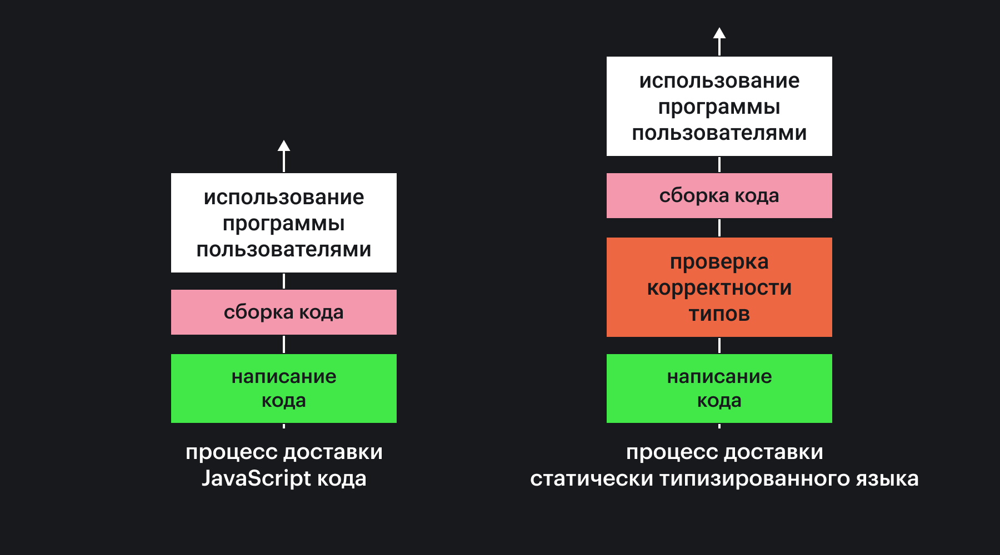

## Кратко

В JavaScript **слабая динамическая** типизация. Это означает две вещи:

1. Любая переменная может произвольно менять свой тип во время выполнения программы.
2. При операциях с переменными разных типов они будут автоматически приведены к одному типу.

Эти свойства языка часто мешают создавать большие надёжные приложения. Поэтому появились решения, которые расширяют язык, добавляя в него строгую статическую типизацию. «Строгая» означает запрет автоматического приведения типов, «статическая» значит, что переменные не меняют свой тип. Самое популярное решение в этой области — [**TypeScript**](https://www.typescriptlang.org/). Другие, менее популярные — [Rescript](https://rescript-lang.org/), [Flow](https://flow.org/) и [Hegel](https://hegel.js.org/).

## Как пользоваться

### Настройка

TypeScript — это язык, очень похожий на JavaScript. Браузеры и Node.js не умеют исполнять его, поэтому без этапа сборки пользоваться им нельзя.

Все современные системы сборки умеют работать с TypeScript: Parcel поддерживает его без дополнительных манипуляций, для Webpack и Rollup есть плагины. Их объединяет одно — необходимо создать файл _tsconfig.json_, который опишет, как превратить TypeScript-код в JavaScript-код. Правила создания конфигурационного файла описаны на [сайте TypeScript](https://www.typescriptlang.org/docs/handbook/tsconfig-json.html).

```json
{
  "compilerOptions": {
    // Указываем папку, куда попадёт результат
    "outDir": "./dist",
  },
  // Указываем, какие файлы следует компилировать
  "include": ["src/**/*"],
  // Внешние зависимости обычно исключают из списка компилируемых файлов
  "exclude": ["node_modules"]
}
```

После этого достаточно писать код в файлах с расширением _.ts_ вместо _.js_.

### Язык

Главное отличие TypeScript от JavaScript — возможность добавлять аннотации типов к переменным, аргументам функций и их возвращаемым значениям.

```tsx
// Теперь переменной age можно присвоить только число
let age: number

// Будет работать
age = 43

// Выдаст ошибку
age = '34'
```

Важно заметить, что ошибки несовпадения типов будут заметны уже на стадии написания кода. То есть не нужно запускать программу, чтобы узнать, что в коде допущены ошибки с типизацией.



Проверка корректности типов — это разновидность [статического анализа](/tools/static-analysis/). Его можно провести, не запуская код.

Примерно таким же образом можно типизировать параметры функции:

```tsx
function sayMyName(name: string) {
  console.log(`Привет, ${name}`)
}

// Будет работать
sayMyName('Игорь')
// Привет, Игорь

// Выдаст ошибку
sayMyName(42)
```

Ошибка несовпадения типов будет заметна на этапе написания кода, и до запуска программы не дойдёт.

В TypeScript можно типизировать не только параметры функции, но и возвращаемое значение.

```tsx
function getCurrentDate(): Date {
  // Будет работать
  return new Date()
}

function getCurrentDate(): Date {
  // Выдаст ошибку
  return 'now'
}
```

Другая особенность TypeScript — строгость типизации. Он запрещает операции с переменными разных типов, чтобы не допустить неоднозначности результата.

```tsx
const age = 43
const name = 'Mary'

// Выдаст ошибку, складывать числа и строки нельзя
const result = age + name
```

## Как понять

TypeScript — надмножество JavaScript. На практике это означает, что любой JavaScript-код является корректным TypeScript-кодом. А вот обратное неверно.

Главное преимущество строгой статической типизации — возможность найти ряд ошибок ещё на этапе написания кода. Например, классическая ошибка, когда в переменной не оказывается значения, приводит в JavaScript к ошибке во время выполнения, когда код уже работает в браузере. Такая ошибка может затронуть пользователей.

```tsx
function generateEmail(user) {
  return `${user.name}@mycompany.com`
}

// При вызове функции программист передает другой объект,
// и происходит ошибка во время выполнения, пользователь её замечает
generateEmail({ fullName: 'Пётр Сергеевич Никольский' })
```

Если переписать этот пример на TypeScript, потенциальная проблема исчезнет:

```tsx
// Аргумент функции всегда должен быть объектом,
// у которого есть строковое поле name
function generateEmail(user: { name: string }) {
  return `${user.name}@mycompany.com`
}

// При вызове функции программист передает другой объект,
// происходит ошибка во время сборки, программист её замечает и исправляет
generateEmail({ fullName: 'Петр Сергеевич Никольский' })
```

Чем раньше обнаруживается ошибка, тем легче её исправить. Поэтому статическая типизация, [статический анализ](/tools/static-analysis/) и [написание автоматизированных тестов](/tools/how-to-test-and-why/) — это правила хорошего тона в современной разработке приложений. По сути, статическая типизация (как и статический анализ) добавляет в процесс разработки программы ещё один шаг — проверку типов, который выполняется перед сборкой проекта и может помочь найти ошибки на раннем этапе.


На первый взгляд кажется, что явное объявление типов заставляет писать много лишнего кода. На самом деле это иллюзия. Аннотации типов — способ обеспечить большую надёжность написанного кода.

TypeScript — это язык с опциональной типизацией. Он не заставляет программиста указывать типы, можно просто писать код как раньше. TypeScript постарается сам определить типы из контекста, и дать подсказки. Если контекст непонятен языку, он пометит тип переменной как `any`. Это означает, что в ней может лежать значение любого типа.

```tsx
// Видимо, переменная должна иметь тип number
const age = 12

// Язык не знает, какой тип имеет аргумент name,
// он пометит его как any
function sayMyName(name) {
  console.log(`Привет, ${name}`)
}
```

Эта особенность языка называется выводом типов и присутствует во многих современных языках программирования. К сожалению, она не слишком развита в TypeScript, и чаще всего приходится всё-таки «подсказывать» компилятору типы. В других языках, например, в Scala, она развита сильнее, там типы приходится указывать значительно реже.
