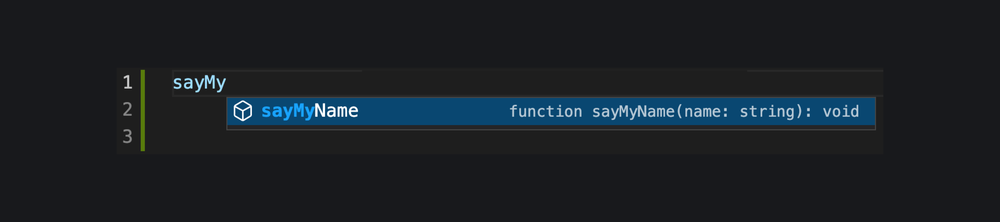

Если у вас нет возможности использовать TypeScript, а типизировать код хочется, то можно использовать JavaScript с аннотациями типов в [JSDoc](https://www.typescriptlang.org/docs/handbook/jsdoc-supported-types.html).

```js
/** @type {number} */
let age;

/**
 * @param {string}  name
 */
function sayMyName(name) {...}

/**
 * @returns {Date}
 */
function getCurrentDate() {...}
```

Это, конечно, не полноценная проверка типов, а только документация и удобное автодополнение в IDE:


