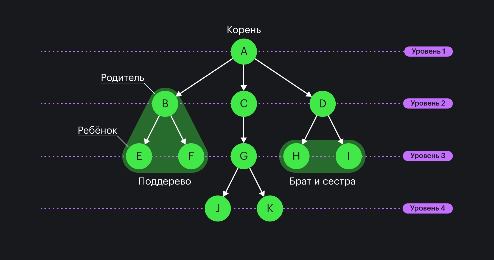
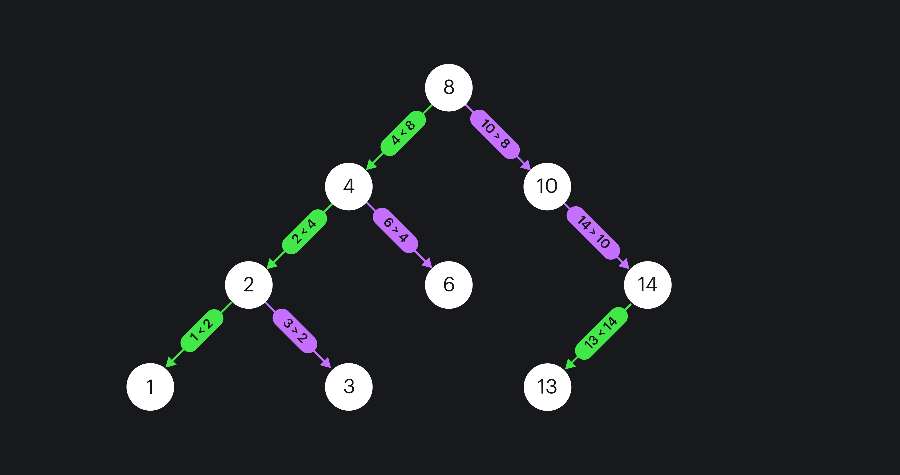
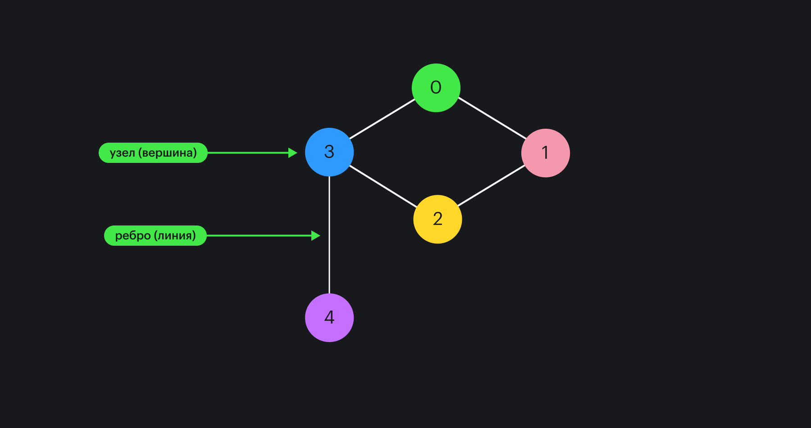

## Что такое и зачем

_Структуры данных_ — это способы хранения данных в памяти компьютера. Они используются для решения различных задач, таких как поиск, сортировка, фильтрация и многое другое.

Представим, что у нас есть список из 1000 имён и нужно найти определённое имя в этом списке. Можно просматривать каждую строку списка по порядку. Это может занять много времени, особенно если список очень большой.

Однако если хранить имена в другой структуре данных, например, в хеш-таблице или дереве поиска, можно найти нужное имя гораздо быстрее. Структуры данных позволяют эффективно организовывать данные и выполнять операции с ними.

## Массивы

[Массивы](/js/arrays/) — это одна из самых распространённых структур данных в программировании. Они используются для хранения коллекции элементов, таких как числа, строки или объекты.


В JavaScript массивы являются динамическими. Это значит, что они могут изменять свой размер во время выполнения программы. Память для массива выделяется динамически, и элементы могут быть расположены в памяти непоследовательно. Однако массивы предоставляют интерфейс для доступа к элементам по их индексу, например, `pizza[0]`.

Представьте, что у нас есть пицца, которую нужно разделить на несколько кусочков. Вы можете использовать массив, чтобы хранить каждый кусочек пиццы в отдельности:

```javascript
let pizza = ['кусочек 1', 'кусочек 2', 'кусочек 3', 'кусочек 4', 'кусочек 5']
```

Теперь мы можем поделить пиццу ещё на несколько кусочков:

```javascript
pizza.splice(2, 0, 'кусочек 2.5')
console.log(pizza)
// ["кусочек 1", "кусочек 2", "кусочек 2.5",
// "кусочек 3", "кусочек 4", "кусочек 5"]
```

## Стeк

_Стек_ — это структура данных, которая работает по принципу LIFO (Last In, First Out), что означает «последним пришёл — первым вышел». К примеру, вы моете посуду и ставите тарелки друг на друга. Если захотите вытереть их, то первой возьмёте последнюю помытую тарелку. Это и есть принцип работы стека.


Стеки используются для извлечения данных в обратном порядке. Например, хотим сохранить историю действий пользователя в приложении: когда пользователь выполняет новое действие, мы кладём элемент на стек. Когда пользователь хочет отменить действие, мы снимаем элемент со стека:

```javascript
let stack = []

stack.push('действие 1')
stack.push('действие 2')
stack.push('действие 3')

console.log(stack) // ["действие 1", "действие 2", "действие 3"]

let lastAction = stack.pop()

console.log(lastAction) // "действие 3"
console.log(stack) // ["действие 1", "действие 2"]
```

B этом примере создали пустой стек и добавили в него три действия. Затем удалили последнее действие из вершины стека с помощью метода `pop()`.

## Очереди

_Очередь_ — это структура данных, которая работает по принципу FIFO (First In, First Out), что означает «первым пришёл — первым обслужен». Её можно сравнить с очередью за вкусными пироженками: первый человек, который пришёл, будет первым, кто получит пироженое.


Очереди используются для хранения данных в порядке их добавления. Например, если хотим сохранить список задач на день, то будем использовать очередь для хранения этих задач:

```javascript
let queue = []

queue.push('задача 1')
queue.push('задача 2')
queue.push('задача 3')

console.log(queue) // ["задача 1", "задача 2", "задача 3"]

let firstTask = queue.shift()

console.log(firstTask) // "задача 1"
console.log(queue) // ["задача 2", "задача 3"]
```

В этом примере создали пустую очередь и добавили в неё три задачи, затем взяли первую из начала очереди с помощью метода `shift()`.

## Связанные списки

_Связанный список_ — это структура данных, которая состоит из узлов, каждый из которых содержит данные и ссылку на следующий узел в списке. Связанный список можно представить как поезд, где каждый вагон — это узел в списке. Каждый вагон содержит груз (данные) и соединение со следующим вагоном (ссылку). Первый вагон — это начало списка, а последний, который не имеет соединения с другим, — это конец списка. Таким образом, вы можете перемещаться по поезду (списку), переходя от одного вагона (узла) к другому.


Существуют два основных типа связанных списков — односвязные и двусвязные.

- _Односвязный список_ — структура данных, состоящая из элементов одного типа, последовательно связанных между собой указателями. Каждый элемент списка имеет указатель на следующий элемент. Последний элемент указывает на `NULL`. Элемент, на который нет указателя, является первым в списке.
- _Двусвязный список_ — структура данных, в которой каждый элемент содержит указатель на следующий и предыдущий элементы. Это позволяет двигаться по списку в обоих направлениях.

Связанные списки используются для хранения данных в порядке их добавления. Одно из преимуществ связанных списков — они позволяют быстро добавлять и удалять элементы в любом месте. Например, если хотите сохранить список задач, которые нужно выполнить в приложении, можете использовать связанный список для хранения этих задач. Каждый узел списка будет содержать одну задачу и ссылку на следующую подзадачу:

```javascript
class Node {
  constructor(data) {
    this.data = data
    this.next = null
  }
}

let head = new Node('Задача 1')
let secondNode = new Node('Подзадача 1.1')
let thirdNode = new Node('Подзадача 1.1.2')

head.next = secondNode
secondNode.next = thirdNode

console.log(head)
// Node {
//  data: "Задача 1",
//  next: Node {
//    data: "Подзадача 1.1",
//    next: Node {
//      data: "Подзадача 1.1.2",
//      next: null
//    }
//  }
// }
```

В этом примере создали три узла односвязного списка и связали их друг с другом с помощью ссылок. Первый узел называется головой списка и содержит ссылку на следующий узел. Каждый последующий узел также содержит ссылку на следующий узел в списке. Последний узел указывает на `NULL` и называется хвостом списка.

## Деревья

_Деревья_ — это иерархическая структура, которая состоит из связанных узлов. Каждый узел дерева содержит данные и ссылки на его дочерние узлы. Вершина дерева называется корнем, узлы у которых нет потомков — листьями.

Ключевые термины, используемые при работе с деревьями:

- _Children_ (дети) — узлы, у которых текущий является родителем;
- _Descendants_ (потомки) — узлы, до которых можно добраться через родительские связи. Все ваши дети, внуки, правнуки и так далее будут вашими потомками;
- _Siblings_ (братья и сестры) — узлы, имеющие одного и того же родителя. Ваши братья и сестры — это люди, у которых те же родители, что и у вас;
- _Leafs_ (листья) — узлы без потомков. К примеру, ваши родственники, у которых нет своих детей.



Давайте создадим дерево с родителем с двумя детьми. У каждого из детей есть свои дети (внуки):

```javascript
class TreeNode {
  constructor(value) {
    this.value = value
    this.children = []
  }
}

const parent = new TreeNode('Родитель')
const child1 = new TreeNode('Ребёнок 1')
const child2 = new TreeNode('Ребёнок 2')

parent.children.push(child1)
parent.children.push(child2)

const grandChild1 = new TreeNode('Внук 1')
const grandChild2 = new TreeNode('Внук 2')

child1.children.push(grandChild1)
child2.children.push(grandChild2)
```

Деревья помогают организовывать данные иерархически, обрабатывать информацию, искать пути и многое другое.

_Бинарное дерево_ — это структура данных, в которой каждый узел имеет не более двух детей, обычно обозначаемых как «левый ребёнок» и «правый ребёнок». Особый вид бинарного дерева — это бинарное дерево поиска. В бинарном дереве поиска для каждого узла его значение больше или равно значению любого узла в его левом поддереве и меньше или равно значению любого узла в его правом поддереве. Это свойство делает бинарные деревья поиска эффективными для операций поиска и вставки.



## Графы

_Графы_ — это структура данных, которая представляет собой узлы, связанные рёбрами. Графы бывают двух основных типов: направленные и ненаправленные.



- _Направленные (directed)_. В направленном графе рёбра имеют направление. Значит, что, если есть ребро от узла `A` к узлу `B`, это не гарантирует наличие ребра от узла `B` к узлу `A`. То есть `A` к `B` и `B` к `A` — это не одно и то же.
- _Ненаправленные (undirected)_. В ненаправленном графе рёбра не имеют направления. Это означает, что, если есть ребро между узлами `A` и `B`, то можно перемещаться в любом направлении.


Давайте представим, что у нас есть несколько городов, расположенных рядом друг с другом, и между ними проложены дороги. В этом контексте, узлы — это города, а рёбра — дороги, соединяющие эти города:

```javascript
const roadMap = new Graph()
roadMap.addVertex('Москва')
roadMap.addVertex('СанктПетербург')
roadMap.addVertex('Нижний Новгород')
roadMap.addEdge('Москва', 'Санкт-Петербург')
roadMap.addEdge('Москва', 'Нижний Новгород')
```

Графы используются для моделирования отношений между объектами, поиска путей, оптимизации маршрутов и многого другого. Иерархия друзей в Facebook или дороги Google Maps — это графы.
