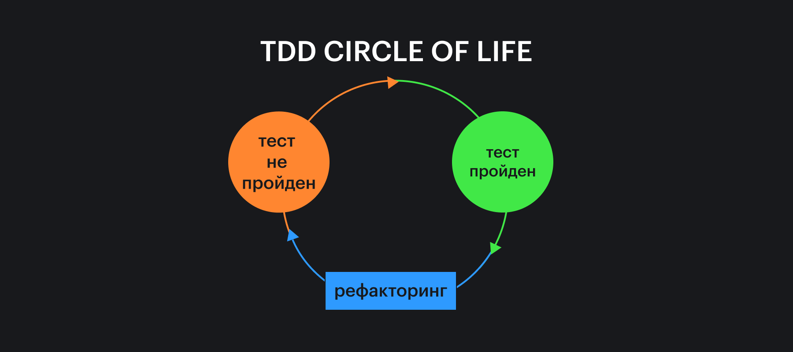

Разработка через тестирование (Test Driven Development, TDD) — практика разработки программ, при которой мы вначале пишем тесты для функциональности, которую хотим создать, затем — реализацию этой функциональности. Когда все заработает — рефакторим код.

Основной посыл TDD — в разбиении больших задач на маленькие. Стандартный цикл разработки состоит из трёх этапов и занимает 10–15 минут.

1. Красная зона. На нём мы пишем тест, который точно упадёт с _ожидаемой причиной_. Если причина падения теста не совпадает с ожидаемой, переходить к реализации функциональности рано.
1. Зелёная зона. На нём пишем функцию, которая проходит этот тест. Цикл короткий, поэтому реализация должна быть максимально простой.
1. Синяя зона. На этом этапе мы рефакторим код тестов и реализации. Проводить рефакторинг в синей зоне безопасно, потому что вся функциональность, которую рефакторинг затрагивает, уже покрыта тестами. Если что‑то по пути сломается, мы об этом тут же узнаем.



Цикл разработки по TDD: в красной зоне тесты не проходят, в зелёной мы это исправляем, в синей рефакторим код. (Изображение взято с [codedream.me](https://codedream.me/2016/03/01/test-driven-development/))

В этой статье мы напишем неполный калькулятор, используя TDD, и узнаем, чем этот подход полезен на практике.

<aside>

💡 Если вам интересно рассмотреть, как написать по TDD приложение побольше, рекомендуем прочесть статью [TTT-TDD](https://bespoyasov.ru/ttt-tdd/). В ней мы напишем игру «Крестики-нолики», начиная от логики самой игры и заканчивая работой с DOM.

</aside>

## Какое приложение мы напишем

Мы будем рассматривать TDD на примере создания калькулятора. Мы реализуем функцию деления одного числа на другое с учётом обработки ошибок и пользовательских настроек:

```javascript
import { divide } from 'calculator'

divide(10, 5)
// 2
divide(10, 3)
// 3.3
divide(10, 3, {precision: 2})
// 3.33
divide(10, 0)
// ERROR: I'm sorry, Dave. I'm afraid I can't do that.
```

Давайте приступим.

## Начинаем с теста

По TDD мы должны сперва написать тест, и только потом реализацию. В качестве тест-раннера мы будем использовать [jest](https://jestjs.io), все тесты в этой статье будут юнит-тестами.

<aside>

💡 Подробнее о видах тестирования и написании юнит-тестов мы писали в статье [«Как и зачем писать тесты»](/tools/how-to-test-and-why/).

</aside>

Спланируем первый тест для базового случая, когда числа делятся друг на друга без остатка и делитель не равен 0. В этом случае мы ожидаем, что в результате получим результат их деления:

```js
describe('when given 2 numbers', () => {
  it.todo('returns the result of dividing the first by the second')
})
```

<aside>

💡 Удобно использовать `it.todo()`, чтобы спланировать тесты, которые мы хотим написать в будущем.

</aside>

Теперь создадим функцию, которую будем тестировать:

```js
function divide(a, b) {
  return null
}
```

Заметьте, из функции мы намеренно возвращаем [`null`](/js/null-primitive/). Дело в том, что прежде чем начать реализовывать настоящую функциональность, нам нужно оказаться в «красной зоне».

## Работаем в красной зоне

Красная зона — это состояние приложения, при котором функция не проходит тест. (Обычно упавшие тесты в консоли отмечены красным цветом.)

Эта зона нужна, чтобы убедиться, что тест действительно проверяет то, что мы тестируем. Она помогает исключить ситуаций, в которых тест никогда не падает. Например,

```js
describe('when given 2 numbers', () => {
  it('returns the result of dividing the first by the second', () => {
    const result = divide(10, 5)
    const expected = 2
    expect(expected).toEqual(expected)
  })
})
```

В этом тесте мы случайно перепутали аргументы для функции `expect()`, поэтому это предположение будет всегда истинным, тест будет всегда проходить. Если тест никогда не падает, значит он ничего не проверяет 😃

Такие тесты нам не нужны. Давайте заставим его падать:

```js
const result = divide(10, 5)
const expected = 2
expect(result).toEqual(expected)

// expect(received).toEqual(expected)
//  Expected: 2
//  Received: null
```

Когда тест падает, надо внимательно посмотреть на ошибку. Мы хотим убедиться, что поломка произошла потому, что результат выполнения `divide()` не совпадает с ожидаемым `expected()`.

Причину поломки мы проверяем по тем же соображениям, что и поломку в целом. Если тест падает по другой причине, это значит, что он не проверяет наше предположение и такому тесту доверять нельзя.

В нашем случае причина поломки — несоответствие результата ожиданиям. Это то, что нам нужно; мы в красной зоне.

## Идём к зелёной зоне

Теперь, когда наш тест падает по правильной причине, мы можем его починить. Для этого реализуем функциональность деления первого числа на второе.

Мы помним, что цикл разработки в TDD короткий, поэтому реализация должна быть максимально простой. (Иногда даже — топорной.)

```js
function divide(a, b) {
  return a / b
}
```

Проверим тест:

```
PASS  ./index.test.js
  when given 2 numbers
    ✓ returns the result of dividing the first by the second (1 ms)

Test Suites: 1 passed, 1 total
Tests:       1 passed, 1 total
```

Тест починился! Отлично, значит мы только что вошли в зелёную зону.

Зелёная зона означает, что заявленная функциональность работает, как ожидается. Мы можем закоммитить результаты в репозиторий, поделиться ими с командой.

Другие разработчики смогут использовать заявленную функциональность для проектирования своих модулей. Таким образом мы сокращаем время разработки проекта в целом.

Но ведь мы же не доделали функцию! Да, мы пока не сделали обработку ошибок и настройки, это правда. Но часто на начальных этапах проектирования детали менее важны, чем основная функциональность. Даже если мы как-то изменим API, тесты помогут объяснить изменения и дадут примеры, как надо будет работать с функцией после изменений.

## Рефакторим в синей зоне

Когда все тесты проходят, можно начинать рефакторить код. Это безопасно, потому что заявленная функциональность протестирована, и если при рефакторинге мы что-то сломаем, то тут же об этом узнаем. Таким образом мы исключаем регрессии в коде.

В нашем случае рефакторить код функции пока особо смысла нет, она состоит из одной строки. А вот код теста можно улучшить.

Сейчас мы проверяем лишь один случай, а можем проверить сразу несколько. Давайте автоматически сгенерируем тесты:

```js
it('returns the result of dividing the first by the second', () => {
  const testCases = [
    { a: 10, b: 5, expected: 2 },
    { a: 15, b: 5, expected: 3 },
    { a: 9, b: 3, expected: 3 },
  ]

  testCases.forEach(({ a, b, expected }) => {
    const result = divide(a, b)
    expect(result).toEqual(expected)
  })
})
```

В примере выше мы создаём массив `testCases`, в котором держим пачку тестовых данных в виде объектов. Каждый объект содержит аргументы для функции и ожидаемый результат, который функция должна вернуть при таких аргументах.

Каждый объект из пачки мы разбиваем на переменные `a`, `b` и `expected`, которые потом используем для проверки функции. Таким образом мы можем использовать написанный единожды тест для проверки его на разных вариантах входных данных.

<aside>

☝️ Код тестов — такой же код, как и код самой функции. Его стоит держать в чистоте так же, как и любой продуктовый код. Если с тестами становится неудобно работать, стоит взять время на их рефакторинг и сделать их более читаемыми.

</aside>

При этом стоит помнить, что тесты не должны становиться слишком сложными. Они должны оставаться читаемыми и не содержать сложной логики, иначе придётся писать тесты, которые проверяют тесты 🥴

## Расширяем функцию

В начале статьи мы приводили примеры того, что функция будет уметь. Деление целых чисел мы уже сделали. Давайте теперь перейдём к дробям.

Мы хотим, чтобы нецелочисленный результат содержал один знак после запятой. Напишем для этого случая тест:

```js
describe('when given 2 numbers that cannot be equally divided', () => {
  it('should return the division result with 1 digit after the decimal point', () => {
    const result = divide(10, 3)
    const expected = 3.3
    expect(result).toEqual(expected)
  })
})
```

Проверим, что тест падает с правильной причиной:

```
expect(received).toEqual(expected)

  Expected: 3.3
  Received: 3.3333333333333335
```

Отлично! Начнём реализовывать функциональность. Попробуем это сделать самым простым способом:

```js
function divide(a, b) {
  return (a / b).toFixed(1)
}
```

Проверим тесты... Ой! Новый тест не прошёл, ещё и старые упали:

```
expect(received).toEqual(expected)

  Expected: 2
  Received: '2.0'
```

Дело в том, что [`toFixed()`](/js/number-wrapper/#formatirovanie-chisla) возвращает строку, а не число, поэтому результат не совпадает с ожидаемым.

Тесты этим и хороши, что ловят подобные ситуации. Они не дают нам испортить функцию, потому что сразу же показывают, что вот такое решение сломает обратную совместимость.

Давайте решим эту проблему, приведём всё к числу:

```js
function divide(a, b) {
  return Number((a / b).toFixed(1))
}
```

Проверим тесты:

```
PASS  ./index.test.js
  when given 2 numbers
    ✓ returns the result of dividing the first by the second (3 ms)
  when given 2 numbers that can't be equally divided
    ✓ should return the division result with 1 digit after the decimal point

Test Suites: 1 passed, 1 total
Tests:       2 passed, 2 total
```

Отлично! Всё работает.

## Реализуем настройки

Теперь сделаем так, чтобы пользователи могли указывать количество знаков после запятой, которые им нужны. Напишем сперва тест:

```js
describe('when given a precision value', () => {
  it('should return the division result with as many decimal places as there are in the settings', () => {
    const result = divide(10, 3, { precision: 2 })
    const expected = 3.33
    expect(result).toEqual(expected)
  })
})
```

Проверяем, что он не проходит:

```
expect(received).toEqual(expected)

  Expected: 3.33
  Received: 3.3
```

Отлично, теперь реализуем это дело. Добавим объект с настройками, чтобы передавать количество чисел после запятой:

```js
function divide(a, b, settings) {
  return Number((a / b).toFixed(settings.precision || 1))
}
```

Последний тест проходит! А вот старые снова падают.

```
● when given 2 numbers › returns the result of dividing the first by the second
  TypeError: Cannot read property 'precision' of undefined
```

Конечно! Мы же не можем сделать объект обязательным, потому что функция должна работать и с двумя аргументами тоже. Давайте это поправим:

```js
function divide(a, b, settings = {}) {
  const { precision } = settings
  return Number((a / b).toFixed(precision || 1))
}
```

Проверим тесты теперь:

```
PASS  ./index.test.js
  when given 2 numbers
    ✓ returns the result of dividing the first by the second (2 ms)
  when given 2 numbers that can't be equally divided
    ✓ should return the division result with 1 digit after the decimal point
  when given a precision value
    ✓ should return the division result with as many decimal places as there are in the settings

Test Suites: 1 passed, 1 total
Tests:       3 passed, 3 total
```

Всё работает! Теперь можно отрефакторить код.

## Рефакторим настройки

Наше решение сейчас не расширяемое: настройки вписаны прямо в функцию, значения по умолчанию захардкожены... Такое себе. Давайте это исправлять.

```js
const defaultSettings = { precision: 1 }

function divide(a, b, settings = defaultSettings) {
  const { precision } = settings
  return Number((a / b).toFixed(precision))
}
```

Мы сделаем объект с настройками по умолчанию, в котором пропишем `precision` 1, чтобы при вызове без настроек функция возвращала один знак после запятой. Проверим, тесты в порядке, всё хорошо.

Объект с настройками по умолчанию мы теперь и вовсе можем вынести в отдельный модуль. Он нам, скорее всего, потребуется и в других функциях калькулятора. При этом, каждое действие будут проверять уже написанные тесты, красота.

## Делим на ноль 😈

Осталось теперь предусмотреть один случай: деление на ноль. Мы хотим, чтобы функция в этом случае выбрасывала ошибку. Давайте напишем тест:

```js
describe('when tried to divide by 0', () => {
  it('should throw an error', () => {
    const attempt = () => divide(10, 0);
    expect(attempt).toThrow("I'm sorry, Dave. I'm afraid I can't do that.");
  });
});
```

Чтобы проверить, что функция выбросит ошибку, нам надо обернуть её в другую функцию. Это особенность jest, она нужна, чтобы jest смог отловить выброшенную ошибку.

Дальше мы проверяем, что функция-обёртка `attempt()` при вызове должна выбросить (`toThrow()`) ошибку указанным сообщением.

Проверим, что пока такого не происходит:

```
expect(received).toThrow(expected)

  Expected substring: "I'm sorry, Dave. I'm afraid I can't do that."
  Received function did not throw
```

И теперь обновим код функции:

```js
function divide(a, b, settings = defaultSettings) {
  if (b === 0) throw new Error("I'm sorry, Dave.")
  const { precision } = settings
  return Number((a / b).toFixed(precision))
}
```

Посмотрим на тесты:

```
expect(received).toThrow(expected)

  Expected substring: "I'm sorry, Dave. I'm afraid I can't do that."
  Received message:   "I'm sorry, Dave."
```

Хм, а ну да! Мы не дописали сообщение об ошибке до конца. Давайте поправим:

```js
function divide(a, b, settings = defaultSettings) {
  if (b === 0) throw new Error("I'm sorry, Dave. I'm afraid I can't do that.")
  const { precision } = settings
  return Number((a / b).toFixed(precision))
}
```

Теперь всё работает, как ожидалось:

```
PASS  ./index.test.js
  when given 2 numbers
    ✓ returns the result of dividing the first by the second (3 ms)
  when given 2 numbers that can't be equally divided
    ✓ should return the division result with 1 digit after the decimal point
  when given a precision value
    ✓ should return the division result with as many decimal places as there are in the settings (1 ms)
  when tried to divide by 0
    ✓ should throw an error (5 ms)

Test Suites: 1 passed, 1 total
Tests:       4 passed, 4 total
```

## Посмотрим на результат

Мы написали функцию `divide()`, которая принимает настройки и не позволяет делить на ноль. Но самое главное, что кроме самой функции у нас есть и тесты к ней.

### Плюсы TDD

Обычно написание тестов считается скучной дополнительной работой, которую «надо делать после основной работы». Если мы используем TDD, написание тестов встраивается в основной поток разработки, не отнимая сил на «дополнительную работу после».

Кроме этого TDD заставляет нас сразу же **думать о том, как нашу функцию будут использовать**. Когда мы сперва пишем тест, мы продумываем публичное API, тем самым делая его удобнее.

Также TDD позволяет безопасно рефакторить реализацию и код самих тестов. Конечно, тесты не исключают ошибки в принципе, но если есть ошибка в описанном сценарии, тесты о ней точно сообщат. Это делает код устойчивее и надёжнее.

### Издержки TDD

Надо думать наперёд и проектировать API заранее 🤷‍♀️

Ещё кого-то могут напрягать пляски с тем, чтобы заставлять тесты падать. Но это необходимое условие, чтобы быть уверенными, что тесты проверяют то, что нам надо.

### Минусы TDD

Часто в минусы TDD записывают то, что он якобы провоцирует думать только об основном сценарии ([happy path](https://en.wikipedia.org/wiki/Happy_path)) кода, забивая на исключения и крайние случаи.

Это не совсем так. Да, TDD сперва требует написать тест. Часто самый первый тест — это тест на главную функциональность, но это не значит, что следующий тест обязан быть таким же.

Разработчики могут писать и отказные тесты до реализации, здесь всё зависит от опыта разработчиков, качества проектирования системы и требований.
