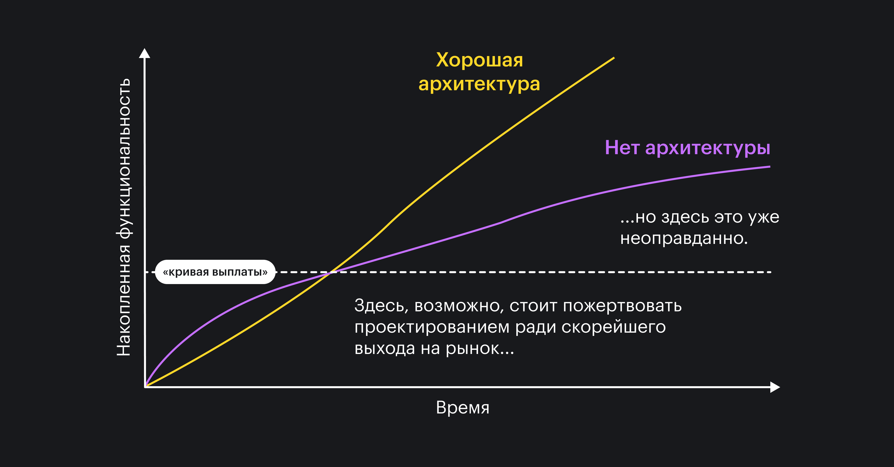

## Кратко

При разработке программ часто не хватает времени на всё, что хотелось бы сделать. Разработчикам приходится выбирать самые важные задачи и делать в первую очередь их. Обычно больше времени уделяют тому, что видит пользователь. Оставшиеся задачи относятся к улучшению кода и инфраструктуры проекта — такие задачи называют техническим долгом.

От тех. долга нужно избавляться, потому что он вредит проекту. Чем больше долгов накоплено в проекте, тем больше времени будет уходить на разработку новых фич и правку ошибок.

В этой статье мы поговорим о том, как управлять техническим долгом и что именно происходит, если своевременно не «платить» по нему.

## Почему «долг»

Технический долг похож на денежный с процентами. Какое-то время его можно игнорировать, но скоро мы заметим, что нам на телефон звонят незнакомые люди и сердито требуют заплатить по счетам. Примерно это происходит с проектом, в котором задачи на улучшение кодовой базы не доходят до продакшена.

Самое опасное — это «проценты» по такому долгу. Чем дольше мы игнорируем неоптимальный код, тем больше времени мы будем тратить в будущем на любые задачи, хоть как-то связанные с этим кодом.

Со временем мы заметим, что на тривиальную-казалось-бы задачу у нас уходит слишком много часов, и мы всё чаще слышим от коллег «если что-то здесь поменять, то всё развалится». Это значит, что долг вырос до масштабов, когда _вся_ работа будет уходить на его оплату.

## Что не является тех. долгом

Не всё подряд является техническим долгом. Например, [по словам Боба Мартина](https://sites.google.com/site/unclebobconsultingllc/a-mess-is-not-a-technical-debt) беспорядок в коде — это не технический долг.

И правда, не любой плохой код можно списать в долги.

<aside>

💡 Как правило, долги появляются, когда разработчики жертвуют _оптимальностью_ решения в угоду коротким _срокам_. Чуть реже — когда мы не можем предсказать изменения будущем, и оставляем неполное решение.

</aside>

Если мы изначально пишем всё в одном файле, вызываем как попало функции и непонятно называем сущности — это не технический долг, это плохо сделанная работа. Когда же из-за «горящих» сроков мы оставляем доработку хорошего, но не очень гибкого решения на будущее — это технический долг.

## Как появляется тех. долг

Чаще всего в долги отправляются задачи с пометкой «в будущем хотелось бы», «когда ..., то переделаем...», «было бы неплохо, если». Разработчики обычно уже знают, как сделать правильно, но внешние условия им этого не позволяют.

### Короткие сроки на задачу или проект

Короткие сроки — самое частое внешнее ограничение. Заказчиков можно понять: чем раньше появится первая версия продукта, тем больше шансов, что рынок не захватят конкуренты. Но чем дольше после старта мы забиваем на тех. долг, тем дороже будут выплаты.

Мартин Фаулер [предлагает](https://martinfowler.com/bliki/DesignStaminaHypothesis.html) использовать «кривую выплаты» (payoff line) для определения выгод и вреда технического долга.

[Есть мнение](http://dopo.st/inem/200530110137) что хороший компромисс для бизнеса и разработки — начать заниматься долговыми задачами сразу после запуска проекта.

### Нет тестов

Чтобы ускорить разработку, часто жертвуют тестами. По началу кажется, что всё нормально: разработка идёт достаточно быстро, код читаемый, фичи пилятся в продакшен. В какой-то момент становится ясно, что «нужен нормальный такой рефакторинг», а уверенности в том, как работает код уже нет.

Тесты могли бы спасти ситуацию, потому что они объясняют, что и как должно работать. Но без них разработчикам остаётся усиленно вспоминать «баг или фича» сейчас в их коде.

Тесты делают рефакторинг кода менее болезненным — если тесты проходят, то рефакторинг ничего не сломал. Без тестов такой уверенности нет, и желание трогать код пропадает. Из-за этого долга может стать ещё больше.

### Архитектура с изъянами

Иногда в продакшен попадает прототип, который не должен был дожить до продакшена. В прототипах главное — скорость, а не качество. Их задача — показать, как будет работать настоящая программа и не более.

Бывает, что заказчикам нравится, как работает прототип, а разработка не может объяснить, почему всё нужно переделать с нуля. И действительно — зачем переделывать, всё ж работает?

Проблема в том, что в прототипах редко заботятся об архитектуре кода. Плохая архитектура рано или поздно остановит рост проекта. Будет невозможно дописать новый модуль или заменить один из старых, потому что код настолько [тесно сцеплен](https://ru.wikipedia.org/wiki/Зацепление_%28программирование%29), что изменение в тексте кнопки будет влиять на отправку писем пользователям.

### Нет документации и передачи знаний

Ещё одна проблема в командах — застой в коммуникациях. Документация и тесты кажутся дополнительной работой, но это отличный способ передать знания о системе другим разработчикам.

Без документации или общей базы знаний вся информация находится в головах конкретных людей.  Автобусный фактор (bus factor) такого проекта очень маленький, что делает проект менее живучим.

<aside>

🚌 Автобусный фактор — количество разработчиков, которые знают несравненно много о проекте. Сколько человек должен «сбить автобус», чтобы проект развалился. Под «автобусом» можно подразумевать увольнение, болезнь, декрет, отпуск, несчастный случай.

</aside>

### Отложенный (часто навсегда) рефакторинг

Когда сроки «горят», разработчикам может не хватать времени на рефакторинг кода. Откладывать его, правда, можно не бесконечно. Рано или поздно с непонятным кодом придётся разбираться прямо во время актуальной задачи, а возможно — во время быстрых важных изменений (хотфиксов) для неработающего продакшена.

### Невидимость для пользователя

Когда разработчики уделяют время техническому долгу, для пользователя (и часто заказчика) ничего не меняется. Это может увеличивать давление со стороны заказчиков, или в целом казаться не такой уж важной работой. Но, как мы увидим далее, это совсем не так.

### Неполные требования, туманное будущее

Иногда мы просто не в состоянии решить задачу полностью или подготовить код к изменениям в будущем. Если требования неполные или неизвестно, какая часть проекта будет меняться, то мы можем оставить часть кода на доработку в будущем.

## К чему приводит «неоплаченный» тех. долг

Коротко: всё очень плохо 😃

### Неподдерживаемый код, большие издержки на работу с ним

Самое первое, с чем мы столкнёмся, если запустим наши долги, — это непонятный код. Нам будет очень трудно разбираться, какая часть кода на что влияет. Затраты на поддержку такого кода тоже будут расти, как временные, так и денежные.

### Непрогнозируемое поведение, экзотические ошибки

Мы будем допускать ошибки из-за того, что код непонятный и запутанный. Некоторые из таких ошибок будут трудными для отладки и воспроизведения. Другие ошибки будут появляться, потому что мы не учтём влияние одной части кода на другую.

Большую часть проблем мы могли бы избежать, если бы код был понятнее.

### Неработоспособный продукт

В терминальной стадии долги могут привести к полностью нерабочему продукту. Он будет запускаться, шестерёнки будут крутиться, но как они крутятся, сколько зубьев у каждой и что именно они вращают, будет за гранью понимания. Когда мы впервые услышим «Да тут всё проще с нуля переписать», мы будем знать, что мы уже близко.

В какой-то момент денежные затраты на поддержку станут больше, чем проект приносит денег. Такие проекты не выживают.

### Переработки, выгорания и увольнения

Много времени на поддержку надо откуда-то брать. Чаще всего это время берут из личного времени сотрудников, что ведёт к переработкам. Переработки ведут к истощению, проблемам со здоровьем и эмоциональной усталости.

С такого проекта [разработчики будут уходить](https://daedtech.com/human-cost-tech-debt/).

## Как выплачивать тех. долг

Бороться с долгами можно одним способом — выплачивать их. Здесь всё, как с денежными долгами: выплатить разом бывает невозможно, но можно выплачивать долги в рассрочку. Технический долг чаще всего так и выплачивают.

### Закладывать больше времени

...Чтобы делать сразу хорошо, не оставляя никакого долга вообще. Проблема с выплатами в будущем в том, что мы не можем предугадать, сколько ресурсов у нас тогда будет. Не создавая долги сейчас, мы повышаем вероятность выплат в будущем.

<aside>

🏕 Правило туриста: оставлять после себя код лучше, чем он был до нас.

</aside>

Делать всё сразу — это сложно и долго. Поэтому в сроки можно закладывать большое количество времени на работу, связанную с задачей. Не всегда руководство будет согласно с таким сроком, поэтому стоит...

### Помочь бизнесу увидеть пользу от «выплаты» и вред от «невыплаты»

Объясняться с заказчиками и руководством лучше всего на их языке. Мы можем рассказать, как именно наши действия повлияют на продукт: где повысится стабильность, какие снизятся риски, чего мы сможем избежать.

О вреде пропуска таких задач тоже можно рассказать в виде бизнес-метрик: сроки на новые фичи, отказоустойчивость, перформанс и другие _измеряемые_ характеристики помогут объяснить, зачем нужные такие задачи.

Также стоит регулярно уточнять требования и планы: чем раньше мы понимаем, какая часть проекта будет меняться, тем больше времени у нас на подготовку кода к изменениям.

### Выплачивать регулярно

Хорошо, когда мы можем заложить работу с техническим долгом в план на неделю или месяц. Если у нас налажен процесс обработки задач из долга, то мы сможем...

### Приоритизировать долговые задачи

Задачи из ящика с техническим долгом тоже можно и нужно приоритизировать. Если мы видим, что изъяны в архитектуре нам мешают сильнее, чем в прошлом месяце, значит пора заняться ими, а рефакторинг модуля рассылки писем можно отложить. Так мы сможем вовремя латать нужные дыры.

## Как принимать решения относительно новых задач

Как мы обсудили раньше, ограничения могут давить на разработчиков, из-за чего приходится переносить задачи в долг. В этот момент важно понять, какую именно часть задачи мы можем сделать сейчас, а что оставить на будущее.

Лучше всего принимать решение исходя из кривой выплат и [квадранта технического долга](https://martinfowler.com/bliki/TechnicalDebtQuadrant.html):

Кривая выплат помогает понять, какие мы получим выгоду и вред.

А квадрант подскажет, в каком состоянии мы принимаем решение.

В идеале нам хочется, чтобы решение принесло максимум выгоды сейчас, минимум издержек в будущем, чтобы оно не было поспешным, и чтобы мы учитывали возможные проблемы уже сейчас.

## Что делать, если тех. долга слишком много

Бывают проекты, где о техническом долге не вспоминают годами. Например, разработчики не обновляли зависимости, и теперь все зависимости устарели на несколько мажорных версий. Обновление такого проекта будет невероятно затратным.

Можно принять волевое решение и переписать всё с нуля™️. Для этого придётся пройти много переговоров и договориться со всеми вокруг, что это действительно нужно и займёт много времени.

Переписывать можно и по частям. Это бывает трудно, потому что в запущенном проекте может быть сложно изолировать изменения, но это вполне рабочая стратегия.
