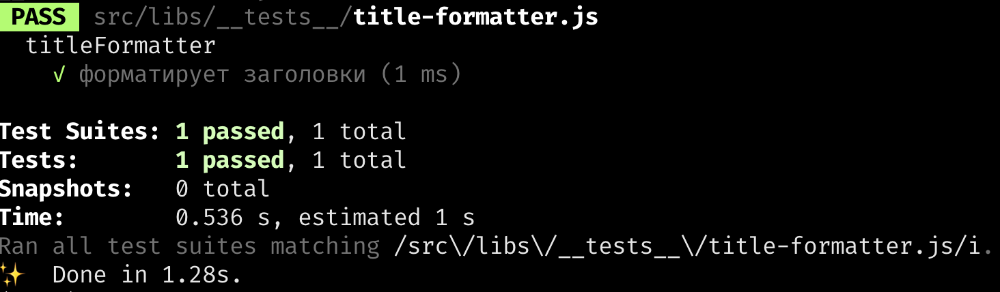
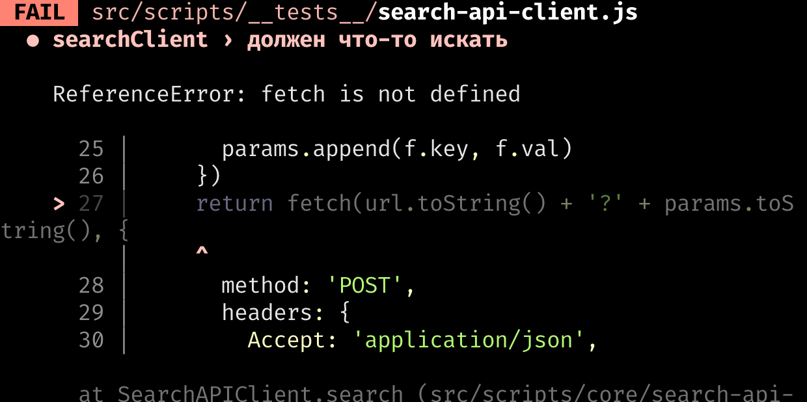
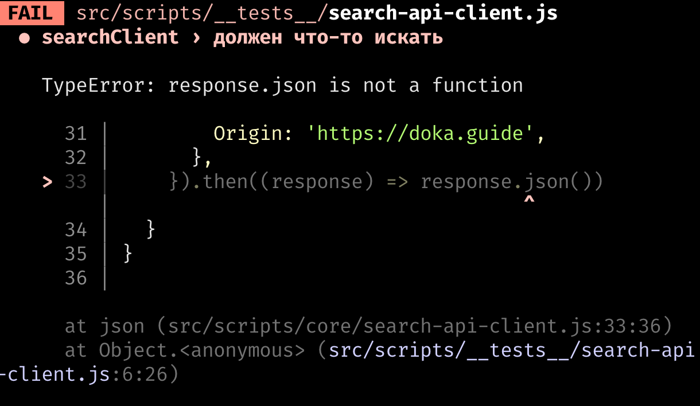
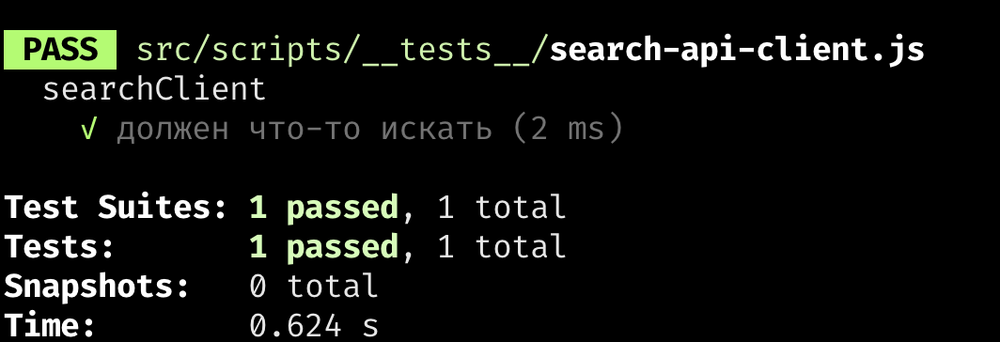
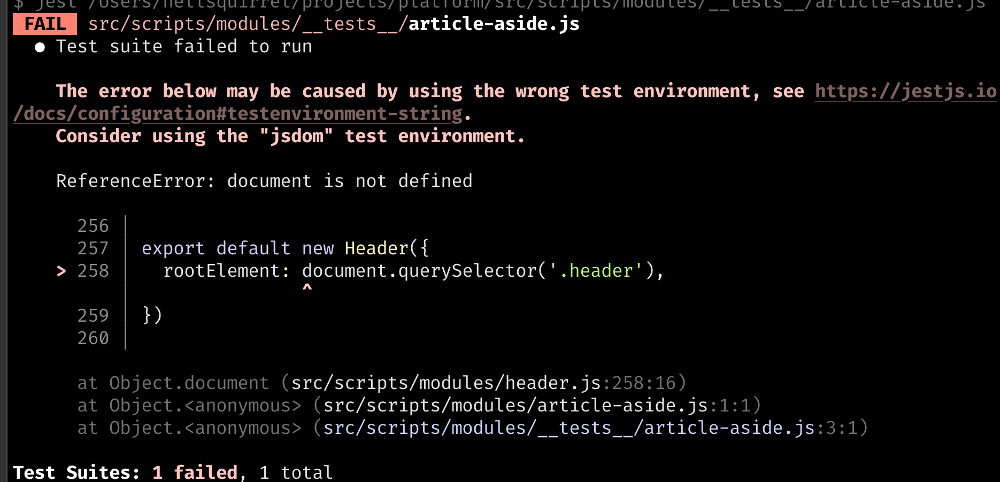
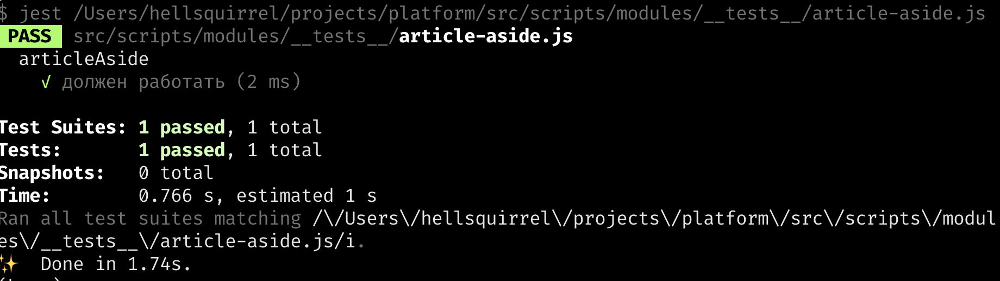

## Немного очевидностей

Пишите тесты для кода. При написании тестов вы глубже анализируете поведение приложения. Тест документирует поведение кода понятным для коллег-разработчиков языком. Приложение становится надёжным и гибким. Рефакторинг не причиняет боли. Тесты на CI позволяют всей команде спать спокойно. Тесты на `git pre-commit hook` не дают запушить сломанный код в репозиторий. Зелёные галочки успокаивают.

## Как начать писать тесты?

Сначала нужно понять какие именно тесты вы хотите написать и выбрать подходящий для них фреймворк. Разобраться в тестах и фреймворках помогут эти статьи:

- [Как и зачем писать тесты](/tools/how-to-test-and-why/).
- [Фиктивные объекты и данные, моки, стабы](/tools/testing-and-fake-objects/).

Если вы не любите читать, но любите смотреть, предлагаем три коротких видео:

- [Пишем первый тест в проект](https://youtu.be/-7G6WBYaTeU),
- [Пишем тест для асинхронного кода](https://youtu.be/OSX9Fbr6faE),
- [Пишем тест для работы с DOM](https://youtu.be/-7G6WBYaTeU).

В них показано всё, что будем делать.

Напишем несколько тестов для разных кусочков [платформы Доки](https://github.com/doka-guide/platform).

Для тестов будем использовать [Jest](https://jestjs.io/).

## Настраиваем Jest

У фреймворка Jest [отличная документация](https://jestjs.io/docs/getting-started), в которой можно найти всю необходимую информацию по настройке.

Чтобы правильно настроить Jest на платформе Доки, нужно научить его выполнять тесты для двух разных окружений:

- для браузера, чтобы тестировать странички Доки;
- для Node.js, чтобы тестировать сборку платформы Доки.

Хорошие новости: Jest может поддерживать различные окружения. Кроме этого нам понадобится специальный [трансформер](https://jestjs.io/docs/code-transformation) — **babel-jest**, который поможет удобно использовать как _нативные ES модули_, так и старый-добрый _CommonJS_.

Итоговый файл конфигурации будет выглядеть так:

```js
module.exports = {
  testEnvironment: 'jest-environment-node',
  setupFilesAfterEnv: ['<rootDir>/jest.setup.js'],
  transform: {
    '\\.[jt]sx?$': 'babel-jest',
  },
}
```

Его нужно положить в корень проекта и назвать _jest.config.js_.

## Запускаем тесты, которых пока нет

Чтобы запустить тесты, создадим отдельную команду в [файле _package.json_ нашей платформы](https://github.com/doka-guide/platform/blob/09ac9232e199f802e92c52143733edfb990180ec/package.json#L33):

```json
{
  "scripts": {
    "test": "jest"
  }
}
```

В реальных приложениях [конфигурация тестов](https://github.com/apollographql/apollo-client/blob/78f6d27d2d926c56cefd54d6f3e2371eb7e890d1/package.json#L53) более затейливая. Может понадобиться несколько команд для запуска разных тестов или придётся запускать их с разными параметрами.

## Пишем первый тест

Протестируем [функцию форматирования заголовков](https://github.com/doka-guide/platform/blob/main/src/libs/title-formatter/title-formatter.js). Код функции выглядит так:

```js
function titleFormatter(segments) {
  return segments.filter(Boolean).join(' — ')
}
```

Нужно убедиться что эта функция… форматирует заголовки 😁 Для этого не нужно думать, нужно просто написать тест.

Создадим папку *__tests__* где-нибудь поближе к файлу с функцией форматирования заголовков и добавим в неё первый тест.

```js
// src/libs/__tests__/title-formatter.js
import { titleFormatter } from '../title-formatter/title-formatter'

describe('titleFormatter', () => {
  it('форматирует заголовки', () => {
    const formattedTitle = titleFormatter(['test', 'test2'])
    expect(formattedTitle).toEqual('test — test2')
  })
})
```

Запускаем:

```bash
npm run test
```

Весёлые зелёные галочки сообщают, что все получилось.



Если вы хотите перезапускать тесты по мере изменения кода, используйте флаг `--watch`:

```bash
npm run test -- --watch
```

Возможно вы задаётесь вопросом: зачем писать тест для такой простой функции? Или думаете «Хм, написать семь строчек кода чтобы проверить однострочную функцию это не продуктивно». Представьте себе что кто-то решил изменить функцию и добавить к ней ещё один параметр, например вот так:

```js
function titleFormatter(separator = ' — ', segments) {
  return segments.filter(Boolean).join(separator)
}
```

Тесты сразу же начнут падать. Это заставит ваших коллег проверить везде ли используется правильная сигнатура этой функции. Семь строк кода защитят от ошибки `Uncaught TypeError: Cannot read properties of undefined (reading 'filter')` в приложении.

## Попробуем что-то посложнее

Для второго упражнения попробуем потестировать функционал поиска. Он живёт в [файле _src/scripts/core/search-api-client.js_](https://github.com/doka-guide/platform/blob/main/src/scripts/core/search-api-client.js) платформы доки. Будет тестировать функцию `search()`.

Посмотрим, что делает функция.

```js
search(query, filters = []) {
  let url = new URL(this.url)
  let params = new URLSearchParams(url.search)
  params.append('search', query.replaceAll('+', '%2B').replaceAll('-', '%2D'))
  filters.forEach((f) => {
    params.append(f.key, f.val)
  })
  return fetch(url.toString() + '?' + params.toString(), {
    method: 'POST',
    headers: {
      Accept: 'application/json',
      Origin: 'https://doka.guide',
    },
  }).then((response) => response.json())
}
```

Метод `search()` использует асинхронную функцию `fetch()`. Это нужно будет учесть в тесте. Первые шаги уже понятны: создаём папку *__tests__*, закидываем в неё _search-api-client.js_. Так как поиск асинхронный, тест тоже будет асинхронный.

```js
import searchClient from '../core/search-api-client.js'

describe('searchClient', () => {
  it('должен что-то искать', async () => {
    const searchResult = await searchClient.search('test')
    const expected = {
      title: 'Как и зачем писать тесты',
      link: '/tools/how-to-test-and-why/',
      category: 'tools',
    }

    expect(searchResult).toEqual(expected);
  })
})
```

Запустим тест. Он упадёт. Пока это ожидаемое поведение.



Похоже, тестирующая функция ничего не знает о существовании функции `fetch()`. Есть несколько способов решить эту проблему. Например, можно добавить в тестовое окружение полифил для функции `fetch()` и делать реальные запросы к [API](/tools/api/) Доки. При этом мы не сможем запускать наши тесты в оффлайн-режиме и будем привязаны к конкретной реализации API. Для некоторых систем это абсолютно нормально, но для нашего простого случая поступим иначе – определим функцию `fetch()` прямо внутри теста.

```js
import searchClient from '../core/search-api-client.js'

describe('searchClient', () => {
  it('должен что-то искать', async () => {
    global.fetch = jest.fn(() => Promise.resolve(42))
    const searchResult = await searchClient.search('test')
    const expected = {
      title: 'Как и зачем писать тесты',
      link: '/tools/how-to-test-and-why/',
      category: 'tools',
    }

    expect(searchResult).toEqual(expected)
  })
})
```

Наша заглушка для `fetch()` всегда возвращает [Promise](/js/promise/), который резолвится числом `42`. Тест по-прежнему не проходит.



На этот раз Jest не доволен значением, c которым резолвится промис. В Доке есть статья, которая подскажет, что же [должен возвращать `fetch()`](/js/fetch/). Прочтём её и уверенно поправим тест:

```js
describe('searchClient', () => {
  it('должен что-то искать', async () => {
    const expectedResult = {
      title: 'Как и зачем писать тесты',
      link: '/tools/how-to-test-and-why/',
      category: 'tools',
    }

    const json = jest.fn(() => Promise.resolve(expectedResult))
    global.fetch = jest.fn(() =>
      Promise.resolve({
        json,
      })
    )

    const searchResult = await searchClient.search('test')
    expect(searchResult).toEqual(expectedResult)
  })
})
```

Запускаем тест и видим, что он проходит.



Осталось разобраться с двумя непонятностями:

- Что вообще мы тестируем?
- Зачем нужен этот странный `jest.fn()`?

Полезное упражнение попробовать пересказать тест словами. Сейчас мы проверяем, что функция `search()` возвращает ожидаемое значение при условии, что глобальная функция `fetch()` работает так, как это определили. В текущей реализации поиск всегда будет возвращать одно и то же значение для любых запросов. Это не то, как работает поиск на самом деле.

Давайте добавим дополнительную проверку, чтобы убедиться, что используется правильный `URL` для поиска. Заодно разберёмся c [`jest.fn()`](https://jestjs.io/docs/mock-functions). Эта функция позволяет заменить (замокать) реализацию модулей или функций. Она следит за тем, сколько раз и с какими параметрами была вызвана функция и предоставляет удобный доступ к этой информации. Например, можем проверить, что вызвали `fetch()` только один раз `expect(global.fetch).toHaveBeenCalledTimes(1)`. Или посмотреть что параметр запроса передаётся так как нужно. Получился вот такой тест:

```js
describe('searchClient', () => {
  it('должен что-то искать', async () => {
    const expectedResult = {
      title: 'Как и зачем писать тесты',
      link: '/tools/how-to-test-and-why/',
      category: 'tools',
    }

    const json = jest.fn(() => Promise.resolve(expectedResult))
    global.fetch = jest.fn(() =>
      Promise.resolve({
        json,
      })
    )

    const searchResult = await searchClient.search('test')
    expect(searchResult).toEqual(expectedResult)
    expect(global.fetch.mock.calls[0][0]).toContain('search=test')
  })
})
```

И он проходит 🥳


## И ещё один маленький тест

Теперь потренируемся писать тесты для функций работы с [DOM](/js/dom/) (Document Object Model). Будем тестировать функцию `init()` в [файле _article-aside.js_](https://github.com/doka-guide/platform/blob/main/src/scripts/modules/article-aside.js) репозитория платформы. Внутри эта функция использует объект `headerComponent`, который является чем-то вроде [_EventEmitter_](https://nodejs.dev/en/learn/the-nodejs-event-emitter/). Навешиваем на `headerComponent` два обработчика событий: `fixed` и `unfixed`. Меняем класс нашего компонента в момент когда одно из этих событий происходит.

Мы чуть-чуть изменили изначальный файл. Добавили в него ключевое слово `export` перед функцией `init()`, чтобы её можно было тестировать.

Если приходится изменять код под тесты, обычно это значит, что делаете что-то не то или что код написан не совсем правильно. Нам пришлось дописать `export`. Это значит, что:

- функцию `init()` тестировать не нужно;
- забыли экспортировать функцию `init()`.

Давайте предположим, что верно второе утверждение. Так выглядит файл, который будем тестировать:

```js
// article-aside.js
import headerComponent from './header.js'

export function init() {
  const articleAside = document.querySelector('.article__aside')

  if (!(articleAside && headerComponent)) {
    return
  }

  const activeClass = 'article__aside--offset'

  headerComponent.on('fixed', () => {
    articleAside.classList.add(activeClass)
  })

  headerComponent.on('unfixed', () => {
    articleAside.classList.remove(activeClass)
  })
}
```

Напишем первую версию теста:

```js
import { init } from './article-aside.js'

describe('article-aside', () => {
  it('должен работать', () => {
    expect(init).toBeDefined()
  })
})
```

Казалось бы, этот тест точно должен проходить, однако получаем ошибку.



Тест ругается на то, что переменная `document` не определена. Но подождите… у нас же нет никакого документа в файле, который мы тестируем. Мы даже не выполнили функцию `init()`.

Мы столкнулись с _эффектом при импорте_. При первом импорте модуля, JS-движок выполняет код этого модуля. В нашем случае _article-aside.js_ импортирует что-то из модуля _header.js_. Похоже, код в модуле _header.js_ трогает DOM (обращается к переменной `document`).

Код с эффектами очень сложно тестировать. Более того, ваши коллеги могут даже не подозревать о том, что при импорте какой-то функции из модуля она поменяет DOM. Хорошая практика — избегать чрезмерного использования эффектов в модулях и функциях. Если есть возможность, старайтесь писать _чистые_, безэффектные функции и модули.

Но вернёмся к тесту. Нужно как-то добавить DOM, чтобы он не падал. Для этого нужно поменять тестовое окружение. Это можно сделать в настройках тестов _jest.config.js_ или использовать специальный doc-комментарий в начале файла с тестом.

```js
/**
 * @jest-environment jsdom
 */
```

Подробнее о разных тестовых окружениях можно почитать в [документации Jest](https://jestjs.io/docs/configuration#testenvironment-string) про окружения `testEnvironment`.

Окружение [_jsdom_](https://github.com/jsdom/jsdom) позволяет вам эмулировать браузерный контекст в Node.js. Вам становится доступна переменная `document`, вы можете использовать многие DOM API. Если элемент присутствует в HTML, переданном в _jsdom_, можете работать с ним точно так же как в браузере.

После добавления нужного комментария тест начнёт проходить. Теперь нужно убедиться, что функция `init()` сработала как нужно. Для этого проверяем, что для элемента с классом `article__aside` добавился класс `article__aside--offset`, когда произошло событие `fixed`. Но как вызвать событие `fixed`? 🤔

Заглянем в [_header.js_](https://github.com/doka-guide/platform/blob/main/src/scripts/modules/header.js) и увидим аж 250 строчек кода. Мы не очень-то хотим разбираться, что делает этот код. Давайте просто заменим настоящий _header.js_ заглушкой (моком). Для этого пригодится магия [`jest.mock()`](https://jestjs.io/docs/bypassing-module-mocks).

```js
jest.mock('../header', () => {
  const fixed = []
  return {
    on: (eventName, callback) => {
      if (eventName === 'fixed') {
        fixed.push(callback)
      }
    },

    callFixed: () => {
      fixed.forEach((callback) => callback())
    },
  }
})
```

В качестве первого аргумента передаём путь до модуля, который хотим замокать, а в качестве второго — реализацию этого модуля. Здесь мы эмулируем очень простой _EventEmitter_, который собирает колбэки в массив и вызывает их как только срабатывает нужное событие. Чтобы событие `fixed` сработало, нужно вызвать функцию `callFixed`.

Вместе с моком получится вот такой тест:

```js
/**
 * @jest-environment jsdom
 */

import { init } from '../article-aside'

jest.mock('../header', () => {
  const fixed = []
  return {
    on: (eventName, callback) => {
      if (eventName === 'fixed') {
        fixed.push(callback)
      }
    },

    callFixed: () => {
      fixed.forEach((callback) => callback())
    },
  }
})

import { callFixed } from '../header'

describe('articleAside', () => {
  it('должен работать', () => {
    const testDiv = document.createElement('div')
    testDiv.className = 'article__aside'
    const classToCheck = `article__aside--offset`;
    document.body.appendChild(testDiv)
    init()
    expect(testDiv.classList.contains(classToCheck)).toBe(false)
    callFixed()
    expect(testDiv.classList.contains(classToCheck)).toBe(true)

  })
})

```

Сначала проверяем, что класс `article__aside--offset` не добавлен к элементу, потом вызываем `callFixed` и проверяем, что класс добавлен. Как всегда, не надо думать, надо написать тест!

Запускам-проверяем. Тест проходит 🎉



Итак, мы научились писать простые и сложные тесты, мокать модули и функции, разобрались с окружениями и получили первое представление о том, чем отличается тестируемый код от нетестируемого. Что дальше?

Если в вашем проекте нет тестов, попробуйте добавить хотя бы один. Через некоторое время будете удивляться, как раньше работали без них 🤓 Если нет подходящего проекта, но хочется потренироваться, приносите тесты [в платформу Доки](https://github.com/doka-guide/platform).
