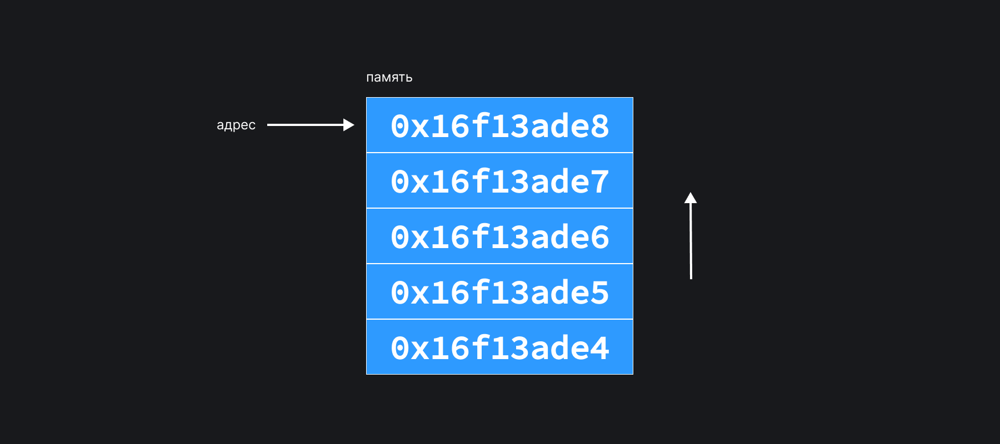
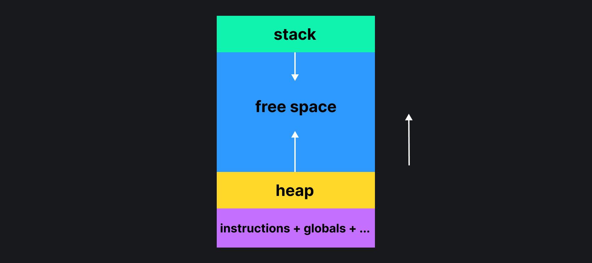
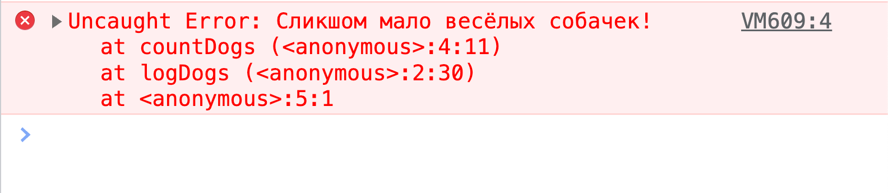

## Зачем мне понимать модели памяти?

При изучении нового языка программирования, вы быстро напишите свой первый `Hello, world!` и начнёте использовать переменные.

<aside>

Так происходит, например, когда учите JavaScript. А вот если изучаете Haskell, "Hello, world!" станет для вас наградой после прочтения первой половины книги 🙂 И «переменные» окажутся «постоянными».

</aside>

Но что действительно происходит при создании или присваивании переменных, и как выполняются функции? Во всех этих процессах участвует память. Если вы примерно поймёте, как она устроена, будет значительно проще использовать инструменты разработчика и легче ответить на вопросы, связанные с памятью.

## Древние модели памяти

В давние времена, когда компьютеры только изобретали, было предложено две модели их устройства:

- [Фон Неймана](https://ru.wikipedia.org/wiki/%D0%90%D1%80%D1%85%D0%B8%D1%82%D0%B5%D0%BA%D1%82%D1%83%D1%80%D0%B0_%D1%84%D0%BE%D0%BD_%D0%9D%D0%B5%D0%B9%D0%BC%D0%B0%D0%BD%D0%B0);
- [Гарвардская](https://ru.wikipedia.org/wiki/%D0%93%D0%B0%D1%80%D0%B2%D0%B0%D1%80%D0%B4%D1%81%D0%BA%D0%B0%D1%8F_%D0%B0%D1%80%D1%85%D0%B8%D1%82%D0%B5%D0%BA%D1%82%D1%83%D1%80%D0%B0).

Эти архитектуры во многом схожи: процессор выполняет различные операции с данными. Какую именно операцию выполнить определяет _инструкция_. Инструкции и данные поступают к процессору из памяти. Память разделена на ячейки, каждая ячейка заботливо пронумерована. Номер ячейки называется адресом в памяти. Адрес — величина фиксированной длинны. Процессор может обращаться к любой ячейке, не обязательно делать это по порядку. Если данные не влезают в одну ячейку, их можно разместить в нескольких.

Основное отличие между этими моделями заключается в том, как именно хранятся инструкции и данные. В Гарвардской модели данные и инструкции разделены, а в архитектуре Фон Неймана они помещаются в одно хранилище. Это значит, что процессор, который использует данные и инструкции, будет доставать их одинаковым способом — с помощью одной шины. Используйте архитектуру Фон Неймана как ментальную модель, чтобы представить себе, что происходит в памяти, когда запускается программа.

<aside>

🧐 На самом деле в ваших компьютерах используется гибрид двух архитектур. Например, в ближайших к процессору кешах данные и инструкции разделены.

</aside>

<aside>

Количество возможных адресов памяти определяется длиной адреса. Длина зависит от архитектуры процессора. Например, 64-битный адрес позволяет обратиться к 18 446 744 073 709 552 000 ячейкам памяти. Это примерно 18 эксабайт 🤯

</aside>



## Модели памяти. Чуть ближе к реальности

Модель выше хорошо подходит для рассуждений о работе программы. В реальности всё немного сложнее. Адреса, на которые смотрели в предыдущем разделе, — _виртуальные_. Чтобы обратиться к реальному адресу, вашему процессору нужно превратить _виртуальный_ адрес в _физический_ адрес ячейки оперативной памяти.

Когда процессу требуется память, операционная система выдаёт процессу блок памяти, называемый страницей (page). Обычно размер страницы относительно небольшой — 4–8 Кб. Процессу можно выдавать много страничек. Эти страницы — _виртуальные_ кусочки памяти, которые как-то отображаются на физическую память.

## Кто и как использует память

Операционная система запускает программу в рамках определённого процесса. Для этого процесса выделяются ресурсы и адресное пространство – то, какие адреса памяти может использовать данный процесс. Операционная система гарантирует, что один процесс не будет иметь доступа к памяти другого процесса, если другой процесс этого не разрешит.

В рамках процесса может существовать один или несколько потоков. Для каждого потока выделяется кусочек памяти.

<aside>

Помните, что это модель. В реальности кто и как запускает поток зависит от того, на чём и для чего пишете программу. Посмотрите, например, [на POSIX Threads](https://en.wikipedia.org/wiki/Pthreads).

</aside>

В этот кусочек памяти загружается код программы, глобальные переменные и ещё кое-что. В этом же кусочке памяти выделяются две важные области: _стек (stack)_ и _куча (heap)_. Стек — это область памяти, которую очень легко выделять.

<aside>

Чтобы выделить или удалить память на стеке, нужно просто переместить специальный указатель — _stack pointer (указатель стека)_. Значение текущего указателя хранится в специальном регистре процессора, что означает, что выделять и удалять память на стеке можно очень быстро. Этот указатель всегда указывает следующую свободную ячейку памяти стека.

</aside>

Данные на стеке можно читать. Данные нужно «положить» на стек, чтобы их записать. Вы не можете записать данные в произвольную область стека, только в конец. Также не можете удалить данные из произвольной области стека, однако возможно перемотать указатель стека. Это равносильно удалению всех данных.

Программа в процессе выполнения активно работает со стеком. Память для стека может закончиться, тогда возникнет всем известное _переполнение стека (stack overflow)_.

Очень популярная и известная картинка, которая объясняет всё:



Стек и куча растут навстречу друг другу 🤗

## Что происходит со стеком

Давайте посмотрим на функцию подсчёта собачек `countDogs()`. Она принимает один аргумент — `happyDogs`, создаёт внутри переменную `sadCoefficient` и как-то считает количество собачек.

```js
function countDogs(happyDogs) {
  const sadCoefficient = 0.1;
  return happyDogs + sadCoefficient * happyDogs;
}
```

Чтобы выполнить эту функцию, нужно положить аргументы функции и локальные переменные на стек. Кроме этого, нужно понимать, какой код выполнить после того, как функция завершится. Для этого на стеке создаётся _stack_frame_. В нём хранятся аргументы и локальные переменные. После того как функция выполнится, стек фрейм удаляется вместе со всем аргументами и переменными функции. При создании стек фрейма используется ещё одна полезная штука – _указатель на фрейм (frame pointer)_. Этот указатель всегда указывает на активный фрейм на стеке.

Давайте посмотрим, что произойдёт, если захотим посчитать собачек в консоли.

```js
function logDogs() {
  console.log(countDogs(20), countDogs(9));
}

logDogs();
```

1. На стеке создастся фрейм для функции `logDogs()`.
1. Потом добавится фрейм для первого вызова `countDogs(20)`.
1. После выполнения функции `countDogs(20)` фрейм удаляется.
1. Потом добавится фрейм для второго вызова `countDogs(9)`.
1. После выполнения функции `countDogs(9)` фрейм удаляется.
1. После выполнения функции `logDogs()` фрейм удаляется.

Фрейм для функции `countDogs()` будет содержать аргумент функции (20) и локальную переменную (`sadCoefficient`).

<aside>

Вы же всё ещё помните, что это модель? JavaScript слабо типизированный язык. Если это учитывать, наша ментальная модель сломается. Чтобы выделить на стеке память под аргументы и локальные переменные, нужно знать, сколько памяти выделять. Так как мы не знаем тип переменной, не понятно, сколько памяти под неё нужно выделить. Компилятор JavaScript делает некоторые предположения о типах переменных и на их основе выделяет память на стеке. Эти предположения могут оказаться ошибочными, но это уже совсем другая история.

</aside>

Если в процессе выполнения функции код выбросит ошибку, то произойдёт _разматывание стека (stack unwinding)_. Вы увидите в консоли знакомый _stack trace_.



Давайте модифицируем функцию `countDogs()` и заставим её выкинуть ошибку.

```js
function countDogs(happyDogs) {
  const sadCoefficient = 0.1;
  if (happyDogs < 10) {
    throw new Error('Слишком мало весёлых собачек!');
  }
  return happyDogs + sadCoefficient * happyDogs;
}
```

Получим следующий результат, когда запустим код из этого примера в консоли браузера:

```
Uncaught Error: Слишком мало весёлых собачек!
    at countDogs (<anonymous>:4:11) <-- вот фрейм count dogs
    at logDogs (<anonymous>:2:30) <-- вот фрейм logDogs
    at <anonymous>:1:1
```

Увидим при разматывании стека, что сначала будет удалён фрейм `countDogs()`, а потом `logDogs()`. После этого выполнение кода прекратится.

## Зачем нужна куча?

Данные на стеке хранятся не долго. Когда функция завершает своё выполнение, то все данные удаляются. Кроме этого, вы не можете положить на стек данные произвольного размера.

Рассмотрим функцию работы с массивом `createDogArray()`.

```js
function createDogArray() {
  const dogs = ['🐶', '🐶', '🐶']; // 3 элемента
  if (Math.random() > 0.5) {
    dogs.push('🐶'); // а может и 4 элемента :)
  }
}
```

Мы создали массив из 3 элементов. Теперь нужно положить на стек переменную `dogs`, которая содержит этот массив. Для этого нужно выделить место под переменную. Всё было хорошо, пока мы не решили случайным образом добавить ещё одну собачку. Получается, что количество элементов в массиве `dogs` неизвестно, и непонятно, сколько памяти под него нужно выделить.

Вот как куча решает эту проблему: выделятся специальный кусочек памяти под массив. Адрес этого кусочка в памяти запоминается и «записывается» в `dogs`. Как мы знаем, адрес имеет фиксированный размер, так что сможем положить переменную `dogs` с адресом на стек. Когда понадобится модифицировать массив, возьмём адрес в куче, найдём по этому адресу массив и добавим в него новую собачку.

## Упражнение, упражнение!

Теперь вы представляете как устроена память и готовы ответить на вопросы из начала статьи.

Если у вас получилось, приносите ответы в раздел «[На собеседовании](https://github.com/doka-guide/content/blob/main/docs/interviews.md)».
