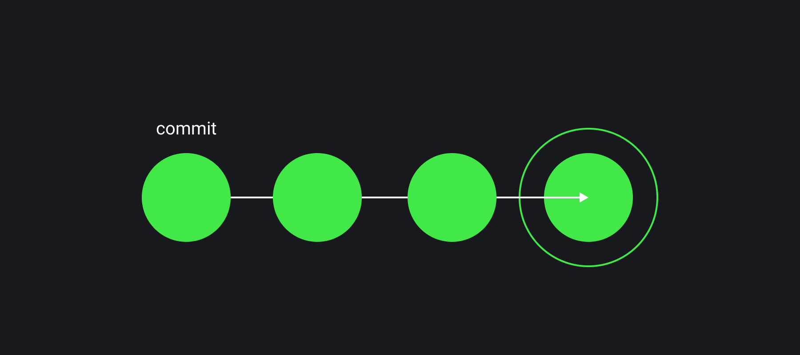
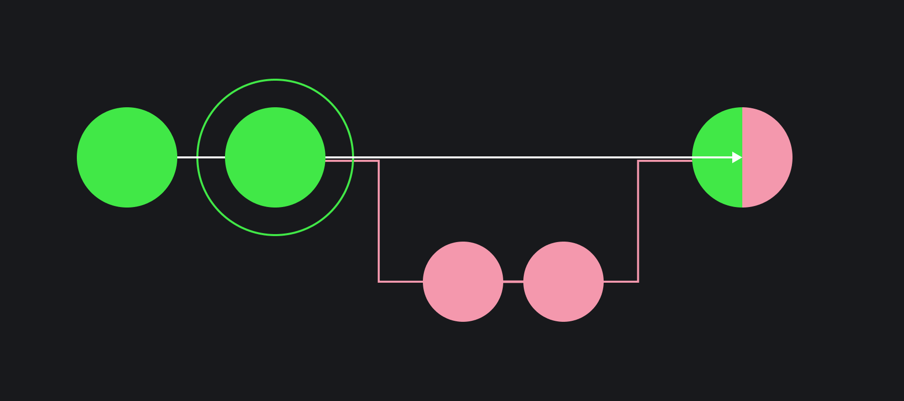

## Кратко

Системы контроля версий — VCS (version control systems) — были придуманы, чтобы контролировать изменения исходного кода и комфортно работать над ним большой командой.

Одна из самых популярных на текущий момент систем — Git. Её используют большое количество проектов. Некоторые компании используют другие системы, например SVN или Mercurial, другие — создают собственные решения, чтобы лучше покрыть свои специфичные потребности.

## Как понять

При разработке программ часто происходят ошибки — одно из изменений может сломать всё приложение. В таком случае нужно быстро вернуть пользователям последнюю работающую версию. С другой стороны, когда над проектом работает большое число людей, бывает полезно знать — кто, когда и какое изменение внёс. Обе эти проблемы решаются сохранением полной истории изменений исходного кода в __системе контроля версий__.

В 2005 году была создана одна из самых популярных на данный момент VCS — __Git__ (произносится «гит»). Для базовых нужд достаточно самых простых возможностей, они покроют большинство потребностей. Но сначала нужно определить несколько понятий.

__Репозиторий__ — это общее название для хранилища исходного кода. Часто говорят об __удалённом репозитории__ (копия кода на каком-то сервере) и __локальном репозитории__ (копия на компьютере разработчика).

Код в репозитории хранится в виде истории __коммитов__ — зафиксированных состояний исходного кода в определённый момент времени. Получить любое состояние можно практически мгновенно, не применяя последовательно все изменения.

Важное отличие VCS от любого другого хранилища файлов с историей — это коммиты. С их помощью можно зафиксировать текущее состояние проекта с общим описанием.



При этом история может ветвиться. То есть в какой-то момент один из разработчиков может начать делать изменения и после коммита А сделать коммиты Б и В, а другой разработчик после коммита А сделает коммиты Г и Д. Так появится две альтернативные истории изменений. Такие параллельные истории называются __ветками__. Чтобы совместить эти изменения в единой кодовой базе, ветки нужно будет слить.

Обычные хранилища файлов не могут показывать параллельные истории одного и того же файла, а VCS — умеет.



## Как пользоваться

Система контроля версий — это интерактивный инструмент для работы с историей проекта. С помощью VCS можно не только узнать кто и когда внёс определённую правку, но и вернуть состояние исходного кода на **любой момент** времени.

Чтобы воспользоваться Git, нужно [установить его](https://git-scm.com/downloads) на свой компьютер. После этого в терминале следует перейти в папку проекта и инициализировать репозиторий.

```bash
git init
```

Теперь можно добавить все файлы проекта к списку отслеживаемых изменений.

```bash
git add --all
```

И создать новый коммит.

```bash
git commit -m "Комментарий к первому коммиту"
```

Последние две команды стоит выполнять после каждого значимого изменения исходного кода, добавляя осмысленное описание.
