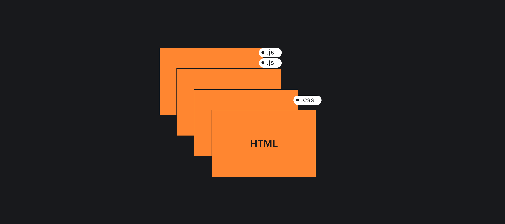
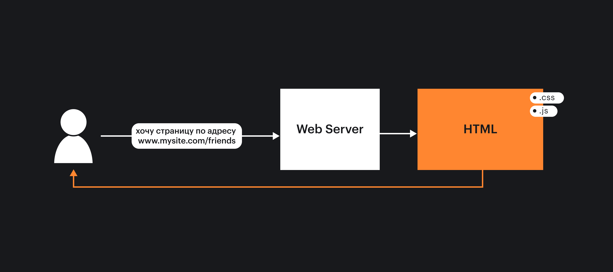
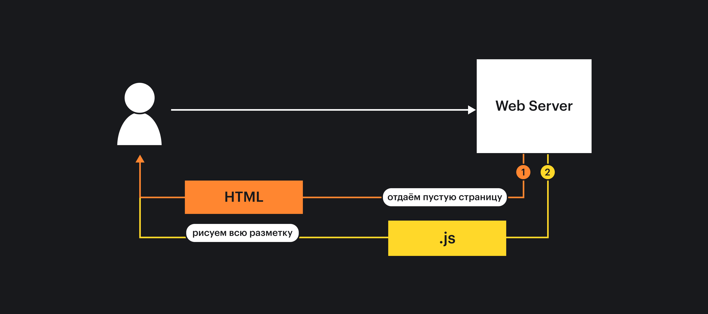
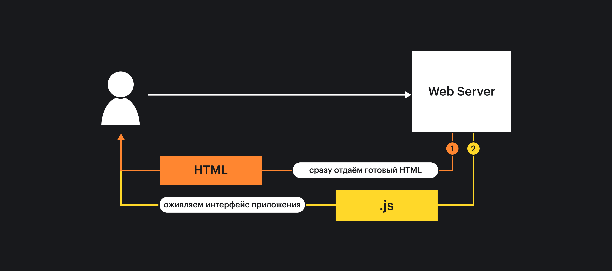
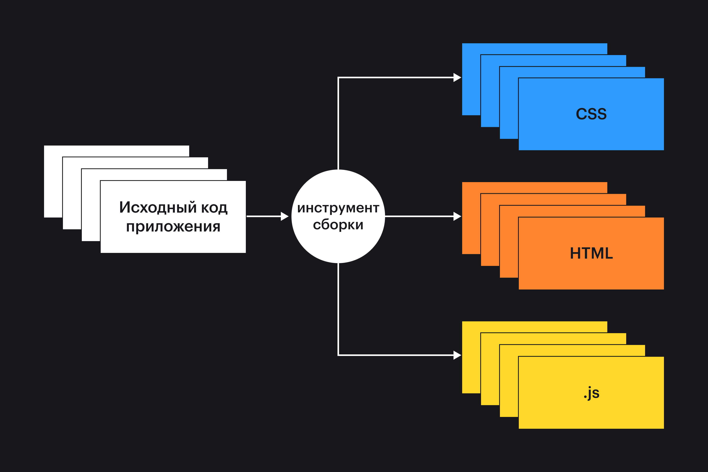

## Кратко

Все веб-приложения делаются с помощью одних и тех же технологий: HTML, CSS и JavaScript. Однако есть много способов организации работы приложения. Выбор способа зависит от цели приложения и пользовательского опыта, которого мы хотим добиться. Хотя основных подхода всего два: многостраничные приложения и Single Page Applications, каждый из них делится на подвиды.

_Статические многостраничные приложения_ состоят из набора статичных страниц. Их просто разрабатывать, но если страниц становится много (сотни и тысячи), или данные на странице меняются, то придётся генерировать их на лету. Для этого нужно подключать сервер и писать дополнительный код. На каждый переход нужно генерировать и загружать новую страницу, а это занимает время.

_Одностраничные приложения (SPA)_ дают возможность разрабатывать клиентские приложения со сложной логикой с помощью JavaScript. В этом подходе отрисовкой содержимого на странице управляет JavaScript. Переходы между экранами будут мгновенными, и пользователь сразу увидит результат своих действий. Однако такой подход создаёт новые проблемы. Как не загружать в браузер слишком много кода? Как обеспечить хорошую производительность? Где рендерить приложение: только на клиенте или на сервере?
Разработка таких приложений часто сложнее, так как может потребовать знания различных инструментов и фреймворков.

## Многостраничные приложения

Многостраничные приложения – это набор статичных веб-страниц, которые связаны между собой с помощью [ссылок](/html/a/). При клике на ссылки происходит переход между страницами, что ведёт к полному обновлению страницы в браузере. Это одно из наиболее значимых отличий от SPA, о нем поговорим отдельно.

Для начала выделим два основных вида многостраничных приложений:
- _Набор готовых свёрстанных страниц_, которые лежат на сервере и вместе с ними находятся и другие статичные файлы (CSS, JavaScript и картинки). Сервер отдаёт эти файлы по заранее настроенным путям.
- _Динамическая генерация HTML на сервере_. Чаще всего такое решение можно встретить на языках программирования PHP, Python и Ruby. При каждом запросе сервер запускает скрипт генерации HTML-страницы. Скрипт может взять данные из базы данных, произвести вычисления и собрать готовый HTML-код страницы.

### Готовые веб-страницы

Подходят, если нужно собрать несколько связанных страниц, которые, по большей части, будут содержать статичную информацию, с которой пользователь может мало взаимодействовать. Например, лендинг – это веб-сайт, который представляет информацию о компании, товарах или продукте.

Разработка при таком подходе обычно самая простая. Рядом складываются несколько html-файлов, в которых содержится вся необходимая вёрстка и дополнительные CSS/JavaScript файлы, подключённые к странице. В продвинутом варианте можно переиспользовать части кода с помощью шаблонизаторов (например, [Pug](https://pugjs.org/api/getting-started.html)) и собрать сайт по кусочкам используя сборщики (Gulp, Rollup, Webpack и др.). В результате на сервер попадёт набор статичных файлов, которые будут раздаваться с помощью веб-сервера ([Nginx](/tools/nginx-web-server/), [Apache](/tools/apache-web-server/)).

Преимущество такого подхода — это отличная производительность. Статичные страницы и файлы легко кэшировать с помощью браузера, CDN или Service Worker.

### Динамическая генерация HTML

Динамическая генерация HTML страницы часто использовалась до изобретения Single Page подхода. Так до сих пор работает большинство форумов, интернет-магазинов, а так же большие приложения, как Facebook или ВКонтакте.

Особенность этого подхода в использовании серверных языков программирования (например, PHP или Ruby), чтобы генерировать итоговый HTML страницы, собирая его из разных частей и обогащая данными.

Например, пользователь перешёл на страничку со списком друзей:

1. Сервер получает запрос.
1. Идёт в базу данных, выбирает список друзей и вспомогательные данные.
1. По шаблону собирает HTML.
1. Отправляет HTML в виде ответа на запрос.

Пользователь сразу получает сгенерированную страницу со списком друзей. Если добавить новых друзей и зайти на страничку ещё раз, то результат будет другой, ведь список друзей изменился.

Использование сервера для генерации содержимого позволяет не нагружать клиентский код сложной логикой, а значит итоговый размер страницы будет меньше. При этом статичные части приложения и целые куски страниц можно так же легко кэшировать.

При всех плюсах многостраничных приложений, все они страдают от одного главного недостатка: при переходе между страницами браузер полностью обновляет содержимое, из-за чего нельзя создать полноценный опыт взаимодействия «как в приложении»: незакэшированным страницам нужно время для загрузки, а значит не будет мгновенного перехода; будет сбиваться положение полосы прокрутки и т.д.

В стремлении решить эти проблемы и создать полноценный опыт приложений веб-разработчики изобрели одностраничные приложения.

## Single page applications (SPA)

_Одностраничные приложения (сокращённо SPA)_ состоят из одной страницы, а всю остальную работу (создание содержимого, переход между экранами и получение данных) выполняет JavaScript. Такой подход позволяет создать полноценный опыт приложения: переходы между экранами происходят мгновенно, можно давать пользователю визуальный ответ, пока данные загружаются асинхронно с помощью [API](/js/api/).

Разработка одностраничных приложений имеет богатую экосистему: фреймворки и библиотеки для создания интерфейсов, подходы к разработке, архитектурные паттерны. Одностраничные приложения делятся по месту начальной отрисовки страницы: в браузере (client side rendering) или на сервере (server side rendering).

### Client Side Rendering (CSR)

В таком приложении вся отрисовка содержимого страницы, включая первую, происходит в браузере. Пользователь должен сначала загрузить весь JavaScript, и только после этого что-то сможет отрисоваться. До этого момента страница будет либо пустой, либо будет содержать статическую заглушку-лоадер.

<video controls muted width="400" height="660">
  <source src="video/twitter_loading.mp4" type="video/mp4">
  <source src="video/twitter_loading_safari.mp4" type="video/mp4">
</video>

Это самым простой способ отображения SPA. Он подходит для небольших приложений, так как оно быстро загружается и запускается. Если кода много и приложение получается большим, пользователи со слабыми устройствами или медленным интернетом могут не дождаться загрузки и уйти.

SPA не работает без JavaScript. Если по какой-то причине пользователь отключил его в своём браузере, то одностраничное приложение не запустится вовсе.

Это требование особенно важно в контексте того, как поисковые сервисы индексируют SPA. Раньше поисковики не умели выполнять JavaScript и потому одностраничные приложения не попадали в результаты поиска. Сейчас ситуация изменилась, поисковые сервисы умеют исполнять JavaScript, но статические сайты до сих пор индексируются лучше.

### Server side rendering (SSR)

Чтобы пользователь не смотрел на пустую страницу в ожидании загрузки приложения, можно отдавать ему сгенерированный сервером HTML. Таким образом пользователь сразу получит ожидаемую страничку и начнёт её просматривать, пока основное приложение загружается и запускается.

Такой подход называется серверным рендерингом. Он помогает улучшить и пользовательский опыт, и позицию сайта в поисковиках. Поиск Google и Яндекса умеет исполнять JavaScript, но сайтам со статическим контентом отдаётся предпочтение.

Главное отличие такого подхода от рендеринга на клиенте — это сервер, который занимается рендерингом. Чаще всего это готовое решение на базе Node.js. Многие SPA-фреймворки имеют проверенные решения для быстрого старта приложения с серверным рендерингом. Например, Next.js для React или Nuxt для Vue.

Своё решение для SSR — непростая задача. Приходится учитывать множество факторов: как и куда сходить за данными, как правильно отрисовать приложение и много других деталей.

Дополнительная серверная часть может потребовать и дополнительной инфраструктуры, из-за чего разработка приложения с server side rendering будет сложнее.

### Static site generation (SSG)

Статические генераторы сайтов позволяют создать приложение, используя статические данные и шаблонизатор. На выходе получается многостраничный сайт. Отличие от классического многостраничного сайта в том, что большинство инструментов для статической генерации поддерживают SPA-фреймворки. Это позволяет объединить плюсы статического и SPA мира.

Самый распространённый пример SSG — это персональный блог. У нас есть тексты статей, а с помощью шаблонизатора эти статьи превращаются в готовые html-странички. Эта страничка и сама Дока, которую вы сейчас читаете, разработана с помощью статической генерации.

Когда говорят об SSG, то часто упоминают Jamstack. Слово Jamstack — это объединение первых букв от слов JavaScript, API, Markdown и слова stack, что в данном случае означает «набор технологий». Технически Jamstack это подход к разработке сайтов и приложений основанный на перечисленных технологиях. Источником данных выступает Markdown (например текст статей блога), JavaScript вместе с React «оживляет» приложение, а с помощью API можно запрашивать наши данные.

Jamstack хорошо подходит для создания сайтов, наполненных статичным контентом, а SPA-фреймворки помогают создать хороший пользовательский опыт, получая при этом плюсы статических сайтов.

## Progressive Web Applications (PWA)

PWA это набор технологий, который позволяет превратить сайт в полноценное приложение. Такое приложение можно установить из браузера себе на компьютер или на телефон. Эта трансформация позволяет веб-приложениям функционировать почти как нативные, например, работать в офлайне или присылать уведомления.

В PWA можно превратить практически любой сайт, главное чтобы он соответствовал [требованиям](https://web.dev/pwa-checklist/) и поддерживал необходимые технологии (Service Worker, HTTPS и так далее).

Конечно такое приложение нельзя считать полноценно нативным, здесь имеются все те же ограничения в веб-технологиях, но это отличная возможность превратить свой сайт в устанавливаемое приложение.

## Заключение

Мы рассмотрели самые распространённые виды веб-приложений, не углубляясь в детали их реализации. Каждый из описанных подходов имеет свои особенности, и потому выбор стоит делать исходя из целей, которые хочется достичь.

Например, переход между многостраничным может быть затруднён если есть проблемы с сетью, при этом одностраничное приложение может продолжать работать и переходить по страницам. Но одностраничные приложения так же могут страдать от проблем с производительностью.

Эти знания должны стать хорошим путеводителем в выборе подходящего типа приложения.
