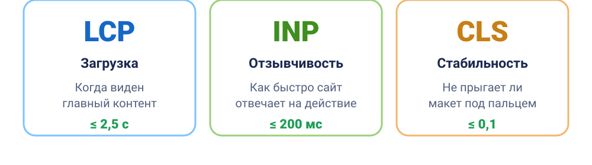
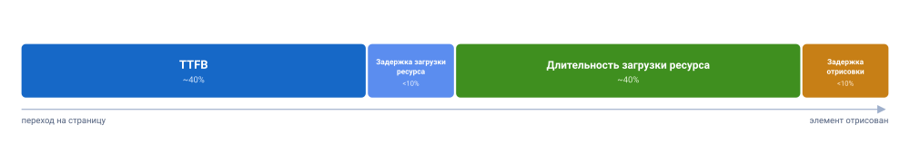

Попробуйте открыть любой веб-сайт. Между кликом по ссылке и моментом, когда сайтом можно пользоваться, браузер получает данные, загружает изображения, стили и скрипты, а затем отрисовывает страницу. На любом этапе может возникнуть задержка: главный контент появляется слишком поздно, элементы прыгают, а кнопки не сразу реагируют на нажатие. Все это производительность и очень долгое время не существовало понятных метрик, как можно сравнить сайты между собой и как понять, что нужно улучшать разработчикам.

В 2020 году компания Google предложила набор метрик, которые описывают визуальный опыт человека конкретными цифрами, и назвала их **Web Vitals**. Самые важные из них получили статус **Core Web Vitals**, или основные метрики. С 2021 года улучшение этих показателей уже не просто рекомендация: Core Web Vitals официально влияют на ранжирование страницы в поиске. Если две страницы одинаково подходят под запрос, то выше в списке окажется та, что быстрее и стабильнее.

Далее разберём, зачем Google ввёл эти метрики, как они рассчитываются, почему их значения ухудшаются и как их улучшить.

## Зачем Google ввёл эти метрики

У производительности сайтов существуют две стороны, и обе важны бизнесу:

**Пользовательский опыт.** Медленный и нестабильный сайт заставляет людей уходить, не дойдя до просмотра, заявки или заказа. Core Web Vitals выражают в понятных показателях три главных раздражителя: долгую загрузку, медленную реакцию на действия и прыжки элементов.

**SEO.** Google встроил Core Web Vitals в сигнал ранжирования Page Experience. При этом Google оценивает метрики не по лабораторным тестам, а по данным реальных пользователей Chrome из отчёта [CrUX (Chrome User Experience Report)](https://cruxvis.withgoogle.com). То есть поисковик смотрит, как ведёт себя сайт на реальных устройствах пользователей.

И сразу нужно запомнить главное: **все Core Web Vitals считаются по 75-му перцентилю**. Метрика считается хорошей только в том случае, если установленному порогу соответствуют не менее 75 % посещений. То есть фокусироваться на быстром сегменте аудитории и не обращать внимания на пользователей с медленными устройствами или со слабым интернетом не получится - Google смотрит именно на «хвост» распределения отдельно для мобильных устройств и десктопных компьютеров

**Как понять 75-й перцентиль.** Представим 100 посещений сайта и расположим результаты по скорости - от лучших к худшим. Значение на 75-й позиции и будет 75-м перцентилем. Иными словами, установленному порогу должны соответствовать не менее 75 % посещений. Поэтому нельзя ориентироваться только на людей с быстрыми устройствами и стабильным интернетом: Google учитывает и менее удачный пользовательский опыт.

<aside>

📊 **Core Web Vitals** - это три основные метрики: **LCP** (Largest Contentful Paint), **INP** (Interaction to Next Paint) и **CLS** (Cumulative Layout Shift). Остальные метрики - **FCP** (First Contentful Paint) и **TTFB** (Time to First Byte) - называются диагностическими: они не входят в сигнал ранжирования напрямую, но помогают понять, почему основные метрики проседают.

</aside>

<aside>

🕰 **Набор Core Web Vitals изменялся.** Изначально в 2020 году в тройку основных входил **FID** (First Input Delay) вместо **INP** (Interaction to Next Paint) - он измерял время отклика страницы исключительно на самый первый клик пользователя. Но в 2023 году Google официально [заявил](https://developers.google.com/search/blog/2023/05/introducing-inp) о замене FID на INP, чтобы измерять время отклика страницы на любые действия пользователя (клики, тапы, нажатия) на протяжении всего времени использования веб-сайта. Официальная замена произошла 12 марта 2024 года.

</aside>

### Три основные метрики Core Web Vitals



Если коротко, три основные метрики отвечают на три простых вопроса:

- **LCP** (Largest Contentful Paint) - «когда я наконец увидел то, ради чего пришёл в полном составе?»
- **INP** (Interaction to Next Paint) - «я нажал - оно отреагировало быстро или подвисло?»
- **CLS** (Cumulative Layout Shift) - «почему элементы прыгают при загрузке и я промахиваюсь мимо кнопок?»

А на что отвечают дополнительные:

- **FCP** (First Contentful Paint) - «как быстро я увижу что-то на своём экране?»
- **TTFB** (Time to First Byte) - «как быстро сервер ответил на запрос браузера?»

## Пороговые значения: шпаргалка

Для каждой метрики есть три зоны: «хорошо» (зелёная), «нужно улучшить» (жёлтая) и «плохо» (красная). Сами пороговые значения одинаковы, но результаты для мобильных и десктопных устройств рассматриваются отдельно. Запомните эту таблицу, дальше мы будем к ней возвращаться.

| Метрика  | Что измеряет                | 🟢 Хорошо | 🟡 Нужно улучшить | 🔴 Плохо |
| -------- | --------------------------- | --------- | ----------------- | -------- |
| **LCP**  | загрузку основного контента | ≤ 2,5 с   | 2,5–4,0 с         | > 4,0 с  |
| **INP**  | отзывчивость на действия    | ≤ 200 мс  | 200–500 мс        | > 500 мс |
| **CLS**  | визуальную стабильность     | ≤ 0,1     | 0,1–0,25          | > 0,25   |
| **FCP**  | первую отрисовку            | ≤ 1,8 с   | 1,8–3,0 с         | > 3,0 с  |
| **TTFB** | ответ сервера               | ≤ 0,8 с   | 0,8–1,8 с         | > 1,8 с  |

Все пороги считаются для 75-го перцентиля, как мы уже упомянули ранее. CLS измеряется в безразмерных единицах от нуля до единицы, остальные метрики - в секундах или миллисекундах.

**Пороги одинаковы для мобильных и десктопных устройств, но результаты собираются отдельно.** Мобильные сети обычно менее стабильны, а мобильные процессоры слабее, поэтому показатели одного сайта на мобильных устройствах и десктопах могут заметно различаться. Проверяйте оба среза в CrUX, [PageSpeed Insights](https://pagespeed.web.dev) и Search Console.

Дальше разберём каждую метрику по очереди и посмотрим на рецепты улучшения их показателей.

## LCP - Largest Contentful Paint

### Что такое LCP

LCP измеряет время от начала загрузки страницы до момента, когда в области просмотра (viewport) был отрисован самый большой видимый элемент. Обычно это главное изображение (hero image), обложка статьи, баннер или крупный текстовый блок.

По сути, LCP отвечает на вопрос: «Когда пользователь увидел основной контент страницы?». В отличие от простого показателя «страница загрузилась», LCP показывает, насколько быстро появился главный элемент, ради которого пользователь открыл страницу.

<aside>

💼 Пока главный контент не появился, пользователь не понимает, туда ли он попал и может ли продолжить свой путь. Плохой LCP повышает риск раннего ухода со страницы и сокращает число людей, которые доходят до целевого действия.

</aside>

**Пример сценария.** Пользователь переходит на страницу товара, но его крупное изображение появляется только через пять секунд. Не увидев основной контент, человек может вернуться к результатам поиска.

### Из чего складывается LCP

Оптимизировать LCP вслепую бесполезно - сначала нужно понять, какая часть процесса занимает больше всего времени. При анализе LCP можно выделить четыре основных этапа:



1. **TTFB** (~40% времени) - время от отправки запроса до получения первого байта ответа от сервера. Пока браузер не получил HTML, он не может начать полноценно анализировать документ и обнаруживать ресурсы, необходимые для отображения LCP-элемента;
2. **Задержка загрузки ресурса** (<10%) - время между получением первого байта HTML и началом загрузки ресурса, необходимого для отображения LCP-элемента. Например, браузер может поздно обнаружить главное изображение или другой критический ресурс;
3. **Длительность загрузки ресурса** (~40%) - время, которое требуется для загрузки ресурса LCP-элемента. На этот этап влияют размер файла, скорость сети, формат ресурса и эффективность доставки;
4. **Задержка отрисовки** (<10%) - время между моментом, когда ресурс уже доступен, и фактическим появлением элемента на экране. Чаще всего здесь мешают блокирующие CSS и JavaScript, длинные задачи (Long Tasks), ожидание шрифтов или другие операции, которые откладывают отрисовку.

Если LCP-элемент не требует загрузки отдельного ресурса (например, это просто текстовый блок без картинки), этапы «задержка загрузки ресурса» и «длительность загрузки ресурса» равны нулю - итоговое значение LCP складывается только из TTFB и задержки отрисовки.

### Как улучшить LCP

#### Что проверить сначала

**TTFB** (кратко, подробнее в разделе про TTFB ниже):

- Уберите лишние редиректы в цепочке до страницы. Настройку CDN, кеширования и параметров URL разберём подробнее в разделе [TTFB](#ttfb---time-to-first-byte).
- Настройте кеш на CDN, чтобы контент отдавался с ближайшего к пользователю узла;
- Не добавляйте уникальные query-параметры (например, аналитические метки), которые ломают кеш сервера или продумайте их исключение как параметров из кэша сервера.

**Задержка загрузки ресурса**, чтобы браузер узнал про LCP-картинку как можно раньше:

- **Держите LCP-картинку в HTML** обычным ``, а не подставляйте её с помощью JavaScript и не прячьте в `data-src`. Тогда её найдёт preload-сканер ещё до выполнения скриптов;
- **Не используйте `loading="lazy"` на LCP-картинке** - ленивая загрузка откладывает именно то, что должно появиться первым;
- Поставьте **`fetchpriority="high"`** на главную картинку - браузер скачает её раньше остального. Не назначайте высокий приоритет более чем 1–2 ресурсам, иначе он теряет смысл;
- Если LCP-картинка задаётся через CSS `background-image`, браузер не увидит её заранее - **используйте ``** или хотя бы `<link rel="preload" as="image" fetchpriority="high">`;

```html
<!-- LCP-картинка: в HTML, с высоким приоритетом, без lazy -->


<!-- если картинка ссылается только из CSS - предзагрузим её -->
<link rel="preload" as="image" href="hero.avif" fetchpriority="high" />

<!-- для адаптивной предзагрузки - imagesrcset/imagesizes -->
<link
  rel="preload"
  as="image"
  imagesrcset="hero-800.avif 800w, hero-1600.avif 1600w"
  imagesizes="100vw"
  fetchpriority="high"
/>
```

- Если ресурс на другом домене - добавьте `<link rel="preconnect">` в секцию `<head>`, а лучше держите его на основном домене;
- **Если LCP-элемент - это простая векторная графика** (иконка, лого, иллюстрация без фотографий), вставляйте её инлайновым [`<svg>`](/html/svg) прямо в HTML, а не через ``. Инлайновый SVG рендерится вместе с документом, без отдельного сетевого запроса - этапы «задержка загрузки ресурса» и «длительность загрузки ресурса» у него попросту равны нулю. Для фотореалистичных изображений (hero-баннер, обложка) SVG не подходит - там нужны растровые изображения (AVIF/WebP/PNG и т. д.). Перед отправкой обработайте свой SVG через [SVGO](https://svgo.dev) ([исходники на GitHub](https://github.com/svg/svgo)): он вычищает метаданные редактора, комментарии, лишние атрибуты и не влияющие на рендер данные, которые остаются после экспорта из графических редакторов. Для разовой оптимизации без установки есть веб-версия [SVGOMG](https://jakearchibald.github.io/svgomg).

<aside>

⚡ `fetchpriority="high"`, самый быстрый выигрыш по LCP, который существует. По умолчанию картинки в области экрана стартуют с приоритетом Low и повышаются до High только после того, как браузер скачает и разберёт CSS и поймёт, что картинка видима. Атрибут пропускает это ожидание. На кейсе Etsy приоритет [ускорил LCP на 4%, а в лабораторных тестах на части сайтов - на 20–30%](https://addyosmani.com/blog/fetch-priority). При этом, по данным [Web Almanac 2025](https://almanac.httparchive.org/en/2025/performance), `fetchpriority="high"` используют уже 17,3% мобильных страниц - а вот обычный `<link rel="preload">` встречается всего у ~2,1% сайтов.

</aside>

**Длительность загрузки**, чтобы файл скачался быстрее:

- **Сжимайте и переводите картинки в современные форматы.** Порядок предпочтения: **AVIF** (на ~50% легче JPEG, поддержка ~95%) → **WebP** (на 25–35% легче, поддержка ~96%) → PNG/JPEG как запасной вариант. Раздавайте через [`<picture>`](/html/picture) с несколькими [`<source>`](/html/source), чтобы браузер сам выбрал, что умеет;
- **Отдавайте адаптивные размеры** через [`srcset`/`sizes`](/html/picture) - не грузите 4К-картинку на мобильные устройства;
- Используйте **CDN** и **image CDN**, которые на лету подбирают формат и размер под устройство пользователя. Хороший image CDN сам решает, что отдать: смотрит на Client Hints (ширина вьюпорта, плотность пикселей), заголовок `Save-Data` и User-Agent - Chrome получит AVIF, старый браузер PNG/JPEG, без ручных `<picture>`-развилок. Экономия по весу файла может составить 40–80 %;
- Настройте **долгое кеширование** (`Cache-Control` с большим `max-age`) для статических файлов - шрифтов, картинок и т. д. Цельтесь в **cache hit ratio CDN около 90%**: нормализуйте query-параметры в URL (сортируйте их и отбрасывайте лишние аналитические метки, влияющие на кеш-ключ, но не на контент) и не отправляйте `Set-Cookie` вместе с кешируемым ответом - CDN обычно не кеширует такие ответы вовсе.
- Уберите конкуренцию за главный поток: понизьте `fetchpriority` второстепенным ресурсам, отложите сторонние скрипты через `defer`/`async`. Работает и в обратную сторону: если на экране несколько картинок, но LCP-элементом станет только одна (например, первый слайд карусели), явно понизьте приоритет остальных через **`fetchpriority="low"`**, чтобы они не отнимали полосу у главной;
- **Для совсем маленьких изображений** можно вставить их как data URL прямо в HTML/CSS (`data:image/...;base64,...`) - так браузер получает картинку без отдельного сетевого запроса. Годится только для небольших иконок: base64 увеличивает вес файла примерно на треть и не кешируется отдельно от документа, поэтому для LCP-картинок это скорее исключение, чем правило.

На практике этот этап редко оказывается узким местом: у большинства сайтов основную часть LCP съедают TTFB и задержки, а не сама загрузка файла. Прежде чем оптимизировать именно длительность загрузки, проверьте по полевым данным (CrUX, `web-vitals`), действительно ли это ваше слабое место.

**Задержка отрисовки**, чтобы скачанное сразу показалось:

- **Сократите блокирующий CSS**: вынесите критические стили инлайном, остальное грузите отложенно; удалите неиспользуемые правила (проверьте через инструмент Coverage в DevTools). Некритичный файл можно асинхронно загрузить приёмом «`preload`, который после загрузки превращается в `stylesheet`»:

```html
<link
  rel="preload"
  href="non-critical.css"
  as="style"
  onload="this.onload=null;this.rel='stylesheet'"
/>
<noscript><link rel="stylesheet" href="non-critical.css" /></noscript>
```

Браузер качает файл асинхронно, не блокируя рендер, а `onload` подключает стили, как только они готовы; [`noscript`](/html/noscript) - запасной вариант для отключённого JS. В проде обычно берут готовую обёртку вроде `loadCSS`, а не пишут этот трюк руками;

- **Уберите блокирующий JS из `<head>`**: переносите вниз `<body>` или вешайте [`defer`/`async`](/html/defer-async);
- **Рендерите на сервере (SSR) или статически (SSG)**, чтобы LCP-контент появился сразу в HTML, а не дорисовывался скриптом на клиенте;
- Следите, чтобы тяжёлые задачи на главном потоке не блокировали отрисовку сразу после загрузки картинки (см. длинные задачи в разделе про INP). Учтите - браузеры отрисовывают изображения именно на главном потоке, поэтому любая задача, занявшая его, задерживает и показ LCP-картинки.

#### Углублённая оптимизация

**Мгновенные переходы между страницами.** Если сайт в основном многостраничный, посмотрите на **Speculation Rules API** - он умеет предзагружать или полностью предрендерить вероятную следующую страницу (например, по наведению на ссылку или по данным аналитики о частых переходах). При переходе она открывается практически мгновенно: LCP такой навигации получается близким к нулю, как при восстановлении из bfcache.</

```html
<script type="speculationrules">
  {
    "prerender": [
      { "where": { "href_matches": "/*" }, "eagerness": "moderate" }
    ]
  }
</script>
```

## INP - Interaction to Next Paint

Медленная реакция интерфейса создаёт ощущение, что действие не сработало. Пользователь нажимает повторно, создаёт дублирующиеся операции, бросает форму или уходит. Особенно критичны задержки в поиске, корзине, оплате и других ключевых сценариях.

**Пример сценария.** Пользователь нажимает «Добавить в корзину», но счётчик товаров изменяется только через 600 мс. Не увидев немедленного отклика, человек нажимает ещё раз. В результате в корзине оказывается два товара вместо одного.

### Чем INP отличается от FID

До марта 2024 года за отзывчивость отвечала метрика **FID** (First Input Delay). У неё было два больших изъяна: она учитывала только **первое** взаимодействие за всю сессию и мерила лишь **задержку до начала** обработки, игнорируя, сколько времени заняли сам обработчик и отрисовка результата. FID был легко «обмануть».

**INP** пришёл на замену FID и учитывает **все** клики, тапы и нажатия клавиш за время жизни страницы. Итоговое значение обычно соответствует самому медленному взаимодействию, но при большом количестве взаимодействий отдельные выбросы отбрасываются. Метрика измеряет полный путь от действия пользователя до визуального отклика.

### Из чего складывается INP


1. **Задержка ввода (input delay)** - от действия пользователя до запуска обработчика. Растёт, когда главный поток занят чем-то другим (обычно - выполнением JavaScript при загрузке);
2. **Время обработки (processing duration)** - пока выполняются обработчики событий;
3. **Задержка отрисовки (presentation delay)** - от конца обработчиков до показа нового кадра.

### Из-за чего INP проседает

- **Длинные задачи на главном потоке.** Браузер однопоточный для JS: пока выполняется одна задача дольше 50 мс, он не может ответить на нажатие. Это главный враг INP;
- **Тяжёлые обработчики событий**, которые на каждый клик пересчитывают и перерисовывают большую часть страницы;
- **Layout thrashing** - когда в одном обработчике вы то меняете стили, то снова читаете геометрию (например, `offsetHeight`), заставляя браузер пересчитывать раскладку снова и снова;
- **Огромный [DOM](/js/dom)** - чем больше узлов, тем дороже каждая перерисовка;
- **Рендеринг большого HTML на клиенте** - отрисовка большого куска разметки через JS блокирует показ кадра.

### Как улучшать отзывчивость

#### Что проверить сначала

- Не выполняется ли при загрузке слишком много JavaScript?
- нет ли обработчиков, которые надолго занимают главный поток?
- не перерисовывается ли большая часть страницы после каждого действия?
- не запускаются ли лишние таймеры, запросы и сторонние скрипты?
- не слишком ли велик DOM?

#### Остальные приёмы

- **[Дебаунсите](/js/debounce) частые события** (`input`, `resize`, `scroll`) - не запускайте тяжёлую логику при каждом событии. Особенно актуально для автокомплита: без дебаунса каждое нажатие клавиши создаёт отдельный обработчик, и они конкурируют за главный поток. Для событий, которые нужно ограничить по частоте, а не отложить до паузы (скролл, resize), больше подходит [троттлинг](/js/throttle);
- **Отменяйте устаревшие запросы через [`AbortController`](/js/abort-controller).** Если пользователь быстро печатает в поиске, каждый символ может улетать отдельным [`fetch`](/js/fetch). Отменяйте предыдущий запрос перед отправкой нового - иначе главный поток обрабатывает колбэки ответов, которые уже никому не нужны:

```js
let controller;
input.addEventListener("input", async (e) => {
  controller?.abort();
  controller = new AbortController();
  const res = await fetch(`/search?q=${e.target.value}`, {
    signal: controller.signal,
  });
  // ...
});
```

- **Осторожнее с таймерами.** [`setInterval`](/js/setinterval) мешает интерактивности сильнее, чем разовый [`setTimeout`](/js/settimeout), потому что колбэк срабатывает снова и снова независимо от того, успел ли отработать предыдущий. Проверяйте, не работает ли где-то забытый `setInterval` (частый источник - счётчики, поллинг, автосохранение), и переносите тяжёлую работу из таймеров в Web Worker;
- **Анимируйте через [CSS](/css/animation), а не `requestAnimationFrame`** там, где это возможно - браузер сможет прогнать анимацию в композиторе, не трогая главный поток. Если JS-анимация всё же нужна, следите, чтобы она не стала non-composited (не анимируйте `width`/`top`/[`box-shadow`](/css/box-shadow), смотрите приёмы для CLS ниже);
- **Не рендерите большие куски HTML на клиенте через `innerHTML` или аналоги.** В отличие от HTML, который браузер стримит с сервера, у клиентской вставки нет автоматической нарезки на части - вся разметка обрабатывается одной длинной задачей и блокирует кадр. Плюс ресурсы (картинки, скрипты) внутри такой разметки не увидит preload-сканер, это бьёт уже по LCP. Максимизируйте серверный рендеринг (SSR/RSC) и держите то, что всё же дорисовывается на клиенте, компактным;
- **Грузите меньше JavaScript.** Основные способы собраны ниже, в разделе «[Снижайте размер бандла](#снижайте-размер-бандла)»;
- **Не делайте layout thrashing** - не чередуйте чтение и запись геометрии в одном обработчике. Если после изменения стиля тут же прочитать `offsetHeight`, браузер вынужден немедленно пересчитать layout (forced synchronous layout), вместо того чтобы сделать это один раз в конце кадра. Правило простое - сначала все чтения, потом все записи:

```js
// плохо: чтение и запись чередуются - layout считается на каждой итерации
boxes.forEach((box) => {
  const height = box.offsetHeight; // чтение
  box.style.height = `${height * 2}px`; // запись
});

// хорошо: сначала все чтения, потом все записи - layout считается один раз
const heights = boxes.map((box) => box.offsetHeight);
boxes.forEach((box, i) => {
  box.style.height = `${heights[i] * 2}px`;
});
```

- **Уменьшайте DOM** и применяйте **`content-visibility: auto`**, чтобы браузер не рендерил то, что вне экрана. Lighthouse считает DOM «раздутым» уже от **800 узлов** и предупреждает жёстко после **1400**: чем больше узлов и глубже вложенность, тем дороже каждый пересчёт стилей и layout. Помогают фрагменты вместо оберток (`<>...</>` в React), плоская вёрстка без лишних `div > div > div` и отложенная отрисовка скрытых секций (табы, аккордеоны) до реального обращения к ним.

`content-visibility: auto` пропускает layout, style и paint для того, что вне экрана, и включает их обратно, как только элемент подъезжает к вьюпорту - на длинной странице (лента, документация с якорями) это заметно ускоряет рендер (в примере Google - с 232 до 30 мс). Обязательно задавайте **`contain-intrinsic-size`**, иначе браузер уменьшит высоту ещё не отрисованного блока до нуля и вы получите те же скачки скролла, которых хотели избежать:

```css
.section {
  content-visibility: auto;
  contain-intrinsic-size: auto 1000px; /* заглушка, пока не отрисовано */
}
```

Есть и второе значение, **`content-visibility: hidden`** - в отличие от `display: none`, оно прячет элемент, но кеширует его отрисовку: показать обратно дешевле, чем нарисовать с нуля. Годится для скрытых вкладок и виртуального скролла. Из подводных камней: вызов DOM-методов (`getBoundingClientRect()` и т.п.) на скрытом поддереве всё равно принудительно запускает рендер этого поддерева - теряется весь смысл; а лендмарки со скрытым контентом стоит помечать `aria-hidden="true"`, иначе скринридер продолжит их находить.

- **Упрощайте CSS-селекторы.** Пересчёт стилей стоит «количество элементов × количество селекторов», поэтому длинная цепочка вроде `.box:nth-last-child(-n+1) .title` дороже одного класса `.final-box-title` (подробнее про то, как браузер сравнивает селекторы, - в статье про [специфичность](/css/specificity)). На страницах с большим DOM и частыми точечными обновлениями это ощутимо разгружает INP;
- **Дробите большие скрипты.** Каждый `<script>` - отдельная задача разбора и выполнения; один гигантский бандл превращается в одну длинную задачу. Ориентир - **около 100 КБ на файл**: код-сплиттинг через динамический `import()` и ES-модули (`type="module"`) режет вычисление на несколько более мелких задач, между которыми браузер успевает ответить на нажатие;
- **На мобильных ставьте [`touch-action: manipulation`](https://developer.mozilla.org/en-US/docs/Web/CSS/touch-action)** на кнопки и другие интерактивные элементы. Свойство отключает жест двойного тапа для зума, а вместе с ним - и встроенную задержку браузера в ~300 мс, которую тот раньше выжидал, чтобы понять, не будет ли второго тапа. Поддерживается всеми современными браузерами, включая Safari, с 2019 года;

#### Если вы используете [React](/tools/react-and-alternatives)

- Используйте конкурентные возможности - **`useTransition`/`useDeferredValue`**, чтобы пометить тяжёлые обновления как несрочные и не блокировать отклик. Конкурентный рендер сам уступает главный поток примерно **каждые 5 мс**, так что срочные взаимодействия (ввод, клики) не ждут медленного рендера;
- В SSR-приложениях **дробите гидратацию через `<Suspense>`**: чем гранулярнее границы, тем меньше компонентов React гидратирует синхронно за раз - главный поток блокируется короче. А **серверные компоненты вообще не гидратируются** - для них шаг гидратации пропускается, и это лучшее, что можно сделать для INP в React;
- **В React 19.2 прячьте неактивные табы, модалки и офскрин-контент через `<Activity mode="hidden">`** вместо условного рендера или `display: none` вручную. React не размонтирует компонент - состояние, DOM-узлы и позиция скролла сохраняются, но все `useEffect` внутри останавливаются, а сам узел выпадает из расчётов layout и paint у браузера: скрытых элементов физически меньше в дереве, значит браузеру дешевле их пересчитывать. Контент можно заранее подготовить в `mode="hidden"`, поэтому переключение на видимый режим происходит без фриза интерфейса.

#### Углублённая оптимизация

**Разбивайте длинные задачи и уступайте главный поток.** Главный приём - периодически «отдавать» управление браузеру, чтобы он успевал обрабатывать нажатия. Современный способ - `scheduler.yield()`:

```js
async function saveSettings() {
  // То, что важно показать сразу:
  validateForm();
  showSpinner();
  updateUI();

  // Уступаем главный поток - браузер успеет ответить на действия:
  await scheduler.yield();

  // То, что пользователь не видит, - отдельной задачей:
  saveToLocalStorage();
  sendAnalytics();
}
```

У `scheduler.yield()` есть приятная особенность: продолжение после `await` встаёт в очередь **с приоритетом**, оно выполнится раньше других задач, которые страница успела добавить (в отличие от [`setTimeout`](/js/settimeout), который помещает продолжение в конец очереди - почитайте подробнее про [микро- и макрозадачи](/js/micro-and-macro-tasks), если хочется понять механику целиком). Он появился в Chrome 129 (сентябрь 2024), поддержан примерно у 71% браузеров, но **в Safari пока нет**, поэтому делайте фолбэк на `setTimeout`:

```js
function yieldToMain() {
  if (globalThis.scheduler?.yield) {
    return scheduler.yield();
  }
  return new Promise((resolve) => setTimeout(resolve, 0));
}
```

Для обработки больших объёмов данных режьте работу скрипта на куски и уступайте поток, если задача идёт дольше 50 мс:

```js
async function runJobs(jobQueue, deadline = 50) {
  let lastYield = performance.now();
  for (const job of jobQueue) {
    job();
    if (performance.now() - lastYield > deadline) {
      await yieldToMain();
      lastYield = performance.now();
    }
  }
}
```

- **Сначала показать, потом досчитать.** В обработчике обновите видимый интерфейс, а тяжёлую работу отложите через `await scheduler.yield()` / `requestAnimationFrame` + `setTimeout`;

- **Выносите тяжёлые вычисления в [Web Worker](/js/web-workers)** - он работает в отдельном потоке и не блокирует интерфейс. Общаться с воркером напрямую через `postMessage`/`onmessage` неудобно, поэтому обычно берут библиотеку **Comlink**: она заворачивает воркер в обычный объект с промисами, вызовы выглядят как синхронные методы. Из ограничений - у воркера нет доступа к DOM, поэтому в нём место только чистым вычислениям (парсинг, сортировка больших массивов, обработка данных), а не UI-логике; и учтите накладные расходы на сериализацию сообщений - для мелких данных не имеет значения, а вот большие объекты (мегабайты) лучше прогонять через `ArrayBuffer`;

<aside>

⚠️ Не используйте `isInputPending()` для проверки «не ждёт ли ввод», спека признала её ненадёжной: она может вернуть `false`, хотя пользователь уже нажал. Полагайтесь на `scheduler.yield()`.

</aside>

<aside>

🎯 По данным [DebugBear](https://www.debugbear.com/blog/reduce-the-impact-of-third-party-code), задержка отрисовки (presentation delay) составляет около 42% от INP, и один из главных вкладов в неё вносят именно **сторонние скрипты**: теги-менеджеры с кучей тегов, A/B-тесты, чаты-виджеты, тепловые карты и аналитика. Они крутятся на главном потоке и блокируют отклик, особенно на мобильных. Обычный Web Worker им не подходит - у воркеров нет доступа к DOM, а тег-менеджеры вроде GTM активно с ним работают. Решение - **Partytown**: библиотека запускает сторонний скрипт в воркере и прозрачно проксирует все его обращения к DOM обратно в главный поток. Подключается через `next/script` со стратегией `worker` в Next.js или напрямую как библиотека. Грузите такие скрипты отложенно через `lazyOnload` и удаляйте то, что не приносит пользы. На реальных проектах перенос Google Tag Manager в Partytown снижал TBT до 92%.

Внутри тег-менеджера тоже есть на чём экономить. По убыванию производительности: **пиксели** (простой GET/POST-запрос без выполнения JS после) → **кастомные шаблоны** → **Custom HTML-теги** (самые дорогие, вставляют разметку и форсируют layout). Не тащите через тег-менеджер то, что должно быть на экране сразу - баннер cookie, hero-картинку: тег-менеджер задерживает их доставку. Держите контейнер компактным (у Google Tag Manager жёсткий лимит **300 КБ**, типичный здоровый размер - около 50 КБ), убирайте неиспользуемые теги и переменные, не дублируйте один и тот же тег в разметке и в менеджере одновременно.

Для встроенных виджетов (карты, видео, соцсети) работает **паттерн facade**: сначала статичный превью-скриншот вместо живого эмбеда, `preconnect` при наведении и полноценная загрузка только по клику. `lite-youtube-embed` таким способом ускоряется в сотни раз по сравнению с обычным [`<iframe>`](/html/iframe) YouTube. Плюс `loading="lazy"` на [`<iframe>`](/html/iframe), если полноценный facade избыточен, и обязательные `width`/`height`, иначе догрузка виджета сдвигает макет так же, как незаданные размеры картинки.

</aside>

### Снижайте размер бандла

Прежде чем добавлять сложные решения вроде `scheduler.yield()` или Web Worker'ов, стоит начать с главного источника проблем - объёма JavaScript, который получает браузер. Каждый килобайт скрипта нужно загрузить, распарсить и выполнить, причём большая часть этой работы происходит на главном потоке. В результате поток, который отвечает за взаимодействие с пользователем, может быть перегружен и не успевать обрабатывать действия вроде кликов и ввода.

Большой JavaScript-бандл напрямую влияет сразу на несколько ключевых метрик: увеличивает время до интерактивности и ухудшает INP, а также может замедлять появление основного контента и негативно сказываться на LCP. Поэтому оптимизацию производительности чаще всего стоит начинать с анализа и сокращения клиентского JavaScript: удалять неиспользуемый код, разделять бандлы и загружать только то, что действительно необходимо пользователю в данный момент.

Способы, по сложности усилий:

- **Сначала измерьте.** Не оптимизируйте вслепую - посмотрите, из чего бандл состоит. `webpack-bundle-analyzer` или `@next/bundle-analyzer` рисуют интерактивную карту, где сразу видно самые большие пакеты (если не уверены, чем вообще [сборщики](/tools/bundlers) отличаются друг от друга и зачем нужны, вроде [Webpack](/tools/webpack) или [Rollup](/tools/rollup) - начните оттуда). Дальше всё просто: измерить → найти самое тяжёлое → заменить или разбить → сжать → поставить бюджет;
- **Делите бандл (code splitting).** Бейте по роутам (каждая страница тащит только своё) и по компонентам. То, что не нужно на первом экране, грузите лениво - через динамический `import()` или `React.lazy` в React. Тяжёлый график, редактор, модалка, админка - всё это пусть подгружается, когда до него дойдёт дело, а не на старте;
- **Включите tree shaking.** Сборщик выкинет из библиотек неиспользуемый код - но только если импортируете точечно. `import { debounce } from 'lodash-es'` вместо `import _ from 'lodash'`, добавляйте конкретные функции из `date-fns` вместо целого скачивания библиотеки `moment`, или используйте нативные аналоги. Импорт «всего сразу» убивает tree shaking;
- **Берегитесь barrel-файлов.** Удобный `index.ts`, который реэкспортит всё из папки (`export * from './...'`), часто ломает tree shaking: импортируете одну кнопку - загружается вся UI-библиотека. В Next.js это лечит опция **`optimizePackageImports`** (а для сторонних пакетов - `modularizeImports`): импорты разворачиваются в точечные автоматически;
- **Выносите вычисления на сервер.** Самый большой клиентский бандл часто делает работу, которой там не место - подсветка кода, рендер Markdown, графики. В Next.js App Router это уносится в **серверные компоненты** - на клиент приходит уже готовый HTML, а не библиотеки и исходник кода;
- **Замените тяжёлые зависимости** на лёгкие аналоги, **сожмите** ответ (Brotli) и поставьте **бюджет размера** в CI, чтобы бандл не увеличивался незаметно от релиза к релизу.

<aside>

🎯 Главное правило - лучший JavaScript - тот, который вы не отправили. Прежде чем оптимизировать выполнение скрипта, спросите, нужен ли он на этой странице вообще и нельзя ли сделать то же самое разметкой, CSS или выполнить на сервере.

</aside>

## CLS - Cumulative Layout Shift

### Что такое CLS

CLS, кумулятивный сдвиг макета, измеряет **визуальную стабильность**. Проще говоря: насколько сильно элементы страницы перемещаются во время загрузки и использования. Каждый раз, когда блок, который вы уже видите, внезапно перемещается на новое место (и не из-за вашего действия), браузер фиксирует «сдвиг макета». CLS суммирует эти сдвиги за всё время жизни страницы.

Балл одного сдвига считается так: **доля затронутой области экрана × расстояние, на которое переместился контент**. Чем больше площадь и чем дальше перемещение, тем хуже. Например, знакомая ситуация: целитесь в кнопку «Купить» на сайте, в этот момент сверху догружается баннер, контент уезжает вниз, и палец попадает на «Отмена».

Для чтения отчёта необязательно запоминать формулу CLS. Достаточно понимать: крупный и заметный скачок ухудшает показатель сильнее небольшого перемещения.


### Из-за чего макет прыгает

Больше всего сдвигов дают картинки без размеров. Дальше идут поздно загруженные шрифты и динамический контент: реклама, куки-баннеры, всплывающие плашки. Полный список причин:

- **Картинки и видео без размеров.** Браузер не знает, сколько места занять, пока файл не догрузится. Поэтому сначала рисует контент вплотную, а потом переносит на задуманное разработчиком место;
- **Реклама, виджеты, эмбеды, iframe** с неизвестной заранее высотой, особенно те, что подгружаются асинхронно;
- **Динамический контент**, вставленный над уже видимым: плашка с куки над текстом, догрузившийся блок рекомендаций, сообщение об ошибке в момент рендеринга;
- **Веб-шрифты.** Пока кастомный шрифт загружается, браузер может показать текст запасным системным шрифтом. Когда загружается кастомный шрифт, а у него другая ширина букв и высота строки, браузер пересчитывает размеры текста, что вызывает переразметку страницы (Layout Shift). Это проявляется в двух сценариях: FOIT (Flash of Invisible Text) - когда текст временно скрыт до загрузки шрифта, и FOUT (Flash of Unstyled Text) - когда сначала показывается текст запасным шрифтом, а затем он заменяется на кастомный;
- **Анимации «не тех» свойств**, когда двигают `top`, `left`, `margin`, `width` вместо `transform`. Такая анимация заставляет браузер пересчитывать страницу и двигать соседние элементы.

### Как улучшить CLS

Сначала убедитесь, что для изображений, видео, рекламы и других подгружаемых блоков заранее зарезервировано место. Затем проверьте шрифты, динамические вставки и анимации свойств, которые меняют раскладку страницы.

- **Картинки и видео всегда задавайте с размерами.** Указывайте атрибуты `width` и `height` либо CSS-свойство [`aspect-ratio`](/css/aspect-ratio). Тогда браузер заранее зарезервирует место правильной формы.

```html

```

```css
img {
  /* при адаптивной вёрстке размеры из атрибутов сохраняют пропорцию */
  height: auto;
  width: 100%;
}
```

- Для `srcset` следите, чтобы у всех вариантов было **одинаковое соотношение сторон**. Для арт-дирекшена через `<picture>` ставьте `width`/`height` на каждый `<source>`;
- **Резервируйте место под рекламу и эмбеды** заранее: задайте контейнеру `min-height` или `aspect-ratio` под самый вероятный размер. Учитывайте разные размеры на брейкпоинтах через медиазапросы;
- **Баннеры cookie-уведомлений** - частый и недооценённый источник CLS: на мобильных экранах такой баннер занимает заметную долю вьюпорта, а его текст нередко становится LCP-элементом. Загружайте скрипт баннера напрямую в HTML с атрибутом `async` (а не через тег-менеджер - так браузерный парсер обнаружит его раньше), заранее устанавливайте соединение с доменом баннера через `preconnect`/`dns-prefetch` и резервируйте место под него так же, как под любой другой поздно подгружаемый блок. Предпочитайте фиксированную нижнюю плашку или модальное окно поверх контента вставке сверху, которая раздвигает уже видимую страницу;
- **Не вставляйте контент над уже видимым** без действия пользователя. Если без вставки никак - держите её под первым экраном или показывайте оверлеем поверх, а не раздвигая. Правило: **чем ближе вставка к верху экрана, тем сильнее сдвиг** - тот же по размеру блок, добавленный внизу видимой области, даёт куда меньше баллов CLS;
- Для бесконечной ленты и «Показать ещё» - подгружайте контент по кнопке (человек ждёт сдвига), или подготавливайте новый контент за пределами экрана. Есть три рабочих паттерна: **менять контент внутри контейнера фиксированного размера** (карусель, ротатор - старое исчезает, новое встаёт на то же место); **догружать заранее**, до того как пользователь долистает или нажмёт (сдвиги в первые 500 мс после взаимодействия в CLS не засчитываются); или **грузить по явному действию** - кнопка «Показать ещё» вместо автоподгрузки при скролле, человек ждёт сдвиг и не удивляется ему;
- **Оптимизируйте шрифты:** [`font-display: optional`](/css/font-display) не даст переверстать текст при поздней загрузке шрифта; в [`font-family`](/css/font-family) всегда указывайте системный фолбэк (`"Google Sans", sans-serif`, а не голое `"Google Sans"`) - иначе до загрузки шрифта текст рисуется дефолтным браузерным шрифтом с ещё большим расхождением метрик; метрики `size-adjust`, `ascent-override`, `descent-override`, `line-gap-override` для `@font-face` подгоняют запасной шрифт под кастомный, чтобы при подмене ничего не дёргалось; критичные шрифты предзагружайте через `<link rel="preload">`, а точное время появления шрифта на экране контролируйте через **Font Loading API** (`document.fonts.ready` и `FontFace`). Заодно уменьшите сам файл шрифта: формат **WOFF2** (компрессия Brotli, на ~30% легче WOFF), **вариативные шрифты** вместо отдельных файлов на каждое начертание и **сабсеттинг через `unicode-range`** - браузер скачает только реально нужный набор символов (кириллицу отдельно от латиницы), а не полный шрифт со всеми языками;
- **Анимируйте через [`transform`](/css/transform)** (`translate`, `scale`, `rotate`), а не через `top`/`left`/`box-shadow` - `transform` обрабатывается на этапе композитинга и не двигает соседей;
- **Включите bfcache** (back/forward cache): при возврате «назад» страница восстанавливается целиком и мгновенно, без сдвигов.

<aside>

↩️ **Про bfcache стоит сказать отдельно:** он улучшает сразу LCP, FCP и CLS. Это кеш, из которого браузер мгновенно восстанавливает целую страницу при навигации «назад»/«вперёд». Такие переходы не редкость: по данным [web.dev](https://web.dev/articles/bfcache), примерно **10% навигаций на десктопе и 20% на мобильных** - это переходы «назад»/«вперёд». Восстановленные из bfcache страницы дают почти нулевые LCP, FCP и CLS. Чаще всего bfcache ломают обработчики [`unload`](/js/event-unload) (используйте `pagehide`) и заголовок `Cache-Control: no-store` (Chrome постепенно перестаёт его учитывать). Проверить страницу: DevTools → **Application → Back/forward cache → Test**, Chrome покажет список «actionable» проблем, которые можно починить.

</aside>

<aside>

🛠 В DevTools на вкладке Performance есть дорожка **Layout Shifts**, она подсветит, какие именно элементы сдвигались и сколько баллов добавили. Очень помогает улучшить CLS.

</aside>

И перейдём к второстепенным метрикам.

## FCP - First Contentful Paint

### Что такое FCP

FCP измеряет первую отрисовку контента и фиксирует момент, когда на экране появился **хоть какой-то** контент: первый текст, картинка, SVG-элемент или непустой `<canvas>`. Это не «страница готова», а «загрузка идёт, пустой белый экран закончился». FCP отлично показывает, как быстро сайт начинает показываться пользователю.

FCP - диагностическая метрика и на ранжирование напрямую не влияет, но это «предшественник» LCP: если плохой FCP, то и LCP почти наверняка будет плохим.

### Как улучшить первый рендер

Поскольку FCP стоит в начале цепочки, его лечат тем же, чем начало LCP и уже упомянутые улучшения загрузки для INP:

- Убрать блокирующие отрисовку ресурсы, минифицировать CSS, удалить неиспользуемый код;
- Снизить TTFB (см. ниже), добавить `preconnect` к нужным доменам, убрать редиректы;
- Предзагрузить ключевые ресурсы (`preload`), оптимизировать загрузку шрифтов, а также удалить неиспользуемые на сайте символы в шрифтах;
- Уменьшить вес страницы, настроить кеширование, не раздувать DOM.

## TTFB - Time to First Byte

### Что такое TTFB

TTFB измеряет, сколько времени прошло **от начала перехода на страницу до прихода первого байта** ответа сервера. Это самый первый этап, и в этот отрезок входит несколько этапов:

- время редиректов;
- запуск service worker (если есть);
- DNS-резолвинг;
- установка соединения и TLS-рукопожатие;
- обработка запроса на сервере до первого байта ответа.

TTFB важен, потому что **он стоит в начале всего**: пока не пришёл первый байт, браузеру нечего парсить, не из чего рисовать FCP и LCP. Высокий TTFB тянет за собой все метрики.

### Как улучшать

- **CDN** - главное средство. Раздаёт контент с узла, физически близкого к пользователю, и заодно даёт HTTP/2, HTTP/3, TLS 1.3 и т. д.;
- **Кешируйте HTML на edge** через `Cache-Control`; настройте инвалидацию кеша при релизах. Избегайте уникальных query-параметров, которые могут сломать кеширование сервера;
- **Уберите редиректы.** Каждый 301/302 - это лишний round-trip. Прописывайте правильную схему и слеши; ставьте `Strict-Transport-Security`, чтобы убрать редирект HTTP→HTTPS у повторных посетителей. Для первого визита (когда HSTS-заголовок ещё не увидели) редирект всё равно случится - от него избавляет попадание домена в **HSTS preload list**, встроенный список браузера, где HTTP→HTTPS редирект убирается ещё до первого запроса;
- **Стримьте разметку.** Браузеры умеют обрабатывать HTML кусками по мере поступления - используйте серверный стриминг (например, `renderToPipeableStream` в React), а где можно - статический рендеринг на этапе сборки;
- **Service worker** со стратегией stale-while-revalidate отдаёт оболочку приложения мгновенно из кеша (app shell), а динамический контент подгружает следом. Для персонализированной, каждый раз новой разметки stale-while-revalidate не годится - отдаст устаревшую версию;
- **103 Early Hints** - сервер успевает подсказать браузеру, какие критичные ресурсы качать, пока бэкенд готовит основной ответ. CDN (например, Cloudflare) умеют отдавать 103 с эджа раннера автоматически. Приём пока почти не распространён (около 0,012% запросов) - это ваше потенциальное преимущество;
- **Современные [протоколы](/tools/http-protocol)** - HTTP/2 и HTTP/3 (QUIC) уменьшают задержки на установке соединения; обычно подключаются на уровне CDN;
- **Бэкенд:** хватает ли памяти, свежий ли софт; меряйте узкие места заголовком `Server-Timing` - сервер размечает в нём отдельные внутренние этапы (запрос к БД, рендер, hit/miss кеша CDN), а браузер отдаёт эти тайминги через Navigation Timing API, поэтому узкое место видно даже в полевых данных, не только в лабораторном профиле.

## Как измерять и улучшать Core Web Vitals

### Лабораторные данные !== реальные

Это самая частая причина недоумения: «Почему метрика в Lighthouse зелёная, а в Search Console красная?» Есть два принципиально разных источника данных:

- **Лабораторные (lab)** - синтетический прогон в контролируемых условиях: фиксированное устройство, заданная сеть, **без реального пользователя**. Это Lighthouse и симуляция в PageSpeed Insights.
- **Реальные или полевые (field)** - данные реальных пользователей (RUM). Это CrUX и `web-vitals`. Именно их Google учитывает в ранжировании, и показывают они **75-й перцентиль** распределения.

Почему они расходятся:

- **INP в лабораторных условиях не измеряется вообще.** Метрика требует реального взаимодействия в реальный момент, а синтетика не знает, когда и куда нажмёт человек. Lighthouse вместо INP показывает суррогат - TBT (Total Blocking Time), и это лишь приблизительный ориентир;
- **CLS различается.** В лаборатории фиксируется в основном сдвиг при загрузке (верх страницы). В поле - за весь жизненный цикл: пользователь скроллит, догружаются ленивые картинки без размеров, срабатывают A/B-тесты - все эти сдвиги лаборатория не видит;
- **LCP различается.** Разным людям на разных экранах виден разный LCP-элемент; у реальных пользователей часть ресурсов уже в кеше, работает bfcache - в синтетике кеш холодный.

Вывод: **для отладки** удобны лабораторные инструменты (они воспроизводимы и подсказывают, что чинить), а **для приоритизации и оценки результата** доверяйте полевым данным.

<aside>

📅 Ещё одна важная деталь про CrUX: данные собираются **скользящим окном в 28 дней**. Показатель рассчитывается по совокупности данных за этот период, а для оценки Core Web Vitals используется 75-й перцентиль, а не простое среднее. Поэтому после релиза с оптимизациями не ждите, что зелёная зона в Search Console наступит завтра: эффект проявляется постепенно и полностью виден только примерно через 28 дней. А ещё CrUX различает URL **с учётом query-параметров**, тогда как PageSpeed Insights отрезает параметры и объединяет всё под «голый» URL, отсюда часть расхождений между отчётами.

</aside>

### Инструменты

#### Лабораторные инструменты (Lab Data)

Инструменты, которые запускают контролируемые тесты и помогают найти конкретные проблемы в коде, загрузке и рендеринге страницы:

- **Lighthouse** (в DevTools, CLI или CI) - лабораторный аудит с конкретными рекомендациями. Помните про оговорку с INP: в лабораторных тестах Lighthouse использует **TBT (Total Blocking Time)** как приближение, а реальный INP измеряется только на реальных пользователях. **Lighthouse CI** удобно ставить в пайплайн, чтобы ловить регрессии до релиза.
- **Chrome DevTools** - основной инструмент глубокой диагностики:
  - **Performance** - профилирование главного потока, анализ долгих JavaScript-задач, Layout Shifts для CLS и причин медленных взаимодействий. Для INP: включите **Screenshots**, запишите трейс во время взаимодействия и смотрите дорожку **Interactions** - наведение на конкретное взаимодействие покажет три отрезка (input delay, processing, presentation delay) с засечками, а красные треугольники в стеке вызовов подсветят виновные обработчики. Если проблема не воспроизводится локально - включите **CPU throttling** (4–6×) или подключите реальный Android-телефон через remote debugging.
  - **Performance Insights** - упрощённый анализ ключевых проблем производительности.
  - **Application → Back/forward cache** - проверка, может ли страница использовать bfcache.
- **PageSpeed Insights** - удобная отправная точка для диагностики: показывает лабораторный прогон Lighthouse и рекомендации по оптимизации.

#### Полевые инструменты (Field Data / Real User Monitoring)

Инструменты, которые показывают реальный пользовательский опыт на основе фактических загрузок и взаимодействий:

- **PageSpeed Insights** - кроме Lighthouse на сервере показывает данные **CrUX (Chrome User Experience Report)** за последние 28 дней, если по сайту достаточно трафика.
- **Search Console → Core Web Vitals** - полевые данные по группам URL, которые показывают реальное качество страниц с точки зрения пользователей и используются Google при оценке опыта взаимодействия.
- **CrUX Vis** и **CrUX Dashboard / BigQuery** - публичные исторические данные CrUX по домену, которые позволяют анализировать тренды Core Web Vitals.
- **Сторонние RUM-сервисы** - DebugBear, SpeedCurve, Vercel Speed Insights, RUMVision. В отличие от CrUX, они обновляются быстрее, работают не только с Chrome и дают более детальную атрибуцию проблем: какой ресурс, скрипт или компонент повлиял на метрику.
- **Библиотека `web-vitals`** - собирает Core Web Vitals у реальных пользователей и отправляет данные в вашу аналитику для дальнейшего анализа.

```js
import { onCLS, onINP, onLCP, onFCP, onTTFB } from "web-vitals";

function sendToAnalytics(metric) {
  const body = JSON.stringify({
    name: metric.name,
    value: metric.value,
    id: metric.id,
  });
  navigator.sendBeacon("/analytics", body);
}

onCLS(sendToAnalytics);
onINP(sendToAnalytics);
onLCP(sendToAnalytics);
```

У библиотеки есть **attribution-сборка**, она доносит, что именно виновато: для CLS, селектор самого двигающегося элемента, для INP, тип взаимодействия и разбивка по фазам, для LCP, какой элемент и из чего сложилось его время.

```js
import { onLCP } from "web-vitals/attribution";

onLCP((metric) => {
  // metric.attribution.element, .url, .timeToFirstByte,
  // .resourceLoadDelay, .resourceLoadDuration, .elementRenderDelay
  console.log(metric.attribution);
});
```

Для INP attribution-сборка идёт дальше и отдаёт `interactionTarget` (какой элемент), `interactionType` (клик/тап/клавиша) и, самое ценное, массив `longAnimationFrameEntries` из **LoAF API** (Long Animation Frames) - там для каждого «тяжёлого» кадра расписано, какой именно скрипт его вызвал: `sourceURL`, `sourceFunctionName`, даже позиция символа в файле. Это разница между «у нас плохой INP» и «вот эта функция в vendor-bundle.js виновата».

При построении собственной аналитики на основе `web-vitals` учитывайте две детали. Во-первых, **отправляйте метрики по событию `visibilitychange`** (когда `document.visibilityState` становится `hidden`), а не по [`beforeunload`](/js/event-beforeunload)/`unload`: после смены видимости вкладки скрипту гарантированно не дадут доработать, особенно на мобильных, а устаревшие unload-события к тому же ломают bfcache (см. врезку выше). Во-вторых, **считайте перцентили, а не среднее**: одно катастрофическое значение на медленном устройстве сильно исказит среднее, но почти не сдвинет 75-й перцентиль - а именно перцентили показывают, что реально происходит у большинства посетителей.

### Подход к работе с метриками

1. **Сначала измерьте на реальных пользователях** (CrUX / `web-vitals`) - поймите, какая из трёх Core-метрик в красной или жёлтой зоне для десктопа и мобильных устройств;
2. **Воспроизведите в лаборатории** (Lighthouse, DevTools) и найдите конкретного виновника через attribution;
3. **Чините по разбивке метрики** - не «улучшаем LCP вообще», а «у нас увеличен отрезок render delay из-за блокирующего CSS»;
4. **Проверьте, что не сломали соседнюю метрику** - например, агрессивный preload всего подряд может ухудшить LCP из-за конкуренции за главный поток браузера;
5. **Мониторьте постоянно.** Производительность деградирует незаметно: добавили виджет, обновили зависимость - и метрика испортилась. Держите `web-vitals` в продкшене и следите за трендом.

### Как связать метрику с пользовательским сценарием

Удобно начинать не с технического термина, а с того, что замечает человек:

- долго не появляется главное содержимое - проверяем LCP;
- интерфейс медленно отвечает на нажатия - проверяем INP;
- элементы меняют положение во время загрузки - проверяем CLS;
- страница долго остаётся полностью пустой - проверяем FCP и TTFB.

После этого проблему можно связать с конкретной страницей, типом устройства, источником трафика и целевым действием.

### Шаблон постановки задачи

Хорошая постановка задачи может выглядеть так:

На мобильных устройствах карточки товаров имеют LCP 4,6 с на 75-м перцентиле. Проблема затрагивает 38 % органического трафика. Цель - довести LCP до 2,5 с или ниже и проследить изменение доли отказов.

В такой формулировке есть проблемная страница, тип устройства, текущее и целевое значения метрики, затронутая аудитория и бизнес-показатель, который нужно наблюдать после изменений.

Короткие варианты для других метрик:

- **INP:** на мобильной странице оформления заказа кнопка «Продолжить» отвечает до 700 мс; цель - не более 200 мс;
- **CLS:** блок рекомендаций сдвигает текст, CLS составляет 0,31; цель - зарезервировать место и снизить показатель до 0,1.


#### Частые ошибки, на которых легко обжечься

- **Гнаться за «100 баллами» в Lighthouse.** Балл Performance - лабораторная синтетика; на ранжирование влияют реальные значения Core Web Vitals. Зелёный PageSpeed при красном Search Console/CrUX - это обычная ситуация;
- **Ждать мгновенного эффекта.** CrUX - это 28-дневное окно. После фикса метрика в Search Console изменится через недели, а не за один день;
- **Оптимизировать не ту метрику.** Сравнивать INP в лабораторных условиях бессмысленно - там его нет. Сначала смотрите, что действительно требует улучшения у пользователей;
- **Чинить «среднее».** Метрики оцениваются по 75-му перцентилю - улучшайте «хвост» (медленные устройства и сети), а не и без того уже быстрый сегмент;
- **Ломать соседнюю метрику.** Запрелоудили всё подряд - получили конкуренцию за полосу и худший LCP. `fetchpriority="high"` - максимум на 1–2 ресурса.

## Дополнительно: лайфхаки для Next.js

<aside>

ℹ️ Этот раздел предназначен прежде всего для разработчиков, работающих с Next.js. Если вы не работаете с кодом напрямую, его можно пропустить: основные выводы уже разобраны выше.

</aside>

Next.js закрывает большинство кейсов из этой статьи «из коробки», нужно просто пользоваться правильными инструментами.

**`next/image`, против CLS и за LCP.** Компонент `<Image>` требует `width`/`height` (или `fill`) и автоматически резервирует место, CLS из-за картинок исчезает. Ниже линии первого он сам включает ленивую загрузку, отдаёт WebP/AVIF (при настройке сервера) и адаптивные размеры. Для **LCP-картинки** ставьте проп **`priority`**, он отключает lazy и поднимает `fetchpriority` до `high`. При статическом импорте `width`/`height` и `blurDataURL` подставляются сами.

```tsx
import Image from "next/image";
import hero from "./hero.png";

// LCP-картинка: priority отключает lazy и грузит её первой
<Image src={hero} alt="Обложка" priority placeholder="blur" />;
```

**`next/font`, против CLS от шрифтов.** Загрузчик self-хостит шрифты (никаких запросов к Google Web Fonts, как пример), а главное, автоматически подбирает метрики запасного шрифта (`size-adjust`), давая **нулевой сдвиг макета** при подмене системным шрифтом.

```tsx
import { Geist } from "next/font/google";
const geist = Geist({ subsets: ["latin"] });

export default function RootLayout({ children }) {
  return (
    <html className={geist.className}>
      <body>{children}</body>
    </html>
  );
}
```

**Server Components и стриминг, против TTFB и за INP.** Серверные компоненты не отправляют свой JS на клиент, меньше скриптов, меньше длинных задач, лучше INP. Стриминг через `<Suspense>` отдаёт готовую часть страницы сразу, не дожидаясь медленных данных, улучшает воспринимаемый TTFB и FCP.

**`next/dynamic`, меньше JS при старте.** Грузите тяжёлые клиентские компоненты лениво, чтобы не раздувать изначальный бандл и не блокировать главный поток.

```tsx
import dynamic from "next/dynamic";
const HeavyChart = dynamic(() => import("./heavy-chart"), { ssr: false });
```

**`next/script`, управление сторонними скриптами.** Стратегии `beforeInteractive`, `afterInteractive` (по умолчанию), `lazyOnload` и `worker` решают, когда грузить аналитику и виджеты, чтобы они не мешали интерактивности.

**SSG / ISR, минимальный TTFB.** Статическая генерация и инкрементальная регенерация отдают готовый HTML с CDN, TTFB и LCP получаются почти идеальными без больших усилий.

**`useReportWebVitals`, встроенный мониторинг.** Хук из `next/web-vitals` собирает все метрики у реальных пользователей. Выносите его в отдельный клиентский компонент, чтобы не тащить `'use client'` на весь layout:

```tsx
"use client";
import { useReportWebVitals } from "next/web-vitals";

const report = (metric) =>
  navigator.sendBeacon("/analytics", JSON.stringify(metric));

export function WebVitals() {
  useReportWebVitals(report);
  return null;
}
```

## Что в итоге

Core Web Vitals можно рассматривать как три характеристики пользовательского пути:

- **LCP** показывает, насколько быстро человек увидел главное;
- **INP** показывает, насколько быстро продукт отвечает на действия;
- **CLS** показывает, остаётся ли интерфейс предсказуемым во время загрузки.

Диагностические метрики **FCP** и **TTFB** помогают понять, где искать причину проблемы.

Практические выводы:

1. Одного удачного лабораторного теста недостаточно: основные метрики оцениваются по 75-му перцентилю реальных пользователей.
2. Начинать стоит с пользовательского симптома: долго не появляется главное, интерфейс медленно отвечает или элементы прыгают.
3. Полевые данные помогают выбрать приоритет, а лабораторные инструменты — найти техническую причину.
4. Метрику полезно связывать с конкретной страницей, аудиторией и целевым действием.
5. Производительность нужно контролировать постоянно: новый виджет или обновление зависимости может незаметно ухудшить показатели.

Хорошие Core Web Vitals — это не просто зелёный отчёт в PageSpeed. Это сайт, который быстро показывает нужное, сразу реагирует на действия и не мешает пользователю двигаться к цели. Для бизнеса это означает меньше случайных отказов, больше завершённых сценариев и дополнительный плюс при оценке страницы поисковой системой.

## Что ещё почитать?

**Официальная документация, пороги, метрики и API:**

- web.dev: [Web Vitals](https://web.dev/articles/vitals), [Introducing Web Vitals](https://web.dev/blog/vitals), [Optimize LCP](https://web.dev/articles/optimize-lcp), [Optimize INP](https://web.dev/articles/optimize-inp), [Optimize CLS](https://web.dev/articles/optimize-cls), [Optimize TTFB](https://web.dev/articles/optimize-ttfb), [Optimize long tasks](https://web.dev/articles/optimize-long-tasks), [Optimize input delay](https://web.dev/articles/optimize-input-delay), [Avoid large, complex layouts and layout thrashing](https://web.dev/articles/avoid-large-complex-layouts-and-layout-thrashing), [How large DOM sizes affect interactivity](https://web.dev/articles/dom-size-and-interactivity), [Client-side rendering of HTML and interactivity](https://web.dev/articles/client-side-rendering-of-html-and-interactivity), [Preload responsive images](https://web.dev/articles/preload-responsive-images), [Back/forward cache](https://web.dev/articles/bfcache), [Lab and field data differences](https://web.dev/articles/lab-and-field-data-differences), [Best practices for fonts](https://web.dev/articles/font-best-practices), [Optimize webfont loading](https://web.dev/articles/optimize-webfont-loading), [High-performance animations](https://web.dev/articles/animations-guide), [Best practices for carousels](https://web.dev/articles/carousel-best-practices), [Reduce webfont size](https://web.dev/articles/reduce-webfont-size), [Defer non-critical CSS](https://web.dev/articles/defer-non-critical-css), [Content delivery networks (CDNs)](https://web.dev/articles/content-delivery-networks), [Image CDNs](https://web.dev/articles/image-cdns), [Fetch Priority](https://web.dev/articles/fetch-priority), [Browser-level image lazy loading](https://web.dev/articles/browser-level-image-lazy-loading), [The preload scanner](https://web.dev/articles/preload-scanner), [Rendering on the Web](https://web.dev/articles/rendering-on-the-web), [CSS for Web Vitals](https://web.dev/articles/css-web-vitals), [Core Web Vitals workflows with Google tools](https://web.dev/articles/vitals-tools), [Best practices for measuring Web Vitals in the field](https://web.dev/articles/vitals-field-measurement-best-practices), [Debug performance in the field](https://web.dev/articles/debug-performance-in-the-field), [Debug layout shifts](https://web.dev/articles/debug-layout-shifts), [Find slow interactions in the field](https://web.dev/articles/find-slow-interactions-in-the-field), [Diagnose slow interactions in the lab](https://web.dev/articles/diagnose-slow-interactions-in-the-lab), [Lighthouse user flows](https://web.dev/articles/lighthouse-user-flows), [Why is CrUX data different from my RUM data?](https://web.dev/articles/crux-and-rum-differences), [Defining the Core Web Vitals metrics thresholds](https://web.dev/articles/defining-core-web-vitals-thresholds), [The most effective ways to improve Core Web Vitals](https://web.dev/articles/top-cwv), [Best practices for cookie notices](https://web.dev/articles/cookie-notice-best-practices), [Best practices for using third-party embeds](https://web.dev/articles/embed-best-practices), [Best practices for tags and tag managers](https://web.dev/articles/tag-best-practices), [Use web workers to run JavaScript off the browser's main thread](https://web.dev/articles/off-main-thread), [`content-visibility`: the new CSS property that boosts your rendering performance](https://web.dev/articles/content-visibility), [Reduce the scope and complexity of style calculations](https://web.dev/articles/reduce-the-scope-and-complexity-of-style-calculations), [Script evaluation and long tasks](https://web.dev/articles/script-evaluation-and-long-tasks)
- Chrome for Developers: [Use `scheduler.yield()`](https://developer.chrome.com/blog/use-scheduler-yield), [Test back/forward cache](https://developer.chrome.com/docs/devtools/application/back-forward-cache), [Enabling bfcache for `Cache-Control: no-store`](https://developer.chrome.com/docs/web-platform/bfcache-ccns), [INP in frameworks](https://developer.chrome.com/docs/aurora/inp-in-frameworks)
- MDN: [Fix your website's LCP by optimizing image loading](https://developer.mozilla.org/en-US/blog/fix-image-lcp), [`Scheduler.yield()`](https://developer.mozilla.org/en-US/docs/Web/API/Scheduler/yield)
- Google: [Understanding Core Web Vitals and search results](https://developers.google.com/search/docs/appearance/core-web-vitals), [Core Web Vitals report (Search Console)](https://support.google.com/webmasters/answer/9205520), [About PageSpeed Insights](https://developers.google.com/speed/docs/insights/v5/about)
- Addy Osmani: [Use `fetchpriority=high` to load your LCP hero image sooner](https://addyosmani.com/blog/fetch-priority)
- [Web Almanac 2025 - Performance](https://almanac.httparchive.org/en/2025/performance), HTTP Archive

**Библиотека и фреймворк:**

- [Библиотека `web-vitals`](https://github.com/GoogleChrome/web-vitals), GoogleChrome
- Next.js: [Image Optimization](https://nextjs.org/docs/app/getting-started/images), [Font Optimization](https://nextjs.org/docs/app/getting-started/fonts), [`useReportWebVitals`](https://nextjs.org/docs/app/api-reference/functions/use-report-web-vitals)
- [React 19.2 Further Advances INP Optimization](https://calendar.perfplanet.com/2025/react-19-2-further-advances-inp-optimization), Web Performance Calendar
- [Guides: Package Bundling](https://nextjs.org/docs/app/guides/package-bundling) и [How we optimized package imports in Next.js](https://vercel.com/blog/how-we-optimized-package-imports-in-next-js), Next.js / Vercel

**Размер бандла:**

- [8 Ways to Optimize Your JavaScript Bundle Size](https://about.codecov.io/blog/8-ways-to-optimize-your-javascript-bundle-size), Codecov;
- [webpack-bundle-analyzer](https://github.com/webpack/webpack-bundle-analyzer), GitHub
- [Why you should avoid Barrel Files in JavaScript Modules](https://laniewski.me/blog/pitfalls-of-barrel-files-in-javascript-modules);
- [Progressive Hydration](https://www.patterns.dev/react/progressive-hydration), patterns.dev

**Инструменты, мониторинг и измерение:**

- DebugBear: [9 Core Web Vitals monitoring tools](https://www.debugbear.com/software/core-web-vitals-monitoring-tools), [CrUX vs RUM](https://www.debugbear.com/blog/crux-vs-rum), [Fixing layout shifts caused by web fonts](https://www.debugbear.com/blog/web-font-layout-shift), [`scheduler.yield`: a beginner's guide](https://www.debugbear.com/blog/scheduler-yield), [Partytown + web workers](https://www.debugbear.com/blog/partytown-web-workers)
- corewebvitals.io: [Yield to the main thread to improve INP](https://www.corewebvitals.io/pagespeed/yield-to-main-thread), [Fix slow hero images](https://www.corewebvitals.io/pagespeed/fix-slow-hero-images-core-web-vitals)

**Разборы и кейсы из практики:**

- [Core Web Vitals Optimization: INP, LCP, CLS Guide 2025](https://www.digitalapplied.com/blog/core-web-vitals-optimization-guide-2025), digitalapplied
- [Case Study: Optimizing Core Web Vitals in a Next.js Content Blog](https://www.wellally.tech/blog/nextjs-core-web-vitals-case-study), wellally.tech
- [How to Optimize Core Web Vitals in Next.js App Router for 2025](https://makersden.io/blog/optimize-web-vitals-in-nextjs-2025), Makers' Den;
- [Third-Party Scripts Are Killing Your Core Web Vitals](https://www.pagespeedfix.com/blog/third-party-scripts-core-web-vitals), PageSpeedFix
- [Image Optimization for Website Speed: The 2026 Playbook](https://logoswebdesigns.com/blog/image-optimization-website-speed-2026), Logos Web Designs
- [How to Fix Cumulative Layout Shift (CLS) in 2025](https://natclark.com/how-to-fix-cumulative-layout-shift-cls-in-2025), Natclark
