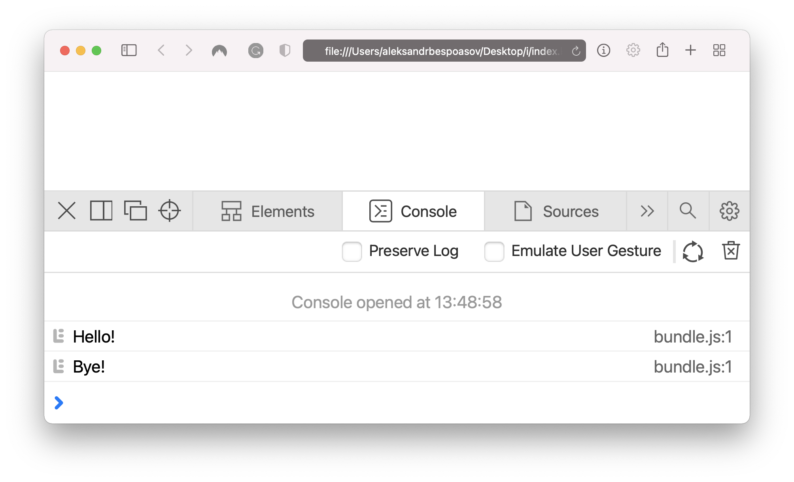

## Кратко

Webpack — это самый популярный [сборщик](/tools/bundlers/) в мире JS. Его функции легко расширяются с помощью сторонних пакетов, так что Webpack можно заставить делать практически что угодно. А если готового плагина не нашлось, благодаря мощному API можно написать решение под свой уникальный случай.

## Базовое использование

На базовом уровне использовать Webpack довольно просто. Представим, что в нашем приложении есть файл _application.js_ с функциями, необходимыми для работы:

```js
function sayHello() {
  console.log('Hello!')
}

function sayBye() {
  console.log('Bye!')
}

// Экспортируем эти функции,
// чтобы воспользоваться ими в другом месте:
export { sayHello, sayBye }
```

Теперь создадим файл _index.js_, который будет использоваться как входная точка, и вызовем в нем функции приложения:

```js
import { sayHello, sayBye } from './application'

sayHello()
sayBye()
```

<aside>

💡 Входная точка — файл, с которого начинается исполнение программы. Обычно в нём содержится логика старта приложения.

</aside>

Настроим Webpack, чтобы он собирал единый файл с кодом приложения.

Для начала следует добавить Webpack в список зависимостей приложения:

```bash
npm install --dev webpack webpack-cli
```

`webpack` — основная зависимость, в которой хранится весь код, нужный для работы бандлера.

`webpack-cli` — обёртка для запуска Webpack из командной строки, _Command Line Interface_.

Теперь достаточно создать простой конфигурационный файл _webpack.config.js_:

```js
// path — встроенный в Node.js модуль
const path = require('path')

module.exports = {
  // Указываем путь до входной точки:
  entry: './src/index.js',
  // Описываем, куда следует поместить результат работы:
  output: {
    // Путь до директории (важно использовать path.resolve):
    path: path.resolve(__dirname, 'dist'),
    // Имя файла со сборкой:
    filename: 'bundle.js'
  }
}
```

Почти готово, осталось только добавить скрипт для сборки в _package.json_ и вызвать его:

```json
{
  "scripts": {
    "build": "webpack"
  }
}
```

```bash
npm run build
```

После выполнения в директории _dist_ окажется файл _bundle.js_, который уже можно подключать на страницу в браузере.

В корне проекта нужно создать папку _src_, а в ней файл _index.html_ и подключить в него файл со сборкой:

```html
<!DOCTYPE html>
<html>
  <head>
    ...
  </head>
  <body>
    ...
    <script src="./dist/bundle.js"></script>
  </body>
</html>
```

Если открыть этот файл в браузере, то в консоли появится приветствие и прощание.



### Отслеживание изменений в проекте

Заново запускать сборку после внесения каждой правки не очень удобно. Во-первых, придётся каждый раз писать команду в терминале. Во-вторых, полная сборка больших проектов может занимать десятки минут, и тратить столько времени каждый раз просто расточительно.

Для решения этой проблемы можно воспользоваться режимом инкрементальной сборки, когда Webpack отслеживает изменения файлов с исходным кодом и автоматически собирает те части, которые изменились.

Добавим новую команду в _package.json_:

```json
{
  "scripts": {
    "build": "webpack",
    "watch": "webpack --watch"
  }
}
```

Теперь достаточно открыть файл _index.html_ в браузере и обновлять страницу после сохранения файлов с исходным кодом.

Для большего удобства можно воспользоваться пакетом [webpack-dev-server](https://webpack.js.org/guides/development/#using-webpack-dev-server).

## Расширение

Webpack — невероятно мощный инструмент, в первую очередь за счёт своей расширяемости. В базовом случае он только собирает несколько JS-файлов в один, но с помощью лоадеров и плагинов можно сильно изменить его функциональность.

Webpack начинает свою работу со входной точки — первого JS-файла. В нём он находит все _импорты_, по которым собирает файлы с исходным кодом проекта. Во всех найденных файлах снова ищет импорты, и так далее, пока импорты не закончатся. В итоге у Webpack оказывается список всех файлов проекта и информация, как эти файлы связаны. Затем в дело вступают плагины и лоадеры. Для каждого файла Webpack найдёт все подходящие по конфигурации лоадеры и обработает ими файл.

Плагины — это более глобальный способ изменить поведение сборщика. В процессе сборки Webpack будет вызывать специальную функцию в каждом плагине, передавая в неё текущий контекст сборки и API для изменения этого контекста.

Обратная сторона расширяемости Webpack — сложность его конфигурации. В больших проектах файл с настройками сборки может занимать тысячи строк. Часто такую конфигурацию разбивают на несколько файлов, чтобы её было проще читать.

### Лоадеры

Лоадер — это функция, которая принимает содержимое какого-то файла и должна вернуть изменённое содержимое.

Например, `ts-loader` превратит любой TypeScript-код в обыкновенный JavaScript-код.

Для Webpack написано огромное число лоадеров — для работы со стилями, с разными языками, для обработки изображений и для многого другого. Вот несколько, которые можно встретить почти в любом проекте:

- `style-loader` — импортирует CSS-файлы и внедряет стили в DOM.
- `css-loader` — позволяет работать с `@import` и `url()` внутри CSS.
- `babel-loader` — позволяет писать код на современном JS, но исполнять его даже в старых браузерах.

Чтобы добавить новый лоадер, нужно расширить файл _webpack.config.js_:

```js
module.exports = {
  // В этом массиве будут перечислены все применяемые лоадеры:
  module: {
    rules: [
      {
        // Это правило будет применяться ко всем файлам,
        // имя которых подойдет под регулярное выражение:
        test: /\.css$/,
        // Список лоадеров, которые применятся к файлу:
        use: [
          { loader: 'style-loader' },
          {
            loader: 'css-loader',
            // Лоадеру можно передать параметры:
            options: { modules: true }
          }
        ]
      }
    ]
  }
}
```

### Плагины

Плагин — мощный способ расширить или изменить функциональность Webpack. Если лоадер ограничен только одной функцией (принимает содержимое файла и должен вернуть изменённое содержимое), то плагин может делать всё что угодно.

Для Webpack написано огромное количество плагинов — для работы со стилями, повышения удобства разработки и упрощения жизни инженеров, для автоматизации рутинных операций и много других. Вот несколько, которые можно встретить почти в любом проекте:

- `MiniCssExtractPlugin` — по умолчанию все стили, которые обработал Webpack, попадают в JS-файл и потом вставляются в тег [`<style>`](/html/style/). Этот плагин извлекает все стили в отдельный CSS-файл, который можно подключить к странице через тег [`<link>`](/html/link/).
- `HotModuleReplacementPlugin` — позволяет делать изменения в коде и видеть изменения в браузере без полной перезагрузки страницы, это делает разработку более комфортной.
- `CompressionWebpackPlugin` — сжимает все ресурсы, сгенерированные Webpack, чтобы передавать пользователям по сети меньший объём данных.

Чтобы добавить новый плагин в сборку, нужно расширить файл _webpack.config.js_:

```js
// Webpack предоставляет несколько плагинов в основном пакете:
const { ProgressPlugin } = require('webpack')

module.exports = {
  plugins: [
    // При сборке этот плагин будет отображать прогресс в консоли:
    new ProgressPlugin()
  ]
}
```
