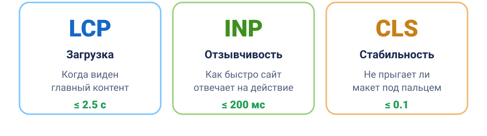

Когда вы открываете любой сайт, между кликом по ссылке и моментом, когда страницей можно пользоваться, происходит довольно много событий: браузер получает данные, загружает изображения, стили и скрипты, а затем постепенно отрисовывает страницу. На каждом из этих этапов могут возникать задержки - главный контент появляется слишком поздно, элементы прыгают, а кнопки не сразу реагируют на нажатие. Всё это напрямую влияет на восприятие скорости сайта пользователем. Долгое время разработчики в основном ориентировались на технические показатели вроде времени загрузки страницы или события load, но они слабо отражали то, что на самом деле ощущает пользователь.

В 2020 году компания Google предложила набор метрик, которые описывают визуальный опыт человека конкретными цифрами, и назвала их **Web Vitals**. Самые важные из них получили статус **Core Web Vitals**, или основные метрики. С 2021 года улучшение этих показателей уже не просто рекомендация: Core Web Vitals стали одним из сигналов ранжирования в поиске Google. Если две страницы одинаково подходят под запрос, то выше в списке окажется та, что быстрее и стабильнее.

Далее разберём, зачем Google ввёл эти метрики, как они рассчитываются, почему их значения ухудшаются и как их улучшить.

## Зачем Google предложил Core Web Vitals

У производительности сайтов существуют две стороны, и обе важны:

- **Пользовательский опыт.** Медленный и нестабильный сайт заставляет людей уходить, не дойдя до просмотра, заявки или заказа. Core Web Vitals выражают в понятных показателях три главных раздражителя: долгую загрузку, медленную реакцию на действия и прыжки элементов.

- **SEO.** Google включает Core Web Vitals в сигнал ранжирования Page Experience. При этом Google оценивает метрики не по лабораторным тестам, а по данным реальных пользователей Chrome из отчёта [Chrome UX Report (CrUX)](https://developer.chrome.com/docs/crux). То есть поисковик анализирует, как ведёт себя сайт на реальных устройствах пользователей.

Все Core Web Vitals оцениваются по 75-му перцентилю. Это означает, что метрика считается хорошей только в том случае, если установленному порогу соответствуют не менее 75% посещений. Поэтому недостаточно оптимизировать сайт только для владельцев мощных устройств и быстрого интернета - Google отдельно оценивает опыт мобильных пользователей и пользователей настольных компьютеров.

**Как понять 75-й перцентиль?** Представьте, что есть результаты 100 посещений сайта. Если отсортировать их от самых быстрых к самым медленным, то значение на 75-й позиции и будет 75-м перцентилем. Иными словами, установленному порогу должны соответствовать не менее 75% посещений. Поэтому нельзя ориентироваться только на людей с быстрыми устройствами и стабильным интернетом - Google учитывает и менее удачный пользовательский опыт.

<aside>

📊 **Core Web Vitals** - это три основные метрики: [**LCP** (Largest Contentful Paint)](/tools/LCP/), [**INP** (Interaction to Next Paint)](/tools/INP/) и [**CLS** (Cumulative Layout Shift)](/tools/CLS/). Остальные метрики - [**FCP** (First Contentful Paint)](/tools/FCP/) и [**TTFB** (Time to First Byte)](/tools/TTFB/) не входят в Core Web Vitals, но считаются «диагностическими» метриками. Они помогают понять причины плохих значений LCP, INP и CLS.

</aside>

<aside>

🕰 **Набор Core Web Vitals изменялся.** Изначально в 2020 году в тройку основных входил **FID** (First Input Delay) вместо **INP** (Interaction to Next Paint) - он измерял время отклика страницы исключительно на самый первый клик пользователя. В мае 2023 года Google [объявила](https://developers.google.com/search/blog/2023/05/introducing-inp) о замене FID на INP, а 12 марта 2024 года изменение вступило в силу. Данное решение аргументировано тем, что важнее измерять время отклика страницы на действия пользователя (клики, тапы, нажатия) на протяжении всего времени использования веб-сайта, а не только после окончания загрузки.

</aside>

## Три основные метрики Core Web Vitals

Если коротко, три основные метрики отвечают на три простых вопроса:

- **LCP** (Largest Contentful Paint) - «когда я увидел основной контент страницы?»
- **INP** (Interaction to Next Paint) - «я нажал - страница быстро отреагировала или заставила долго ждать?»
- **CLS** (Cumulative Layout Shift) - «почему элементы неожиданно сдвигаются при загрузке и я могу случайно нажать на другой элемент?»

А неосновные отвечают на следующие:

- **FCP** (First Contentful Paint) - «когда на экране вообще появилось хоть что-нибудь?»
- **TTFB** (Time to First Byte) - «как быстро сервер начал отвечать на запрос браузера?»

## Пороговые значения: шпаргалка

Для каждой метрики существуют три зоны: «хорошо» (зелёная), «нужно улучшить» (жёлтая) и «плохо» (красная). Сами пороговые значения одинаковы, но результаты для мобильных и десктопных устройств рассматриваются отдельно. К этим значениям мы ещё не раз будем обращаться в других статьях раздела.

| Метрика  | Показывает                | 🟢 Хорошо | 🟡 Нужно улучшить | 🔴 Плохо |
| -------- | --------------------------- | --------- | ----------------- | -------- |
| **LCP**  | загрузку основного контента | ≤ 2,5 с   | 2,5–4,0 с         | > 4,0 с  |
| **INP**  | отзывчивость на действия    | ≤ 200 мс  | 200–500 мс        | > 500 мс |
| **CLS**  | визуальную стабильность     | ≤ 0,1     | 0,1–0,25          | > 0,25   |
| **FCP**  | первую отрисовку            | ≤ 1,8 с   | 1,8–3,0 с         | > 3,0 с  |
| **TTFB** | ответ сервера               | ≤ 0,8 с   | 0,8–1,8 с         | > 1,8 с  |

CLS безразмерная величина которая обычно измеряется от 0 до 1, но она может быть и больше - например бесконечная лента постоянно вставляет новый контент сверху. Остальные метрики измеряются в секундах или миллисекундах.

**Пороговые значения одинаковы для мобильных и настольных устройств, но статистика собирается отдельно.** Из-за менее стабильных сетей и более слабых процессоров показатели одного и того же сайта на мобильных устройствах часто оказываются хуже, чем на десктопах. Поэтому всегда проверяйте оба среза в CrUX или [PageSpeed Insights](https://pagespeed.web.dev).

## Что ещё почитать о Web Vitals?

Тут я собрал все, что использовалось для написания раздела.

**Официальная документация, пороги, метрики и API**

- web.dev: [Web Vitals](https://web.dev/articles/vitals), [Introducing Web Vitals](https://web.dev/blog/vitals), [Optimize LCP](https://web.dev/articles/optimize-lcp), [Optimize INP](https://web.dev/articles/optimize-inp), [Optimize CLS](https://web.dev/articles/optimize-cls), [Optimize TTFB](https://web.dev/articles/optimize-ttfb), [Optimize long tasks](https://web.dev/articles/optimize-long-tasks), [Optimize input delay](https://web.dev/articles/optimize-input-delay), [Avoid large, complex layouts and layout thrashing](https://web.dev/articles/avoid-large-complex-layouts-and-layout-thrashing), [How large DOM sizes affect interactivity](https://web.dev/articles/dom-size-and-interactivity), [Client-side rendering of HTML and interactivity](https://web.dev/articles/client-side-rendering-of-html-and-interactivity), [Preload responsive images](https://web.dev/articles/preload-responsive-images), [Back/forward cache](https://web.dev/articles/bfcache), [Lab and field data differences](https://web.dev/articles/lab-and-field-data-differences), [Best practices for fonts](https://web.dev/articles/font-best-practices), [Optimize webfont loading](https://web.dev/articles/optimize-webfont-loading), [High-performance animations](https://web.dev/articles/animations-guide), [Best practices for carousels](https://web.dev/articles/carousel-best-practices), [Reduce webfont size](https://web.dev/articles/reduce-webfont-size), [Defer non-critical CSS](https://web.dev/articles/defer-non-critical-css), [Content delivery networks (CDNs)](https://web.dev/articles/content-delivery-networks), [Image CDNs](https://web.dev/articles/image-cdns), [Fetch Priority](https://web.dev/articles/fetch-priority), [Browser-level image lazy loading](https://web.dev/articles/browser-level-image-lazy-loading), [The preload scanner](https://web.dev/articles/preload-scanner), [Rendering on the Web](https://web.dev/articles/rendering-on-the-web), [CSS for Web Vitals](https://web.dev/articles/css-web-vitals), [Core Web Vitals workflows with Google tools](https://web.dev/articles/vitals-tools), [Best practices for measuring Web Vitals in the field](https://web.dev/articles/vitals-field-measurement-best-practices), [Debug performance in the field](https://web.dev/articles/debug-performance-in-the-field), [Debug layout shifts](https://web.dev/articles/debug-layout-shifts), [Find slow interactions in the field](https://web.dev/articles/find-slow-interactions-in-the-field), [Diagnose slow interactions in the lab](https://web.dev/articles/diagnose-slow-interactions-in-the-lab), [Lighthouse user flows](https://web.dev/articles/lighthouse-user-flows), [Why is CrUX data different from my RUM data?](https://web.dev/articles/crux-and-rum-differences), [Defining the Core Web Vitals metrics thresholds](https://web.dev/articles/defining-core-web-vitals-thresholds), [The most effective ways to improve Core Web Vitals](https://web.dev/articles/top-cwv), [Best practices for cookie notices](https://web.dev/articles/cookie-notice-best-practices), [Best practices for using third-party embeds](https://web.dev/articles/embed-best-practices), [Best practices for tags and tag managers](https://web.dev/articles/tag-best-practices), [Use web workers to run JavaScript off the browser's main thread](https://web.dev/articles/off-main-thread), [`content-visibility`: the new CSS property that boosts your rendering performance](https://web.dev/articles/content-visibility), [Reduce the scope and complexity of style calculations](https://web.dev/articles/reduce-the-scope-and-complexity-of-style-calculations), [Script evaluation and long tasks](https://web.dev/articles/script-evaluation-and-long-tasks)
- Chrome for Developers: [Use `scheduler.yield()`](https://developer.chrome.com/blog/use-scheduler-yield), [Test back/forward cache](https://developer.chrome.com/docs/devtools/application/back-forward-cache), [Enabling bfcache for `Cache-Control: no-store`](https://developer.chrome.com/docs/web-platform/bfcache-ccns), [INP in frameworks](https://developer.chrome.com/docs/aurora/inp-in-frameworks)
- MDN: [Fix your website's LCP by optimizing image loading](https://developer.mozilla.org/en-US/blog/fix-image-lcp), [`Scheduler.yield()`](https://developer.mozilla.org/en-US/docs/Web/API/Scheduler/yield)
- Google: [Understanding Core Web Vitals and search results](https://developers.google.com/search/docs/appearance/core-web-vitals), [Core Web Vitals report (Search Console)](https://support.google.com/webmasters/answer/9205520), [About PageSpeed Insights](https://developers.google.com/speed/docs/insights/v5/about)
- Addy Osmani: [Use `fetchpriority=high` to load your LCP hero image sooner](https://addyosmani.com/blog/fetch-priority)
- [Web Almanac 2025 - Performance](https://almanac.httparchive.org/en/2025/performance), HTTP Archive

**Библиотека и фреймворк**

- [Библиотека `web-vitals`](https://github.com/GoogleChrome/web-vitals), GoogleChrome
- Next.js: [Image Optimization](https://nextjs.org/docs/app/getting-started/images), [Font Optimization](https://nextjs.org/docs/app/getting-started/fonts), [`useReportWebVitals`](https://nextjs.org/docs/app/api-reference/functions/use-report-web-vitals)
- [React 19.2 Further Advances INP Optimization](https://calendar.perfplanet.com/2025/react-19-2-further-advances-inp-optimization), Web Performance Calendar
- [Guides: Package Bundling](https://nextjs.org/docs/app/guides/package-bundling) и [How we optimized package imports in Next.js](https://vercel.com/blog/how-we-optimized-package-imports-in-next-js), Next.js / Vercel

**Размер бандла**

- [8 Ways to Optimize Your JavaScript Bundle Size](https://about.codecov.io/blog/8-ways-to-optimize-your-javascript-bundle-size), Codecov;
- [webpack-bundle-analyzer](https://github.com/webpack/webpack-bundle-analyzer), GitHub
- [Why you should avoid Barrel Files in JavaScript Modules](https://laniewski.me/blog/pitfalls-of-barrel-files-in-javascript-modules);
- [Progressive Hydration](https://www.patterns.dev/react/progressive-hydration), patterns.dev

**Инструменты, мониторинг и измерение**

- DebugBear: [9 Core Web Vitals monitoring tools](https://www.debugbear.com/software/core-web-vitals-monitoring-tools), [CrUX vs RUM](https://www.debugbear.com/blog/crux-vs-rum), [Fixing layout shifts caused by web fonts](https://www.debugbear.com/blog/web-font-layout-shift), [`scheduler.yield`: a beginner's guide](https://www.debugbear.com/blog/scheduler-yield), [Partytown + web workers](https://www.debugbear.com/blog/partytown-web-workers)
- corewebvitals.io: [Yield to the main thread to improve INP](https://www.corewebvitals.io/pagespeed/yield-to-main-thread), [Fix slow hero images](https://www.corewebvitals.io/pagespeed/fix-slow-hero-images-core-web-vitals)

**Разборы и кейсы из практики**

- [Core Web Vitals Optimization: INP, LCP, CLS Guide 2025](https://www.digitalapplied.com/blog/core-web-vitals-optimization-guide-2025), digitalapplied
- [Case Study: Optimizing Core Web Vitals in a Next.js Content Blog](https://www.wellally.tech/blog/nextjs-core-web-vitals-case-study), wellally.tech
- [How to Optimize Core Web Vitals in Next.js App Router for 2025](https://makersden.io/blog/optimize-web-vitals-in-nextjs-2025), Makers' Den;
- [Third-Party Scripts Are Killing Your Core Web Vitals](https://www.pagespeedfix.com/blog/third-party-scripts-core-web-vitals), PageSpeedFix
- [Image Optimization for Website Speed: The 2026 Playbook](https://logoswebdesigns.com/blog/image-optimization-website-speed-2026), Logos Web Designs
- [How to Fix Cumulative Layout Shift (CLS) in 2025](https://natclark.com/how-to-fix-cumulative-layout-shift-cls-in-2025), Natclark
